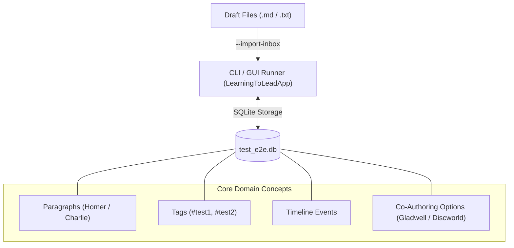
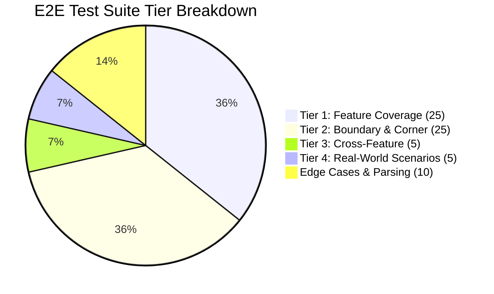
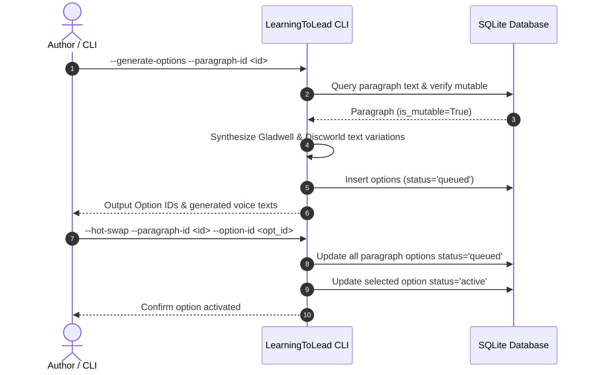

# High Ground Studio / LearningToLead Architecture

This document describes the software architecture and component design for the `LearningToLead` co-authoring application and test harness.

## System Architecture

## E2E Test Suite Matrix

## Co-Authoring Option Generation & Hot-Swap Flow

