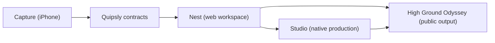

# Quipsly and High Ground Studio

Quipsly is an iPhone-first system for capturing real work and turning it into
durable notes, transcripts, tasks, goals, projects, research, writing, coaching
follow-through, and production-ready media. High Ground Odyssey is the first
real production workflow using the platform.

This is an active product monorepo. It is public for transparent development
and deliberate collaboration, but it is not a collection of interchangeable
demo apps. Each surface has its own runtime and release proof.



## Product surfaces

| Surface | Path | Purpose | Delivery proof |
| --- | --- | --- | --- |
| Capture | `apps/mobile-capture/HighGroundCapture` | Fast, resilient iPhone capture for notes, sessions, and recordings | physical iPhone, then TestFlight |
| Nest | `apps/quipsly` | Canonical workspace for notes, tasks, goals, tags, transcripts, projects, and research | signed-in save/reload plus Cloud Run readback |
| Quipsly contracts | `packages/quipsly-domain`, `packages/quipsly-document-kernel` | Shared data and document behavior | package tests plus consuming-app build |
| Quipsly Studio | `apps/QuipslyStudio` | Source-aware native podcast, video, and manuscript production | native runtime and output artifact |
| HGO web | `apps/web` | Public High Ground Odyssey site and coaching front door | route smoke plus deployed revision |
| Data | `prisma` | Shared schema and forward-only migrations | migration review plus target-environment check |

The current repository and eventual extraction boundaries are documented in
[Repository and release boundaries](docs/architecture/repository-and-release-boundaries-2026-07-23.md).

## Start here

Prerequisites:

- Node `24.14.0` (see `.node-version`)
- pnpm `10.30.3` (pinned in `package.json`)
- Docker Desktop for local PostgreSQL
- Xcode `26.2` for Capture work
- Google Cloud CLI only for credentialed deployment work

Install from the repository root:

```bash
corepack enable
pnpm install --frozen-lockfile
node scripts/ci/audit-repository-contract.mjs
```

Run the local Nest lane:

```bash
pnpm quipsly:local:up
pnpm quipsly:local:doctor
```

Open [http://127.0.0.1:3012](http://127.0.0.1:3012). When finished:

```bash
pnpm quipsly:local:down
```

The full database, Firebase emulator, identity, dogfood, and cleanup workflow is
in [Quipsly Nest local development](docs/runbooks/quipsly-nest-local.md).

For portable-backup or migration work, prove a restore in the separately
administered [Quipsly recovery lab](docs/runbooks/quipsly-recovery-lab.md).
It runs on different ports and builds an empty disposable database from
committed migrations instead of copying the daily local database.

## Making a change

Read these in order:

1. [Contributor guide](CONTRIBUTING.md)
2. [Development guide](docs/development/README.md)
3. [Product and repository map](docs/architecture/product-and-repository-map.md)
4. [Testing and proof matrix](docs/development/testing.md)
5. [Release runbook index](docs/runbooks/release-index.md)

Use one short-lived branch for one dependency-closed product slice. Pull
requests must state the visible user workflow, source of truth, persistence or
delivery proof, auth/data risk, and intentional deferrals.

## Repository rules

- Build and release from committed SHAs, never ambient untracked files.
- Keep recordings, renders, generated evidence, model environments, and design
  originals out of Git.
- Do not add or grow a binary asset above `1 MiB`; total positive binary growth
  in one pull request is capped at `5 MiB`.
- A green build is not proof of a signed-in workflow, physical-device behavior,
  persistence, deployment, or publication.
- Preserve provenance: fixed sources, editable drafts, decisions, and published
  outputs are different layers.
- Never commit credentials, production exports, private session content, or
  client data.

## Collaboration and governance

- [Contributing](CONTRIBUTING.md)
- [Security policy](SECURITY.md)
- [Support policy](SUPPORT.md)
- [Code of conduct](CODE_OF_CONDUCT.md)
- [Repository governance](docs/maintainers/repository-governance.md)
- [Architecture decisions](docs/decisions/README.md)

No open-source license has been selected yet. Public visibility does not grant
reuse rights beyond GitHub's terms; licensing is an explicit maintainer
decision.
