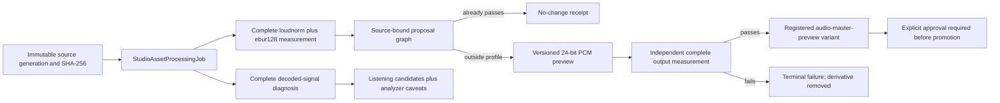

# Audio Mastery Architecture

Date: 2026-08-03

Quipsly audio mastery is an evidence pipeline, not a destructive effect button.
The immutable capture/import remains source truth. Automated work produces a
versioned derivative that must pass an independent complete decode before it
can even become a playable preview. Promotion remains a later explicit action.

## Standards profiles

The first shipping profile is `apple-podcasts-dialogue-v1`:

- target integrated loudness: -16 LUFS/LKFS;
- accepted source/output tolerance: plus or minus 1 LU;
- Apple maximum true peak: -1 dBTP;
- Quipsly render ceiling: -1.5 dBTP, preserving an additional 0.5 dB of
  encode headroom without presenting that policy as an Apple requirement;
- measurement standard: ITU-R BS.1770 and EBU R128 through FFmpeg;
- source and verification scans decode the complete primary audio stream.

The separate `ebu-r128-broadcast-v1` profile targets -23 LUFS with a 0.5 LU
tolerance. Quipsly does not conflate the Apple podcast target, the EBU
broadcast target, or platform playback normalization.

Primary references:

- [Apple Podcasts audio requirements](https://podcasters.apple.com/support/893-audio-requirements)
- [ITU-R BS.1770-5](https://www.itu.int/dms_pubrec/itu-r/rec/bs/R-REC-BS.1770-5-202311-I%21%21PDF-E.pdf)
- [EBU R 128 (2023)](https://tech.ebu.ch/files/live/sites/tech/files/shared/r/r128.pdf)
- [FFmpeg loudnorm and ebur128 filters](https://www.ffmpeg.org/ffmpeg-filters.html)

## Canonical flow

Every measurement is explicitly bound to the selected mastering profile. This
matters because FFmpeg's second-pass target offset is profile-specific; an EBU
measurement can never be reused silently for an Apple render, or vice versa.

The shared contract lives in
`packages/quipsly-media-processing/src/audio-mastery.ts`. It validates job
target authority, immutable source bindings, monotonic visualization points,
profile-bound measurements, recomputed proposal graphs, proposal safety
declarations, fully bound derived-byte receipts, and the independently
recomputed verification result.

Decoded signal evidence lives in
`packages/quipsly-media-processing/src/audio-signal-diagnosis.ts`. It is a
separate contract because capture-time metering and post-capture media
diagnosis are independent witnesses: the phone reports what it observed while
recording; the processor reports what the immutable uploaded bytes contain.
Disagreement is retained as evidence instead of allowing one witness to erase
the other.

The FFmpeg engine lives in
`apps/quipsly-media-processor/src/audio-mastering-ffmpeg.ts`. It runs:

1. `ffprobe` for the primary audio stream;
2. a complete `loudnorm` measurement pass;
3. a streaming `ebur128=metadata=1:peak=true` pass reduced to one-second
   visualization bins without retaining unbounded process output;
4. complete `astats` and `silencedetect` diagnosis against the source;
5. an optional double-pass loudness-only render to 48 kHz, 24-bit PCM WAV;
6. the same complete loudness measurement process against the derived bytes.

The local recoverable worker uses `StudioAssetProcessingJob`, atomic partial
files, exact-lease completion, safe existing-output recovery, authorized
temporary media roots, and output remeasurement. The Nest control plane
rechecks source and derivative bytes before it registers an
`audio-master-preview` variant.

## Automation boundary

This pass may automatically:

- decode and measure source loudness and true peak;
- classify profile compliance;
- create a loudness-only 24-bit PCM preview when needed;
- verify the output independently;
- expose a private playback preview and measurement receipt.
- expose deterministic signal-attention candidates with exact evidence and
  listening jumps.

This pass does not automatically:

- overwrite, relabel, or promote the source;
- denoise, gate, equalize, compress, de-ess, remove breaths, or change silence;
- make editorial cuts;
- treat a model opinion as measured signal truth;
- treat near-silence as a dropout or sample-peak proximity as proof of clipped
  waveform shape;
- apply a repair merely because a threshold was crossed;
- publish or export a final episode.

Those capabilities should become their own observable proposal nodes with
before/after listening, exact changed regions, reversible parameters, and
versioned approval receipts.

## Visualization contract

The Episode editor displays:

- integrated LUFS;
- maximum true peak in dBTP;
- loudness range in LU;
- momentary loudness over 400 ms;
- short-term loudness over 3 s;
- the selected profile target;
- complete-decode and display-bin disclosure;
- independently measured output values;
- the explicit unpromoted-preview boundary.

RMS dBFS elsewhere in Capture remains correctly labeled as not LUFS. The two
surfaces complement each other: Capture provides immediate bounded recording
evidence, while the media worker provides standards-conformant complete-source
measurement and mastery preparation.

The audition desk adds the post-capture signal layer without pretending it is
a spectral editor or an ear. It shows RMS dBFS, sample peak dBFS, estimated
noise floor, DC offset, channel/sample-rate coverage, and clickable attention
candidates. Zero candidates means only that the declared deterministic rules
did not fire; it is never rendered as a quality certificate.

Source-to-preview listening defaults to loudness-matched monitor gain. Quipsly
uses the quieter complete-decode integrated LUFS as the reference and
attenuates only the louder browser feed with `10^(deltaLU/20)`. This is a
monitoring operation, not a render node: it cannot clip by boosting, it is
observable on each media element, and it changes neither stored bytes nor
evidence. Reviewers can switch to unity `Delivery level` without losing the
playhead when they need to judge the verified final output level.

## Next qualified layers

1. generation-bound GCS manifest/outbox and database-free cloud execution;
2. explicit preview approval/rejection and promotion receipts;
3. dialogue-aware diagnosis proposals for noise, hum, clipping, plosives,
   sibilance, room tone, and speaker-to-speaker loudness consistency;
4. A/B and loudness-matched listening so “better” is never just “louder”;
5. stem-aware podcast mastering before mixdown;
6. the same measurement lane for coaching recordings with stricter privacy and
   no publication profile implied.
