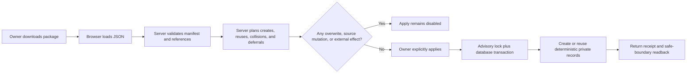

# Quipsly Nest portability

Status: implemented and proven across isolated local environments

Write schema: `quipsly-nest-export-v2`

Read compatibility: `quipsly-nest-export-v1`, `quipsly-nest-export-v2`

Owner: Quipsly Nest

## Decision

Quipsly Nests have an owner-operated, inspectable JSON portability contract for
the knowledge-work graph. This is not a database dump and it is not a media
archive. It packages the durable records a person needs to resume thinking:
canonical vocabulary, note and Source Story writing documents, exact source
reference metadata, Source Story boards/cards/ranges, tasks, goals, progress,
relationships, and planning history.

Restore is deliberately asymmetric. It preserves meaning while refusing to
recreate time-sensitive or externally observable behavior:

- destination records are private, deterministic copies;
- existing destination records are never replaced;
- reminders and recurrence remain snapshots, not active schedules;
- focus blocks are restored as canceled history;
- provider, calendar, notification, message, media, and publication systems are
  not called.

The owner must validate a complete destination plan before Apply becomes
available.

## Product boundary

| Included                                                                          | Preserved as history only                           | Excluded                                                |
| --------------------------------------------------------------------------------- | --------------------------------------------------- | ------------------------------------------------------- |
| canonical tags, aliases, and tag revisions                                        | tag merge targets                                   | media bytes, replicas, derivatives, and upload state    |
| note and Source Story writing documents, blocks, and exact tagged spans           | reminder intent                                     | Sessions, recordings, and transcripts                   |
| source checksums, clocks, sets, exact ranges, selectors, and reframing recipes    | source references, restored unavailable             | provider locators, credentials, grants, and connections |
| Source Story cards, revisions, boards, sections, placements, and decision history | source and board identities inside restore receipts | provider access or source relinking                     |
| actor-assigned project tasks, source-card anchors, and tag links                  | recurrence and occurrence intent                    | other collaborators' assignments                        |
| actor-owned goals, hierarchy, progress, and task links                            | focus blocks, restored canceled                     | external calendar or notification delivery              |

Documents enter the package only when they are a note, the acting actor's
personal writing, or are referenced by an included Source Story section. The
query combines those alternatives under the actor's visibility boundary; it
does not broaden export visibility to every shared project document. Dedicated
research, Session, transcript, production-timeline, and publication contracts
remain separate because they carry different source and review semantics.
Unreviewed transcript action candidates are excluded from committed work.

## Source Story portability boundary

Source Story decisions must survive a database move without pretending that
large camera files, Drive authority, or private provider locators moved with
them. Version 2 therefore carries the durable decision graph and only
provider-neutral source evidence:

- source content SHA-256, size, duration, dimensions, frame rate, projection,
  capture clock, and source-set membership;
- exact source ranges, semantic selectors, and 360 reframing recipes;
- card text, status, purpose, tags, card revisions, boards, sections, writing
  links, placements, and append-only decision history; and
- source-card Work anchors rebound to the destination project and restored
  source/card/board identities.

Restore creates disconnected `portable` external references with
`accessState:unavailable` and `capabilityState:relink-required`. No provider
locator, Drive file ID, OAuth connection, access grant, local path, signed URL,
replica, proxy, media asset, or source byte enters the package. Relinking is a
later deliberate operation that must prove exact content identity before a
source can become available.

Version 1 packages remain readable. They normalize to an empty Source Story
graph and keep their original verified manifest; validation does not rewrite
the old payload and then compare it against a version 2 digest.

## Authorization

Both export and restore require the durable signed-in Quipsly session plus
`manage` access to the exact Nest. The current access model reserves that
capability for the owner. The package itself is private user data; possession of
the JSON does not grant access to a destination Nest.

Export scopes work to the signed-in actor:

- `ActionItem.assignedUserId` must match the actor;
- `Goal.ownerUserId` must match the actor;
- planning blocks must belong to the actor and reference an included task or
  goal;
- goal/task relationships are included only when both endpoints are included.

## Package integrity

`integrity.manifestSha256` is the SHA-256 of the stable JSON serialization of
every payload field except the `integrity` envelope. It is a semantic package
manifest, not the SHA-256 of the formatted file bytes.

Validation occurs before any destination read or write:

1. require a supported schema version and preserve its exact manifest domain;
2. recompute and compare the semantic manifest;
3. enforce the 30 MB HTTP and text ceiling plus per-record count limits;
4. validate enums, dates, offsets, IDs, and text bounds;
5. reject duplicate identities and broken tag, note-span, source-set,
   source-range, writing-document, card, board, section, placement,
   goal-parent, goal-task, or planning references;
6. require the declared safety boundary to remain false for external effects
   and active scheduling.

The export is stable enough for audit and recovery. It is not a signature from a
trusted third party and should not be treated as proof of who originally
created a file.

## Restore identity and idempotency

Every restored record receives a destination-scoped deterministic identity:

```text
destination Nest
+ source Nest identity
+ source record identity
+ stable digest of the exported snapshot
= restored identity
```

The exact encoding lives in `portableId(...)`. A retry of the same package into
the same Nest therefore resolves the same records. A changed source snapshot
gets a new identity instead of overwriting the earlier restore.

Apply takes a PostgreSQL transaction-level advisory lock over destination,
actor, and manifest. The transaction then rebuilds the plan and performs
create-or-reuse operations. Concurrent retries cannot interleave two copies of
the same restore.



## Vocabulary collision policy

Vocabulary recovery must not silently change destination meaning.

1. An equivalent canonical tag at the same slug is reused.
2. A different canonical tag at that slug remains untouched; the imported tag
   receives `-restored-<12 character digest>`.
3. An alias already routing to the same restored tag is reused.
4. An alias colliding with another canonical tag or alias is deferred.
5. Alias reservations are simulated across the whole incoming bundle, so the
   preview matches what Apply can create.
6. Source merge relationships remain in the tag restore revision; restore does
   not reactivate a merge in the destination.

Every newly created canonical tag gets an append-only
`restored-from-portable-nest` revision containing source identities, original
slug, exported revisions, manifest, and the no-overwrite claim.

## Record semantics

### Notes

Notes restore as private `StudioDocument` and `StudioDocumentBlock` rows with
new deterministic stable IDs. Exact tagged spans are recreated only after their
block offsets, selected text, document identity, and tag references validate.
One `StudioDocumentOperation` records the import.

### Tasks and goals

Task and goal status, descriptive fields, dates, tags, and source envelopes are
preserved. Goal progress and goal/task relationships get deterministic
identities. Parent relationships are restored only when the parent goal is in
the same package.

Reminder and recurrence snapshots are retained inside task provenance with
`reminderRestoredActive:false` and `recurrenceRestoredActive:false`. No
`TaskReminder` or `TaskRecurrenceSeries` row is created.

### Focus blocks

Planning blocks retain their original times, timezone, original status, and
source envelope, but the destination row is `CANCELED`. Provenance explicitly
records:

- `restoredCanceledForSafety:true`;
- `externalCalendarMutated:false`;
- `notificationScheduled:false`.

### Source Story

Source revisions, source sets, ranges, cards, boards, sections, and placements
receive deterministic destination-scoped identities. Existing exact
provider-neutral source evidence may be reused; changed evidence receives a
new identity rather than mutating the earlier record. Board slugs collide like
vocabulary slugs: the destination board remains untouched and the restored
board receives a digest suffix.

Every newly restored source reference is explicitly disconnected. Exact
checksums and range decisions remain useful for search, writing, and later
relink review, while Source Library truthfully reports that playback and render
are unavailable. A restored card task keeps its source-card evidence envelope,
but its project/card/range/set/revision/board IDs are rebound to the restored
graph and `sourceAvailable` is false.

## Failure behavior

| Failure                                         | Result                                                                                |
| ----------------------------------------------- | ------------------------------------------------------------------------------------- |
| malformed, oversized, or tampered package       | 400/413; no plan and no write                                                         |
| signed-out request                              | 401                                                                                   |
| actor cannot manage destination                 | privacy-preserving 404                                                                |
| broken or foreign reference                     | validation error before transaction                                                   |
| canonical tag slug collision                    | versioned imported tag; destination untouched                                         |
| alias collision                                 | alias deferred and disclosed in preview                                               |
| concurrent retry                                | one advisory-locked transaction; same identities reused                               |
| database failure during Apply                   | transaction rolls back                                                                |
| ambiguous client response after Apply           | retry the same package; deterministic identities converge                             |
| Source Story source has no bytes in destination | decision graph restores; source remains unavailable until checksum-proven relink      |
| v1 package                                      | validates against its original manifest and restores with an empty Source Story graph |

## Implementation map

- Contract and validation:
  `apps/quipsly/src/lib/nest-portability.ts`
- Source Story sub-contract and graph validation:
  `apps/quipsly/src/lib/nest-source-story-portability.ts`
- Owner-scoped export:
  `apps/quipsly/src/lib/server/nest-portable-export.ts`
- Plan and transactional apply:
  `apps/quipsly/src/lib/server/nest-portable-restore.ts`
- HTTP boundaries:
  `apps/quipsly/src/app/api/nests/[slug]/portable-export/route.ts` and
  `portable-restore/route.ts`
- Owner UX:
  `apps/quipsly/src/app/(app)/nests/[slug]/portable`
- Operator procedure:
  `docs/runbooks/quipsly-nest-portability.md`

## Acceptance evidence

A portability change is not accepted on typechecking alone. The required proof
stack is:

1. pure manifest/reference validation tests;
2. route authorization and validate/apply tests;
3. rendered client tests proving Apply is unavailable before preview and stays
   unavailable for any unsafe plan;
4. disposable PostgreSQL round trip with collisions, exact note anchors,
   source clocks/sets/ranges, Source Story cards/boards/writing/placements,
   source-card task rebinding, actor scoping, progress, relationships, canceled
   planning history, retry, and independent readback;
5. an operated rendered-app rehearsal using a downloaded package and a
   dedicated destination Nest;
6. repository TypeScript 7 and production build/release gates;
7. a second Nest runtime, Firebase Auth emulator, and empty PostgreSQL instance
   built from committed migrations, followed by rendered-product readback and
   retry.

The isolated local proof closes second-environment recovery for the included
knowledge-work package. It does not close production deployment, provider or
media recovery, physical iPhone, TestFlight, or App Store acceptance.
