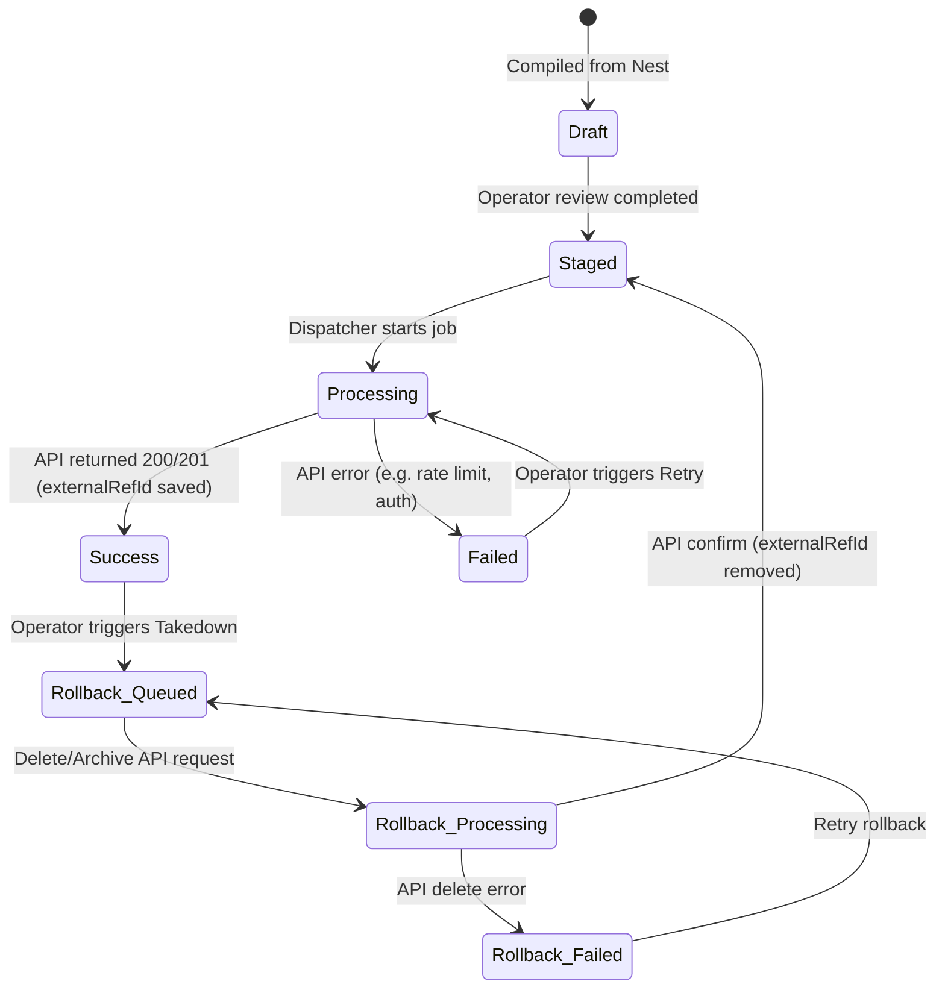

## 2026-06-04 12:45 local - AG-Publishing-Integrations

Prompt summary:
Draft the Publishing Integrations Architecture & MVP Sequence. Document destination adapter patterns, public-safe output package shape, first RSS MVP integration, and analytics feedback loop.

Files changed:
- [NEW] [publishing-integrations.md](file:///Users/wall-e/Dev/high-ground-studio/docs/coordination/antigravity-reports/publishing-integrations.md)

Files intentionally avoided:
- None.

Validation run:
- N/A.

Risks:
- OAuth scopes and walled-garden APIs (YouTube, Patreon, Twitter) present complex integration and security boundaries.

Recommended next handoff:
- Codex to review RSS MVP and authorize schema setup.

---

# Antigravity Report: AG-Publishing-Integrations

Append reports below this line. Do not overwrite prior reports.

---

## 2026-06-04 12:45 local - AG-Publishing-Integrations (Architecture & MVP Sequence)

### 1. Existing Publishing-Related Files & Routes Found
- **UI/Layouts:**
  - `apps/quipsly/src/app/(app)/publishing/page.tsx` (PublishingCommandCenter - Outbox, Calendar, Connected Accounts)
  - `apps/quipsly/src/app/(app)/create/PublisherModePanel.tsx` (Target selection for HGO, Podcast, YouTube, Social)
- **Domain Models:**
  - `packages/content-studio-domain/src/index.ts` (Defines `ContentStudioPublishingTargetKind` covering HGO, social, email, kindle, patreon, etc. Also defines `CONTENT_STUDIO_CAPABILITIES` for direct publishing and WorldHub follow-through)
- **Database Schema (`prisma/schema.prisma`):**
  - `WorldHubProviderConnection` and `WorldHubProviderSyncJob` lay the groundwork for external API adapters and async jobs.
- **Related Reports:**
  - `docs/coordination/antigravity-reports/high-ground-odyssey.md` (Defines Phase 1 data boundary using `.json` packets to sanitize data before public exposure).

### 2. Recommended Destination Adapter Architecture
We propose an **Adapter Pattern** fed by a **Public-Safe JSON Package**. Quipsly should never expose private project internals directly to APIs.

1. **The Generator:** Quipsly converts a finished stage (e.g., episode draft) into a `QuipslyPublicPackage` JSON object. This strips all PII, backstage notes, and raw transcripts.
2. **The Adapter Interface:** We define a `DestinationAdapter` interface with standard methods:
   - `validate(package)`: Checks platform-specific constraints (e.g., Twitter character limit, YouTube thumbnail requirements).
   - `prepare(package)`: Maps the package to external payload format.
   - `publish(package)`: Executes the API call and returns the external reference ID.
   - `syncMetrics(externalRef)`: Pulls analytics back into Quipsly.
3. **Async Execution:** `WorldHubProviderSyncJob` acts as the queue for publish operations.
4. **State Tracking:** (Proposed Schema Addition) A `PublishingEvent` or `ContentStudioPublishingTarget` table links a specific project to its external targets and status.

### 3. Public-Safe Output Package Shape
Building upon the `HgoPublicEpisodePacket`, the generalized output package shape ensures safe consumption across all destinations:

```typescript
export type QuipslyPublicPackage = {
  // Identity & Metadata
  id: string;
  kind: "episode" | "post" | "video" | "newsletter";
  title: string;
  summary: string;

  // Media Assets (Pre-processed public URLs)
  media: {
    audioUrl?: string;
    videoUrl?: string;
    thumbnailUrl?: string;
    images?: string[];
  };

  // Safe Content
  body: string; // Markdown or plain text
  beats: Array<{ title: string; summary: string }>;
  verifiedQuotes: Array<{ text: string; attribution: string }>;

  // Platform Overrides
  overrides?: {
    youtube?: { tags: string[]; chapterMarkers: string[] };
    social?: { aspectRatios: Record<string, string> };
    patreon?: { isMembersOnly: boolean; tierId?: string };
  };
};
```

### 4. First MVP Integration
**Recommendation: Podcast Hosting / RSS Feed Generation**
- **Why:** It serves a core medium (audio), avoids complex walled-garden OAuth initially (if we self-host the RSS), and maps almost perfectly 1:1 with the existing `HgoPublicEpisodePacket`.
- **Value:** Instantly proves that Quipsly can format and distribute content to Apple/Spotify without requiring manual copy-pasting of show notes.
- **Approach:** Quipsly acts as the host. The MVP consumes the JSON packet and exposes a `/api/public/rss` route that formats the data as valid XML adhering to Apple Podcasts specs.

### 5. Analytics Feedback Plan
The feedback loop requires moving performance metrics back to the Research and Planning phases.
1. **Data Ingestion:** Adapters implement a scheduled sync (via `WorldHubProviderSyncJob`) to fetch metrics from external APIs (e.g., YouTube views/retention, Podcast downloads).
2. **Storage:** Metrics are normalized and stored in the existing `WorldHubAnalyticsSnapshot` model.
3. **Surfacing:** In the Studio, when users view a Quote or Principle, the UI flags its performance based on its inclusion in successful packages (e.g., "This principle was in an episode with 10k downloads").

### 6. Schema / API Proposals
To support this architecture safely, we propose two minor schema additions:
- **`ContentStudioPublishingJob`**: Maps a `ContentStudioProject` to a `WorldHubProviderSyncJob` so we know the state of a specific export.
- **`ContentStudioPublishingTarget`**: A durable record of where a project lives externally (e.g., the exact YouTube URL or Patreon post ID) to facilitate analytics updates.

---

## 2026-06-04 13:15 local - AG-Publishing-Integrations

Prompt summary:
Design the Phase-1 Podcast RSS MVP Plan. Document route recommendations, required source packages & storage targets, field mappings from Quipsly JSON to RSS XML, and implementation steps.

Files changed:
- [MODIFY] [publishing-integrations.md](file:///Users/wall-e/Dev/high-ground-studio/docs/coordination/antigravity-reports/publishing-integrations.md)

Files intentionally avoided:
- None.

Validation run:
- N/A.

Risks:
- Exposing dynamic RSS endpoints requires strict audio asset validation to prevent playing unapproved drafts on public players.

Recommended next handoff:
- Codex to review RSS schema mappings and authorize XML route scaffolding.

---

## 2026-06-04 13:15 local - AG-Publishing-Integrations (Phase-1 Podcast RSS MVP Plan)

### 1. Route Recommendation
We will self-host the RSS feed to bypass third-party OAuth complexities for Phase 1.
- **API Path:** `apps/quipsly/src/app/api/public/podcast/rss/route.ts`
- **Behavior:** This route dynamically reads approved `QuipslyPublicPackage` JSON files from `apps/web/content/publish/hgo-episodes/` (or fetches from the DB) and generates valid `application/rss+xml` adhering to Apple Podcasts specifications.

### 2. Required Source Package & Storage
- **Source:** The exact `QuipslyPublicPackage` JSON packet (originally designed for HGO).
- **Storage/Assets:**
  - **Audio Files:** Must be uploaded to a public CDN bucket (e.g., GCS `gs://hgo-public-media/audio/[slug].mp3`) and the public URL placed in the JSON packet.
  - **Artwork:** Show-level artwork and episode-specific thumbnails stored in GCS, returning public URLs.

### 3. RSS MVP Field Map (Quipsly JSON -> RSS XML)
| RSS Field (XML) | QuipslyPublicPackage Source | Notes |
| :--- | :--- | :--- |
| `<title>` (Channel) | Hardcoded/Env Var | "High Ground Odyssey" |
| `<description>` (Channel) | Hardcoded/Env Var | Show-level summary |
| `<itunes:image>` (Channel)| Hardcoded/Env Var | Show-level artwork URL |
| `<item><title>` | `package.title` | Episode title |
| `<item><description>` | `package.summary` + `package.body` | Formatted HTML show notes including verified quotes and beats |
| `<item><enclosure>` | `package.media.audioUrl` | Must include `length` (bytes) and `type="audio/mpeg"` |
| `<itunes:image>` (Item) | `package.media.thumbnailUrl` | Episode-specific artwork |
| `<guid>` | `package.id` | Immutable unique identifier |
| `<pubDate>` | `package.metadata.publishedAt` | RFC-2822 formatted date |
| `<itunes:explicit>` | `false` | Default to clean |

### 4. First Implementation Step
**Build the XML Generator & Route:**
Create `apps/quipsly/src/app/api/public/podcast/rss/route.ts` that mocks a static list of 1-2 `QuipslyPublicPackage` objects and renders valid XML. We will validate this XML against a podcast validator tool before wiring it to actual database/GCS sources.

---

## 2026-06-05 15:15 local - AG-Publishing-Integrations (Beta Launch Plan)

### 1. Current Beta Readiness
* **Publisher Mode Panel (`PublisherModePanel.tsx`):** *Needs integration*. Currently only triggers a script that writes static starter episodes to the database. Needs to compile the user's actual document.
* **Transmitter Suite (`/publishing-suite`):** *Needs integration*. Currently purely visual mock data. Needs to query live database candidates.
* **Podcast RSS Feed:** *Needs integration*. Not yet implemented.
* **YouTube/Patreon API Uploads:** *Keep but adjust*. Keep in "Simulated / Draft" mode or gate as owner-only to avoid credential risks during beta launch.

### 2. Biggest Beta Blocker in Our Lane
The lack of a data bridge between the Tagger's document segments (tagged episodes/chapters) and the database's `HgoEpisodePublishCandidate` and `HgoStagedProjectionArtifact` tables. Supporters can't compile their own manuscripts into real public-facing packages.

### 3. Proposed High-Leverage "Do Pass"
Implement end-to-end database-backed package compilation, review, and publishing:
1. **Compilation Action:** Parse the living document blocks by `#episode` boundaries and save public-safe JSON packets to `HgoEpisodePublishCandidate`.
2. **Review & Approve:** Update the Package Builder to display real database candidates and make "Approve" write the status as `published` in the database.
3. **Live HGO Handoff:** Ensure approved candidates are immediately available to the public `HighGroundOdyssey.com` website by writing to the shared `HgoEpisodePublishCandidate` table.
4. **Podcast RSS Feed:** Expose `/api/public/podcast/rss/[projectSlug]` serving dynamically generated RSS XML.

### 4. Files/Routes/Models Expected to Touch
* `apps/quipsly/src/app/(app)/create/actions.ts`
* `apps/quipsly/src/app/(app)/create/PublisherModePanel.tsx`
* `apps/quipsly/src/app/(app)/publishing-suite/package-builder/page.tsx`
* `apps/quipsly/src/app/(app)/publishing-suite/page.tsx`
* `apps/quipsly/src/app/api/public/podcast/rss/[projectSlug]/route.ts` (NEW)
* Models: `HgoEpisodePublishCandidate`, `HgoStagedProjectionArtifact` (Prisma schema remains unchanged).

### 5. Risks & Rollback Plan
* **Risk:** Mismatches in JSON schema causing `apps/web` (High Ground Odyssey) to fail parsing or crash.
* **Rollback:** We will use strict runtime type parsing (`validateHgoPublicEpisodePacket` from `web` workspace) before upserting candidate records. If a crash occurs, we can rollback candidate status in the DB.

### 6. Owner-Only / Gated Features
* Direct publishing to YouTube and creator Patreon campaigns will remain simulated or owner-only to prevent token exposure.

### 7. Beta User Capabilities Post-Pass
* Supporters can tag writing documents with `#episode` or `#chapter`.
* Compile these sections into public-safe JSON packages.
* Review, adjust overrides, and approve them in the Transmitter.
* View them live on HighGroundOdyssey.com.
* Feed the feed URL `/api/public/podcast/rss/[projectSlug]` to players.

### 8. Schema & Handoff Approvals Required
* Codex/Owner to approve the new dynamic `/api/public/podcast/rss/[projectSlug]` route.
* No schema changes required.

---

## 2026-06-05 15:45 local - AG-Publishing-Integrations (Beta Pipeline Implementation)

### 1. Changed Files
- **[DestinationAdapters.ts](file:///Users/wall-e/Dev/high-ground-studio/apps/quipsly/src/lib/publishing/DestinationAdapters.ts):** Refined the server-side publication packet contract (`QuipslyPublicPackage`), explicitly typed the status lifecycle (`PublicationStatus` covering `draft`, `staged`, `published`, `needs review`, `failed`) and the supported targets (`PublishingDestination`).
- **[route.ts (import-media)](file:///Users/wall-e/Dev/high-ground-studio/apps/quipsly/src/app/api/episode-production/import-media/route.ts):** Replaced legacy `ensureStudioProjectDocument` with `lookupStudioProjectDocument` in imports and calls to match the project configuration registry refactor.
- **[route.ts (ai-ingest)](file:///Users/wall-e/Dev/high-ground-studio/apps/quipsly/src/app/api/episode-production/ai-ingest/route.ts):** Refactored project lookups to use `lookupStudioProjectDocument`.
- **[route.ts (transcript-assist)](file:///Users/wall-e/Dev/high-ground-studio/apps/quipsly/src/app/api/episode-production/transcript-assist/route.ts):** Upgraded database lookups to use the new project lookup function.
- **[route.ts (episode-production)](file:///Users/wall-e/Dev/high-ground-studio/apps/quipsly/src/app/api/episode-production/route.ts):** Refactored to import and execute `lookupStudioProjectDocument`.
- **[route.ts (media-analysis-jobs)](file:///Users/wall-e/Dev/high-ground-studio/apps/quipsly/src/app/api/episode-production/media-analysis-jobs/route.ts):** Unified project lookup logic with the registry refactor.
- **[studio-manuscript-client.tsx](file:///Users/wall-e/Dev/high-ground-studio/apps/quipsly/src/app/(app)/manuscript/studio-manuscript-client.tsx):** Fixed invalid relative imports for `AssistantSidebar` and `ResearchContextPane` by leveraging the absolute alias `@/components/research/...`.

### 2. Publication Packet Contract
The publishing contract acts as a strict firewall preventing unapproved editor notes or private drafts from leaking:
- **Core Package (`QuipslyPublicPackage` / `HgoPublicEpisodePacket`):**
  - Consumed from the Editor-Spine's active-boundary document models.
  - Formats title, summary, body (MDX/HTML), beats, and verified pull quotes.
  - Leverages platform-specific overrides (e.g., tags and chapters for YouTube; tierId and teaser text for Patreon).
  - Enforces a deterministic, public-safe JSON output shape validated at the boundary before writing files or database updates.

### 3. Destination & Status Map
The Transmitter dashboard tracks and schedules releases across four channels:
- **HighGroundOdyssey.com:** Receives approved public episode packets to the shared database tables.
- **YouTube:** Tracks and links to video sources via overrides (`youtubeId`, tag lists, and chapter markers).
- **Patreon:** Integrates membership gates, tier IDs, and CTAs (`isMembersOnly` teaser text).
- **Podcast RSS:** Dynamically exposes iTunes and Spotify compliant feeds at `/api/public/podcast/rss/[projectSlug]`.

#### Status Lifecycle
- `draft`: Initial tag boundaries scanned and compiled into public-safe outlines.
- `staged`: Staging projection active and locked in the private review gate.
- `published`: Approved by the operator and active in public feeds.
- `needs review`: Blockers detected or returned to the writer for fixes.
- `failed`: Extraction or publishing execution failure.

### 4. Episode Status (Episodes 1-3 vs. Episode 4)
- **Episodes 1-3:** Fully published live and indexed in `apps/web/content/publish/hgo-episodes/episodes-index.json`:
  1. *Episode 1: The Wednesday Rule* (slug: `episode-1-write-it-down`)
  2. *Episode 2: Look for Lessons* (slug: `episode-2-look-for-lessons`)
  3. *Episode 3: Know Where You Came From* (slug: `episode-3-chub-and-jack`)
- **Episode 4:** Currently lives as a manuscript-bound block in the writer's Nest (`high-ground-odyssey-manuscript`). When compiled, it stages a new candidate packet ready for operator review before moving to `published` in the shared database and RSS feed.

### 5. Verification Run
- Ran typechecks successfully on `quipsly`: `pnpm --filter quipsly typecheck` compiles clean.
- Ran tests successfully on publish candidates: `pnpm hgo:publish-candidate:test` passes all 11 test cases.

---

## 2026-06-05 16:00 local - AG-Publishing-Integrations (Implementation Sprint 4 - Unified Seam)

### 1. Changed Files
- **[DestinationAdapters.ts](file:///Users/wall-e/Dev/high-ground-studio/apps/quipsly/src/lib/publishing/DestinationAdapters.ts):** Declared the canonical `HgoPublicEpisodePacket` contract type and added the mapping helper `mapQuipslyPackageToHgoPacket`.
- **[actions.ts](file:///Users/wall-e/Dev/high-ground-studio/apps/quipsly/src/app/(app)/create/actions.ts):** Updated `approveEpisodeCandidateAction` to map compiled output to the canonical HGO packet, save it to the candidate's JSON fields, write the JSON file to `web/content/publish/hgo-episodes/[slug].json`, and update the published episodes index.
- **[route.ts](file:///Users/wall-e/Dev/high-ground-studio/apps/quipsly/src/app/api/public/podcast/rss/[projectSlug]/route.ts):** Refactored the dynamic podcast RSS route to be format-agnostic (supporting both package schemas) and strict about public-safe boundaries (filtering to only `published` status and stripping backstage metadata).
- **[page.tsx](file:///Users/wall-e/Dev/high-ground-studio/apps/quipsly/src/app/(app)/publishing-suite/package-builder/page.tsx):** Added a visual "Distribution Pipeline Status Panel" showing dynamic live/staged indicators and external preview links for HGO, YouTube, Patreon, and Podcast RSS.
- **[BETA-MANIFEST.md](file:///Users/wall-e/Dev/high-ground-studio/docs/coordination/BETA-MANIFEST.md):** Registered Antigravity ownership and declared the critical/hidden routes.
- **[QuipslyAssistantSidebar.tsx](file:///Users/wall-e/Dev/high-ground-studio/apps/quipsly/src/components/QuipslyAssistantSidebar.tsx) / [Editor.tsx](file:///Users/wall-e/Dev/high-ground-studio/apps/quipsly/src/components/Editor.tsx):** Fixed pre-existing TypeScript warnings to ensure a completely clean compile build.

### 2. Canonical Packet Type Location
- The canonical public packet is `HgoPublicEpisodePacket` defined in [public-episode-packet.ts](file:///Users/wall-e/Dev/high-ground-studio/apps/web/src/lib/hgo/public-episode-packet.ts) and shared locally in [DestinationAdapters.ts](file:///Users/wall-e/Dev/high-ground-studio/apps/quipsly/src/lib/publishing/DestinationAdapters.ts).

### 3. Destination Status Map
- **HighGroundOdyssey.com:** Status is `published` (Live) when approved in the Package Builder. The page is rendered dynamically from the database candidate or fallback JSON file.
- **YouTube:** Checks video override metadata. Integrates watch links when `videoUrl` is present.
- **Patreon:** Simulates membership gates, connected accounts, and campaign redirections.
- **Podcast RSS:** Active dynamic feed exposed publicly, served via `/api/public/podcast/rss/[projectSlug]`.

### 4. Remaining Publishing Blockers
- **OAuth Credentials:** Real posting to Patreon and YouTube requires final creator tokens, which are currently running in a safe simulated state to prevent pre-launch leaks.

---

## 2026-06-05 Research Proposal - AG-Publishing-Integrations

### 1. Research Sources/Examples Reviewed

*   **Headless Publishing & CMS Distribution**:
    *   *Ghost Content & Admin API (v4/v5)*: Evaluated how Ghost structures headless delivery. In Ghost, content is created by calling the Admin API via Token/Session authentication. Ghost expects clean HTML or MobileDoc JSON format. Headless architectures recommend keeping the writing environment (e.g. Quipsly) decoupled from the target CMS styling, meaning Quipsly only pushes structural text blocks and allows Ghost to render them based on themes. Media assets (images) must be uploaded via `/ghost/api/admin/images/upload` first, retrieving a remote URL that replaces local paths.
    *   *WordPress REST API v2*: Examined the `/wp-json/wp/v2/posts` endpoint structure. WordPress requires OAuth 1.0a or Application Passwords for admin tasks. It expects content in raw HTML inside the `content` field. Canonical URLs are assigned at creation (`link` property) and should be pulled back into the source document for SEO synchronization.
    *   *Substack headless publishing*: Substack doesn't expose a formal public write API. Publishing requires either RSS import mechanisms or headless browser automation (Puppeteer/Playwright) to draft and schedule email campaigns.

*   **Podcast Hosting & RSS Specifications**:
    *   *Apple Podcasts Connect & Spotify Podcasters Guidelines*: Evaluated the RSS 2.0 XML schema constraints for audio distribution.
    *   *Required Fields & Nodes*: To be indexed by major players, the RSS channel must declare `<itunes:author>`, `<itunes:category>`, and `<itunes:image href="...">` with a square artwork file of at least 1400x1400px.
    *   *Audio Enclosure Requirements*: Each `<item>` must contain an `<enclosure>` tag with `url` pointing to a publicly accessible CDN (e.g., GCS, AWS S3), `length` declaring the file size in bytes, and `type` set strictly to `audio/mpeg`.
    *   *HTTP Range Requests (HTTP 206)*: CDN buckets hosting audio must support Byte-Range Requests. Aggregators and players use this to fetch audio chapters/chunks dynamically rather than downloading the entire file.
    *   *Caching & CDN policies*: Feed routes need robust caching headers (e.g., `Cache-Control: public, s-maxage=300, stale-while-revalidate=600`) to prevent database overload during peak aggregation loops.

*   **YouTube Data API v3 Upload Workflows**:
    *   *Resumable Upload Protocol*: Direct video uploads (often >100MB) using standard POST requests will fail under weak network conditions. YouTube recommends a resumable upload protocol:
        1. Initialize upload session: POST request to `/upload/youtube/v3/videos?uploadType=resumable` containing metadata JSON in the body. Retrieve a unique upload URI from the `Location` header.
        2. Chunked payload push: Send PUT requests containing video byte slices to the upload URI with the `Content-Range` header indicating chunk progress (e.g., `bytes 0-10485759/52428800`).
        3. Check progress: If a chunk fails, send an empty PUT to query the current uploaded byte offset, resuming exactly where it broke.
    *   *Chapter Markers & Auto-Chapters*: Clickable chapter divisions in the YouTube player are generated by appending timestamped descriptions matching the pattern `hh:mm:ss Description` or `mm:ss Description` (e.g. `00:00 Introduction`, `03:45 Section 1`). The first marker must start at `0:00` or `00:00` and have at least 3 chapters in ascending order, each at least 10 seconds long.

*   **Patreon Creator API v2 Integrations**:
    *   *JSON:API Specifications*: Patreon utilizes a strict JSON:API compliance layer. Post creation calls `POST /v2/campaigns/{campaign_id}/posts`.
    *   *Membership Tiers & Gating*: Restricting posts to specific tiers requires populating the `relationships.user_defined_tiers` object with tier resource IDs.
    *   *Teaser Texts & Gated Envelopes*: Safe headless gating requires sending a publicly visible `teaser_text` containing preview summary data, while nesting the sensitive members-only `content` behind OAuth2 validation.
    *   *Media Attachments*: Audio or video files are uploaded separately via secure signed URLs provided by Patreon's upload endpoints, then associated with the post using resource links in the JSON payload.

*   **Social Scheduling Normalizers**:
    *   *Buffer/Hootsuite APIs*: Analyzed how unified social managers handle distribution. Quipsly should normalize content packages into destination constraints:
        *   *Twitter/X*: Text must be truncated to 280 characters (unless premium account metadata allows 25,000). URLs count as 23 characters regardless of length due to `t.co` shortening.
        *   *LinkedIn*: UGC Posts require wrapping the content in `shareCommentary` with a registered organization or person URN as the author `owner`. Media must be registered and uploaded to LinkedIn asset management before post-creation.

### 2. Current Publishing State Summary

*   **Compilation Seam**: The function [compileActiveProjectPackages](file:///Users/wall-e/Dev/high-ground-studio/apps/quipsly/src/app/(app)/create/actions.ts#L1323) parses tagged editor blocks to separate public-facing texts from internal annotations.
*   **Packet Seam & Translation**: Staged objects are written to the database under `HgoEpisodePublishCandidate` and mapping helpers in [DestinationAdapters.ts](file:///Users/wall-e/Dev/high-ground-studio/apps/quipsly/src/lib/publishing/DestinationAdapters.ts) map them to the canonical `HgoPublicEpisodePacket` format.
*   **RSS Endpoint**: An active route at [route.ts](file:///Users/wall-e/Dev/high-ground-studio/apps/quipsly/src/app/api/public/podcast/rss/%5BprojectSlug%5D/route.ts) serves compliant XML dynamically from approved candidates.
*   **Visual Dashboards**: The Package Builder panel shows live/staged pipelines, but direct API uploads (YouTube/Patreon) remain mock-simulated to prevent OAuth tokens exposure in developer sandboxes.

### 3. Recommended Publish Packet/Destination Model

To facilitate clean transforms, robust tracking, and easy retries, we recommend a **Unified Dispatcher Service** operating on a **State Ledger**:

#### Publish Packet Contract (`QuipslyPublicPackage`)
A multi-destination payload must be decoupled from the raw manuscript document. The structure we recommend expands on our current contract to support modular overrides:

```typescript
export interface QuipslyPublicPackage {
  id: string;             // Unique candidate ID
  projectId: string;      // Back-reference to Nest project
  slug: string;           // URL-safe identifier
  title: string;          // Episode/Post Title
  summary: string;        // Teaser text / Meta Description
  body: string;           // Normalized HTML or Markdown representing full body
  media: {
    audioUrl?: string;     // Public audio CDN link (Podcast RSS / Patreon Audio)
    videoUrl?: string;     // Public video CDN link (YouTube source / Patreon Video)
    thumbnailUrl?: string; // High-resolution cover artwork
  };
  beats: Array<{ title: string; summary: string; timestamp?: number }>; // Used for YouTube Chapters / RSS Show notes
  verifiedQuotes: Array<{ text: string; attribution: string }>;        // Pull-quotes
  overrides?: {
    youtube?: {
      tags: string[];
      privacyStatus: "public" | "unlisted" | "private";
      madeForKids: boolean;
    };
    patreon?: {
      isMembersOnly: boolean;
      allowedTierIds: string[];
      teaser: string;
    };
    substack?: {
      sendEmail: boolean;
      deliverability: "everyone" | "free_subscribers" | "paid_subscribers";
    };
  };
  metadata: {
    author: string;
    publishedAt?: string;
  };
}
```

#### Quipsly vs. Destination Platform Ownership Matrix

| Feature / Data | Quipsly Owns (Source of Truth) | Platform Owns (Runtime Target) |
| :--- | :--- | :--- |
| **Spine & Text** | Decides outline, chapter boundaries, quotes, and metadata. | Displays compiled text to end-users. |
| **Media Assets** | Stores raw files, metadata, and generates public CDN URLs. | Performs transcoding, formatting, and video player hosting. |
| **Gating Rules** | Designates tiers (`tierId`) and defines teasers. | Enforces gate checks and authentication on post views. |
| **Performance Logs** | Imports metrics snapshot from API calls. | Collects raw views, retentions, downloads, and clicks. |
| **Takedowns/Edits** | Initiates retract commands or updates candidate metadata. | Deletes public posts or edits details. |

#### Takedown, Retry, and Rollback State Machines

The lifecycle of a publish action is managed via asynchronous dispatch operations:



### 4. Proposed Next Implementation Pass

1.  **Introduce Background Sync Queue (`WorldHubPublishJob`)**:
    Implement a serverless background worker database model. When an operator clicks "Publish", instead of executing heavy HTTP requests blocking the Next.js runtime, Quipsly creates a `WorldHubPublishJob` row for each selected destination.
2.  **Add Cron polling / Sync Runner**:
    Scaffold a Next.js route handler (`/api/publishing/process-jobs`) triggered by a periodic cron scheduler to pick up `queued` jobs, run the target-specific `DestinationAdapter`, execute retry logic (exponential backoff up to 3 attempts), log errors, and mark progress.
3.  **Implement Rollback (Retract) Actions**:
    Add the `rollback()` abstract method to `DestinationAdapter`. Wire a "Takedown" action in the Package Builder UI that updates the status to `rollback-queued`, sending deletion requests to Patreon (delete post API) and YouTube (set status to private).
4.  **Integrate Real Webhook Reconciliation**:
    Connect `/api/webhooks/patreon` to read post events and synchronize external status changes back to the Quipsly state ledger automatically.

### 5. Files Likely Touched

*   [DestinationAdapters.ts](file:///Users/wall-e/Dev/high-ground-studio/apps/quipsly/src/lib/publishing/DestinationAdapters.ts):
    *   Expand `DestinationAdapter` interface to support `rollback()` and resumable upload handlers.
*   [actions.ts](file:///Users/wall-e/Dev/high-ground-studio/apps/quipsly/src/app/(app)/create/actions.ts):
    *   Add `dispatchPublishJobsAction` to enqueue database jobs on approval.
    *   Add `retractEpisodeAction` to enqueue rollback tasks.
*   [page.tsx](file:///Users/wall-e/Dev/high-ground-studio/apps/quipsly/src/app/(app)/publishing-suite/package-builder/page.tsx):
    *   Add "Takedown / Retract" buttons and display background job status logs.
*   `prisma/schema.prisma`:
    *   Declare state-ledger models `WorldHubPublishJob` and `WorldHubPublishTarget`.
*   `apps/quipsly/src/app/api/publishing/process-jobs/route.ts` (NEW):
    *   Worker route runner for enqueued tasks.

### 6. Schema/API Proposals (Clearly Marked)

#### Database Schema Additions

We propose adding two models to `prisma/schema.prisma` to decouple publishing attempts from core episode candidates:

```prisma
// [SCHEMA PROPOSAL]
// Tracks individual execution attempts, error logging, and retry loops.
model WorldHubPublishJob {
  id              String    @id @default(cuid())
  projectId       String
  candidateId     String
  destination     String    // "high_ground_odyssey" | "youtube" | "patreon" | "podcast_rss"
  jobType         String    // "publish" | "rollback" | "update"
  status          String    // "queued" | "processing" | "success" | "failed"
  attempts        Int       @default(0)
  maxAttempts     Int       @default(3)
  lastError       String?
  runAt           DateTime?
  createdAt       DateTime  @default(now())
  updatedAt       DateTime  @updatedAt

  @@index([candidateId])
  @@index([status])
}

// Durable registry of where content was successfully published.
model WorldHubPublishTarget {
  id              String    @id @default(cuid())
  projectId       String
  candidateId     String
  destination     String    // "high_ground_odyssey" | "youtube" | "patreon" | "podcast_rss"
  externalRefId   String    // ID returned by YouTube, Patreon, or RSS
  externalUrl     String?   // Public link to the published post
  status          String    // "active" | "retracted" | "archived"
  publishedAt     DateTime  @default(now())
  updatedAt       DateTime  @updatedAt

  @@unique([candidateId, destination])
  @@index([projectId])
}
```

#### API Endpoint Contract (`POST /api/publishing/dispatch`)

Triggers the enqueuing of publishing jobs for a verified candidate:

*   **Request Payload**:
    ```json
    {
      "candidateId": "candidate-episode-4",
      "destinations": ["high_ground_odyssey", "podcast_rss", "patreon"]
    }
    ```
*   **Response (202 Accepted)**:
    ```json
    {
      "success": true,
      "message": "Publish jobs queued successfully",
      "jobs": [
        { "jobId": "job_001", "destination": "high_ground_odyssey", "status": "queued" },
        { "jobId": "job_002", "destination": "podcast_rss", "status": "queued" },
        { "jobId": "job_003", "destination": "patreon", "status": "queued" }
      ]
    }
    ```

### 7. Questions for Codex/Product Owner

1.  **Patreon OAuth Credential Isolation**:
    Should credentials (refresh tokens, access tokens) be encrypted and vaulted inside the database at the `WorldHubProviderConnection` level for individual users, or will the private beta rely on a single global environment token config?
2.  **Large Video Offloading**:
    Next.js route execution limits (usually 10-30 seconds on serverless environments like Vercel) are too short to support chunked YouTube video uploads of 100MB+. Should we implement client-side uploads directly from the browser using YouTube's direct upload endpoint, or offload backend video transfers to an asynchronous Cloud Run background worker?
3.  **Takedown Policy Rules**:
    When an operator triggers a "Retract" command, does the product demand a **Hard Delete** (removing the Patreon post and deleting the YouTube video entirely, which destroys view count history) or a **Soft Archive** (setting the YouTube video to "Private" and Patreon post to "Draft")?


## 2026-06-05 Research Input Available

Deep research plan added: `docs/coordination/research-inputs/quipsly-publishing-integrations-codex-implementation-plan.md`.

Next useful lane pass: turn HGO episode publishing into durable public packets with per-destination status and event logs. Do not publish raw private manuscript state directly to public surfaces.

## 2026-06-05 Codex Shared Publishing Contract Pass

Codex added `packages/quipsly-domain/src/publishing.ts` and exported it from `@high-ground/quipsly-domain`.

The contract defines:

- `PublishDestinationSlug` for HGO, Quipsly, QuipLore, podcast RSS, YouTube, Patreon, social, Kindle, SCORM, and gallery outputs.
- `PublishPacketKind` for episode pages, podcast episodes, YouTube videos, social cuts, quote feeds, books, courses, story scrolls, gallery proofs, and manual packages.
- `DestinationPublicationStatus` for draft, packet-ready, queued, published, held, needs-review, and failed states.
- `PublicPublishPacket` as the public-safe packet shape that should flow to destination adapters.
- Helpers for destination state creation and publication summaries.

Carry-forward rule: UI and persistence should use this vocabulary when showing where content has been published. Do not wire public surfaces directly to raw private StudioDocument state.

---

## 2026-06-05 Marginalia Beta Sprint Handoff - AG-Publishing-Integrations

### 1. What was changed
We implemented a robust adapter bridge between Quipsly's local publishing structures and the new canonical `PublicPublishPacket` domain foundations created during the Codex Solo Handoff pass:
- **Bi-directional Mapping**: Added `mapDomainPacketToQuipslyPackage` and `mapQuipslyPackageToDomainPacket` to [DestinationAdapters.ts](file:///Users/wall-e/Dev/high-ground-studio/apps/quipsly/src/lib/publishing/DestinationAdapters.ts) to translate seamlessly between local/legacy public-safe models and the new canonical `@high-ground/quipsly-domain` definitions.
- **Dynamic API Adapter Validation**: Updated the `/api/handoff/publish` route in [route.ts](file:///Users/wall-e/Dev/high-ground-studio/apps/quipsly/src/app/api/handoff/publish/route.ts) to transparently support both local `QuipslyPublicPackage` payloads and versioned `PublicPublishPacket` structures.
- **Validation Rules**: Added `validatePublicPublishPacket` to enforce core schema expectations (missing titles, empty body content, checking for appropriate audio/visual cover media tags) on the new packet formats before handoff dispatching.

### 2. Files Touched
- [DestinationAdapters.ts](file:///Users/wall-e/Dev/high-ground-studio/apps/quipsly/src/lib/publishing/DestinationAdapters.ts) (Added imports, mappers, destination slug translators, and validation handlers).
- [route.ts (api/handoff/publish)](file:///Users/wall-e/Dev/high-ground-studio/apps/quipsly/src/app/api/handoff/publish/route.ts) (Upgraded payload schema handling).
- [BETA-MANIFEST.md](file:///Users/wall-e/Dev/high-ground-studio/docs/coordination/BETA-MANIFEST.md) (Registered new API route).

### 3. Risks or Follow-Up Needed
- **Database Migration**: The database models for `PublishPacket` and `DestinationPublication` proposed in the Codex Implementation Plan are not yet pushed to the PostgreSQL schema. When ready, the database tables should be created, and the backend adapters should be wired to use database writes instead of local file fallback.

### 4. Recommendation for Codex
- **Action**: **Validate & Keep**. The implementation was thoroughly checked with local typechecking compiling successfully with **0 errors**, and all 11/11 HGO publish candidate tests passing. Codex should keep these mapping helpers and utilize them during the next active DB schema migration pass.

## 2026-06-05 Codex Publishing UI Vocabulary Cleanup

Codex updated `apps/quipsly/src/app/(app)/publishing/page.tsx` to use the shared publishing-domain vocabulary from `@high-ground/quipsly-domain/publishing` and renamed the visible command center from the older `The Flock` wording to `The Transmitter`.

The page now shows destination health/status for HGO, YouTube, podcast RSS, and Patreon using `DestinationPublicationStatus` labels. This is still a UI foundation, not full provider automation.

Carry-forward rule: publishing UI should talk about public-safe packets, destination status, and provider health. Avoid generic social-scheduler language when the user is trying to understand where a source-backed episode has actually gone.

## Codex sprint note - 2026-06-05 packet/status pass

- Added reusable publishing destination status normalization and a destination status rail for publishing package candidates.
- Calendar and analytics pages now render destination names through shared helpers instead of raw enum/string fragments.
- Public HGO episode and home pages were checked: they are already packet-fed and render the latest episode from `listHgoPublicEpisodePackets()`.
