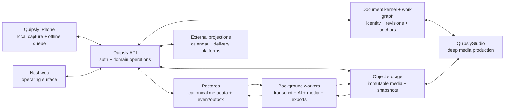

# Quipsly Unified Product Goal and Execution Blueprint

**Status:** Active product authority and implementation blueprint
**Date:** 2026-07-18
**Scope:** Quipsly iPhone, Nest web, shared services and document kernel, QuipslyStudio handoff
**Primary use cases:** High Ground Odyssey production, private coaching, research, writing, planning, and follow-through

## Goal

Build Quipsly into one production-ready creative and coaching operating system:

- the iPhone is the fastest, safest place to capture a real conversation, thought, source, or commitment;
- Nest is the canonical place to understand, organize, write, plan, review, and follow through;
- QuipslyStudio is the deep media-production surface;
- every surface operates on the same durable sessions, sources, transcripts, notes, goals, tasks, annotations, tags, calendar records, and version history.

Quipsly is complete only when it can be used, end to end, for real High Ground Odyssey episodes and real coaching sessions without reconstructing the work in unrelated apps. Automated tests are required but never sufficient. Completion requires hands-on operation of the shipped iPhone and web products, real persisted data, real playback, real exports, real account boundaries, and real delivery readback.

## Product mandate

The current UX is evidence, not a constraint.

We may replace navigation, names, layouts, interactions, schemas, and whole surfaces when that produces a clearer system. We will preserve:

- immutable source recordings and imported source files;
- authorship, consent, permissions, citations, and provenance;
- stable object identity and source anchors;
- inspectable revisions, audit history, exports, and rollback;
- reversible data migrations and explicit supersession of derived artifacts.

We will not preserve:

- duplicate concepts merely because each already has a table or screen;
- dashboard and status-card clutter;
- form-first capture;
- paper packets that strand useful information outside the product;
- separate mobile and web truths;
- AI output that cannot lead back to evidence;
- compatibility shims that make the primary workflows worse.

This mandate permits decisive redesign. It does not permit destructive production-data rewrites, sending client communications, scheduling people, charging money, publishing episodes, or changing external accounts without the appropriate explicit authority and a rollback plan.

## One product, four responsibilities

Quipsly is the customer-facing product. Capture, Nest, and Studio are responsibilities, not competing products.

| Responsibility    | Surface                        | What it must be exceptional at                                                                                   |
| ----------------- | ------------------------------ | ---------------------------------------------------------------------------------------------------------------- |
| Capture edge      | iPhone                         | Start safely, preserve audio, see source truth, capture ideas, review urgent work, and continue offline          |
| Operating surface | Nest web                       | Sessions, sources, writing, research, goals, tasks, calendar, review, collaboration, and export                  |
| Shared substrate  | Document kernel and work graph | Stable identity, revisions, anchors, permissions, operations, projections, and provenance                        |
| Deep production   | QuipslyStudio                  | Multitrack truth, editorial decisions, timeline work, proof watching/listening, renders, and publication handoff |

The iPhone must not become a miniature administrative website. Nest must not become another generic notes database. Studio must not become the database of record for coaching or planning. Each surface should expose the same objects through the interaction best suited to that device and job.

## Research synthesis

The research bar is to borrow proven interaction principles without copying another product's limitations.

### Trustworthy iPhone capture

Apple's current guidance supports a local-first, interruption-aware recorder with explicit audio-route handling, durable file storage, background-transfer intent, just-in-time permission prompts, accessibility, and real-device validation. The current platform also makes on-device, long-form timecoded transcription and system-level App Intents relevant parts of the design.

Quipsly should therefore:

- create and journal a durable local recording before attempting network work;
- show the actual input route and recording state, not an optimistic proxy;
- record route changes, interruptions, media-server resets, storage pressure, and segment boundaries as source events;
- use a stable background upload session with file-backed requests and resumable intent;
- keep an explicit local/uploaded/verified state machine with checksums;
- make consent separate from microphone permission;
- expose fast capture through the app, share sheet, App Intents, widgets, and supported hardware actions through the same API;
- prove long sessions, interruptions, relaunch, offline capture, force quit, upload recovery, and playback on physical devices.

### Podcast production

Riverside demonstrates why local participant tracks and visible upload truth matter. Descript demonstrates why the transcript can be a media navigation and collaboration surface. Apple Podcasts, Spotify, and YouTube each impose different transcript, chapter, clip, RSS, and publishing constraints.

Quipsly should therefore:

- preserve immutable, same-clock source tracks per participant where available;
- distinguish raw sources, aligned derivatives, treated stems, editorial decisions, and final renders;
- make speaker-labeled transcript text navigate actual media time;
- version transcript corrections and production handoffs;
- turn transcript evidence into markers, clips, tasks, show notes, chapters, citations, and draft material without severing provenance;
- validate loudness, peak, format, chapters, captions, RSS identity, enclosure behavior, and platform-specific readback independently of render success;
- require a real High Ground Odyssey episode to pass through capture or ingest, transcript, editorial handoff, proof watch/listen, packaging, and destination verification.

### Coaching knowledge to action

The strongest coaching systems close a reviewed loop: prepare, consent, capture, transcribe, verify, distill, commit, follow through, measure, and prepare again. They keep the exact source of commitments while separating private coach material from client-visible work.

Quipsly should therefore:

- support separate coaching terms, recording, transcription, AI-processing, sharing, and sponsor-reporting consent receipts;
- keep raw evidence, approved knowledge, private notes, client-safe notes, and AI hypotheses distinct;
- present AI-generated notes, goals, and actions as candidates with source evidence;
- require accept, edit, merge, reject, or defer before an inferred item becomes committed work;
- make a goal an outcome with owner, measure, baseline, target, date, health, evidence, and review cadence;
- make a task a concrete action with one accountable owner, source anchor, availability, deadline, estimate, reminder, recurrence, dependencies, status history, and completion evidence;
- prepare the next session from longitudinal goals, commitments, measures, prior evidence, and unresolved questions.

### Tasks, calendar, and follow-through

Things, Todoist, Linear, Motion, Sunsama, Notion, and Google Tasks converge on several useful distinctions: capture is fast; triage is an explicit boundary; goals are not large tasks; the same task appears in many views; and planning dates, hard deadlines, calendar blocks, and reminders are different concepts.

Quipsly should therefore enforce:

- one canonical task ID across Inbox, Today, Session, Project, Goal, Calendar, notifications, and search;
- separate `availableAt`, `deadlineAt`, `TimeBlock`, and `Reminder` records;
- a recurrence series with materialized occurrences, explicit “this / future” editing, and no operation that rewrites historical occurrences;
- a deliberate Today list rather than every overdue item;
- visible capacity and deadline risk without silently scheduling outside working hours;
- one accountable owner, with collaborators and watchers modeled separately;
- append-only task events and idempotent external mappings;
- notifications that collapse semantic duplicates and age routine noise into a digest.

### Research, annotation, and writing

Readwise, Zotero, Obsidian, Craft, Notion, Apple Notes, and Scrivener point to a coherent evidence-to-output workflow: immediate capture, canonical sources, exact locators, contextual backlinks, adjacent research and drafting, named revisions, and portable citations.

Quipsly should therefore implement:

`Capture -> Source -> anchored evidence -> annotation -> note/draft/goal/task -> citation/export -> relevant resurfacing`

Key consequences:

- a quote or highlight cannot exist without a resolvable source and locator;
- source-level notes/tags and excerpt-level notes/tags are distinct;
- transcript and media anchors use immutable media time and stable token or segment identity, not editable character offsets alone;
- prose remains visually dominant in a writing surface while research appears in a contextual inspector;
- links survive rename, movement, split, merge, transcript correction, and export/import;
- automatic recovery history and named creative milestones are separate;
- AI-generated factual prose exposes exact evidence chips and the searched source scope;
- tags support aliases and merge, while imported keywords remain distinguishable from intentional tags;
- a spatial or graph view is optional projection, never the source of truth or default home screen.

## Current-state audit

The repository already contains important foundations, but they do not yet form a coherent product.

### Reusable foundations

- The iPhone candidate has a focused four-tab shell and a local-first audio-file path.
- Recording, consent, media assets, transcripts, transcript segments, coaching notes, actions, commitments, appointments, episode production, document blocks, tags, and knowledge nodes already exist in the server domain.
- The Capture bridge already names transcription and coaching-packet APIs.
- Nest has working areas for documents, notebooks, research, calendar, production, and collaboration experiments.
- The document kernel already models documents, nodes, regions, annotations, entities, anchors, operations, and projections.
- Calendar code already treats Quipsly as source truth and Google as an external projection.
- QuipslyStudio already has the strongest deep media-editor responsibility and should receive structured handoffs rather than absorb all planning and knowledge work.

### Product gaps and contradictions

- The notes sync API contains a permanent development-token bypass, and its UUID update path is not consistently constrained by authenticated ownership.
- The notes parse API can destructively replace document blocks without the authentication and authorization boundary required for that operation.
- Some production-facing routes convert database failures into convincing simulated episodes or offline documents, making failure look like persisted success.
- Comments and block reordering include success stubs rather than durable operations.
- The Nest dashboard says its browser call can record, while the call surface says recording belongs on iPhone Capture.
- The App Store candidate primarily exposes recording files. Rich session context exists elsewhere but is not a coherent shipped session workspace.
- Notes are fragmented across coaching notes, Quipsly notes, document blocks, and knowledge nodes.
- Work is fragmented across actions, weekly commitments, agent tasks, metadata JSON, and workflow-specific records.
- Goals are mostly unstructured strings or metadata, not measurable durable entities.
- Tags and annotations are scoped to unrelated subsystems rather than forming a permission-aware cross-media model.
- Calendar appointments and publishing calendar records are separate, and there is no canonical event/time-block model.
- Some iPhone session context is persisted in local preferences and copied into room metadata instead of becoming first-class records.
- Transcription is a synchronous, provider-specific route that downloads large audio into memory. The large-file/background path is not complete.
- The current Deepgram diarization option uses a deprecated form and needs a provider-version migration.
- Transcript storage is segment-oriented and lacks durable word/token anchors, correction history, speaker identity/remapping, and normalized provider receipts.
- The coaching packet builder uses shallow deterministic extraction and can create open action rows from AI-adjacent candidates before a proper review boundary.
- Useful state is spread across report and proof surfaces instead of appearing as the next clear action in the product.
- The same concepts have different names and behavior on iPhone, Nest, and Studio.

### Immediate operational truth

On 2026-07-18, direct live checks returned uniform Google Frontend HTTP 503 responses across `highgroundodyssey.com`, `app.highgroundodyssey.com`, `quipsly.com`, and `nest.quipsly.com`, including:

- `https://nest.quipsly.com/` -> HTTP 503;
- `/api/mobile/capture/readiness` -> HTTP 503;
- `/api/mobile/capture/sessions` -> HTTP 503.

The response is generated before application route contracts are reached, so missing page copy is not a valid diagnosis. The configured gcloud user credentials and Application Default Credentials are also expired, which prevents current Cloud Run, revision, traffic, billing, and log inspection. The loop-back action is `gcloud auth login --update-adc --brief`, followed by `bash scripts/release/quipsly-gcloud-auth-check.sh`, then read-only project billing and Cloud Run inspection before any deploy.

Restoring and explaining live-service health is phase zero. A successful local build cannot substitute for a reachable production surface, and a blind deploy cannot substitute for service-plane diagnosis.

## Experience architecture

### Product naming

Use **Quipsly** as the visible product name. Treat Capture, Nest, and Studio as modes or surfaces. Do not ask a user to understand which internal app owns a task, note, transcript, or source.

### iPhone information architecture

Keep the primary shell small:

1. **Today** — the next session, deliberate commitments, review items, upload problems, and one-tap continuation.
2. **Capture** — a dominant record action plus thought, photo, file, link, and task capture.
3. **Library** — sessions and sources with honest local, uploading, verified, processing, and failed states.
4. **Me** — account, privacy, consent defaults, storage, export/deletion, audio diagnostics, and support.

The Capture tab is not a form. The default state should communicate input route, available storage, expected recording quality, and a single safe action. Session name, project, participants, and consent can be set before or immediately after capture without blocking source preservation.

The Today tab should answer only:

- What is next?
- Is anything unsafe or stuck?
- What did I promise?
- What needs review?
- Where was I?

Session detail on iPhone contains:

- source playback with route and upload truth;
- transcript synchronized to playback;
- a compact overview and preparation state;
- notes, decisions, goals, tasks, bookmarks, and private/client visibility;
- reviewable AI suggestions;
- one-tap source return from every derived item;
- export and Studio handoff status.

Mobile is not read-only. Capture, playback, correction, tagging, assignment, completion, rescheduling, reminder editing, basic goal check-in, and review must work offline with visible reconciliation.

### Nest web information architecture

Use a calm persistent shell with a universal New action and search/command palette.

Primary navigation:

- **Today** — continuation, schedule, committed work, risks, and short planning ritual.
- **Inbox** — captured, imported, or AI-proposed material awaiting triage.
- **Work** — Tasks, Goals, and Projects as saved views over canonical records.
- **Sessions** — podcast, coaching, meeting, and solo-capture workspaces.
- **Library** — sources, recordings, documents, research, and saved evidence.
- **Calendar** — meetings, deadlines, planned work blocks, and publication events.

Tags, schemas, graphs, diagnostics, and exhaustive dashboards are secondary tools, not primary navigation.

### Session workspace

A session is the product spine for podcast and coaching work.

The workspace should offer focused modes over the same records:

- **Prepare** — agenda, prior goals, open commitments, relevant sources, participants, and consent state.
- **Recordings** — immutable source tracks, routes, clocks, checksums, derivatives, and playback.
- **Transcript** — synchronized text, speaker identity, confidence flags, correction history, search, selection, and comments.
- **Notes** — coach-private, shared, production, decision, and client-safe views with explicit visibility.
- **Goals & Tasks** — existing goals, commitments, candidates, ownership, due semantics, scheduling, and completion evidence.
- **Outputs** — follow-up, next-session brief, outline, show notes, chapters, captions, Studio handoff, and publish receipts.

Source playback or the transcript should remain dominant. Administrative details belong in a contextual inspector, not a wall of equal-weight cards.

### Project or Nest workspace

A project groups a coaching engagement, show, season, episode, manuscript, or research program without becoming a data silo.

Focused modes:

- Overview and recent continuation;
- Sessions;
- Sources and evidence;
- Drafts and named versions;
- Tasks and goals;
- Calendar and milestones;
- Tags, annotations, backlinks, and saved views;
- Outputs and external delivery receipts.

### Universal capture and triage

Every meaningful surface uses the same capture contract:

- save immediately to Inbox by default;
- attach source context automatically;
- allow optional project, quick tag, owner, or note;
- parse natural-language fields into visible chips;
- preview ambiguous dates, people, or recurrence before commit;
- confirm, offer Undo, and expose offline/retry state;
- prevent replay or retry from producing duplicates.

Transcript or source selection actions should be immediate: **Note**, **Task**, **Goal evidence**, **Decision**, **Quote**, **Add to draft**, **Clip**, and **Follow up**.

AI and bulk imports enter a reviewable Inbox. Explicit user capture may commit immediately. Inferred assignments, dates, private/public classification, or goal changes may not.

### Today and calendar

Today is a chosen plan, not accumulated guilt.

It combines:

- fixed meetings and recording sessions;
- deadlines and publication events;
- deliberately scheduled work blocks;
- an ordered task playlist for work that does not need a precise time;
- estimates, available focus time, and expected shutdown;
- one-action defer, reschedule, delegate, reduce, or split controls;
- limited review candidates and explicit risk explanations.

A task remains intact when its time block moves or is deleted. Changing a deadline never silently moves planned work. A blocked task is not auto-scheduled. Scheduling beyond normal hours requires visible confirmation.

### Writing and research

The writing surface keeps prose dominant. A collapsible inspector shows sources, annotations, backlinks, tasks, comments, and versions relevant to the current block or selection.

Required interactions:

- drag or insert evidence while retaining citation and locator;
- open any evidence chip at the exact page, block, or media time;
- compare the writer's words with verbatim source material visually;
- create named draft snapshots and compare/restore all or part;
- compile selected draft material into a script, outline, show notes, memo, PDF, DOCX, Markdown, or production handoff;
- search a declared source scope and show what was excluded;
- surface contradictions and uncertainty without silently rewriting prose.

## Core journeys

### Coaching session

1. Coach opens Today and sees the upcoming client session, prior commitments, goal health, and preparation questions.
2. Coach and client complete the necessary consent steps with versioned receipts.
3. iPhone preflight shows the real input route, storage, and local source state; recording begins in one deliberate action.
4. Interruptions, routes, and segments are journaled while the source remains playable locally.
5. Upload continues or resumes with visible checksum verification.
6. Background transcription produces a versioned, speaker-aware transcript tied to immutable media time.
7. Coach corrects speaker identity and critical text while listening to the real source.
8. AI proposes summary, insights, questions, goal updates, and action items with exact evidence.
9. Coach accepts, edits, merges, rejects, or defers each proposal; no inferred task or client-visible note commits silently.
10. Coach assigns separate coach and client tasks, links measurable goals, and sets availability, deadlines, reminders, or work blocks independently.
11. A client-safe follow-up and private coaching note are generated from approved records only.
12. The next-session brief reflects longitudinal evidence, measurements, commitments, completion proof, and unresolved questions.

### High Ground Odyssey episode

1. The episode project contains research, guests, agenda, sources, recurring preparation, and production milestones.
2. iPhone capture or imported multitrack sources are preserved immutably with one clock and explicit track identity.
3. Transcript and speakers are verified against playback.
4. Charlie and Homer annotate exact moments, create evidence-linked notes and production tasks, and draft an outline or show notes.
5. Approved transcript moments become Studio markers, selects, clip candidates, chapters, corrections, or editorial decisions.
6. QuipslyStudio opens a structured, versioned handoff with source truth and preserves non-destructive decisions.
7. The producer proof-watches and proof-listens the real output; technical render success and editorial success are separate gates.
8. Quipsly prepares platform-specific metadata, transcript/captions, chapters, clips, artwork references, and RSS identity.
9. Authorized publication produces delivery events and destination readback rather than a generic “published” flag.
10. Episode knowledge, citations, unused research, tasks, and retrospective feed the next episode without copying records.

### Research to writing

1. A link, PDF, book, recording, image, or file is saved in at most a few seconds and works offline.
2. Quipsly creates or matches a canonical source with metadata, snapshot/hash, and permission scope.
3. The user highlights exact evidence, annotates it, tags it, and links it to a project, session, task, goal, or draft.
4. The evidence reopens at its exact locator after rename, transcript correction, or draft revision.
5. The writer assembles evidence in a prose-first draft, uses named snapshots, and sees contextual backlinks or contradictions.
6. AI assistance cites exact evidence and exposes its search scope.
7. Export preserves identity, citations, links, authorship, and version metadata sufficiently for round-trip recovery.

### Daily follow-through

1. Today proposes a small plan based on appointments, availability, estimates, deadlines, blockers, goals, and working hours.
2. The user deliberately commits, defers, splits, delegates, or schedules work.
3. Completion, evidence, and rescheduling update the canonical task once and project everywhere.
4. Weekly review shows goal health, actual versus planned time, session contributions, completed evidence, missed commitments, and blockers.
5. Notifications emphasize assignment, mention, deadline risk, dependency release, and failure; routine mutations become digests.

## Canonical domain architecture

The following model is the target conceptual contract. Existing tables may be migrated, wrapped, or superseded through reversible compatibility views; names are not an instruction to perform one destructive schema rewrite.

### Identity and tenancy

- `Workspace` — privacy, retention, policy, and membership boundary.
- `Person` and `WorkspaceMember` — stable identity and role without assuming account access.
- `Project` — show, season, episode, coaching engagement, manuscript, or program container.
- `PermissionGrant` and `VisibilityPolicy` — object- and field-aware access, including private derived previews.

### Sessions and media

- `Session` — purpose, project, participants, schedule, state, and lifecycle.
- `Participant` — person, role, speaker identities, and visibility.
- `ConsentReceipt` — scope, version, subject, actor, timestamp, evidence, revocation, and expiry.
- `MediaAsset` — immutable source identity, storage locator, hash, clock/timebase, duration, and protection state.
- `MediaTrack` — participant/input/role relationship on a shared clock.
- `RecordingSegment` — local segment, interruption boundary, route, format, and recovery status.
- `MediaDerivative` — aligned, treated, proxy, render, caption, waveform, or analysis artifact with provenance and supersession.

### Transcript truth

- `TranscriptDocument` — transcript identity associated with source clocks.
- `TranscriptVersion` — provider/model/config/schema, raw receipt, author, correction reason, and parent version.
- `TranscriptToken` or `Word` — stable token ID, start/end, alternatives, confidence, and version lineage.
- `Utterance` — ordered time range, speaker identity, text, and token membership.
- `SpeakerIdentity` and `SpeakerAssignment` — person mapping with correction history.
- `TranscriptCorrection` — explicit operation, author, timestamp, source playback context, and superseded value.

Provider confidence is never compared as a universal score. Deepgram, OpenAI, and Apple/on-device candidates must be evaluated on a private High Ground corpus using word error, speaker confusion, correction time, latency, cost, retention policy, and failure behavior.

### Sources, evidence, and writing

- `Source` — canonical work, URL, media, document, book, image, or file.
- `SourceVersion` — captured bytes/snapshot, metadata, hash, access time, and provenance.
- `Locator` — page, section, block, selector, media time, transcript token range, or composite selector.
- `Evidence` — verbatim excerpt or media range that must reference a source and locator.
- `Annotation` — body, target, motivation, author, visibility, version, and state.
- `TypedLink` — supports, contradicts, mentions, derived-from, continues, task-from, goal-from, belongs-to, and related.
- `Tag`, `TagAlias`, and `TagAssignment` — scoped taxonomy, provenance, merge history, and target type.
- `Document`, `Node`, `Boundary`, and `Region` — document-kernel structures for prose and mixed media.
- `DraftVersion` — immutable parent, name, reason, author, diff, and restore relationship.
- `Citation` — normalized public bibliography or private evidence citation with locators.

Annotation targeting should follow the W3C Web Annotation body/target/selector pattern where practical, including exact quote plus surrounding context, position/state selectors, and media fragments. Quipsly IDs and version state remain authoritative.

### Notes and decisions

- `Note` — durable identity, purpose, author, visibility, session/project, and lifecycle.
- `NoteRevision` — immutable change history.
- `Addendum` — post-signature or post-session addition without rewriting locked history.
- `Decision` — decision, owner, date, evidence, alternatives, status, and consequences.

Coach-private, shared, client-safe, production, and public output are visibility policies over canonical records, not string labels that can leak in search or notifications.

### Goals and measures

- `Goal` — outcome, accountable owner, scope, baseline, target, target date, status, and health.
- `Metric` — definition, unit, collection cadence, and sensitivity.
- `Measurement` — value, period, source evidence, author/importer, and confidence.
- `GoalCheckIn` — health, narrative, blockers, next commitment, and supporting evidence.
- `GoalLink` — contribution or dependency relationship without reducing progress to task count.

### Tasks and planning

- `Task` — action, description, state, priority, estimate, owner, project, primary goal, visibility, `availableAt`, `deadlineAt`, completion metadata, and optimistic version.
- `TaskEvent` — append-only creation, edit, assignment, state, schedule, completion, and reconciliation history.
- `TaskSourceAnchor` — session, note, evidence, transcript/media range, decision, or document source.
- `Dependency` — blocked-by, blocks, related, or external-wait with cycle prevention.
- `RecurrenceSeries` and `TaskOccurrence` — fixed or completion cadence, timezone, horizon, scope edits, skip/pause/end rules, and missed occurrence policy.
- `TimeBlock` — zero or many planned work periods, fixed/flexible policy, and scheduling provenance.
- `Reminder` — trigger, recipient, channel, snooze, and delivery state.
- `ActionCandidate` — proposed task, owner, dates, evidence, confidence, rationale, and review state.

Non-negotiable task invariants:

- every task has one canonical ID across all views;
- every assigned task has at most one accountable owner;
- a task may exist without dates;
- availability, deadline, time block, and reminder never overwrite one another;
- moving or deleting a time block never deletes the task;
- blocked work is not automatically scheduled;
- recurrence is a series plus occurrences, never blind copies;
- explicit capture may create a task; AI inference creates a candidate;
- deleting or restricting a source never silently deletes the task or leaks source text;
- retry and external sync are idempotent;
- completion and ownership history remain inspectable.

### Calendar and external projections

- `Event` — meeting, session, milestone, deadline display, publication event, or external evidence.
- `TimeBlock` — planned work tied to a canonical task, distinct from an event.
- `ExternalCalendarLink` — provider/calendar/external ID, sync direction, external version, and mapping state.
- `SyncCursor` — provider incremental token and last successful reconciliation.
- `SyncConflict` — field-level competing values, provenance, and explicit resolution.

Initial Google Calendar sync is a full reconciliation followed by persisted incremental sync tokens. Deleted items and token expiry are explicit states; an expired token causes a safe full resync. External calendars are projections and evidence. They do not silently become Quipsly's task or permission authority.

### AI, delivery, and audit

- `AIArtifact` — provider, model, prompt/policy version, source scope, inputs, outputs, cost/latency, retention choice, and safety state.
- `ReviewDecision` — accept, edit, merge, reject, or defer; actor, time, reason, and exact diff.
- `OperationReceipt` — proposed/applied operation, input and output revisions, idempotency key, and rollback/supersession.
- `DeliveryEvent` — export, handoff, upload, publish attempt, destination response, and readback.
- `AuditEvent` — security, privacy, consent, ownership, deletion, and access-sensitive actions.
- `RetentionPolicy` and `DeletionRequest` — source/derivative/backup/provider scope, state, executor receipt, and exception.
- `ExportPackage` — portable records, sources, locators, citations, authorship, permissions metadata, and verification manifest.

Every derived artifact records source references, provider/model/tool and schema versions, creation time, author/agent, permission scope, review state, and what it supersedes.

## System architecture



### Architectural rules

- APIs and domain packages are shared contracts; iPhone and web do not reverse-engineer one another's JSON.
- New TypeScript follows the repository's current TypeScript 7 direction.
- Postgres/Prisma holds canonical structured metadata and append-only events; immutable files and snapshots live in object storage.
- Long transcription, AI, media, and export work runs as background jobs with idempotency, retry, cancellation, progress, and receipts.
- A transactional outbox bridges committed domain state to jobs and notifications.
- UI writes use optimistic concurrency and explicit field-level conflicts rather than silent last-write-wins for sensitive objects.
- iPhone uses an encrypted durable local store and offline operation queue. Server acknowledgement does not replace local source verification.
- Search begins with permission-filtered structured and full-text retrieval; semantic indexes are derived and rebuildable, return source citations, and never bypass visibility.
- Provider adapters normalize transcript and AI outputs while preserving raw provider receipts.
- No route should buffer arbitrarily large media in application memory.
- Observability must correlate client operation, upload, asset, session, job, provider request, review decision, Studio handoff, and delivery event.

## AI interaction contract

AI is useful when it shortens review without pretending to be the record.

Required states:

1. source evidence;
2. generated candidate or draft;
3. user/authorized-agent review decision;
4. committed record or version;
5. later correction or supersession.

Rules:

- never silently overwrite a source, transcript truth, approved note, goal, task, calendar commitment, or draft;
- show exact evidence and the source scope used;
- separate provider confidence, Quipsly heuristic confidence, and human verification;
- redact or omit private source context from tasks, notifications, search, or exports a recipient cannot access;
- prefer structured, individually reviewable candidates to one monolithic packet;
- keep AI hypotheses separate from approved longitudinal knowledge;
- expose a diff for prose or transcript changes;
- log model/policy version and review receipt;
- make provider retention/training choices explicit and enforceable;
- allow a fully manual path when AI is unavailable or inappropriate.

The existing behavior that materializes open actions before a proper review boundary must be replaced with candidate records and explicit commit operations.

## Privacy, security, accessibility, and reliability

### Privacy and security

- just-in-time microphone and data-sharing disclosure;
- granular, versioned recording/transcription/AI/sharing consent;
- object and derived-preview permission checks on every query path;
- tenant isolation tests covering titles, counts, snippets, backlinks, embeddings, notifications, exports, logs, and caches;
- Keychain-backed secrets, protected local files, transport security, expiring signed media access, and private logs;
- least-privilege worker and provider credentials;
- complete in-app account deletion with durable executor receipts;
- explicit retention and legal-hold behavior for sources, derivatives, backups, and third-party processors;
- portable export before deletion where requested;
- no external message, invite, billing action, calendar mutation, or publication without the relevant authority.

### Accessibility

- VoiceOver labels, focus order, rotor/navigation landmarks, and spoken state for recording and upload;
- Dynamic Type without clipping at accessibility sizes;
- 44-by-44-point minimum interactive targets on iPhone;
- keyboard-complete web navigation and visible focus;
- semantic headings, labels, errors, and live-region announcements;
- contrast that does not rely on color alone;
- reduced motion and non-animated alternatives;
- captions/transcripts and accessible playback controls;
- Voice Control and Switch Control paths for core capture and review;
- usability verification by real operation, not screenshot inspection alone.

### Reliability

- local source file is authoritative until remote checksum verification;
- explicit recording and upload state machines with no ambiguous spinner states;
- preflight storage and route checks plus graceful low-storage behavior;
- crash-safe recording journal and relaunch recovery;
- interruption, route-change, background, force-quit, network-loss, duplicate-retry, provider-failure, and conflict drills;
- service health endpoints that test meaningful dependencies and do not return false green;
- p95 latency, job age, failure-rate, and stuck-state alerts tied to visible user impact;
- restoration and export/import exercises, not backup configuration alone.

## Implementation strategy: vertical slices

Do not disappear into a platform rewrite. Each slice must make one real workflow materially better across iPhone and Nest, migrate relevant data safely, expose the real state, and pass hands-on use before the next slice is considered complete.

### Phase 0 — Truth, recovery, and product map

**Outcome:** The live system is reachable, observable, and safe to change.

- Diagnose and restore Nest HTTP 500 and Capture API 503 failures.
- Remove development-token authentication bypasses, scope all UUID lookups and mutations to the authenticated owner/workspace, and authorize destructive parse operations.
- Stop returning simulated or session-local success from production persistence failures; label deliberate demos and local drafts unmistakably.
- Replace comment, reorder, and other success stubs with durable operations or explicit unavailable states.
- Stop creating committed/open actions from unreviewed transcript inference.
- Correct web-call recording copy so the visible promise matches the implemented capture path.
- Establish production, staging, local, TestFlight, and bundle identity in a visible environment panel.
- Add correlated health and dependency diagnostics without exposing secrets.
- Inventory every current note, task/action, commitment, goal string, tag, annotation, appointment, session context, and document record.
- Publish a reversible mapping from legacy entities to canonical concepts.
- Record UX task flows and screenshots for the current iPhone, Nest, and Studio surfaces.
- Define data migration, dual-read/dual-write, backfill, verification, and rollback procedures.
- Establish a small private High Ground evaluation corpus for transcript and workflow benchmarking.

**Exit gate:** signed-in Nest and the intended iPhone build can create/read a harmless canary record through the same production contract, and the canary can be removed safely; live health explains any dependency failure.

### Slice 1 — Canonical session spine

**Outcome:** One session joins Today, iPhone capture, Nest, media, consent, participants, and project context.

- Introduce canonical Session and participant/visibility contracts with compatibility mappings.
- Build the uncluttered Today and session shells on iPhone and Nest.
- Replace local-preference/room-metadata session context with syncable first-class records.
- Make local, uploading, verified, processing, failed, and ready states honest and actionable.
- Add deep links that resolve the same session and source on both surfaces.

**Dogfood:** create a real HGO preparation session and a real coaching preparation session; verify both on iPhone and web with persisted participants, agenda, consent state, and source placeholders.

### Slice 2 — Capture integrity

**Outcome:** A physical iPhone can be trusted for a long real session.

- Modernize the audio session, real route display, input picker where supported, interruption handling, media-server recovery, storage preflight, and crash journal.
- Preserve stable local files in durable protected storage.
- Implement file-backed background uploads, resumable intent, checksum verification, idempotent finalization, and recovery UX.
- Add explicit bookmarks and lightweight thoughts during recording without threatening audio continuity.
- Add safe local playback, export, and source diagnostics.

**Dogfood:** record 60–120 minutes on physical devices across built-in, wired/USB, and supported wireless routes; interrupt with calls/alarms/route changes/network loss/low storage/relaunch; replay the exact local source and verify the remote checksum.

### Slice 3 — Transcript, review, notes, goals, and tasks

**Outcome:** A session becomes reviewed, source-grounded work.

- Move transcription to durable background jobs and provider adapters.
- Benchmark current Deepgram diarization, OpenAI diarized transcription, and Apple/on-device capabilities on the High Ground corpus.
- Add token/time anchors, speaker identities, correction operations, transcript versions, raw receipts, and provider policy receipts.
- Build synchronized playback/transcript correction on iPhone and Nest.
- Introduce canonical Note, Goal, Task, source-anchor, event, and candidate models through reversible migrations.
- Replace monolithic/coarse coaching packets with evidence-linked, individually reviewable suggestions.
- Implement client-safe/private note boundaries and explicit task ownership.

**Dogfood:** complete one real coaching session and one HGO episode conversation; correct speakers while listening; create explicit and AI-suggested notes/goals/tasks from exact time ranges; accept/edit/reject candidates; verify source return and two-account privacy.

### Slice 4 — Today, calendar, and accountability

**Outcome:** Quipsly carries commitments into daily action and review.

- Implement availability, hard deadlines, time blocks, reminders, dependencies, recurrence series/occurrences, and task events.
- Build Inbox triage, deliberate Today planning, capacity/risk explanations, and weekly goal review.
- Upgrade Google Calendar to persisted incremental sync, deletion handling, expired-token recovery, idempotency, and field-level conflicts.
- Keep external calendars as projections; clearly label external versus Quipsly truth.
- Add semantic notification deduplication, snooze, preferences, digesting, and privacy-safe previews.

**Dogfood:** schedule, reschedule, remind, block, unblock, recur, delegate, complete, and review real coaching and podcast work; edit offline on iPhone and verify idempotent reconciliation on web.

### Slice 5 — Research, annotation, tagging, and writing

**Outcome:** Sources become trustworthy evidence and finished writing.

- Introduce canonical sources, versions, locators, evidence, typed links, tags/aliases, citations, and permission-aware annotations on the document kernel.
- Build fast share-sheet/browser/file capture with duplicate matching and offline queueing.
- Build the source reader/transcript selection actions and exact-location return.
- Build prose-first writing with contextual research inspector, backlinks, named snapshots, comparison, and partial restore.
- Add source-scoped search and AI assistance with exact evidence chips.
- Provide Markdown, JSON, citation, PDF/DOCX, and human-readable exports with a verification manifest.

**Dogfood:** complete two real HGO research-to-draft flows and two real coaching evidence-to-follow-up flows; exercise duplicate capture, transcript correction, link stability, rollback, deletion/recovery, export/import, and next-day resurfacing.

### Slice 6 — Studio and publication loop

**Outcome:** Episode knowledge and source truth drive production and delivery.

- Define a versioned Studio handoff containing immutable sources, clocks, speaker corrections, markers, selects, transcript ranges, clip candidates, tasks, annotations, and output requirements.
- Project Studio editorial decisions and proof results back to the episode without making Studio the planning database.
- Build platform-specific output recipes, transcript/caption/chapter validation, artwork and metadata checks, RSS identity, and delivery receipts.
- Keep render success, editorial approval, upload success, and destination readback as separate states.

**Dogfood:** produce at least two HGO episodes end to end, including proof-watch/listen of the real rendered artifact and authorized destination readback.

### Slice 7 — Production hardening and release

**Outcome:** The system is safe for sustained private production and App Store use.

- Complete account deletion, retention, provider erasure, export, restore, tenant-isolation, and permission-adversary exercises.
- Complete accessibility, localization-ready layout, performance, battery, storage, and failure-state audits.
- Complete TestFlight, App Store metadata/privacy declarations, production signing, crash/metric monitoring, and support diagnostics.
- Validate load and search targets on realistic media/transcript/document scale.
- Remove superseded UI and compatibility writes only after readback, export, and rollback gates pass.

**Dogfood:** use Quipsly as the actual system of record for a sustained run of HGO and coaching work; record evidence, friction, failures, and time-to-output; keep producing until the product is genuinely better than the fallback workflow.

## Completion and acceptance bar

### Service and identity

- Production Nest and Capture APIs are reachable and dependency health is observable.
- The installed iPhone bundle, environment, account, session, and stored records are visibly proven.
- Production, TestFlight, staging, and local data cannot be mistaken for one another.
- Owner isolation and a separate client account pass adversarial read, search, notification, export, and media-access tests.

### Capture and media

- Physical-device 60–120-minute sessions survive supported routes, interruptions, backgrounding, network loss, relaunch, low storage, and duplicate retry without source loss.
- The exact local file is replayed after recording; remote finalization verifies size and checksum.
- Local, uploaded, verified, processed, failed, and superseded states are truthful.
- Same-clock tracks and derived stems retain provenance and never replace immutable sources.

### Transcript and AI

- A representative private evaluation corpus defines clean and difficult audio cases.
- Target transcript accuracy is no worse than 5% word error on clean in-scope audio and 10% on difficult in-scope audio, with speaker-confusion error no worse than 3%, or an explicitly approved revised bar based on measured corpus limits.
- Critical names, commitments, dates, and quoted evidence can be corrected against real playback and remain versioned.
- Transcript correction never invalidates media-time evidence anchors.
- Every AI-derived factual claim, note, goal update, task, or draft passage returns to exact permitted evidence.
- Zero inferred task, assignment, deadline, goal change, private/public reclassification, or publish action commits without the required review.
- A normal 60-minute coaching transcript becomes a reviewable packet within five minutes after transcription completes under normal service conditions.

### Tasks, goals, calendar, and notifications

- Explicit task capture from transcript selection takes at most two taps after selection and retains session, time range, speaker context, and backlink.
- The same task ID opens from Session, Today, Calendar, Project, Goal, notification, search, iPhone, and web.
- Replayed imports, offline retry, and sync reconciliation create zero duplicates.
- Moving/deleting a time block never changes or deletes its task; changing a deadline never silently moves planned work.
- Fixed and completion-based recurrence, DST/timezone changes, skipped/paused/resumed/ended series, missed occurrences, offline edits, and immutable-history “this/future” scope are covered.
- Daily planning can be completed in under three minutes and always exposes a one-action path out of overcommitment.
- Weekly review shows goal health, evidence, planned versus actual time, session contribution, blockers, and next commitments.
- One semantic event produces at most one immediate alert per recipient across installed clients; routine noise is bundled.

### Research and writing

- Share-sheet capture reaches a durable Inbox item within two deliberate actions and five seconds, including offline queue visibility.
- The database rejects orphan evidence; every excerpt has canonical source and locator.
- Exact source return takes one action from evidence in a task, goal, note, transcript, or draft.
- Rename, move, duplicate, split, merge, transcript correction, and draft revision preserve targets and backlinks.
- Tag suggestions favor existing tags and support alias, global rename, and merge while keeping import provenance.
- Permission-filtered search responds in under one second at 10,000 notes and one million transcript tokens for the agreed production profile.
- Named snapshots compare and restore all or part while preserving the outgoing version.
- Markdown, JSON, CSL-JSON/BibTeX or RIS as applicable, and human-readable document exports preserve sources, locators, citations, links, authorship, and a round-trip verification path.

### Accessibility and UX

- Core iPhone workflows pass VoiceOver, Dynamic Type, Voice Control/Switch Control where applicable, reduced motion, and touch-target review.
- Core web workflows are keyboard-complete with visible focus, semantic structure, accessible errors, and non-color-only status.
- A new-user usability run can capture a source, recover it, annotate it, link it, create a task, and return to the source without opening settings or understanding the schema.
- The dominant content or action is visually obvious on Today, Capture, Session, Transcript, Draft, and Studio handoff surfaces.
- Status and provenance are available when they change the next action; they do not overwhelm ordinary work.

### Required real-work proof

Before this goal can be marked complete, preserve screenshots or interaction recordings, timings, source/deep-link readback, exported artifacts, permission results, and an issue log for:

1. at least two real High Ground Odyssey episode flows from source through usable production output;
2. at least two real coaching-session flows from preparation/consent through next-session brief and follow-through;
3. an actual physical iPhone capture, failure-recovery, playback, upload, checksum, transcript, correction, and cross-device reconciliation run;
4. an actual research-to-writing flow with exact evidence, citations, named revision, export, and reopen;
5. separate coach/client and private/production/public visibility tests;
6. a Studio handoff and proof-watch/listen of the real artifact;
7. authorized platform or delivery readback where external publication is in scope.

The work is not done if the tests pass but the real episode, session, or document still needs manual reconstruction elsewhere.

## 2026-07-22 reusable tagging checkpoint

This is an active-goal checkpoint, not a completion claim.

- Work can now create a reusable project-scoped tag and apply it to an owned
  task or goal in one transaction. The shared authenticated API exposes the same
  operation for Nest and native clients.
- Exact-label retries reuse the canonical tag. Cross-Nest tags, ownership loss,
  stale revisions, archived vocabulary, and ambiguous slug collisions fail
  closed rather than mutating or silently merging records.
- Local application-level dogfood created `#Product Development` on the existing
  tagging-workflow task and reused the same tag ID on its linked goal. Database
  readback proved one canonical tag, one task link, and one goal link.
- Focused verification passed 47 Work unit/component/route tests plus four
  database-backed integration tests and Quipsly TypeScript validation.
- Visible browser readback is still required: after the local Docker restart,
  browser automation rejected the localhost URL under its URL safety policy.
  The HTTP application contract and database state are proven, but that is not
  being represented as visible UI proof.
- Remaining taxonomy work includes aliases, global rename, merge and redirect
  history, archive/restore UI, imported-keyword provenance, and iPhone offline
  creation/reconciliation.

## 2026-07-18 implementation checkpoint

This is an active-goal checkpoint, not a completion claim.

### iPhone capture edge

- Reworked the capture-first iPhone shell around Today, Record, Library, and Account, with one clear Up Next session, explicit New session and Open recorder actions, consent-first recording language, and tab-bar-safe critical controls.
- Added a revisioned Session Plan to the primary Record surface. Quick note, goals, and explicit tasks round-trip with stable entry identities and project transactionally into source-marked Nest records.
- A stale phone save returns both the current Nest version and the preserved phone draft. The user must explicitly choose Use Nest or Keep phone; loading Nest cannot silently replace unsynced local work.
- Incomplete, malformed, oversized, or contradictory full-replacement payloads fail before Prisma opens. Explicit blank/empty full replacements remain the only delete-all intent.
- Clean iPhone 17 Pro simulator proof passed the full capture-first UI suite, including consent gating, new-session safety, Session Plan visibility, tab-bar clearance, and the primary Record accessibility audit. Physical-iPhone endurance, interruption, offline, storage, upload/checksum, and playback proof remain required.

### Session, transcript, and action truth

- Note sync and parse routes now use real Quipsly session auth, owner-scoped writes, canonical Nest checks, server revision cursors, idempotent no-op behavior, and conflict responses that preserve both versions instead of replacing newer server text.
- Transcript inference now produces review candidates inside the packet rather than open ActionItems. ACCEPT is the only decision that materializes exactly one unassigned ActionItem, with transcript/recording/segment/build/reviewer provenance; EDIT, REJECT, and DEFER create no open work.
- Candidate review rechecks recording/transcript release evidence inside the serializable commit transaction. A withdrawn release, stale packet, cross-room evidence mismatch, or oversized review payload fails closed.

### Nest operating surfaces

- Projects, Research, Schedule, Collections, Read mode, Publishing, Outputs, and Analytics now read app-owned records or show explicit signed-out, empty, or persistence-unavailable states. Invented sample projects, quotes, schedules, provider accounts, uploads, artifacts, and metrics no longer stand in for missing data on these routes.
- Publishing separates internal packet readiness, intended publish time, provider attempt, and external artifact receipt. Outputs is explicitly a capability-definition catalog and proves no artifact, provider connection, publication, or service reachability.
- The routable legacy Publishing Suite is an archived, read-only boundary that directs users to Publishing, Schedule, and Analytics. Its former sample calendar/analytics, simulated OAuth/upload, provider-health lights, and live publish/retract controls are unreachable.
- Retention telemetry is read-only, staff-gated, requires an exact persisted video ID, derives alerts only from stored points, never seeds data, and returns an honest empty or 503 response without randomized fallback charts.

### Verification and operational blocker

- Consolidated focused web regression: 22 suites, 114 tests passed. Capture packet gates, session-context smoke, public-failure classification, mobile source-only contract smoke, Quipsly typecheck, and scoped diff checks are green at this checkpoint.
- Local in-app-browser proof shows truthful signed-out analytics, database-unavailable publishing, definition-only outputs, and the archived simulated YouTube desk.
- On 2026-07-18, the public Quipsly/HGO host matrix returns a uniform Google Frontend HTTP 503 before app routes. Local `gcloud` and Application Default Credentials require interactive refresh, so current production revision, billing, service, and database state cannot be responsibly inferred or changed.
- Loop-back trigger: run `gcloud auth login --update-adc --brief`, then `bash scripts/release/quipsly-gcloud-auth-check.sh`; continue with read-only billing, Cloud Run service/revision/log, domain mapping, and database reachability inspection before any deploy decision.
- No deployment, provider mutation, production-data write, billing change, OAuth grant, publication, commit, or push was performed in this checkpoint.

## 2026-07-18 Work Queue, runtime dogfood, and access checkpoint

This is an active-goal checkpoint, not a completion claim.

### Canonical follow-through surface

- Added `/work` as a primary Nest destination beside Sessions. The mobile web bar keeps The Nest, Sessions, Work, and Research as its four focused destinations; Sources and Publishing remain available under More.
- Work Queue reads only committed ActionItems that are directly assigned to the actor or belong to an actor-accessible room/booking. Legacy inferred transcript ActionItems remain quarantined. Accepted transcript proposals, Session Plan tasks, and manual tasks retain visibly distinct provenance.
- Added explicit personal task creation. A manual task is assigned to its signed-in creator and stores a `quipsly-work-item-create-v1` receipt stating that no message, calendar event, publication, or other external side effect occurred.
- OPEN, DONE, and CANCELED decisions use optimistic `updatedAt` concurrency, recheck actor access inside the transaction, preserve existing source provenance, and append at most 24 `quipsly-work-item-status-v1` receipts. Conflicts refresh canonical state instead of overwriting another client.
- Session goals are shown only when they are active, exact `quipsly-capture-session-context-v2` goal projections. The UI says plainly that this is not yet a complete hierarchical Goal entity. WeeklyCommitment rows remain a separate coaching cadence rather than being flattened into tasks.
- Signed-out Settings now stays on `/settings` and offers a return-safe sign-in path instead of unexpectedly dumping the user onto marketing `/`.

### Access boundary correction

- Removed the legacy unauthenticated development-owner identity from `requireProjectAccess`.
- Project authentication now fails before Prisma, project configuration, or private workspace reads in every environment. Local operator work must use a real Quipsly session; no invented `dev-user-id` can authorize research, writing, story-bible, assistant, record, or publish callers.
- Jest now runs explicit `*.test.*` files only. Playwright `*.spec.ts` journeys are no longer imported into jsdom by the wrong runner.

### Running-app evidence

- Local app runtime: `http://127.0.0.1:3012`.
- Browser dogfood confirmed `/work` and `/sessions/:roomId` protect private records and preserve callback URLs while signed out.
- `/schedule` reported the configured database connection unavailable and showed no sample calendar, task, or production board.
- `/render-queue` reported the durable render worker is not connected, made no queue claim, and directed real rendering to QuipslyStudio.
- `/beta-readiness` executed and reported `blocked`, with 1/11 required gates passing, 14 production-core tables unproven/missing, and `QUIPSLY_RELEASE_SMOKE_SECRET` unavailable or invalid. It explicitly did not claim public reachability or a signed-in journey.
- Both available browser surfaces were signed out. The local Google popup did not establish a Quipsly session, and the configured database was unavailable. Therefore personal task create/status mutation, persisted cross-device readback, and authenticated Session Review remain unproven runtime gates rather than inferred passes.

### Consolidated verification

- Quipsly Jest: 47 suites / 218 tests passed.
- Quipsly, `@high-ground/quipsly-domain`, and web TypeScript checks passed.
- Web Jest: 2 suites / 6 tests passed.
- Capture/account isolation/consent/finalization/ingestion/packet/release/resumable/security/upload/public-failure/release-smoke contracts: 76 tests passed, including the 50/50 iPhone durability contract.
- Native Xcode test on iOS 26.3 / iPhone 17 Pro simulator succeeded. Eight deterministic UI tests passed: capture-first navigation, explicit consent gating, new-session no-recording safety, Record accessibility audit, Session Plan visibility, account-action tab clearance, and the two login/recovery accessibility journeys.
- The signed-in native runtime smoke skipped because no short-lived QA credential packet was supplied. Physical-iPhone capture, real microphone bytes, interruption/recovery, upload/checksum, transcription, cross-device reconciliation, and real episode/coaching use remain mandatory.

### Exact loop-back gates

- Local authenticated dogfood: restore a real Quipsly QA session and reachable database, then create a personal task in `/work`, mark it done/reopen it, verify its persisted receipt, and read the same ID from Schedule and a second client.
- Native signed-in smoke: supply the authorized short-lived QA credential packet expected by `CaptureRoomRuntimeSmokeTests`, rerun the iPhone UI suite, and preserve signed-in Capture room evidence without checking credentials into the repository.
- Public service inspection remains gated by `gcloud auth login --update-adc --brief`, then `bash scripts/release/quipsly-gcloud-auth-check.sh`, followed by read-only billing, Cloud Run revision/log, domain mapping, and database inspection before any deploy decision.
- No production write, deployment, provider call, OAuth grant, calendar mutation, publication, commit, or push was performed in this checkpoint.

## 2026-07-18 canonical Goal and follow-through checkpoint

This is an active-goal checkpoint, not a completion claim.

### Durable goal architecture

- Added an additive canonical `Goal` model with an explicit owner, ACTIVE/PAUSED/ACHIEVED/ARCHIVED lifecycle, optional target and achievement dates, room/booking/project provenance, and parent/child hierarchy substrate. Goals are no longer forced to masquerade as coaching notes.
- Added `GoalTaskLink` with CONTRIBUTES/BLOCKS/OUTCOME relationships so a task can support a goal without copying either record. Added append-only `GoalProgressReceipt` records for status decisions, measured progress, notes, and evidence.
- Added the reversible `20260718190000_add_canonical_goals` migration and regenerated the Prisma client. The schema validates, but the migration was deliberately not applied because the configured database is unavailable and no production mutation was authorized.
- Production-core readiness now requires all three goal tables in a distinct `goals-follow-through` group. Its error response preserves the complete 17-table checklist while redacting private connection diagnostics.

### iPhone and Nest continuity

- Session Plan v2 now dual-writes goal entries transactionally: it retains the legacy `CoachingNote` projection and stable projection ID for existing clients while creating/updating the canonical `Goal` with the exact context-entry and legacy-note provenance. Removing a Session Plan goal archives both projections rather than deleting history.
- `/work` prefers canonical goals and suppresses duplicate legacy projections by context-entry identity. Legacy unmatched goal notes remain visibly read-only instead of being silently reinterpreted.
- Signed-in actors can create personal goals, pause/resume/achieve/archive them with optimistic concurrency, record whole-percent progress without implicit achievement, and explicitly connect or disconnect accessible committed tasks. Goal ownership and task access are rechecked inside each transaction.
- Goal status, progress, and task-link decisions append internal receipts and make no claim to have sent messages, changed calendars, published content, or completed external work.

### Verification and remaining proof gates

- Consolidated Quipsly regression: 49 suites / 227 tests passed. Quipsly and `@high-ground/quipsly-domain` TypeScript checks, Prisma schema validation, and the six-fact mobile Session Plan static contract passed.
- Local runtime readiness returned `error` with all 17 required production-core tables unproven/missing, including all three goal tables, and exposed only the generic `Production core schema query is unavailable.` diagnostic. This is an honest blocked state, not a migration or persistence success claim.
- Authenticated goal creation/status/progress/task-link readback remains unproven until a real local Quipsly QA session and reachable database exist. The required dogfood is: create a real episode or coaching goal on iPhone, see the same canonical ID in Nest, connect an accepted/manual task, update progress from a second client, and verify the receipts and legacy Session Plan compatibility.
- Physical-iPhone capture, real audio/transcript/session work, cross-device reconciliation, public-host recovery, and authorized destination readback remain mandatory completion gates.
- No database migration, production write, deployment, provider call, OAuth grant, calendar mutation, publication, commit, or push was performed in this checkpoint.

## 2026-07-18 personal planning and weekly review checkpoint

This is an active-goal checkpoint, not a completion claim.

### Time and follow-through semantics

- Added additive actor-owned `WorkPlanBlock` records. A block points to exactly one accessible open ActionItem or owned active Goal, has a finite start/end, IANA timezone, and PLANNED/COMPLETED/SKIPPED/CANCELED lifecycle. Database checks reject missing/dual targets and non-positive time windows.
- A focus block means “I intend to work on this then.” It is deliberately distinct from an ActionItem deadline, Goal target, coaching Appointment/CallRoom time, publishing target, and external provider event.
- Completing, skipping, canceling, reopening, or moving a block changes only that actor's planning record with optimistic concurrency and a bounded internal receipt. It cannot complete the task, achieve the goal, update an appointment, call Google Calendar, or send an invitation by implication.
- Added the reversible `20260718203000_add_work_plan_blocks` migration. It also gives existing WeeklyCommitment rows additive `clientReviewedAt` and `sourceJson` fields so client reflection evidence no longer overloads coach-review fields. No migration was applied.

### Visible planning and review UX

- Schedule now fails closed without a real signed-in Quipsly session; the unauthenticated local-operator identity path was removed. Signed-out runtime proof shows `The private runway is locked` before private reads.
- Schedule now leads with a personal planning surface: choose real committed work, choose a realistic 25/50/90/120-minute block, see it grouped in the browser timezone, complete/skip/cancel it, or move it without leaving the runway. The UI repeatedly names the provider and target-status boundaries.
- Work Queue now supports an actor-owned weekly plan with one required and two optional commitments, a support/blocker request, and a substantive reflection. “I reviewed what actually happened” records client reflection separately and never marks tasks/goals complete or impersonates coach review.
- Existing weekly coaching records remain visible to authorized actors. Only the client-owned active week is editable through this new form; stale writes conflict instead of replacing another client.

### Verification and runtime truth

- Consolidated Quipsly regression: 52 suites / 237 tests passed. Quipsly and domain TypeScript checks, Prisma validation/client generation, migration diff checks, and the existing mobile Session Plan contract remain green.
- Local production-core readiness now requires 18 tables. With persistence unavailable it honestly reports 0/18 present, all 18 missing/unproven, the four-table goals/follow-through group blocked, and only the generic database diagnostic.
- Runtime mutation remains unproven until a real QA session and reachable schema exist. Required dogfood: create a goal/task from a real coaching or episode session, plan it on Schedule, complete one focus block without completing the target, record weekly reflection, reopen on a second client, and verify the same IDs plus bounded receipts.
- No database migration, production write, external calendar call, invitation, provider mutation, deployment, publication, commit, or push was performed.

## 2026-07-18 iPhone Today follow-through checkpoint

This is an active-goal checkpoint, not a completion claim.

### One canonical work system on iPhone

- Added authenticated `/api/mobile/capture/today` readback for actor-scoped committed ActionItems, owned active Goals with latest progress, personal WorkPlanBlocks, and the actor's active WeeklyCommitment. The response uses canonical IDs and excludes unreviewed transcript candidates.
- Added explicit optimistic-concurrency mutations for task status and personal focus-block status. Both recheck actor access inside the transaction and use the same bounded receipt kinds as Nest. Completing a focus block does not update its task/goal, recording state, provider, appointment, or calendar.
- Capture Today now shows the next planned focus block, up to three committed tasks, two active goals, and the current weekly plan directly beneath the next session. Task Done and Block done are useful primary actions instead of a separate report surface.
- Added a protected, owner-email-bound, complete-file-protection Today cache excluded from backup. It is read-only when Nest is unreachable; mutation requires current verified network authority. Sign-out clears both protected session and Today caches.
- Deterministic preview data visibly carries the same boundaries but disables mutation controls, preventing screenshots/tests from claiming that a real task was changed.

### Verification and remaining proof

- Quipsly Jest: 53 suites / 240 tests passed; Quipsly TypeScript and scoped diff checks passed. Local runtime `/api/mobile/capture/today` returned HTTP 401 and `Sign in before loading private Today work` before private reads.
- Native Xcode test succeeded on iOS 26.3 / iPhone 17 Pro simulator. Nine deterministic UI tests passed, including the new canonical follow-through/boundary test; the credential-dependent signed-in room smoke skipped as designed. Evidence: `/tmp/quipsly-capture-derived/Logs/Test/Test-HighGroundCapture-2026.07.18_18-56-51--0600.xcresult`.
- The required authenticated dogfood remains: with the migration applied to a safe reachable database and a real QA account, create/accept a task in a real coaching or episode session, plan it in Nest, mark its focus block done on iPhone, prove the target stays open, then mark the task done and read the same IDs/receipts back on web and a second client.
- Physical-iPhone operation, real-session audio/transcript/follow-through, and public-host recovery remain mandatory. No schema migration, production write, deploy, provider call, OAuth grant, external calendar mutation, invitation, publication, commit, or push was performed.

## 2026-07-18 source-aware annotation checkpoint

This is an active-goal checkpoint, not a completion claim.

### One canonical annotation contract

- Audited the competing `StudioTaggedSpan`, quote-only `QuipLoreUserAnnotation`, document-kernel annotation, and source-overlay type paths. The first migration lane now uses immutable `StudioSourceUnit` as source identity, existing project-scoped `StudioTag` as taxonomy, and additive `StudioSourceAnnotation`, `StudioSourceAnnotationTag`, and `StudioSourceAnnotationRevision` records as the canonical durable overlay.
- Text selectors retain UTF-16 positions, exact quote, prefix/suffix context, and a SHA-256 source fingerprint. A stale or mismatched selection fails closed instead of relocating a note. The source text is never edited by annotation create, resolve, reopen, or archive.
- Visibility is explicit: `private` means author-only and `project` means an actor with current Nest access. Only the author may change review state. Client request IDs make retried saves idempotent, and optimistic `updatedAt` checks reject stale decisions.
- Every create/review decision writes an append-only snapshot revision. Existing tagged-span and QuipLore rows remain intact and readable; no compatibility data was destructively reclassified.
- Added reversible migrations `20260718221500_add_source_annotations` and `20260718233000_add_source_annotation_uses`. They were validated but not applied to migration history or production. The additive schema was pushed only to the disposable `localhost:5432/high_ground_studio` database after a no-drop diff inspection. Production-core readiness now requires 22 tables, including the four new annotation/evidence-use tables.
- Added reversible migration `20260719001500_add_transcript_corrections`
  for immutable provider-segment overlays and append-only review revisions. Its
  datasource-to-schema diff was additive-only and the post-push local diff is
  empty. Production-core now requires and locally proves 24/24 tables;
  migration history and production remain untouched.

### App-visible research workflow

- `/research` now reads actual immutable text sources or shows an honest empty/unavailable state. A reader can drag-select an exact passage, choose note/question/quote/claim/idea/correction/action/highlight, add canonical Nest tags, choose Only me or Nest collaborators, save, and resolve/reopen the annotation in place.
- The composer repeatedly names the source boundary, shows the selected quote before save, and refuses a blank untagged overlay. Search now spans sources, annotations, tags, packets, and projected evidence.
- `/api/mobile/capture/today` now returns current actor-visible active source annotations with their quote, source, Nest, privacy, and tags. Capture Today presents these as Research cues; the author can resolve one with optimistic conflict protection. Response boundaries explicitly report `sourceMutated: false` and immutable source anchors.
- The protected Today cache carries the readback offline but remains decision-disabled until current Nest authority returns. Deterministic preview data is visibly fake and cannot call the mutation route.
- A saved annotation can now start a private writing draft without copy/paste. One transaction creates the draft document, its opening evidence block, a stable footnote-style citation, a typed `StudioSourceAnnotationUse`, and a reversible document-operation receipt. Retried handoffs reuse the same client identity instead of creating duplicate drafts.
- The writing editor recognizes evidence-backed blocks and puts an app-visible provenance panel above the prose with the citation label, immutable-source boundary, and return links to Research and the original URL. Research reads the use record back as `Used in writing` with a direct link to the exact draft document.
- Research now offers an authenticated per-Nest portable JSON export. It includes complete preserved text plus per-source SHA-256, canonical tags, only the exporter's private annotations plus Nest-visible annotations, revision receipts, writing-use links, explicit no-provider/no-fetch boundaries, and a stable manifest digest. The response is private/no-store and does not fetch external URLs.
- Research now pairs export with a two-gate restore. JSON is parsed locally first; authenticated validation recomputes manifest/source hashes and anchors, checks destination write access, and returns a create/reuse/collision plan with explicit overwrite counts. Apply is a separate request, versioning slug/content collisions and using deterministic actor-bound restore identities. Eligible writing-use references now carry verified referenced-block target snapshots and restore as private excerpt documents; legacy exports without target snapshots remain visibly deferred.

### Verification and remaining proof

- Prisma schema validation and client generation passed. Quipsly TypeScript passed. Full Quipsly Jest passed: 61 suites / 266 tests, including exact-anchor mismatch, source/privacy search, atomic evidence-to-draft creation, actor-scoped export integrity, restore tamper/anchor rejection, validate-before-apply, Studio handoff privacy/fingerprint/idempotency, playback-required transcript correction, AI proposal quarantine, honest UI states, mobile readback, and Today mutation boundaries.
- Mobile source-contract smoke passed 47/47 in source-only mode. The stale packet-provenance smoke assertion was updated to follow the shared domain constants rather than require obsolete duplicate literals.
- Native Xcode UI test succeeded on the actual iPhone 17 Pro simulator shell: all 7 `CaptureExperienceUITests` passed, including the Research cues readback and accessibility audit. Evidence: `/tmp/quipsly-capture-derived/Logs/Test/Test-HighGroundCapture-2026.07.18_19-18-22--0600.xcresult`.
- Local disposable persistence is now reachable and production-core returns `ready`, 24/24 tables present. `/research` rendered real saved sources/annotations/writing links on desktop and a 390x844 phone viewport with no horizontal overflow. The unauthenticated local snapshot now exposes zero annotation composers, private-export links, or restore controls and explicitly says `Local read-only`.
- Real local dogfood preserved the Homer coaching guide and Episode 4 audio-publication goal by content hash, created two exact-source annotations, exercised resolve/reopen to three revisions each, created two private citation-linked drafts, reopened the dynamic Nest through the formerly registry-only Create lookup, and proved retry reuse of the same IDs.
- Local export-to-restore dogfood created a second disposable Nest and restored four sources/tags/annotations: two coaching fixtures and two Episode 4 fixtures. The expanded apply created two and reused two of each identity; the retry reused all four with zero creates, source mutations, or overwrites. Direct readback verified all hashes, anchors, restore receipts, and four honestly deferred private writing uses.
- Two Episode 4 annotations now also produce canonical `research-studio-handoff` packets pinned to annotation revision 3. QuipslyStudio builds and visibly renders the authenticated Nest evidence inbox. Native dogfood additionally found and fixed a launch freeze caused by synchronously crawling a removable-drive symlink during first layout; the rebuilt exact bundle became interactive in 3.2 seconds and its command/readback counts remain correctly numeric.
- A real Episode 4 60-second Charlie WAV and its five MLX Whisper segments now
  exercise the canonical transcript correction lane locally. Protected playback
  opened in QuickTime and advanced through the first timestamp; one Charlie
  speaker proposal remains quarantined with `humanListenPerformed=false` until
  an authenticated human can hear and decide it. Nest implements the decision
  UI, and the native session contract carries released correction briefs to a
  read-only Studio Transcript Review inbox.
- Capture Library now also owns the iPhone correction lane. Each retained local
  source can open the canonical Nest correction desk, but acceptance unlocks
  only when its local `recordingAssetId` exactly matches the recording asset
  backing the transcript. Native playback seeks the exact segment and supplies
  measured player time to the same server-side window check; preview,
  remote-only, mismatched, deleted, and unplayable media remain explicitly
  review-only. AI proposals remain non-authoritative until accepted through that
  exact-source playback path.
- Released AI proposals also resurface in iPhone Today through the canonical
  correction desk, so urgent review is not buried in Library. Held/inaccessible
  rooms are omitted, protected-cache readback is decision-disabled, and each
  Today row states whether the exact retained source is ready before opening the
  shared correction surface.
- Transcript desks persist as owner-bound, complete-file-protected,
  backup-excluded snapshots for 30 days. Offline mode permits evidence readback
  and exact local playback but never accept/reject; sign-out removes the cache.
- In-progress human correction drafts persist separately with the same device
  protection and an account/room/segment/provider-SHA identity. They are visibly
  unsynced, discarded when provider evidence changes, and never become accepted
  overlays until current authority plus exact-source playback reaches Nest.
- During-capture moment marks now expose their count and latest audio time live,
  persist as `user-mark` boundaries in the source segment manifest, and reappear
  as numbered Library timeline positions. Marking neither pauses nor rewrites
  the source recording.
- The iPhone 17 Pro / iOS 26.3.1 simulator build succeeded and all eight primary
  Capture UI journeys passed, including the new transcript/AI truth-boundary
  journey. Latest unified evidence: `/tmp/quipsly-capture-transcript-derived/Logs/Test/Test-HighGroundCapture-2026.07.18_21-49-48--0600.xcresult`.
  Mobile source contract passes 51/51 and App Store static smoke passes 563/563.
- Authenticated browser mutation/export download/apply, separate-account privacy, Nest-to-iPhone readback, authenticated native packet readback, and production/public-service persistence remain unproven. Required loop-back: establish a real QA session, repeat annotation/export/restore through UI/API, open the restored private writing excerpt, prove a second account cannot read private overlays, writing targets, or Studio packets, resolve/reopen the same IDs on iPhone, and read the two existing packet IDs from the native inbox.
- Physical-iPhone operation, recorded coaching-session use, complete produced HGO episode flows, link stability across edits, real next-day readback, and Studio proof-watch/listen remain mandatory. The local two-coaching/two-episode repository research-to-writing evidence and deterministic Today resurfacing contract are complete but do not substitute for those end-to-end workflow gates. No migration-history application, production write, deploy, provider/calendar call, invitation, publication, commit, or push was performed.

### Explicit work from reviewed transcript evidence

- Nest and Capture now expose the same deliberate `Make this my task` composer from a transcript segment. Opening the composer has no side effect; the final decision creates one actor-owned `OPEN` ActionItem with a stable client request identity.
- Creation re-reads access, release/consent gate, protected playback, provider segment SHA, and the current correction overlay inside the transaction. The source receipt preserves room, job, segment, exact media range, provider evidence, effective reviewed text/speaker, accepted correction ID, recording asset, and playback source under `quipsly-transcript-derived-task-v1`.
- Retried requests reauthorize and return the same task. Stale evidence and identity conflicts fail closed. The mutation explicitly creates no deadline, reminder, calendar event, message, provider action, delivery, publication, transcript rewrite, correction change, recording change, or media-time change.
- Native operation found and repaired a 44-point hit-target failure and a Dynamic Type clipping failure in the combined editor. The focused journey and final eight-journey iPhone 17 Pro / iOS 26.3.1 suite pass; evidence is `/tmp/quipsly-capture-transcript-derived/Logs/Test/Test-HighGroundCapture-2026.07.18_22-09-14--0600.xcresult`.
- Current verification is Quipsly 62 suites / 271 tests, focused route/web 7/7, TypeScript, and 52/52 mobile source-contract checks. Signed-out local POST returns 401 before private transcript reads. Authenticated and physical-device creation/readback remain open and must prove the same task/source IDs across iPhone, Session, Work, Schedule, and a second client before this gate can close.

### Exact transcript-task source return checkpoint

- Transcript-derived task evidence now has one shared fail-closed parser. Work and iPhone Today expose a source return only when the schema, task room, transcript job/segment, ordered timestamp, provider SHA-256, reviewed text snapshot, recording asset, and playback source are complete and mutually consistent.
- Web Work shows the reviewed transcript provenance and links to the exact Session segment. The correction desk resolves the segment hash after loading, centers it, and gives it focus.
- Native Today exposes the exact timestamp as a deliberate action, opens the shared review surface on the preserved segment/recording, identifies the task-source boundary, and does not autoplay evidence. The user must explicitly press play.
- Real simulator operation found and fixed a SwiftUI infinite-layout failure in the previous giant lazy/grouped Today card. The bounded Today content now uses deterministic non-lazy layout plus smaller labeled accessibility landmarks; the exact-source scroll/navigation journey completes instead of timing out.
- Final evidence: iPhone 17 Pro / iOS 26.3.1 simulator, 10 passed, 1 explicitly skipped, 0 failed at `/tmp/quipsly-capture-transcript-derived/Logs/Test/Test-HighGroundCapture-2026.07.18_22-46-20--0600.xcresult`. Full Quipsly Jest passes 62 suites / 273 tests; Quipsly and shared-domain TypeScript pass; mobile source contract passes 52/52; App Store static contract passes 563/563; `git diff --check` passes.
- Remaining acceptance is intentionally not downgraded: authenticated same-ID readback, separate-account privacy, physical-iPhone playback, edit-stable anchors, next-day resurfacing, real coaching/episode dogfooding, and production persistence are still required. No production write, deploy, provider/calendar call, invitation, publication, commit, or push occurred.

### Portable research writing-target restore checkpoint

- Export now carries a typed, manifest-covered target snapshot for each eligible evidence-to-writing use: document identity/visibility plus the exact referenced block, not the unreferenced remainder of a manuscript. Private draft targets export only when the signed-in actor created the use.
- Validation fails closed on target/use/document/block rebounds, repeated identities, inconsistent document snapshots, malformed dates, or missing annotation evidence. Old schema-v1 exports without additive target snapshots remain readable and report their writing links as deferred.
- Apply creates deterministic private excerpt documents and blocks with provenance and reversible operation receipts, then recreates the evidence link. It never overwrites destination writing. Identical retries reuse IDs; changed target bytes produce a new private version because the receipt identity includes the verified snapshot digest.
- Actual disposable-PostgreSQL proof passed for create, inspect, identical retry, changed-snapshot versioning, source-byte preservation, private projection, zero overwrite, and exact fixture cleanup. A second actor with Viewer access and the signed-out predicate both received zero private writing-use rows while the creator resolved the link. Focused contracts pass 10/10 plus local DB smoke 1/1. Full Quipsly regression is 62 passing suites / 277 passing tests with the opt-in DB test skipped by default; TypeScript, 52/52 mobile source checks, and diff checks pass.
- The remaining gate is real-account/browser and second-account proof, not implementation: download from one Nest, validate/apply into another, open the restored excerpt, verify same-ID retry, and prove a different account cannot see the exporter's private annotation or restored writing target.

### Schedule exact-source continuity checkpoint

- Schedule accepts the shared transcript-derived source anchor only when its room relation still matches. Accepted-task cards show the reviewed evidence and exact Session return; the focus selector labels the evidence context; planned focus blocks preserve the same link.
- The planning record remains deliberately separate: focus-block moves and decisions do not change task status, deadline, transcript/correction truth, recording bytes, provider state, or external Calendar state. Opening the source is navigation only and does not autoplay.
- Focused Schedule proof passes 13/13. Full Quipsly regression passes 62 suites / 277 tests with the opt-in DB smoke skipped; Quipsly/shared-domain TypeScript, 52/52 mobile source contract (now including Schedule), 563/563 App Store static checks, and diff checks pass.
- Authenticated cross-device proof remains open: create from physical-iPhone playback, plan the same ID, reopen its exact source from Schedule and Today, complete only the focus block, and verify the task remains open on another client.

### Evidence-aware next-day Today checkpoint

- Capture Today now applies a bounded, explicit relevance order to actor-visible committed work: focus blocks within the next 24 hours, overdue or due-within-24-hours commitments, recently created reviewed-transcript follow-through, then ordinary open work. A task merely planned later in the seven-day schedule window does not jump ahead of today's work.
- The response says why a task surfaced (`Planned focus`, `Overdue commitment`, `Due within 24 hours`, or `Reviewed transcript follow-through`) and native Today renders that reason as compact context instead of making the user reverse-engineer sort order.
- Unreviewed transcript candidates remain excluded. Ranking does not create, schedule, complete, remind, notify, deliver, publish, or mutate external Calendar state; the existing exact source receipt and one-action return remain intact.
- Focused Today server proof passes 3/3, Quipsly TypeScript passes, the generic iOS simulator build succeeds, the 52/52 mobile source contract passes, and the exact Today-to-source iPhone 17 Pro journey passes. Visible simulator readback was captured at `/tmp/quipsly-today-ranked.png`.
- This is deterministic local next-day behavior, not the mandatory real elapsed-day proof. Loop back under a real QA account: create a reviewed-source task without a deadline, leave it open overnight, verify it resurfaces with the same ID/source before newer generic work on physical iPhone and Nest, then complete it on one client and confirm the receipt/state on another.

### Canonical task navigation checkpoint

- Session Review, Schedule, and a Goal's linked-work list now point to `/work?task=<canonical ActionItem ID>` instead of flattening the task into repeated display-only text. Work accepts a requested task or goal only after the actor-scoped snapshot contains that exact ID.
- Work opens the matching record with a stable DOM identity, visible focus ring, keyboard focus, and centered scroll. A completed or canceled deep-linked task automatically selects the `All` filter so the target cannot disappear behind the default Open view.
- This is navigation only: opening a task does not change task/goal status, plan blocks, transcript/source evidence, provider state, messages, Calendar, or publication. Exact transcript-source return remains available from the focused record.
- Focused Work/Schedule proof passes 11/11, Quipsly TypeScript passes, and the shared mobile/product source contract now passes 53/53. The real local `/work` route was operated in the in-app browser and correctly stopped at the private sign-in boundary without reading or fabricating work.
- Remaining surfaces in the full identity acceptance bar are notifications, global search, authenticated iPhone/web readback, and edit-stable real-source proof. Loop back with a QA session and same-ID fixture rather than weakening private access for browser automation.

### Nest project follow-through checkpoint

- The Nest dashboard now carries a prominent Project follow-through panel before its document/media tool catalog. It shows only the signed-in actor's goals explicitly attached to that project and accepted tasks that are both project-related and actor-visible through assignment or an accessible Session.
- Goal/task titles navigate to the same canonical IDs in Work. Transcript-derived tasks retain their exact Session segment return. Unreviewed transcript candidates are removed before display, and another actor's project-room task is not exposed merely because the viewer can open the Nest.
- The query is centralized in `nest-project-follow-through.ts` with explicit actor-scoped/no-side-effect boundaries. A focused component test verifies same-ID links, exact source return, the actor predicate, and candidate exclusion.
- An actual disposable-PostgreSQL smoke created two actors, one project, separate rooms, owned and other-actor goals, a room task, a goal-linked task, an unreviewed candidate, and another actor's private task. Readback returned only the actor goal and two accepted actor-visible tasks with exact source intact; all fixtures were removed and zero smoke workspaces/users/tasks/goals remained.
- Full verification passes: 63 Jest suites / 279 tests with two opt-in database tests skipped by default; the Nest DB smoke passes 1/1 when enabled; Quipsly and shared-domain TypeScript pass; mobile/product source contract passes 54/54; App Store static contract passes 563/563; diff checks pass.
- Authenticated browser rendering and real cross-device same-ID navigation remain open because the available local browser session correctly stopped at sign-in. No bypass was restored and no production write, deploy, OAuth grant, provider/calendar call, invitation, message, publication, commit, or push occurred.

### Permission-filtered Search All checkpoint

- Added `/find` as a first-class Search All surface reachable from the desktop header and mobile More menu. It searches canonical tasks, goals, Sessions, documents, sources, and annotations, then navigates back to the same task/goal/session/document identity rather than producing a detached copy.
- Authentication precedes access resolution. Task and Session queries reuse assignment/participant/creator/client/coach boundaries; goals require ownership or an accessible source Session/booking; documents and sources are limited to already visible Nests; private annotations are visible only to their creator while project-visible overlays remain collaborative.
- Searches require two characters, normalize whitespace, cap the query at 120 characters, return at most 10 records per category, and exclude unreviewed transcript candidates. Research handoffs arrive with the matching source/quote query already applied and URL text is bounded.
- Search is read-only. It cannot create, complete, schedule, send, invite, notify, call a provider, change external Calendar, edit evidence, or publish. Persistence failure renders no sample results.
- The pure query service has 3 focused privacy/boundary tests and the rendered page has 2 authentication/canonical-link tests. The disposable-PostgreSQL project smoke also searched the live fixture and returned the exact actor task while excluding candidate and other-actor work; cleanup again left zero smoke records.
- Full verification passes: 65 Jest suites / 285 tests with two DB suites skipped by default; the combined Nest/Search DB smoke passes 1/1 when enabled; Quipsly/shared-domain TypeScript pass; source contract passes 55/55; App Store static contract passes 563/563; diff checks pass.
- The million-token/sub-second indexed-search acceptance gate is still open; this bounded first pass deliberately avoids claiming scale proof. Authenticated browser/cross-device search and notification entry points also remain required.

### Immutable transcript-version checkpoint

- Audited both active transcript runners and found that retries could delete and recreate `TranscriptSegment` rows. That broke the identity contract required by transcript-derived tasks, corrections, Schedule, Today, Search, Nest project follow-through, and Studio handoff even when the replacement words looked identical.
- Quipsly Capture/Nest and the legacy web coaching runner are now append-only. A failed or held transcript job with any stored segments is held with `TRANSCRIPT_VERSION_IMMUTABLE` before storage download or provider work; the Quipsly retry route creates a new job carrying `versionedFromTranscriptJobId` and `immutablePriorSegmentCount`. Zero-segment failures may still be safely requeued.
- Segment creation and job completion are one transaction. A repository-wide scan finds no runtime `transcriptSegment.delete` or `deleteMany` path. The coaching static audit now enforces review candidates rather than automatic ActionItem creation, plus explicit acceptance as the only task-materialization boundary.
- A disposable-PostgreSQL smoke created transcript v1, one exact-source task, transcript v2 for the same recording, and verified that v1's segment ID, provider words, media time, and task source receipt remained readable unchanged. Cleanup left zero smoke rooms, users, and tasks.
- Verification passes: full Quipsly Jest 67 suites / 290 tests with three opt-in DB suites skipped by default; focused Quipsly runner/route 5/5; legacy web transcript/packet boundary 5/5; the new database versioning smoke 1/1; Quipsly, shared-domain, and legacy web TypeScript; mobile source contract 56/56; live local mobile contract 79/79; coaching lifecycle static audit; and diff checks.
- This proves local identity preservation, not provider output quality or authenticated cross-device use. Required loop-back: transcribe one released real recording, create a task/correction from v1, intentionally retry into v2, and verify v1 anchors still open on physical iPhone, Nest, and Studio. No provider call, production write, deploy, OAuth grant, calendar mutation, invitation, message, publication, commit, or push occurred.

### Canonical attention checkpoint

- Added a global Attention entry point that opens `/work?view=attention`. It is a derived lens over the same actor-scoped ActionItem rows, not a notification table, copied inbox, or fabricated unread count.
- Attention includes only open overdue commitments, tasks due within 24 hours, and transcript-derived tasks accepted within the last seven days. Work due later in the week remains ordinary open work. Each surfaced row keeps its canonical task identity and exact reviewed-transcript source return.
- The attention reason is computed in the Work snapshot and displayed on the task card. Completing/canceling a task removes it from the lens immediately; reopening recomputes urgency. The signed-out boundary preserves the requested attention destination without reading private data.
- Focused Work/navigation proof passes 20/20. Full Quipsly verification passes 67 suites / 293 tests with three opt-in DB suites skipped; Quipsly, shared-domain, and legacy web TypeScript pass; source contract 57/57; live local contract 80/80; lifecycle audit and diff checks pass.
- This is honest in-app attention, not OS push/local notification delivery. No permission prompt, reminder, badge, unread receipt, message, Calendar event, or external side effect was created. Authenticated multi-client attention readback and any future opt-in notification delivery remain separate acceptance gates.

### Tag discovery and taxonomy-truth checkpoint

- Search All now returns active `StudioTag` records from already visible Nests as a first-class Tags category. A tag result hands its canonical label to the tag-aware Research library; it does not synthesize a copied source, task, or collection.
- Fixed a misleading Research model boundary uncovered during the audit. The project tag catalog had been exposed as `source.tags`, which meant an unused tag could make every source in the project match a search. It is now explicitly `tagCatalog` for the annotation composer, while filtering matches only tag labels actually attached to annotations/evidence.
- A disposable-PostgreSQL smoke created a private project taxonomy tag and found exactly that tag through the actor's explicit visible-project input. Cleanup left zero smoke tags, workspaces, or users. Focused Search/Research proof passes 14/14.
- Current architecture decision: project-scoped `StudioTag` remains the semantic taxonomy for writing/research evidence; global `StudioMediaTag` remains an operational media label until an explicit, reversible slug-mapping migration exists. Tasks, goals, and Sessions must gain foreign-key-backed project identity and explicit join tables before they can be honestly tagged; do not add generic `tagsJson` or an orphan-prone polymorphic assignment table.
- Full verification passes 67 suites / 294 tests with three opt-in DB suites skipped; all relevant TypeScript checks, source contract 57/57, live local contract 80/80, and diff checks pass. Real authenticated tag use across two Nests and any future task/goal/Session tag migration remain open.

### Calendar identity and cancellation checkpoint

- Fixed a provider/local split-brain risk in Google Calendar sync. New events now use a deterministic 64-character Google-safe ID derived from both calendar ID and booking ID. If Google accepted creation but the local receipt failed, a retry receives 409 and updates that same deterministic event instead of posting a duplicate.
- Event IDs are calendar-scoped. A receipt from a different configured calendar is not reused against the current calendar. CalendarEventLink, booking metadata/event identity, and optional appointment identity now commit in one local transaction after provider success, making the deterministic retry path sufficient for recovery.
- Closed guessed-booking authorization gaps. Provider sync, manual calendar receipt attachment, Quipsly reschedule, Quipsly cancellation, and provider cancellation now require Quipsly staff, the assigned coach, or the room creator at the mutation boundary—not merely any account with a coach profile.
- Added a separately confirmed `cancel-google-calendar-event` action. It is allowed only after the Quipsly booking is already canceled, searches past a newer `cancel-planned` slot to the prior provider event receipt, treats provider 404/410 as idempotent already-absent evidence, and appends a canceled receipt without deleting booking history. The staff UI exposes the action only when readback proves an external event still exists.
- Focused Calendar proof passes 7/7 and scheduling static contract passes 19/19. Full Quipsly regression passes 68 suites / 301 tests with three opt-in DB suites skipped; Quipsly/shared-domain/legacy-web TypeScript, source contract 57/57, live local contract 80/80, lifecycle static audit, App Store static 563/563, and diff checks pass.
- No Google token was minted and no external calendar was read or mutated in this checkpoint. Required QA loop-back: under a credentialed staff QA account, create one event with attendee sending explicitly off, force/replay the local-receipt retry, verify one provider event, reschedule and sync, cancel Quipsly, explicitly cancel Google, then verify provider absence, cancellation receipt, and actual invite behavior under the configured `sendUpdates` policy.

### Source-linked session brief checkpoint

- Replaced the transcript packet's opening/closing-only “summary” with a shared deterministic brief that separates candidate decisions, candidate goals, open questions, candidate commitments, and key moments. Every item carries exact segment ID, speaker, start/end time, and bounded transcript text.
- The brief is implemented once in `@high-ground/quipsly-domain/coaching-packet` and consumed by both Quipsly/Nest and the legacy web coaching builder. Both persist `quipsly-transcript-packet-brief-v1` under the packet summary provenance and render the same candidate sections into the reviewable summary body.
- This remains an extraction aid, not an AI-authored truth claim. `candidateOnly` and `humanApprovalRequired` are mandatory; recording media remains source truth; packet building creates zero Goal or ActionItem rows. Existing explicit candidate acceptance remains the only task-materialization path.
- Focused Quipsly packet proof passes 4/4 and web packet/transcript boundary passes 5/5. Full Quipsly regression passes 68 suites / 302 tests with three opt-in DB suites skipped; relevant TypeScript, source contract 57/57, live local contract 80/80, lifecycle and scheduling audits, and diff checks pass.
- Real transcript usefulness still requires a human review pass against actual High Ground audio. Next product slice is explicit goal-candidate review/materialization with the same exact-source and no-implicit-work rules; do not silently turn the new candidate-goal lane into canonical goals.

### Explicit transcript-derived goal checkpoint

- Added one deliberate `Make this my goal` composer to the shared Nest correction desk and native iPhone transcript review. Opening it creates nothing; only `Create my goal` may create one actor-owned canonical `Goal` in `ACTIVE` state.
- The authenticated route re-reads the released correction desk inside the write transaction, revalidates room access, playback/source release, current segment identity, and provider-text SHA-256, then stores the effective reviewed overlay plus immutable transcript job, segment, media time, recording asset, and playback source. Actor plus client-request identity makes retries idempotent.
- Goal materialization explicitly creates no ActionItem, target date, reminder, focus block, calendar event, message, delivery, or publication. Work and Schedule parse the same fail-closed source receipt only when its room matches; both return to the exact reviewed segment. A later focus block preserves that goal receipt and does not complete the goal when the block is completed.
- Real disposable-PostgreSQL proof created transcript v1, an actor-owned source-linked goal, and transcript v2 for the same retained recording, then read the original goal back through the shared parser with its v1 segment ID, 12.25-second position, and wording unchanged. Independent cleanup readback returned zero smoke users, rooms, and goals.
- The native iPhone 17 Pro simulator built successfully. Its actual transcript-review journey opened the goal composer, confirmed preview save remained disabled without authority, displayed the no-implied-work boundary, and passed hit-region, description, and clipped-text accessibility audit. Focused web/domain proof passes 34/34; full Quipsly regression passes 69 suites / 309 tests with three opt-in DB suites skipped; web packet/release proof passes 7/7; all relevant TypeScript checks, source contract 58/58, live local contract 81/81, lifecycle and scheduling audits, App Store static 563/563, and diff checks pass.
- Closed the iPhone follow-through gap found immediately after that proof. Mobile Today now returns a room-matched goal source receipt, shows a dedicated goal-source action, and opens the same exact transcript segment and retained recording. Room-mismatched metadata fails closed. Simulator inspection also caught that task and goal links originally had identical spoken names and inherited their parent card's identifier; they now expose distinct `Task source` / `Goal source` labels and independent automation identities. Both Today source-return journeys pass on iPhone 17 Pro.
- This is local database, route contract, and simulator UX proof—not an authenticated canonical goal created from real audio on a physical iPhone. Required loop-back: sign in with the real QA account, play and review a released High Ground transcript segment on the matching physical device, create one episode goal and one coaching goal, verify the same IDs/source timestamps in Today or Work, Schedule, Nest, and Studio, then exercise progress and completion without accidental tasks, dates, calendar writes, or delivery. No production write, deploy, provider/calendar call, invitation, message, publication, commit, or push occurred.

### Packet goal-candidate review checkpoint

- The deterministic packet brief's goal candidates are now first-class review cards in both Nest and iPhone transcript review instead of prose stranded in a packet. Each candidate retains the current completed transcript segment ID, media time, speaker, recording source, and provider-text SHA-256; stale or malformed packet provenance fails closed.
- Accept, edit, defer, and reject now share a serializable, actor-scoped packet review ledger. Edit/defer/reject append immutable review receipts to the current packet summary and create no Goal or task. Accept creates exactly one actor-owned canonical Goal and its correlated receipt in the same transaction by reusing the hardened transcript-goal core.
- Nest preserves success confirmation across truth refresh and links an accepted candidate by canonical Goal ID. iPhone shows the same status, source text, timestamp, exact-segment return, and review choices; Preview and protected-offline modes lock every mutation. The deterministic classifier is not represented as AI authorship.
- Focused packet/goal/model/client proof passes 17/17; full Quipsly regression passes 72 suites / 319 tests with three opt-in DB suites skipped by default; the enabled transcript-version database smoke retained the accepted packet-goal receipt and exact v1 Goal anchor after v2 was stored, then independent cleanup readback returned zero smoke users, rooms, goals, and notes. Quipsly, shared-domain, and legacy-web TypeScript, source contract 59/59, live local contract 85/85, lifecycle static audit, App Store static 563/563, native simulator build, focused iPhone journey, and diff checks pass.
- The iPhone 17 Pro journey exercised the actual packet-goal section, exact-source control, inspectable edit state, disabled Preview decisions, and accessibility audit. Required loop-back: build a packet from real released High Ground episode and coaching audio, compare every proposed goal to playback, accept/edit/defer/reject real candidates, verify exact-source return and the same Goal IDs on iPhone Today, Work, Schedule, Nest, and Studio, and confirm non-acceptance creates no work. No production write, provider/calendar call, invitation, message, delivery, publication, deploy, commit, or push occurred.

### iPhone packet task-review checkpoint

- iPhone transcript review now decodes the canonical packet's action candidates beside goal candidates. Each card shows the packet draft, exact transcript time/speaker, current human-review status, and a one-action return to the matching segment.
- Accept, edit, defer, and reject call the already hardened packet action-review ledger. Accept creates one unassigned ActionItem; the other decisions preserve review history and create no task. Preview and protected-offline snapshots expose the workflow for inspection while disabling every mutation.
- The deterministic Preview transcript now honestly contains both its displayed goal and commitment candidates. Multiline packet/direct task and goal title editors fixed the Dynamic Type clipping found when the source sentence became realistically long.
- Native simulator build, source contract 59/59, App Store static 563/563, and diff checks pass. The iPhone 17 Pro journey exercised both task and goal candidate cards, exact-source controls, edit forms, disabled non-authoritative mutations, direct transcript task/goal composers, and hit-region/description/clipped-text accessibility audit.
- Required loop-back: on a physical signed-in iPhone with real released audio, accept one useful packet task, edit/defer/reject other candidates, and verify the same ActionItem ID and review state in Today, Work, Nest, and Studio. No production write, assignment, date, reminder, calendar event, message, delivery, publication, deploy, commit, or push occurred.

## Operating protocol for this goal

- Work autonomously from this blueprint while safe, reversible implementation remains.
- Prefer coherent vertical slices to broad scaffolding.
- Inspect and operate the actual iPhone app, Nest, Studio, stored records, media, exports, and destination state as part of implementation.
- Use real High Ground work early; do not wait until a final QA phase to discover the workflow is wrong.
- Preserve immutable inputs and create versioned derived artifacts.
- Keep migrations reversible and verify counts, identities, permissions, and source links before removing compatibility paths.
- Record material product decisions and update this blueprint when evidence changes the architecture.
- Treat visible product usefulness as the gate. Reports support work but do not substitute for an app-visible workflow.
- If blocked by external access, a physical device, production authority, billing, provider state, signing, or user-only consent, preserve the exact blocker, acceptance bar, and loop-back trigger, then continue on other safe slices.
- Stop for explicit authority before destructive production changes, client communications, invites, charges, calendar mutations affecting other people, or publication.

## Official and primary references

### Apple platform

- [Handling audio interruptions](https://developer.apple.com/documentation/avfaudio/handling-audio-interruptions)
- [Responding to audio route changes](https://developer.apple.com/documentation/avfaudio/responding-to-audio-route-changes)
- [SpeechAnalyzer](https://developer.apple.com/documentation/Speech/SpeechAnalyzer)
- [Background file downloads](https://developer.apple.com/documentation/foundation/downloading-files-in-the-background)
- [Checking storage capacity](https://developer.apple.com/documentation/foundation/checking-volume-storage-capacity)
- [File protection](https://developer.apple.com/documentation/uikit/encrypting-your-app-s-files)
- [App Intents for widgets and live activities](https://developer.apple.com/documentation/appintents/widgets-and-live-activities)
- [App Review Guidelines](https://developer.apple.com/app-store/review/guidelines/)
- [Privacy manifest files](https://developer.apple.com/documentation/bundleresources/privacy-manifest-files)
- [Offering account deletion](https://developer.apple.com/support/offering-account-deletion-in-your-app/)
- [Accessibility design guidance](https://developer.apple.com/design/human-interface-guidelines/accessibility/)

### Podcast production and delivery

- [Riverside file formats](https://support.riverside.fm/hc/en-us/articles/5260131045917-Video-and-audio-file-formats-Overview)
- [Riverside track upload truth](https://support.riverside.fm/hc/en-us/articles/5287442440093-Confirm-that-participants-tracks-are-uploading)
- [Riverside raw versus aligned tracks](https://support.riverside.fm/hc/en-us/articles/6518046195613-What-is-the-difference-between-an-aligned-track-and-a-raw-track)
- [Descript edit like a document](https://help.descript.com/hc/en-us/articles/15726742913933-Edit-like-a-doc)
- [Descript speaker detection and labels](https://help.descript.com/hc/en-us/articles/10249423506061-Detect-and-label-speakers-in-your-transcript)
- [Apple Podcasts audio requirements](https://podcasters.apple.com/support/893-audio-requirements)
- [Apple Podcasts transcripts](https://podcasters.apple.com/support/5316-transcripts-on-apple-podcasts)
- [Apple Podcasts chapters](https://podcasters.apple.com/support/5482-using-chapters-on-apple-podcasts)
- [Spotify episode transcripts](https://support.spotify.com/us/creators/article/managing-episode-transcripts-on-spotify/)
- [Spotify chapters](https://support.spotify.com/us/creators/article/episode-chapters/)
- [Spotify Clips](https://support.spotify.com/us/creators/article/clips/)
- [YouTube podcast creation](https://support.google.com/youtube/answer/12751636?hl=en)
- [Apple Podcasts RSS requirements](https://podcasters.apple.com/support/823-podcast-requirements)

### Coaching and action systems

- [ICF AI coaching standards framework](https://coachingfederation.org/wp-content/uploads/2024/11/ICF-AI-Reports-Framework-Standards.pdf)
- [CoachAccountable actions](https://www.coachaccountable.com/knowledgeBase/coaching/actions)
- [CoachAccountable metrics](https://www.coachaccountable.com/knowledgeBase/coaching/metrics)
- [CoachAccountable key insights](https://www.coachaccountable.com/knowledgeBase/coaching/sessionNotes/keyInsights)
- [CoachAccountable follow-through reports](https://www.coachaccountable.com/knowledgeBase/coaching/reports/followThrough)
- [Practice Better AI session summaries](https://help.practicebetter.io/hc/en-us/articles/19371176733723-AI-Charting-Assistant-AI-Summary-telehealth)
- [Practice Better session notes](https://help.practicebetter.io/hc/en-us/articles/360019918151-Creating-and-Managing-Client-Session-Notes)
- [Paperbell client experience](https://paperbell.com/support/knowledge-base/paperbell-client-experience/)
- [Things scheduling](https://culturedcode.com/things/support/articles/2803579/)
- [Todoist Quick Add](https://www.todoist.com/help/articles/use-task-quick-add-in-todoist-va4Lhpzz)
- [Linear Triage](https://linear.app/docs/triage)
- [Motion auto-scheduling](https://www.usemotion.com/help/time-management/auto-scheduling)
- [Sunsama daily planning](https://help.sunsama.com/docs/usage-guides/daily-planning/)

### Knowledge, annotation, and synchronization

- [W3C Web Annotation Data Model](https://www.w3.org/TR/annotation-model/)
- [Readwise Reader](https://docs.readwise.io/reader/docs)
- [Zotero PDF annotations](https://www.zotero.org/support/pdf_reader)
- [Zotero annotation portability](https://www.zotero.org/support/kb/annotations_in_database)
- [Obsidian links](https://obsidian.md/help/links)
- [Obsidian backlinks](https://obsidian.md/help/plugins/backlinks)
- [Craft Plan and Do](https://support.craft.do/en/plan-and-do)
- [Notion relations and rollups](https://www.notion.com/help/relations-and-rollups)
- [Apple Notes Quick Note](https://support.apple.com/en-gb/guide/notes/apdf028f7034/mac)
- [Scrivener snapshots](https://www.literatureandlatte.com/blog/use-snapshots-in-scrivener-to-save-versions-of-your-projects)
- [Google Calendar incremental synchronization](https://developers.google.com/workspace/calendar/api/guides/sync)
- [Google Tasks resource](https://developers.google.com/tasks/reference/rest/v1/tasks)
- [Gemini Embedding 2 retrieval formatting and dimensions](https://ai.google.dev/gemini-api/docs/embeddings)

### Transcription providers

- [Deepgram diarization](https://developers.deepgram.com/docs/diarization/)
- [Deepgram utterances](https://developers.deepgram.com/docs/utterances)
- [Deepgram confidence](https://developers.deepgram.com/docs/confidence)
- [Deepgram model-improvement opt-out](https://developers.deepgram.com/docs/the-deepgram-model-improvement-partnership-program)
- [OpenAI GPT-4o Transcribe Diarize](https://developers.openai.com/api/docs/models/gpt-4o-transcribe-diarize)

## Decision log

- **2026-07-18:** iPhone is the priority capture edge; Nest evolves in parallel whenever the vertical slice needs a durable operating surface.
- **2026-07-18:** Quipsly is one product. Capture, Nest, and Studio are responsibilities over shared records.
- **2026-07-18:** Current UX, navigation, and fragmented schemas may be replaced; source data, provenance, permissions, portability, and rollback remain protected.
- **2026-07-18:** Session is the initial cross-surface product spine.
- **2026-07-18:** Canonical tasks, goals, sources, annotations, notes, and events replace copies and metadata strings through reversible migrations.
- **2026-07-18:** AI creates candidates and diffs; authorized review creates committed work.
- **2026-07-18:** Real High Ground episodes, coaching sessions, writing, physical-device operation, and visible persisted proof are completion criteria.
- **2026-07-18:** A page view may not bootstrap organizations, subscriptions, sample records, telemetry, or provider state merely to make a dashboard look populated.
- **2026-07-18:** Capability definitions, internal publish plans, provider attempts, external artifact receipts, and live destination readback are separate evidence levels and must never share a generic `Live` label.

### 2026-07-19 canonical Session to Studio handoff checkpoint

- Session Review now exposes the same canonical Nest and explicit Session tags as Work/Today, with permission-checked editing through the shared tag ledger. It also reads durable Studio handoff truth per recording: verified-but-unpromoted, attached, missing-receipt, and project-conflict states are distinct instead of collapsing into a generic media badge.
- Recording promotion now makes `CallRoom.projectId -> StudioProject.slug` authoritative. A requested different Nest or a conflicting capture manifest is held before reusable-media writes; drifted legacy room slugs are retained as compatibility evidence but cannot silently redirect the recording.
- Promotion writes one unique `StudioAssetAttachment` receipt containing source-room identity, immutable recording lineage, canonical project identity, same-project tag IDs plus a labeled provenance snapshot, and explicit no-copy/no-original-mutation/no-publication boundaries. Canonical tags remain on the Session. New source, media, attachment, workflow, episode import, and recording-manifest records commit in one local database transaction.
- Episode attachment replay is now genuinely idempotent: an already-linked recording returns the existing episode import and does not add another imported-media record or workflow job. Session Review opens the exact `project + episode` editor route and exposes attachment/media IDs for receipt inspection.
- Studio's episode media-truth surface now returns canonical Session context, links back to the source Session, and shows its tag snapshot while stating that the Session remains canonical. Recording evidence lookup prefers `room.projectId` and keeps legacy slugs only as fallback.
- The iPhone Session projection now reads that same canonical project relation and visibly names the Session's Nest in the real Record chooser. It no longer invents High Ground Odyssey for an unfiled Session: unfiled capture is held with `studio-project-required`, legacy slug-only records are labeled as fallback, and canonical promotions omit a client-selected slug so the server remains authoritative.
- Real disposable-PostgreSQL dogfood promoted an Episode 4 room-mix fixture, read back one attachment, one media asset, one source, one imported episode item, and its Proof-listen tag through the actual episode-inventory route, replayed without increasing any count, then cleaned users/projects/rooms/media/sources to zero. This run caught and fixed three runtime faults hidden by `any`: nonexistent document `orderIndex`, nonexistent project `title`, and `findUnique({slug})` against a non-unique field.
- Verification passes: all 81 Quipsly suites / 341 tests with six real local-database suites enabled; Quipsly/shared-domain/legacy-web TypeScript; source contract 62/62; live local contract 90/90; packet and lifecycle gates; App Store static 563/563; and `git diff --check`. The focused `CaptureExperienceUITests.testCaptureFirstNavigationKeepsFourFocusedDestinations()` journey passed on iPhone 17 Pro / iOS 26.3.1 and visibly verified the canonical project in the actual Session chooser (`Test-HighGroundCapture-2026.07.19_02-37-59--0600.xcresult`). No production schema/write, deploy, provider/calendar mutation, invite, message, delivery, publication, commit, or push occurred.
- Still required for completion: authenticated real Session promotion and same-ID iPhone/Nest/Studio readback, physical-iPhone capture and recovery, a separate-account privacy attempt, real HGO proof-watch/listen judgment, and authorized production reachability/schema/deploy evidence. This local receipt proof does not satisfy those physical and external gates.

### 2026-07-19 iPhone Today goal check-in checkpoint

- Closed the missing iPhone-first follow-through loop over the existing canonical `GoalProgressReceipt` ledger. Today now shows the latest progress bar and evidence note and offers an explicit check-in form with 0/25/50/75/100 progress plus a bounded evidence note.
- The authenticated mobile action is owner-only and optimistic-concurrency protected. It appends one `PROGRESS` receipt plus a `quipsly-goal-progress-v1` source receipt identifying `ios-capture-today`; it does not change goal status, mark the goal achieved, create a task, schedule a focus block, mutate Calendar/provider state, send a message, deliver, or publish.
- Preview and protected offline snapshots allow inspection but keep Save disabled. The native boundary states that a check-in records progress without changing goal status. The existing exact transcript/recording source return remains on the same goal card.
- Focused route proof passes 5/5, including stale-revision zero-write behavior. A real disposable-PostgreSQL route smoke wrote one actor-owned 75% evidence receipt, read back the goal still `ACTIVE` with `achievedAt=null`, and independent cleanup returned `{"users":0,"goals":0,"receipts":0}`.
- The iPhone 17 Pro simulator operated both the existing canonical Today journey and the new check-in journey; both passed. The native app build succeeds. Full Quipsly regression is 72 passing suites / 321 tests with four opt-in DB suites skipped by default; enabled check-in DB smoke is 1/1; Quipsly/shared-domain/legacy-web TypeScript pass; source contract is 60/60; live local contract is 88/88; lifecycle and packet gates pass; App Store static remains 563/563; `git diff --check` passes.
- Read-only browser operation re-proved the local `/work` private sign-in boundary. Production `nest.quipsly.com/work` and all seven public route checks across four hosts still fail at Google Frontend before application route contracts. Operator and ADC credentials remain expired. Loop back with `gcloud auth login --update-adc --brief`, then `bash scripts/release/quipsly-gcloud-auth-check.sh`, followed by read-only billing, Cloud Run service/revision/log, domain, and database inspection before any deploy decision.
- Mandatory acceptance remains open: physical-iPhone authenticated check-in against a real episode and coaching goal, same-ID Nest/iPhone readback, a second-account privacy proof, and real progress/achievement judgment. No production write, deploy, provider/calendar mutation, message, invitation, delivery, publication, commit, or push occurred.

### 2026-07-19 canonical project and work/session tags checkpoint

- Replaced the remaining slug-only Work/Session relationship with an additive canonical identity layer: `CallRoom.projectId` and `ActionItem.projectId` are nullable foreign keys to `StudioProject`; `Goal.projectId` remains the existing canonical link. Legacy `nestSlug` and `projectSlug` stay intact for reversible compatibility reads.
- Added explicit `ActionItemTagLink`, `GoalTagLink`, and `CallRoomTagLink` ledgers over the shared project-scoped `StudioTag` taxonomy. Each link records creator, source receipt, and creation time. No `tagsJson`, copied label, or polymorphic target table was introduced.
- The migration backfills a Session only when its legacy slug has one unique project match; Tasks/Goals inherit a canonical Session project, and a Task may inherit from linked Goals only when all project-bearing links agree. Ambiguity remains null for human repair. The exact SQL ran successfully against the disposable local database and resolved one existing Session without forcing any ambiguous work record.
- Nest Work now lets an actor create a Task or Goal inside an editable Nest, shows canonical Nest and tag chips, and replaces the complete tag set through an optimistic receipt. Viewer grants remain read-only; Owner/Editor is rechecked inside the transaction; entity ownership/assignment, active same-Nest tags, and current revision are required. Cards accessed through a Session do not reveal project/tag metadata unless the actor also has explicit project visibility.
- New mobile Sessions bind the canonical project foreign key at creation. Session-context Tasks/Goals, exact-transcript Tasks/Goals, and accepted packet Tasks inherit that Session project. Nest project follow-through prefers canonical keys and retains slug matching only as a declared compatibility fallback.
- iPhone Today decodes and visibly renders the same Nest/tag context while keeping taxonomy editing on the fuller Nest surface. The deterministic iPhone 17 Pro journey read `High Ground Odyssey`, `Proof listen`, and `Episode 4` from the actual Today card and retained the exact transcript source route.
- Real local database dogfood created two users, two Nests, a Session, Task, Goal, two tags, three explicit joins, and receipts. It proved Task/Goal/Session persistence, cross-Nest rejection, Viewer rejection, second-actor rejection, stale-revision zero-write behavior, then cleanup readback returned `workspaces=0`, `links=0`, and `smoke_users=0`.
- Verification passes: Prisma validate/generate and the exact migration SQL; all 77 Quipsly suites / 329 tests with all five database suites enabled; Quipsly/shared-domain/legacy-web TypeScript; source contract 61/61; live local contract 89/89; packet and lifecycle gates; App Store static 563/563; native simulator build; focused iPhone UI journey; and `git diff --check`.
- This is not production migration or physical-device proof. Production remains unavailable before application routes and operator credentials remain expired. Required loop-back: authenticated physical iPhone plus Nest use with real episode and coaching records, same-ID/tag readback across both surfaces and Studio, separate-account privacy, then authorized production schema/deploy readback. No production write, deploy, provider/calendar mutation, invitation, message, delivery, publication, commit, or push occurred.

### 2026-07-19 iPhone local-first quick Note, Task, and Goal checkpoint

- Record now starts with a prominent `Capture the work` bar for Note, Task, and Goal instead of forcing deliberate ideas through the deeper Session Plan form. Each composer keeps the chosen Session/Nest visible, accepts a title plus optional detail, and explains that Save means protected local capture first—not successful cloud sync.
- A protected, actor-partitioned Application Support outbox journals the entry before networking with a stable UUID, last-known-good recovery, and `completeFileProtectionUntilFirstUserAuthentication`. Automatic retries retain retryable failures; authorization, access, and validation failures are held visibly for review instead of looping or disappearing. Switching accounts cannot expose or upload another actor's entries.
- The authenticated mobile API rechecks Session access and treats the Session's canonical project as authoritative. It materializes Note as an actor-authored private `CoachingNote`, Task as an actor-assigned open `ActionItem`, and Goal as an actor-owned active `Goal`; deterministic IDs and exact source receipts make retries idempotent without mutating a prior record. The contract has no Calendar, provider, message, delivery, publication, or media side effect.
- Session Review reads those canonical records back from their real tables, filters them to the signed-in actor, and labels them as deliberate iPhone capture rather than AI output. Task and Goal open the same IDs in Work; Note remains private to the Session. Today and Work therefore consume canonical work instead of a parallel mobile projection.
- Disposable-PostgreSQL dogfood committed all three kinds through the actual route, replayed the Task without increasing its count, rejected a second actor with no leaked record, then independently verified cleanup at zero users, projects, rooms, notes, tasks, and goals. The running local Next route also returned the expected 401 before any private read for a signed-out request.
- Verification passes: all 84 Quipsly suites / 357 tests with every local-database suite enabled; focused quick-entry helper/route 14/14; focused Session Review 5/5; Quipsly/shared-domain/legacy-web TypeScript; source contract 63/63; live-local contract 91/91; lifecycle, coaching-handoff, and App Store static gates; native simulator build; and `git diff --check`. The real-shell journey `CaptureExperienceUITests.testRecordQuickCaptureMakesNoteTaskAndGoalImmediateWithoutFakingPreviewWrites()` passed 1/1 on iPhone 17 Pro / iOS 26.3.1 (`Test-HighGroundCapture-2026.07.19_02-57-12--0600.xcresult`).
- This is not physical-device or production proof. Required loop-back: save while genuinely offline on a signed-in physical iPhone, kill/relaunch before sync, recover and retry, inspect pending-versus-held behavior, then verify the same Note/Task/Goal IDs in authenticated Nest Session/Work/Today under the creator and confirm a separate account cannot read them. The Mac desktop was locked during this checkpoint, so UI truth came from the deterministic XCUITest journey rather than a separate computer-use inspection. No production write, deploy, provider/calendar mutation, invite, message, delivery, publication, commit, or push occurred.

### 2026-07-19 unified Nest operating shell checkpoint

- Replaced the legacy pillar-first primary navigation with the six daily operating surfaces from the product blueprint: Today, Inbox, Work, Sessions, Library, and Calendar. Nests, Research, media, podcast production, Publishing, outputs, analytics, and beta tooling remain reachable under More instead of competing with the daily loop. The mobile web bar keeps Today, Inbox, Work, and Sessions plus More.
- Added a purpose-built Nest Today over canonical Session, WorkPlanBlock, ActionItem, and Goal records. It shows one upcoming accessible Session, at most four timezone-aware deliberately planned blocks, at most three overdue/due-soon/reviewed-transcript follow-through Tasks, and two actor-owned active Goals. Planned Tasks are not duplicated in attention, unreviewed transcript proposals are excluded, hidden project metadata is filtered through explicit Nest visibility, and the empty state does not manufacture work.
- Added the first canonical Inbox lane over the newest transcript packet per accessible Session. It projects uncommitted action proposals, goal proposals, and packet review lanes into Ready, Needs revision, and intentionally Deferred groups; exact segment IDs return to Session transcript evidence. Accepted/rejected candidates disappear from triage, legacy candidate rows remain review-only, and opening Inbox cannot assign, schedule, send, deliver, or publish anything. The surface says honestly that phone-local queues and research/import capture need later canonical Inbox contracts.
- Real disposable-PostgreSQL dogfood created two actors, two private Sessions, canonical Task/Goal/plan records, and separate transcript packet proposals. The actor loader returned only the actor's Episode Session, planned proof-listen, due cold-open Task, active Goal, and exact packet proposal; the other actor's private records remained stored but invisible. Independent cleanup readback returned zero users, workspaces, projects, rooms, tasks, notes, and goals.
- The in-app browser operated the running local shell from `/today` to `/inbox`, verified the exact six-destination navigation, correct page titles and callback URLs, and zero console errors. Its current unsigned state stopped at the explicit private Studio gate, so this is not authenticated rendered-data proof; no session bypass or fake data was added.
- Verification passes: all 87 Quipsly suites / 363 tests with every local-database suite enabled; focused navigation/Today/Inbox 7/7; operating-shell PostgreSQL 2/2; Quipsly/shared-domain/document-kernel/legacy-web TypeScript; source contract 64/64; live-local contract 92/92; App Store static 563/563; coaching lifecycle and HGO handoff gates; and `git diff --check`.
- Still required: authenticated browser operation of real Today and Inbox records, same-ID transitions through Work/Session/Calendar, physical-iPhone-to-Inbox/canonical readback, separate-account UI privacy, and production reachability. Inbox must later gain explicit share/import/research capture triage without turning deliberate human capture into mandatory bureaucracy. No production write, deployment, provider/calendar mutation, invitation, message, delivery, publication, commit, or push occurred.

### 2026-07-19 dedicated Calendar checkpoint

- Refocused `/schedule` as Calendar after Today became its own bounded surface. The dominant hierarchy is now private focus planning, upcoming Sessions, and accepted Tasks available to plan; the unrelated five-lane production board was removed from Calendar and remains owned by Nests/Studio.
- Calendar names three different truths instead of collapsing them: a personal WorkPlanBlock is an intention, a Session time is a Quipsly appointment, and an external provider event exists only with a linked receipt. Completing a focus block does not complete its Task/Goal, planning does not change a deadline or target, and no page read or plan action implicitly invites or mutates Google Calendar.
- The running local app rendered `Calendar - Quipsly`, the exact primary Calendar destination, the focused `Time for the work you actually chose` hierarchy, corrected signed-out callback/language, and zero browser console errors. The unsigned browser again stopped before private records, so real authenticated block creation/rescheduling and provider-event readback remain open.
- Verification passes: focused Calendar model/page/planner/action proof 18/18; the full 87-suite / 363-test Quipsly run with every database smoke enabled; Quipsly TypeScript; source contract 64/64; live-local contract 92/92; and `git diff --check`.
- Required loop-back: sign in, plan one real Episode task and one coaching Goal in their true timezones, reschedule one block, complete only the block, prove the source Task/Goal remains unchanged, and compare a real receipt-linked Session with a Quipsly-only Session. A credentialed provider replay/cancel/invite-delivery audit remains separately mandatory. No production write, deploy, provider/calendar mutation, invite, message, delivery, publication, commit, or push occurred.

### 2026-07-19 canonical Library checkpoint

- Replaced the primary Library placeholder with a permission-filtered continuation index over existing canonical identities. Session remains the owner of capture recordings and transcripts, Research owns immutable source text and anchored annotations, Documents own manuscript revisions, and Studio owns reusable media; no generic asset table or copied Library record was introduced.
- Exact continuation preserves the source identity: Sessions open `/sessions/:id`, sources open one validated `/research?source=:id` workbench, episode manuscripts open their exact project/episode reading route, other documents open their stable document ID, and Studio media opens its media ID. Research rejects an unknown source query instead of using it as an authorization bypass.
- Library deduplicates a `StudioMediaAsset` already identified by a recording's promotion receipt so one capture does not masquerade as two sources. The Session card retains recording/transcript evidence while unrelated reusable Studio media remains independently visible. Unsynced iPhone originals remain device-owned and are not claimed by this web index.
- Annotation projection includes project-visible notes plus the current actor's private notes only. Session access is independently actor-scoped; hidden Session project metadata is stripped unless the actor can also see that Nest. Legacy snippets/bookmarks remain actor-owned behind one migration summary instead of being silently rewritten.
- Disposable-PostgreSQL dogfood created two users, two private Sessions, a verified promoted recording, two transcript segments, actor-private/other-private/project annotations, an episode manuscript, promoted and standalone media, and separate saved captures. The actor projection returned exactly one Session/source/document/standalone-media/saved card, excluded the other room/private annotation/bookmark, and retained the other records in storage. Teardown independently read zero fixture users.
- The in-app browser operated the running local `/library` route, found Library in the six-destination primary shell, and verified the private signed-out gate returns to `/library`. Authenticated card rendering remains open; no private session bypass or representative content was added.
- Verification passes: all 89 Quipsly suites / 369 tests with every local-database smoke enabled; focused Library/Research 9/9; Library PostgreSQL 2/2; Quipsly TypeScript; and source contract 64/64. This remains an active-goal checkpoint. Required loop-back is authenticated exact-card operation with real HGO and coaching records, second-account rendered privacy, physical-iPhone promotion/readback, and production reachability. No production write, deployment, provider/calendar mutation, invitation, message, delivery, publication, commit, or push occurred.

### 2026-07-19 iPhone personal-source to Nest Inbox checkpoint

- Added `Source` beside Note, Task, and Goal in the iPhone's dominant `Capture the work` card. It accepts a web link or quoted text without requiring a Session, clearly targets `Personal Inbox`, and says that no shared Research Nest has been chosen. The four actions now use a readable two-column layout instead of compressing into one row.
- Source uses the same actor-partitioned, file-protected outbox and stable request UUID as other quick capture. The ledger was made backward-compatible by making Session fields optional; Note/Task/Goal still require a Session while Source does not. Preview remains visibly non-mutating, retryable failures retain the phone copy, and account switching cannot expose or upload another actor's entry.
- The authenticated quick-entry route materializes a valid HTTP(S) URL as the existing actor-owned `Bookmark` identity and quoted text as the existing actor-owned `Snippet` identity. A repeated request returns the same deterministic source ID; an already saved URL is reused instead of duplicated. The route does not create a Session, Nest source, annotation, Task, Goal, calendar event, message, provider request, delivery, or publication.
- Nest Inbox now combines actor-owned unfiled Snippets/Bookmarks with transcript packet proposals. The source card contains no Session/Nest claim and opens `/collections?capture=:id`; Collections validates that ID against the actor's already-loaded records, isolates the exact item, and lets the person return to all saved sources. Filing into shared Research remains an explicit next slice rather than an implicit capture side effect.
- Real disposable-PostgreSQL dogfood sent one URL and one passage through the actual mobile route, replayed the URL without duplication, read back the actor-owned Bookmark metadata and Snippet text, and exercised Inbox alongside a second actor's private source. The second actor's source stayed stored but absent; fixture users cascade-cleaned their personal captures.
- The actual iPhone 17 Pro / iOS 26.3.1 simulator journey opened Source, verified `Personal Inbox` and `Not chosen yet`, entered a URL, saved in Preview, and proved no fake pending outbox record appeared (`Test-HighGroundCapture-2026.07.19_03-45-04--0600.xcresult`). The native simulator build also passes. The running local web app operated `/inbox` and enforced the exact private sign-in callback.
- Verification passes: all 90 Quipsly suites / 375 tests with every local-database smoke enabled; focused source/Inbox/Collections 21/21; two real-database slices 4/4; Quipsly TypeScript; native build; focused iPhone UI 1/1; source contract 64/64; and `git diff --check`. This is in-app paste capture, not yet an iOS Share Extension. Required loop-back: add and operate the system Share Sheet intake, signed-in physical-iPhone offline/relaunch sync, authenticated same-ID Inbox/Collections readback, deliberate Research filing with provenance, separate-account rendered privacy, and production reachability. No production write, deploy, provider/calendar mutation, invitation, message, delivery, publication, commit, or push occurred.

### 2026-07-19 protected iOS Share Sheet intake checkpoint

- Added a real `ShareCaptureExtension` target that appears in the system Share Sheet for HTTP(S) links, webpages, and text. The extension performs no network request and holds Post disabled until the containing app has published a verified account identity into the shared app group.
- Posting writes one bounded, file-protected, atomic envelope into the app group. Capture imports only envelopes whose owner matches the currently verified account, journals the exact UUID into the existing protected Source outbox before deleting the staging file, and leaves other-account envelopes sealed. The normal authenticated route remains the only path that materializes the actor-owned Bookmark or Snippet in Nest.
- The pending-source receipt now retains the exact shared URL beneath the source title, so a person can inspect what is waiting rather than trusting a generic Safari label. No Session, Research Nest, task, goal, calendar/provider action, message, delivery, publication, or media mutation is inferred by sharing.
- Real iOS system-UI operation passed on iPhone 17 Pro / iOS 26.3.1. The signed-out journey opened Safari, discovered Quipsly in the Share Sheet, opened the extension, showed `Open Quipsly to sign in`, and kept Post disabled. The signed-in disposable simulator journey posted from Safari, imported the protected handoff into Capture, and visibly showed the exact URL plus `Saved on iPhone · waiting for Nest`.
- The combined, order-independent Share suite passes both journeys (`Test-HighGroundCapture-2026.07.19_04-16-04--0600.xcresult`). Debug and Release simulator builds pass embedded-extension validation; plist and entitlement lint, the expanded source contract, and `git diff --check` pass. The locked Mac prevented a separate desktop visual audit, but the tests operated the actual Safari and iOS Share Sheet surfaces rather than a mocked extension entry point.
- Still required: repeat the signed-in share while genuinely offline on a physical iPhone, kill and relaunch, recover and sync, then read back the same source ID in authenticated Nest Inbox/Collections and prove a separate account cannot view or import it. Deliberate Research filing remains the next slice. No production write, deploy, provider/calendar mutation, invitation, message, delivery, publication, commit, or push occurred.

### 2026-07-19 deliberate personal-source to Research filing checkpoint

- Collections now offers one explicit `File into Research` decision on each signed-in actor-owned Snippet or Bookmark. The person chooses a writable destination Nest and sees the sharing boundary before committing; Viewer/local-preview states cannot file.
- Filing atomically creates one canonical immutable `StudioSourceUnit` plus one `StudioPersonalSourceFiling` receipt. It does not move, edit, delete, or share the personal Collection row. The receipt pins actor, destination, original capture identity, capture time, SHA-256, stable client request identity, and negative external-side-effect claims. Serializable execution and per-Nest capture uniqueness make retry and races converge on one source.
- A passage becomes preserved text with its original source URL. A bookmark becomes explicit link evidence whose immutable body is the URL; metadata states that no webpage body was imported. Private personal notes and bookmark metadata are not copied into the shared source.
- Inbox now excludes a personal source only after a Research filing receipt commits. Collections keeps the original and links to each canonical Research filing. Research names the personal-capture provenance and links back to the original only for its owner; collaborators get the Nest source without gaining access to the private capture.
- Real disposable-PostgreSQL use filed a coaching passage and leadership bookmark, replayed the passage at one source/one receipt, verified the original note and unfiled Collection state remained unchanged, and read the passage out of the actual Inbox loader only after commit. A second actor's capture and a Viewer destination both produced zero writes. Independent cleanup readback returned zero users, workspaces, filings, and sources.
- Verification passes: Prisma format/validate/generate and exact migration SQL against the named local database; focused Collections/Research/Inbox 18/18; filing database proof 3/3; all 91 Quipsly suites / 379 tests with every local-database smoke enabled; Quipsly TypeScript; source contract 66/66; and `git diff --check`. Required real-use loop-back remains signed-in authenticated browser filing of an actual HGO/coaching source, same-ID Research continuation, collaborator-versus-owner rendered privacy, physical-iPhone origin, and authorized production schema/readback. No production write, deploy, provider/calendar mutation, invitation, message, delivery, publication, commit, or push occurred.

### 2026-07-19 selected-passage webpage provenance checkpoint

- Upgraded Share envelopes to backward-compatible v2 so one source can carry exact selected text and a separately validated HTTP(S) webpage URL. The protected iPhone outbox and authenticated route preserve both; Nest writes a `Snippet` with `sourceUrl`, capture mode, actor, and original device timestamp instead of flattening it into a URL or assigning sync time as capture time.
- Real system operation exposed an Apple boundary the first pass missed: Safari's contextual selected-text Share action supplies only `public.plain-text`. Quipsly now embeds Apple's documented webpage preprocessor and the supported UX uses Safari's page Share control while selection remains active. It returns only current URL, title, and explicit selection. Text-only providers remain allowed but are labeled `Text only · no webpage`; no URL is guessed.
- The same iPhone 17 Pro / iOS 26.3.1 journey long-pressed `Example Domain`, kept the selection active, opened Safari page Share, chose Quipsly, visibly read `Passage + webpage`, posted, then read both passage and `example.com` from the protected pending Source card. Ordinary page sharing still reads `Web link`; signed-out Post remains disabled.
- Disposable PostgreSQL committed URL-only and passage-with-webpage sources through the actual route, verified canonical Bookmark versus Snippet identity and metadata, then filed the passage into Research with its original capture time. The personal original remained unchanged and cleanup readback returned zero fixtures.
- Verification passes: all 91 Quipsly suites / 382 tests with every local-database smoke enabled; Quipsly TypeScript; Prisma validation; source contract 67/67; plist/entitlement/JavaScript lint; and diff checks. The final three-journey iPhone Share suite passes 3/3 on iPhone 17 Pro / iOS 26.3.1 with zero skips or failures (`Test-HighGroundCapture-2026.07.19_05-03-47--0600.xcresult`), and the current Release simulator build passes with the extension plus preprocessing resource embedded. Physical-iPhone offline/relaunch, authenticated cross-device readback, owner/collaborator rendered privacy, real HGO/coaching use, and authorized production migration remain open. No production write, deploy, provider/calendar mutation, invitation, message, delivery, publication, commit, or push occurred.

### 2026-07-19 duplicate-safe source identity and capture-history checkpoint

- Personal source identity and capture history are now separate truths. Exact actor-owned URLs converge on one `Bookmark`; exact passage plus webpage pairs converge on one fingerprinted `Snippet`. Every distinct Share Sheet/outbox request creates an immutable `StudioPersonalSourceCaptureReceipt` with actor, request UUID, original device capture time, source fingerprint, target identity, title/source snapshot, and explicit no-side-effect boundary. Replaying the same request adds no receipt.
- The database enforces one receipt per actor/request, one fingerprinted passage per actor, and exactly one matching Snippet-or-Bookmark target per receipt. Bookmark/Snippet upserts plus one bounded serializable retry make simultaneous offline sync races converge instead of leaking a transient server error. Legacy captures remain readable and gain a receipt the next time their stable request is replayed.
- Nest Inbox now orders an old source by its latest capture receipt without rewriting the source row and says `Captured once` or `Captured N times`. Collections shows the latest capture date and an inspectable recent history, including title snapshots when the person used a different label. The source remains one card rather than multiplying into duplicates.
- Deliberate Research filing now pins the earliest receipt-backed capture time and the capture count at filing. It still copies only bounded immutable source evidence, leaves the private source and receipt history unchanged, and creates no task, goal, schedule, provider call, message, delivery, publication, or media mutation.
- Disposable PostgreSQL exercised the actual API with two distinct shares of one URL and one passage, exact replay, one identity per source, two receipts per source, and independent filing from a twice-captured passage. Focused proof passes 23/23 API/helper tests, 8/8 Inbox/Collections tests, and 5/5 enabled database tests. Full Quipsly regression passes 91/91 suites and 385/385 tests with every database smoke enabled; Quipsly TypeScript, Prisma validation/generation, the exact local migration and target constraint, source contract 68/68, Share Extension JavaScript/plist/entitlement lint, and `git diff --check` pass.
- Still required: genuinely offline signed-in physical-iPhone share/relaunch/recovery, authenticated same-ID and history readback in Nest, separate-account rendered privacy, filing real HGO and coaching sources, and authorized production migration/readback. No production write, deploy, provider/calendar mutation, invitation, message, delivery, publication, commit, or push occurred.

### 2026-07-19 iPhone protected-source relaunch and owner-isolation checkpoint

- The actual Safari Share Sheet journey now continues past initial import: Capture is terminated, relaunched with network actions disabled, and must recover the same `iana.org` URL from its file-protected ledger with `1 quick capture waiting`, `Saved on iPhone · waiting for Nest`, and the explicit retry control still visible.
- The same journey switches to a second verified simulator owner and proves the first owner's URL, local-save receipt, and retry control are absent. Returning to the original owner reveals the same pending URL again. This validates process-death recovery and rendered actor partitioning without uploading, deleting, or copying another actor's evidence.
- The focused journey passes 1/1 and the complete actual-system `ShareCaptureExtensionUITests` suite passes 3/3 on iPhone 17 Pro / iOS 26.3.1. Its finalized result bundle is `/tmp/quipsly-share-suite-0605.xcresult`. Source contract remains 68/68 and `git diff --check` passes.
- Read-only rendered web checks reached the correct local signed-out Inbox boundary, but authenticated local use is blocked by unavailable Firebase Admin ADC. The live `https://nest.quipsly.com/inbox` route currently returns Google Frontend `503 Server Error`. Loop back after operator authentication and service recovery; do not turn either condition into a product-level success claim.
- Still required: a signed-in physical iPhone with genuine network loss and process death, retry into an authenticated Nest account, same-ID/history readback across iPhone and web, a real second-account rendered privacy attempt, real HGO/coaching source filing, and authorized production migration/service proof. No production write, deploy, provider/calendar mutation, invitation, message, delivery, publication, commit, or push occurred.

### 2026-07-19 honest and atomic AI research-index checkpoint

- Replaced the Writing Assistant's synthetic `Sync Embeddings` success with a real, typed `Refresh AI research index` action. It now requires a signed-in actor with Nest write access; missing provider configuration, denied access, or refresh failure returns an honest unavailable/rejected state and no persistence receipt.
- Migrated the provider contract from the obsolete `text-embedding-004` path to current `gemini-embedding-2` with an explicit 768-dimensional output matching pgvector storage. Documents use the provider's current retrieval document format and searches use the matching `task: search result | query:` prefix. Missing credentials and zero, malformed, or wrong-dimension vectors fail closed instead of becoming convincing semantic results.
- Provider work completes before the replacement transaction. A quota, credential, network, or malformed-vector failure therefore retains the last-known-good index. A successful transaction replaces only Quipsly-managed writing-block and Lore-quote origins, preserving separately managed index rows. The SQL now uses the schema's real `sourceOrigin` column instead of nonexistent `sourceType`.
- The UI says that refresh sends eligible Nest writing blocks and quotes to the configured embedding provider only after the person presses the control, and states that a failed refresh retains prior results. Success reports real block/quote counts plus model; errors render as errors rather than green success notices.
- Disposable PostgreSQL/pgvector proof inserted one writing block, one quote, an obsolete managed row, and an unrelated external-origin row. Refresh produced two 768-dimensional managed vectors, removed only the obsolete managed row, preserved the external row, then an injected provider failure left the exact last-known-good rows unchanged. Cleanup removed all fixture index/workspace rows.
- Verification passes: focused helper/server-action proof 15/15, enabled database proof 2/2, full Quipsly 93 suites / 395 tests with all local-database smokes enabled, Quipsly TypeScript, and `git diff --check`. No real provider request, production write, deploy, provider/calendar mutation, invitation, message, delivery, publication, commit, or push occurred. Required loop-back: authenticated rendered refresh over a deliberately chosen non-sensitive HGO research Nest, search-quality comparison against exact evidence, private-coaching provider-consent policy, separate-account denial, and authorized production pgvector/model readback.

### 2026-07-19 durable Writing Assistant review and rollback checkpoint

- Removed the browser-only manuscript mutation path and the retired assistant-ledger call. A draft, rewrite, or continuity proposal now changes a document only through an authenticated, Nest-write-authorized server transaction. Exact original text is an optimistic concurrency gate; stale proposals refuse to overwrite newer work. Drafts receive deterministic persisted block identity, retries replay one receipt, and each successful mutation creates one reversible `StudioDocumentOperation` plus an immutable assistant-ledger receipt.
- Added a first-class `Undo persisted edit` control. Rewrite rollback restores the exact prior block only while the applied text and stable identity still match; draft rollback deletes only the unchanged assistant-created block and closes the order gap. Newer human edits make rollback fail closed. Successful apply and undo receipts update the loaded editor without issuing a second write, and native-note projection sync remains a post-commit best-effort projection rather than the source of success truth.
- Human review decisions are no longer local theater. Approve, reject, and undo-approval now persist action status and immutable ledger receipts before the UI changes state. Missing actions, denied access, invalid transitions, or persistence failure leave the proposal visibly unchanged. The assistant context now throws when rendered outside its provider instead of returning controls that silently do nothing.
- Story Bible proposals remain proposals after review until a separate explicit commit. That commit creates or updates a canonical `StoryEntity` with exact-source provenance and a receipt; undo deletes only the entity created by that action or restores the exact prior entity snapshot. The legacy `saved` status is labeled non-canonical instead of being presented as QuipLore truth.
- Retired the older Story Bible Inbox bypass that accepted uppercase status drift and created raw entities directly. Its Review, Reject, Undo review, and Commit controls now delegate to the same canonical decision/commit boundary; only entity proposals appear there, reviewed proposals remain visible until commit, and the canonical entity API no longer maps legacy `saved` assistant actions into fake virtual entities.
- All assistant and Lore semantic search callers now share the current `gemini-embedding-2` / 768-dimensional retrieval contract; no `text-embedding-004` caller remains in Quipsly source. The sidebar names provider submission, persisted edit, local preview, Story Bible commit, and legacy reference as separate states.
- The provider entry path now proves database availability, Nest read access, canonical document ownership, and assistant-session Nest/document identity before constructing a Gemini client or sending content. Browser-supplied block text and document lists are replaced by canonical authorized rows; a foreign session fails closed. Every provider or local-fallback control is stored with its creation ledger in one transaction and receives a position-matched durable ID, so duplicate labels cannot alias and persistence failure returns no clickable temporary proposal.
- Per-action PostgreSQL transaction locks serialize apply, undo, decision, commit, and rollback. Two simultaneous draft applies now converge on one inserted block, one document operation, one original receipt, and one replay receipt instead of racing deterministic IDs. Mutation ledger notes record the reviewing actor, and committed entity provenance retains that reviewer while exact undo restores the prior snapshot.
- Entity provenance is now executable rather than prompt-only. Provider proposals attach the one canonical visible block containing the exact excerpt. Commit rechecks authorized document identity, block identity, stable block identity, and current exact-text presence; absent, stale, or ambiguous excerpts remain proposals and produce zero Story Bible writes. Both assistant review surfaces show whether a block is attached or a unique current match will be required at commit.
- Research retrieval now keeps origin types honest. Manuscript-example vector search filters to `studio-document-block` so quote and externally managed rows cannot crowd the result window. Assistant RAG accepts only Quipsly-managed document-block and Lore-quote origins and retains `sourceOrigin` plus `sourceId` beside each content snapshot in provider context. A generation that has no semantic matches, an invalid vector, or an unavailable embedding call explicitly warns that it used only the authorized current document context. Official Google model documentation still names `gemini-2.5-flash` as a stable structured-output model, so the production default remains pinned instead of following a preview or hot-swapped `latest` alias.
- Disposable PostgreSQL proof passes 7/7: exact rewrite apply/replay/rollback, stale overwrite refusal, stale rollback refusal preserving newer human text, concurrent deterministic draft insertion/replay/removal and order restoration, outsider denial, durable approve/reject/reversal decisions, canonical entity create/update with exact block provenance, invented-excerpt refusal, and exact entity undo. Both assistant review surfaces, their API delegation/canonical-entity truth, and the provider authorization/canonicalization/atomic-receipt boundary are covered by 14 focused rendered/route tests. Pgvector proof additionally verifies that manuscript examples exclude quote/external origins. Full verification passes 99 suites / 417 tests with every local-database smoke enabled, Quipsly and shared-domain TypeScript, mobile source contract 68/68, the optimized Next production build, and `git diff --check`. The build retains one pre-existing Turbopack NFT over-tracing warning from `next.config.mjs` through the Nest actions import; compilation, type checking, and all 150 static page generations succeed.
- This remains an active-goal checkpoint, not authenticated real-work or production proof. Required loop-back: sign into the real writing surface, generate proposals over selected HGO and consented coaching material, inspect exact diffs and citations, apply and undo in both clients, verify one operation and ledger receipt per decision, test a collaborator versus a separate account, and compare semantic retrieval quality against source evidence. Fresh public checks still fail before application code at Google Frontend (`503`, with one transient `429`); the configured gcloud account is visible but cannot refresh tokens non-interactively. Local `/create` reaches the explicit unauthenticated fallback. The existing Chrome profile was inspectable, but browser control could not attach a navigable local QA tab after the supported recovery paths; the temporary tab and server were closed without touching existing user tabs or initiating sign-in. Local authenticated rendering also remains blocked by unavailable Firebase Admin credentials. No new OAuth grant, real provider request, production write, deployment, provider/calendar mutation, invitation, message, delivery, publication, commit, or push occurred.

### 2026-07-19 authenticated local Nest and exact-source research checkpoint

- Added an explicit localhost-only Firebase Auth Emulator path and used it with a verified disposable identity to operate the real rendered Nest. The login form now reads password-manager/autofill values from submitted form data and uses `method="post"`, so a delayed hydration path cannot place credentials in URL history. Emulator routing rejects remote, credentialed, HTTPS, and path-bearing URLs.
- Real local use created `QA — Episode and coaching workflow proof`, edited its two canonical blocks with the episode-to-Studio and consented coaching follow-through workflow, saved, reloaded, and independently read the exact text from a second authenticated tab against the disposable PostgreSQL database.
- The assistant API now authorizes customer Nests through the same Firebase-backed actor and canonical per-Nest grant resolver as the editor. It no longer forces every request through the legacy `tonight-pack` workspace. Read, write/record/import, and manage/publish actions map to the shared grant policy and continue to fail closed.
- Rendered dogfood found and fixed two interaction defects: the Quipsly and Nest Chat launchers occupied the same bottom-right target, and same-millisecond restored previews reused React keys. The assistant now has its own responsive offset/label and every preview derives identity from its durable action receipt.
- Local fallback research is now a first-class read-only action. It records the proposal and review receipt, tokenizes meaningful query terms when no semantic index is available, ranks canonical block matches, and exposes exact document/block continuation links. The operated coaching query found four evidence blocks; `Open exact block` navigated to the saved note with `document=cmrrth9bj000gghxl1hnphwz1&block=cmrrth9bj000ighxlfnbufcxm`, and the exact coaching/episode source text was present after navigation.
- Exact-source continuation accepts only a block ID that exists in the currently loaded document, then centers and temporarily highlights that block. A stale, foreign, or invented `block` query value is ignored.
- Local QA now has an explicit `QUIPSLY_DISABLE_AI_PROVIDER=true` kill switch honored by assistant generation and embeddings even if the shell inherits a credential. Before that guard was added, the first operated attempt inherited an unusable Gemini key and Google rejected both embedding and generation requests with `403 PERMISSION_DENIED`; no provider output returned and no provider/external mutation occurred. Subsequent dogfood ran with provider access explicitly disabled and used only app-owned local retrieval.
- Verification passes: all 102 Quipsly suites / 430 tests with every local-database smoke enabled; Quipsly and shared-domain TypeScript; mobile source contract 68/68; optimized Next build with all 150 static page generations; and `git diff --check`. The build retains the pre-existing Turbopack NFT over-tracing warning through the Nest actions import.
- This advances authenticated cross-surface proof but does not complete the goal. Still required: a physical signed-in iPhone, genuine offline/relaunch/upload recovery, same-ID iPhone/Nest/Studio readback over real episode and consented coaching work, a separate-account rendered privacy attempt, authorized production schema/service/deploy evidence, and real High Ground proof-watch/listen editorial judgment. No production write, deploy, calendar mutation, invitation, message, delivery, publication, commit, or push occurred.

### 2026-07-19 authenticated research portability and fail-closed creative-room checkpoint

- Operated portable Research through the actual signed-in Nest UI. A QA editor downloaded a versioned `quipsly-research-export-v1` bundle from the real-work dogfood Nest containing four immutable sources, four collaborator-visible annotations, twenty-one canonical tags, revision/provenance receipts, and a SHA-256 manifest. Actor-private writing links remained excluded. No external URL was fetched and no source was mutated.
- Styled file pickers could not open reliably in either controlled browser, so Restore now includes an accessible `Paste portable JSON` fallback. The JSON stays browser-local until Validate, uses the same 30 MB limit and parser as file input, and does not weaken the explicit validate/apply boundary.
- The QA owner pasted the downloaded bundle, selected their Home Nest, validated a plan for four new sources, four annotations, and twenty-one tags with zero overwrites/source mutations, then explicitly applied it. A second Apply created zero rows and reused the four sources plus four restore identities. Independent PostgreSQL readback verified four source hashes, four active project annotations, twenty-one tags, four annotation revisions, the exact manifest hash in provenance, and `sourceMutated:false` / `overwroteExisting:false` on every restored annotation.
- Separate-account proof ran with `QUIPSLY_OWNER_OVERRIDE=false`. The unrelated verified account received rendered 404s for the guessed Nest dashboard and access page, was redirected away from the exact document ID, saw zero Research sources even with the restored source ID in the URL, and could export only its own two accessible Nests. The QA owner opened that exact restored source, immutable text, and collaborator annotation in the same strict environment.
- The first privacy attempt was invalid because `.env.local` had the documented localhost owner-recovery override enabled. The resolver now reports this as `operator-override` instead of pretending it is ordinary staff access, and Nest surfaces say `Operator override` / `Local operator override is active`. Future local privacy proof must explicitly disable it.
- Browser operation exposed two misleading creative-room fallbacks. An unauthorized guessed editor previously painted a plausible `Saved Locally` Episode 4 starter timeline, and Recorder painted a cold-open script, producer notes, and capture controls before access resolved. Editor now shows only a protected checking state until episode access returns and a private denial state with no timeline/transcript/media/starter content. Recorder now verifies database-backed access before reading project-keyed local storage or rendering script, notes, room state, or mic controls; denied and unverifiable states fail closed. Actual owner readback still opens DB-backed Editor and Recorder, while the outsider sees neither content nor controls.
- Dogfooding also exposed a Media server-component 500 from an inline select `onChange` and an Editor hydration mismatch from a render-time co-pilot timestamp. Media now uses an ordinary GET submit button, and the co-pilot boot message is created after mount. These two log-derived repairs passed typecheck and production build; their final browser rerun remains a follow-up because temporary QA tabs were already finalized.
- Verification passes: focused portability/access/editor/recorder proof 19/19; complete Quipsly suite 104/104 suites and 438/438 tests with every local database, assistant, and pgvector smoke enabled; Quipsly and shared-domain TypeScript; mobile source contract 68/68; optimized Next build with all 150 static page generations; and `git diff --check`. The build retains the pre-existing Turbopack NFT over-tracing warning through Nest actions.
- This is a durable local privacy and portability checkpoint, not goal completion. Still required: physical signed-in iPhone network-loss/relaunch/upload recovery, same-ID iPhone/Nest/Studio use over real episode and consented coaching work, production authorization/schema/service evidence, real HGO episode and coaching dogfood, transcript correction against playback, and Studio proof-watch/listen editorial acceptance. No production write, deploy, provider/calendar mutation, message, delivery, publication, commit, or push occurred.

### 2026-07-19 safe Session creation and durable identity checkpoint

- Retired the misleading legacy `/call` prototype honestly. Its signaling API was already disabled, but the page still advertised a working peer room, microphone, guest link, recording, and Session bootstrap. The page now names the migration and exposes none of those controls. Nest, Editor, and Recorder preparation links lead to the canonical Sessions surface instead.
- Sessions is now a first-class podcast and coaching entry point rather than a consent-status dead end. An eligible signed-in user can deliberately create a planned podcast, coaching, research, or internal Session, choose one writable canonical Nest, add an optional episode slug and planned times, and continue to the canonical Session workspace. The action uses the existing protected Session creation contract and explicitly performs no invite delivery, token minting, recording, transcription, provider join, Calendar write, Stripe operation, or publication.
- Actual authenticated local use created `High Ground Odyssey Episode 8 production rehearsal` in the episode Nest and `Homer coaching workflow rehearsal` in the QA Home Nest. Both persist as `PLANNED`; each has one HOST participant and one `REQUESTED` consent record under `2026-07-18.capture-consent-v2`, with audio, video, and transcription all false. Recording and transcript counts remain zero, the packet remains held, and independent metadata readback reports every external side effect false.
- Canonical Session privacy now preserves Next's real 404 control flow with `unstable_rethrow`. A protected-room miss no longer becomes a generic HTTP 200 unavailable page. The verified owner receives the canonical workspace while an independently authenticated outsider receives HTTP 404 and no episode title.
- Fixed durable identity recovery across Firebase UID rotation. Quipsly's stable person key remains the database user ID; after a verified email and the provider UID independently pass collision checks, a recreated Firebase account may rotate the provider binding onto that same person. Unverified mailboxes are refused, and a UID/email split across two Quipsly users fails without changing either binding.
- The reset emulator issued QA UID `EgpqZvj2OtoLpBYXAeFt0cn91cOh`. Authenticated POST/GET readback retained database user `cmrrtgjb30000ghxlmfo5qq70`, returned both exact rehearsal room IDs, opened the episode Session with HTTP 200, and independently confirmed two unchanged created-room relationships plus two HOST participant rows. The outsider received HTTP 404. Database integration proof additionally covers safe rotation, collision rejection, and unverified-email rejection.
- Final verification passes: 108/108 Quipsly suites and 444/444 tests with every local database, assistant, and pgvector smoke enabled; Quipsly and shared-domain TypeScript; the complete 68-check mobile source contract in source-only mode; optimized Next production compilation with all 150 static pages; and `git diff --check`. The known Turbopack NFT over-tracing warning through Nest actions remains non-fatal. A deliberately separate live contract attempt still reaches Google Frontend `503` before application routes, so it is recorded as an external production blocker rather than folded into local readiness.
- This remains a local active-goal checkpoint. No consent was granted, provider or recording session started, transcript invented, invite delivered, Calendar/provider/Stripe state mutated, production service written or deployed, episode published, commit created, or branch pushed. Physical-iPhone capture/recovery, real consented recording and playback-anchored transcription correction, same-ID cross-surface follow-through, production authorization, and editorial proof-watch/listen acceptance remain mandatory.

### 2026-07-19 signed-in native canonical Session checkpoint

- Added a strict development-only Firebase Auth Emulator seam to the public native client configuration. The web route advertises only a validated `http://localhost` or `http://127.0.0.1` origin outside production; the iPhone client validates the origin again before redirecting sign-in, signup, account lookup, reset, or refresh traffic. Production always receives `null`, and remote, credentialed, path-bearing, query-bearing, and fragment-bearing origins are refused.
- Operated the real native login against the disposable emulator and local Nest, then selected canonical Session `cmrrvwyol0003foxlxju1kqt6` by exact ID in the real Session picker. The Record surface showed the exact `High Ground Odyssey Episode 8 production rehearsal` title, requested-consent strip, dominant local recorder, explicit Start control, optional Live room disclosure, distinct disabled Join room control, and immutable selected-microphone source boundary. No preview data or auth bypass was used.
- The operated journey found a contract-level decoder failure that erased every Session from the picker. `journeySummary.evidence` is a boolean receipt map in the native model, but the server had mixed a string transcript hold-reason code into it; one valid diagnostic therefore made the entire response undecodable. Evidence is boolean-only again, while exact hold reasons remain in the existing blocker and hold fields. The contract test now rejects any non-boolean evidence value and proves the reason code is retained in blockers.
- Native runtime proof also tightened the test around real product semantics: explicit exact-ID selection is mandatory; the requested title must appear before consent/recorder checks; provider and source boundaries are asserted through stable semantic accessibility identities rather than SwiftUI layout-wrapper classes. The signed-in runtime journey passes 1/1 on iPhone 17 Pro / iOS 26.3.1 (`Test-HighGroundCapture-2026.07.19_08-58-14--0600.xcresult`).
- Local request logs show only authenticated GETs for Firebase client config, session check, Sessions, Today, and readiness during the passing run. Independent database readback retained durable user `cmrrtgjb30000ghxlmfo5qq70` with current emulator UID `native-runtime-qa-20260719`, the same two HOST room relationships, both rooms `PLANNED`, both consent rows `REQUESTED`, and zero recording assets, transcript jobs, or capture state receipts. The planned local provider identifiers remain preparation metadata; no provider token, join, recording, connection, or external mutation occurred.
- Full Xcode is installed and used explicitly without changing the machine-wide developer selector. Two paired physical iPadOS devices are discoverable but currently unavailable: Layla, an iPad mini (6th generation), and Morbo, an iPad Pro 12.9-inch (5th generation). Reconnecting either could validate physical iOS-family behavior, but neither substitutes for the required physical iPhone journey; simulator success does not satisfy that gate.
- Final verification passes: 109/109 Quipsly suites and 447/447 tests with every local database, assistant, and pgvector smoke enabled; Quipsly and shared-domain TypeScript; mobile source contract 68/68 in source-only mode; the boolean Session-evidence contract; App Store static invariants; the signed-in native simulator journey; optimized Next production compilation with all 150 static pages; and `git diff --check`. The known non-fatal Turbopack NFT over-tracing warning through Nest actions remains.
- This remains an active-goal checkpoint. No consent was granted, recording started, provider room joined, transcript created, invitation or message sent, Calendar/Stripe/provider state mutated, production service written or deployed, episode published, commit created, or branch pushed. Physical capture/recovery, same-ID Nest/Studio follow-through, authorized production evidence, and real HGO proof-watch/listen editorial acceptance remain mandatory.

### 2026-07-19 operated capture, recovery, and same-ID Nest checkpoint

- Operated the signed-in native capture journey against both canonical local Sessions: `cmrrvwyol0003foxlxju1kqt6` (`High Ground Odyssey Episode 8 production rehearsal`) and `cmrrvwypq0006foxlduakksr4` (`Homer coaching workflow rehearsal`). Each run explicitly granted audio consent, kept transcription disabled, recorded an actual simulator microphone take, marked a moment, finalized it, and played the local source from Library.
- Each journey then began a second take, journaled it before simulated process death, terminated the app mid-capture, and relaunched with the API deliberately unreachable. Protected offline Library retained the same Session and source identities, played the recovered source, and exposed no recording authority. A subsequent online relaunch preserved those identities without inventing an active recording.
- The episode run produced finalized local source `08A8241E-BC80-4410-A917-2B84D285769D` and crash-recovered source `27B1825A-62B9-40EE-8153-AC896A887455`. The coaching run produced finalized source `33505662-2EEC-4EAB-9527-F16FE758AE4C` and crash-recovered source `2C863321-AFB6-4ED1-8C89-B90BC2D6D9C2`. Canonical state readback contains an applied START and STOP receipt for each exact capture UUID; the consent records remain audio true, video false, and transcription false.
- Actual upload attempts returned `503` because every local media-bucket variable was intentionally empty. This exposed an architectural auth defect: any reachable feature endpoint returning HTTP 5xx had globally ejected the app into protected offline access. Authentication now enters offline mode only for transport/network failure; non-auth HTTP responses remain with the feature that owns them. After the repair, upload unavailability remained visible while the authenticated capture, Library, recovery, and online-relaunch journey completed normally.
- Canonical Nest Session review now renders iPhone capture receipt trails separately from cloud `RecordingAsset` records. Each trail shows the exact local capture UUID and start/stop times, explicitly says that receipt delivery does not mean upload succeeded, and says the audio remains on the iPhone until upload completes. The rendered episode Session showed both exact episode UUIDs; the coaching Session showed both current UUIDs plus one earlier operated take. Neither surface invented a recording asset, transcript, task, goal, or note.
- Independent database readback confirms zero `RecordingAsset` and zero `TranscriptJob` rows for both Sessions. No external media mutation occurred. Both operated simulator runs passed: coaching in 79.997 seconds and episode in 85.675 seconds. Xcode currently retains the final episode bundle, `Test-HighGroundCapture-2026.07.19_09-29-23--0600.xcresult`; the earlier coaching bundle was observed during the run but was later pruned from `Logs/Test`, so it is not claimed as a durable on-disk artifact.
- Verification passes: the operated native capture/recovery journey for both Sessions; 96 passing Quipsly suites with 13 intentionally skipped (419 passing tests and 29 skipped); Quipsly and shared-domain TypeScript; all 571 App Store static checks; the complete mobile preflight including a LiveKit-linked simulator build; optimized Next production compilation and all 150 static pages; and the focused Session receipt rendering tests. The known non-fatal Turbopack NFT over-tracing warning through Nest actions remains.
- This is strong same-ID simulator and rendered-Nest evidence, not completion or physical-device readiness. Required loop-back: make a physical iPhone available and unlocked, repeat genuine microphone capture through interruptions, backgrounding, network loss, relaunch, and upload into an explicitly authorized staging media vault; then opt into transcription on the actual uploaded recording, correct it against playback, create reviewed notes/goals/tasks from it, and prove those objects across Nest and Studio. Production deploys, external provider/calendar/Stripe mutations, invitations, messages, publication, commits, and pushes remain outside this checkpoint.

### 2026-07-19 operated local Episode 4 source-to-review checkpoint

- Added a runnable, localhost-database-only `pnpm quipsly:transcript:dogfood -- --apply` lane over the existing immutable Episode 4 Charlie WAV and local MLX Whisper transcript. Dry run requires no database and reports its exact intended effect; apply refuses non-loopback PostgreSQL, copies one protected playback source, and creates one fixed Session, RecordingAsset, TranscriptJob, five provider segments, Studio attachment, released finalization receipt, and one quarantined AI speaker proposal. It never claims a human listen or accepts the proposal.
- Made the dogfood lane truly repeatable. RecordingAsset immutable fields, the finalization receipt's complete release and immutable-upload binding, TranscriptJob evidence, and every fixed transcript segment now refresh on replay while correction history and stable IDs remain intact. Two consecutive applies returned the same Session, asset, job, five segments, and proposal without duplication.
- Operated the signed-in Session at `/sessions/local-transcript-dogfood-episode-4` against Firebase Auth Emulator and local Nest. The first render exposed a real false hold: packet review selected only display fields from RecordingAsset, then compared absent checksum, byte size, and bucket fields against the immutable receipt. The correction desk loaded the full asset and released the same source, so two surfaces disagreed. Packet reads now load every immutable binding field; both surfaces visibly report `Release evidence verified` for the same SHA-256-bound WAV.
- Used the actual `Play timestamp` control. The protected audio element loaded `/api/ingest/media/local-transcript-source-episode-4`, reported duration 60 seconds, ready state 4, sought from the 00:03 segment, advanced beyond ten seconds, and remained unended while playing. This proves route, range playback, seek, and control operation; it does not claim an auditory speaker judgment. The Charlie AI speaker proposal therefore remains `proposed`, unreviewed, and unapplied.
- Closed the missing review action in the Session UX. `Packet Ready To Build` now offers an explicit bounded `Build review packet` action with `force:false`; it states that the action creates internal review artifacts only and creates no task, goal, message, or publication. Actual UI operation created packet build `e928e1ed-33eb-4d34-856c-99cf158b4237`, one summary, and five source-linked highlight notes. Independent readback found zero Tasks and zero Goals.
- Replaced the saved packet wall of text with a scan-friendly evidence surface: exact segment/speaker/time range badges, Candidate decisions/goals/questions/commitments/key-moments cards, empty-lane truth instead of filler, and timestamp links back to exact transcript segments. The immutable-source rule and human-review requirement remain visible, while the complete original saved body stays inspectable in a disclosure.
- Verification passes: focused packet policy gates; focused Session Review UI 7/7; packet route 4/4; Quipsly TypeScript; complete Quipsly regression with 96 passing suites / 420 passing tests and 13 database-gated suites intentionally skipped; optimized Next production build with all 150 static pages; and real signed-in browser operation/readback. The existing non-fatal Turbopack NFT over-tracing warning through Nest actions remains.
- This advances real Episode 4 transcription and packet review, but it is a local repository-source fixture, not an iPhone upload, physical-device, staging-vault, production, or editorial-listen acceptance. Loop back when a physical iPhone and authorized media bucket credentials are available: upload the actual immutable take, opt into transcription with real all-party consent, human-listen and decide corrections, create only genuine reviewed work, prove same IDs in Nest/Studio, and proof-listen/watch the resulting episode. No production write, deploy, provider/calendar/Stripe mutation, invitation, message, delivery, publication, commit, or push occurred.

### 2026-07-19 native capture vault and source-backed follow-through checkpoint

- Added an explicit development-only immutable Capture vault so the real iPhone client can exercise upload and finalization without pretending local disk is production cloud readiness. It requires a loopback PostgreSQL database, credential-free loopback HTTP origin, and a dedicated OS-temporary root; production and every broader configuration fail closed. Readiness now names `local-development`, GCS, and unavailable as different backends.
- Fixed a consent-integrity defect found by operated upload. PostgreSQL JSONB canonicalized object key order after consent persistence, but the old receipt hash depended on insertion order. Consent versions now hash recursively canonical JSON; a legacy version is accepted only when its stored canonical snapshot exactly equals current consent. Audio release and the separate transcript-consent gate no longer disagree over semantically identical evidence.
- Hardened the local upload capability: the native client strips the token from the request URL and sends it in `X-Quipsly-Local-Capture-Capability`, server logs retain a clean path, and successful finalization erases both URI and token hash. Two exact pre-fix temporary capabilities were revoked while all manifests and source objects were preserved.
- Operated `CaptureRoomRuntimeSmokeTests.testConsentedCapturePlaybackAndCrashRecovery()` through the real iPhone simulator app on iPhone 17 Pro / iOS 26.3.1. The passing artifact is `/tmp/QuipslyCaptureVault-20260719-1132.xcresult` (105.441 seconds): signed-in Episode 8 Session selection, explicit audio consent with transcription disabled, actual AVAudioRecorder take, moment mark, local playback control, protected vault upload, server verification, a second take killed mid-capture, protected offline recovery, and signed-in relaunch.
- The verified take is upload `6a2414df-c734-46aa-b206-df4e03948122`, source `cmrs2i49e01bzzsxlwdqkl0tb`, RecordingAsset `cmrs2i4aa01c1zsxlicm9wf2d`, and TranscriptJob `cmrs2i4ah01c3zsxlg7aupx4o`. Its 62,440 immutable bytes match SHA-256 `ad6791497bdc8a13e3f92e7016fd2b03c316b28fc848d1a78a04f9c763a121e4`. Nest served the same source as full `200 audio/m4a` and exact range `206`; the recovered second take upload `533d4436-8874-4c34-a886-70495fb52567` also finalized and verified.
- Processing is truthfully split: both recording assets are `RELEASED`, while their transcripts are `HELD` with `ALL_PARTY_TRANSCRIPTION_CONSENT_REQUIRED`. No transcript was invented from the operated take. Local playback was mechanically exercised, but no human auditory-quality or speaker judgment is claimed.
- Actual signed-in Episode 4 review then exposed and repaired three cross-surface defects: dogfood AI proposals duplicated when the operator account changed; project-granted Session readers could see the page but not its packet/correction/task mutation; and Work plus its actions still used the legacy Studio auth helper. The fixture now keeps one stable creator while granting the current operator, Session/packet/correction access includes the canonical active Nest grant, and Layout/Work/actions use the same durable Quipsly session.
- From the visible immutable transcript question `Why are you excited?` at 00:14–00:16, the operator explicitly created Task `transcript-task-b74b2d2a2ee1d0e7f1b7add5` and Goal `transcript-goal-5d1e9afcef8931549f31d3f7`, then connected the Task as `CONTRIBUTES`. Work rendered both exact IDs, exact source return, canonical Nest/Session context, OPEN/ACTIVE states, and the no-calendar/no-message/no-publication boundary. Independent database readback matched segment, recording asset, playback source, owner, project, and link receipt.
- Verification passes: focused correction/packet/task/goal/Session/Work tests; the complete Quipsly suite at 97 passing suites / 424 passing tests with 13 database-gated suites and 29 tests intentionally skipped; Quipsly TypeScript; room-readiness canonical-consent regression; finalization integrity; six resumable-contract tests; local vault/transcript tests; upload quota guard; all App Store static invariants; the complete 68-check source contract; the optimized production build with all 150 static page generations; and `git diff --check`. The build retains the known non-fatal Turbopack NFT over-tracing warning through Nest actions and the development-only local vault route.
- This is not physical-iPhone, production-GCS, authorized deployment, real all-party-consented transcription, human proof-listen, or production publication evidence. Loop back with an unlocked physical iPhone and authorized staging/production media credentials; repeat interruptions and network loss, collect real all-party consent before transcription, correct against human-heard playback, and prove the same records across iPhone, Nest, and Studio. No production write, deploy, provider/calendar/Stripe mutation, invitation, message, delivery, publication, commit, or push occurred.

### 2026-07-19 native Capture-to-Studio continuation checkpoint

- Closed the missing continuation in the actual four-tab iPhone shell. The Record surface now shows one first-class `Continue in Studio` card after upload truth, names whether media is pending, ready, or attached, and invokes the existing authenticated promotion contract without changing or deleting the local source. Account identity is pinned across the request, active capture keeps the action locked, and the status/action expose stable accessibility identities.
- The first operated pass found the control and enabled it, then exposed a deeper canonical-project defect: destination authorization resolved the correct non-legacy Nest, but `attachAssetToNest` discarded that project ID and looked the slug up again only inside the old `tonight-pack` workspace. The write now keeps the authorized project ID authoritative. This also prevents a same-slug project in another workspace from receiving the attachment. The database integration fixture deliberately creates its Nest outside the legacy workspace and passes.
- A post-pass provenance audit found one more defect behind the green UI: finalization had already created the correct immutable source/media rows, while promotion minted a second pair and represented the local vault as GCS. Promotion now reuses only a released finalization receipt whose source/media relationship is intact. The Studio handoff adds attachment/editor meaning to those exact IDs rather than duplicating the recording identity; the correct local path and `local-development` provider truth survive into playback.
- The stricter complete native journey passed on iPhone 17 Pro / iOS 26.3.1 in `/tmp/QuipslyCaptureStudioReuse-20260719-1300.xcresult` (116.910 seconds). It operated real native sign-in, exact Episode 8 Session selection, explicit audio-only consent with transcription off, AVAudioRecorder capture and mark, local playback, direct protected-vault upload and verification, process death during a second take, offline source recovery and playback, Nest recovery, and the visible `Attach to Studio` action returning `Studio media ready`.
- The canonical promoted source is upload `fe5b15e6-1d40-46c0-9f74-f6b140b0250a`, RecordingAsset `cmrs4kaoq00062hxlgddogj84`, TranscriptJob `cmrs4kaou00082hxlxly7bdhy`, StudioVideoSource `cmrs4kao700042hxl5795xjtd`, StudioMediaAsset `cmrs4kaoe00052hxl3roixzo4`, attachment `cmrs4lo2c000c2hxler2wzw6q`, and episode production `cmrs44yhq0016gmxlhw9hlxtj`. Finalization receipt and promotion manifest match the same source/media IDs. The source is 62,428 bytes and independently hashes to `8e8fa6367a29adc067868fc97c97da81bf88e8dbb3dd01f548ea387783da8d18`, exactly matching RecordingAsset evidence.
- Authenticated playback through the promoted Studio URL returned `200 audio/m4a`, all 62,428 exact bytes, and the same SHA-256. `bytes=0-1023` returned `206`, `Content-Range: bytes 0-1023/62428`, and the exact local-file prefix. The media row has `rawAssetId` equal to the same source ID and `cloudProvider:local-development`; no fake GCS lookup or duplicate media row is needed.
- Independent database readback proves the Session, media row, attachment receipt, episode imported-media record, and source context all retain project `cmrr4x1a30002ehxlqzp7qjv5` / Nest `quipsly-local-dogfood`; the attachment says `copiedBlob:false`, `mutatedOriginal:false`, and `externalPublished:false`. The RecordingAsset remains `VERIFIED`. Audio processing is `RELEASED`, while transcription is correctly `HELD` with `ALL_PARTY_TRANSCRIPTION_CONSENT_REQUIRED`; no transcript or downstream work was invented.
- A second real bearer-authenticated POST replay returned `already-promoted`, the same source/media/attachment/project IDs, and `already-attached-to-episode-production`. Counts remained exactly one media row, one source, one attachment, one matching imported-media entry, and two existing workflow jobs before and after the replay.
- Current verification passes: native Debug simulator build; the operated 116.910-second identity-reuse UI journey; cross-workspace/finalization-identity Studio handoff database integration; promotion boundary unit tests; all 97 enabled Quipsly suites / 424 tests with 13 database-gated suites and 29 tests intentionally skipped; Quipsly TypeScript; 68-check source contract; 571 App Store static checks; upload-quota 14/14; room-readiness, finalization-integrity, and resumable 6/6 contracts; optimized Next production build with 150 static pages; and `git diff --check`. The known non-fatal Turbopack NFT over-tracing warning remains.
- Temporary Firebase credentials, local services, and simulator state were removed or shut down; immutable vault objects and `.xcresult` evidence remain. This is still simulator/local-vault proof, not physical-iPhone, production-GCS, human auditory-quality review, all-party-consented transcription, deployment, or publication proof. Loop back when an unlocked physical iPhone and authorized staging media credentials are available, then repeat the source/recovery/handoff journey and continue the same recording through human-reviewed transcript, notes, goals, tasks, calendar follow-through, Studio proof-listen, and separate-account privacy.

### 2026-07-19 iPhone-to-Nest coaching follow-through checkpoint

- Operated the actual iPhone Record-tab quick-capture surface against canonical coaching Session `cmrrvwypq0006foxlduakksr4` (`Homer coaching workflow rehearsal`). The app explicitly saved a private Session note, one self-assigned task, and one active goal; each native confirmation named the durable Nest destination, and no failed/retry outbox record remained. The focused iPhone 17 Pro simulator journey passed in 63.752 seconds with durable result bundle `/tmp/QuipslyCoachingQuickEntry-20260719-1320.xcresult`.
- Canonical readback preserves the exact iPhone identities: note `mobile-note-41b1e8d2-9c4c-430d-af2e-8c912c127193`, task `mobile-task-b392fb70-5c3d-4868-a0c9-75edbdc678d7`, and goal `mobile-goal-7a79a266-a9f4-47b3-8a7a-7dff90f2a3ac`. All three retain actor `cmrrtgjb30000ghxlmfo5qq70`, project `cmrrtgjc60004ghxlisln79wq`, Session ID, human-commit receipt, offline-retry safety, and `externalSideEffects:false`. The task remains `OPEN`; the goal remains `ACTIVE`.
- Operated signed-in Nest in the real rendered Session, Work, and Calendar surfaces. Session displayed all three exact records and same-ID Work deep links. Work displayed the task and goal with their canonical Session/Nest context, then explicitly connected them with a `CONTRIBUTES` link and receipt `f77b8d81-db95-4f25-bc09-2af25b82dfe9`; this did not complete, schedule externally, message, or publish anything.
- Closed a real authentication split in Calendar: `/schedule` had retained the older `auth()` lookup while the rest of the operating shell used the durable Firebase-first Quipsly session. Page and actions now use `getQuipslySession()`, and the authenticated QA account renders the canonical planning surface rather than falling through a stale session path.
- Actual Calendar use found a second defect that unit-only verification had missed. Entering Monday July 20 at 10:00 AM visibly changed the field, but the creation handler used stale component state and persisted Sunday at 1:00 PM. The start control is now a named form value and creation submits the exact displayed `datetime-local` value. A regression test changes the field and proves the exact instant reaches the server action.
- Preserved the mistaken creation as evidence and used the live Move control to recover the same block instead of deleting it. WorkPlanBlock `cmrs55bms0008fvxltje0gxsf` now persists `2026-07-20T16:00:00.000Z`–`16:50:00.000Z`, timezone `America/Denver`, and status `PLANNED`; rendered Calendar shows Monday July 20, 10:00–10:50 AM. Its create and reschedule receipts both say `externalCalendarMutated:false`; the source task still has no due/completion date, the source goal has no target/achievement date, and the coaching Session has zero `CalendarEventLink` rows.
- Separate-account privacy passed through the real bearer-auth APIs with no-role outsider `cmrrwbx720009utxlz3wfj5uc`: direct Session-context access returned `404 CALL_ROOM_NOT_FOUND`, the session listing omitted the coaching room, and Today omitted both private task and goal IDs. The owner browser remained signed in and showed the expected records. Visual inspection of the final Calendar card found the chosen day, time, duration, status, target semantics, and recovery controls readable; there were no runtime console errors during the operated flow.
- Continued the same records back onto the signed-in native Today surface. Stable leaf-level accessibility identities now expose the exact canonical focus-block, task, and goal IDs without overwriting child button identities. The first operated read exposed that the real server's normal millisecond ISO-8601 timestamps rendered as `Time needs review`; native preview data had hidden the bug because its formatter emitted no fractional seconds. Today now accepts both fractional and non-fractional internet timestamps.
- The final iPhone 17 Pro simulator journey passed in 14.307 seconds with `/tmp/QuipslyCoachingTodayCrossDevice-20260719-1404.xcresult`. It rendered block `cmrs55bms0008fvxltje0gxsf` as July 20 at 10:00–10:50 AM, task `mobile-task-b392fb70-5c3d-4868-a0c9-75edbdc678d7`, goal `mobile-goal-7a79a266-a9f4-47b3-8a7a-7dff90f2a3ac`, and the explicit no-implied-completion boundary. It proved the owner could act but deliberately did not tap `Block done`. Post-run database readback left the task `OPEN`, goal `ACTIVE`, block `PLANNED`, all completion timestamps null, and every calendar-side-effect receipt unchanged.
- Verification passes: focused Calendar proof 19/19; all 97 enabled Quipsly suites / 425 tests with 13 database-gated suites and 29 tests intentionally skipped; Quipsly TypeScript; all 571 App Store static checks; the complete 68-check mobile source contract; the operated native quick-entry and cross-device Today journeys; optimized Next production build with all 150 static page generations; and `git diff --check`. The build retains the known non-fatal Turbopack NFT over-tracing warning.
- This is strong simulator/local-service coaching dogfood, not the two physical, consented, real coaching-session workflows required for goal completion. No recording or transcription was claimed for this Session, no focus block was marked done before the work occurred, and no external calendar/provider/Stripe/message/invitation/delivery/publication action happened. Loop back with a physical signed-in iPhone, a real all-party-consented coaching session, authorized durable media/transcription services, human transcript correction against playback, honest completion/progress evidence after doing the work, production cross-device readback, and a second real coaching workflow. No production write, deploy, commit, or push occurred.

### 2026-07-19 research-to-writing revision and portable-reopen checkpoint

- Added one durable writing-safety lane over the existing append-only `StudioDocumentOperation` kernel instead of creating a second document-history table. A named checkpoint stores the exact canonical document/block identities, order, text, tags, source metadata, and citation-use receipts plus a SHA-256 snapshot receipt. A restore records both the outgoing and restored portable bundles, refuses a different canonical document, missing tag, or displaced citation, restores stable IDs, and archives later blocks instead of deleting them.
- Added an inspectable `quipsly-document-export-v1` JSON bundle beside the existing human-readable Markdown recovery copy. Export includes block/tag/citation counts and a recursively stable SHA-256 receipt. `Open backup…` previews title, filename, counts, and abbreviated hash before any mutation; `Verify + restore` revalidates the full payload on the server. Tampered bytes, unsafe counts, duplicate stable identity/order, malformed spans, separate-account access, and cross-document restore all fail closed.
- Operated the signed-in local Nest against real source-backed writing, not a generated fixture. `Draft — Homer coaching workflow guide` / document `cmrr4x1bn0006ehxloewjxkx6` kept block `cmrr4x1bo0007ehxlfo6zitno`, annotation use `52969f53-2bac-4faa-8a2c-379effa556e0`, annotation `22e159e6-be5f-4970-bf22-9527ca909e55`, citation key `qs-22e159e6be5f4970`, and the quote snapshot `If one of those answers is unclear, that is product feedback, not Homer failure.` visible with immutable-source provenance.
- The real UI saved named checkpoint `cmrs6hvjv0049adxl5m1lzxzx` (`Homer coaching guide — cited source baseline`): one block, one citation, hash `1765ef6aa3ee8230d735ec6cd2ee01d90a5952b9756621283fd31fc7f1fbe40b`. It downloaded `/Users/wall-e/Downloads/quipsly-local-dogfood-draft-homer-coaching-workflow-guide-2026-07-19.quipsly-writing.json`, reopened that physical file through the visible file picker, previewed the same counts/hash, and committed portable-import receipt `cmrs6m35k0079adxl2xyfkcj3`. Independent database readback retained the same document, block, citation, annotation, quote snapshot, and 406-character writing body.
- Actual operation found and fixed two writing defects that automated coverage had missed. Opening any parent UI panel re-reported unchanged server blocks as `Unsaved edits`, disabling backup controls; server/view refreshes now suppress that false local-edit signal. Multi-paragraph paste previously created convincing `pending-paste-*` blocks that could never persist and could strand a citation on a shortened fragment. Ordinary untagged paste is now one authorized atomic `paste-split-blocks` transaction with real IDs and a reversible receipt; cited or tagged writing stays in one block so its anchors remain trustworthy.
- The repaired live paste path turned QA document `cmrrth9bj000gghxl1hnphwz1` from two blocks into four real saved blocks, survived reload, and recorded operation `cmrs6rx0q00q2adxlbieg32rb`. Restoring checkpoint `cmrs6h7g50032adxlsnmjlzae` returned the exact original two active blocks and archived the two later blocks at their same stable identities. The cited Homer block separately stayed one block, saved a 478-character temporary proof, survived reload, then restored to the exact 406-character cited baseline.
- Disposable-PostgreSQL verification independently checkpointed/exported/restored a two-block document with one tag and one citation, proved later blocks archive rather than disappear, restored again from the exported JSON, rejected tampering and an outsider, persisted a three-paragraph ordinary paste with non-pending IDs, and refused to split the cited block without changing it. The focused portability validator passes 4/4 and the database integration passes 3/3.
- Broad verification passes: 98 enabled Quipsly suites / 429 tests with 14 database-gated suites and 32 tests intentionally skipped; Quipsly TypeScript; optimized Next production build with all 150 static pages; and `git diff --check`. The known non-fatal Turbopack NFT over-tracing warning remains. The operated browser showed one old pre-repair `Block not found` log from the discarded pending-paste path at 19:20 UTC and no later runtime error after the repair.
- Temporary Firebase credentials, the local Next server, and Firebase Auth Emulator were removed or stopped. The downloaded portable backup remains as an inspectable dogfood artifact. This advances the real research-to-writing, named-revision, and export/reopen acceptance lane, but it is still local/simulator evidence—not production reachability, a physical iPhone source origin, collaborator-rendered citation privacy, a second real episode/coaching workflow, human transcript correction, or authorized delivery. No production write, deploy, provider/calendar/Stripe mutation, invitation, message, publication, commit, or push occurred.

### 2026-07-19 canonical recurring-task and timezone checkpoint

- Added app-owned recurrence as two distinct truths: `TaskRecurrenceSeries` preserves the person's IANA timezone and wall-clock rule, while each `TaskOccurrence` is an immutable, retry-safe receipt for one exact canonical `ActionItem`. Stable keys include local date, local time, and zone; a transaction-scoped advisory lock on that exact identity makes simultaneous materialization attempts converge as well as ordinary retries. The implementation resolves daylight-saving gaps compatibly, preserves 9:00 AM local time through 23- and 25-hour days, and keeps a month-end anchor from drifting after February.
- Fixed-schedule series create a bounded three-occurrence planning horizon and top it up after the next open occurrence is completed or canceled. Completion-cadence series keep exactly one open successor based on the completion's local date; explicitly canceling one means skip and schedules the next from that decision time instead of leaving an invisible active series. Reopen/re-complete and request retry reuse the recorded successor rather than duplicating work. Pause stops new materialization, resume restores three fixed or one completion-based open occurrence, and end is terminal; none of those operations rewrite already-created task history.
- Quick Capture now makes recurrence deliberate: `Does not repeat`, `Fixed schedule`, or `After completion`, with required local due time, interval, unit, and visible timezone. Work cards expose the recurrence rule and status. Only the next open occurrence manages the series; later cards point back to it. Goal-link selectors include due dates so identical repeated titles remain distinguishable.
- Operated the signed-in local Work surface with fixed weekly series `901577ab-f5aa-443c-bc19-5d1e1f2fedde` (`High Ground weekly production review`) and completion-daily series `5409c3f5-e804-41ed-b2e0-a4312d5b1985` (`Coaching notes reflection`) in `America/Denver`. The weekly series visibly created three tasks, paused/resumed, completed its first task, and topped up to four total. The completion series created one task, produced exactly one successor after completion, and produced no duplicate after reopen/re-complete. Database readback retained one follow-up receipt per completed source task and an owner-scoped read returned no record to a second account.
- Real Calendar use exposed a UTC-derived focus-picker label: Denver July 20 at 8:00 PM was being named July 21 even though the accepted-task card rendered correctly. Calendar now derives the label from the same local formatter and calls the provenance `Recurring task` instead of exposing a machine source token. The operated Work pass also exposed duplicated series controls and indistinguishable goal-task options; both were corrected before the final pass. Today stayed bounded and did not invent attention or unread state from future occurrences.
- The boundary is explicit in data, actions, and UI: recurrence creates no provider calendar event, push/local notification, message, invitation, publication, or delivery. A missed occurrence stays open; there is no unattended catch-up scheduler yet. Native iPhone recurrence authoring and notification policy remain follow-on slices, not implied capabilities.
- Verification passes: recurrence/DST and materialization helper proof 10/10; the enabled PostgreSQL proof 2/2, including two independent transactions racing the same occurrence and a resumed fixed series returning to exactly three open tasks; all 100 enabled Quipsly suites / 444 tests with 15 suites / 34 tests intentionally environment-gated; Quipsly TypeScript; the optimized Next production build with all 150 static pages; isolated exact recurrence migration SQL plus constraints and a real inserted occurrence; and `git diff --check`. The build retains the known non-fatal Turbopack NFT over-tracing warning.
- A clean-database `prisma migrate deploy` audit stopped before this migration at the repository's first historical migration: `20260608000000_add_vector_embedding` alters `RetrievalEmbedding`, but no earlier recorded migration creates that table. The recurrence migration itself passes isolated PostgreSQL execution. Preserve this as a production migration-baseline blocker; do not edit an already-deployed historical migration blindly. Loop back with an inventory of production `_prisma_migrations` and a schema-only baseline/reconciliation plan before authorized deployment.
- Temporary migration-verification databases and local browser/auth services were removed or stopped. The goal remains active: this is local web recurrence evidence, not physical-iPhone authoring, production schema/readback, real provider notification behavior, or another completed HGO/coaching workflow. No production write, deploy, provider/calendar/Stripe mutation, invitation, message, delivery, publication, commit, or push occurred.

### 2026-07-19 iPhone canonical recurrence continuation checkpoint

- Removed the split-brain task-completion path between Nest Work and iPhone Today. Both surfaces now call one owner/access-scoped optimistic transaction, append the same bounded work-status receipt shape with their surface recorded, and materialize or reuse the next recurrence occurrence inside that transaction. iPhone completion returns the successor task ID instead of claiming success before follow-through exists.
- Today now receives the canonical occurrence key, scheduled local date, cadence, frequency, interval, IANA timezone, wall-clock minutes, series status/revision, and owner-management capability. It visibly names the fixed/completion rule and repeats that a Quipsly occurrence is not a reminder or provider event. Protected-cache, preview, and disconnected states remain read-only.
- The series owner can pause, resume, or permanently end a repeat from the phone. Resume restores the canonical fixed/completion horizon; end preserves already-created tasks and cannot be reversed into the old series. Series status decisions now retain a bounded 24-receipt history instead of overwriting the only audit evidence. Notifications and provider Calendar remain explicitly unchanged.
- Actual signed-in iPhone operation exposed a genuine Today UX defect: the API returned six committed tasks but the UI rendered only three with no disclosure, making the weekly series at rank four unreachable. Today now stays initially bounded while offering an accessible `Show N more committed tasks` control and stable per-task completion identities.
- The operated iPhone 17 Pro / iOS 26.3.1 journey used local Nest/PostgreSQL with QA user `cmrrtgjb30000ghxlmfo5qq70`, weekly series `901577ab-f5aa-443c-bc19-5d1e1f2fedde`, and exact task `1129a0e1-c8c8-4977-9330-1bd525f3156b`. It expanded Today, read `Every week at 09:00 · fixed schedule · America/Denver`, paused, resumed, and completed that occurrence. The passing runtime result is `Test-HighGroundCapture-2026.07.19_14-32-24--0600.xcresult`.
- Independent PostgreSQL readback preserved separate `ACTIVE→PAUSED` and `PAUSED→ACTIVE` receipts with `surface=ios-capture-today`; the task became `DONE` with the same surface; source occurrence `ea86747f-9d47-4253-a12f-0c782fedef3f` points to successor occurrence `27771842-af5c-4d83-abed-8ffdeee56d73` and action `63f6fb99-e286-4dba-a7ed-c3709d455ca3`. The successor is open at `2026-08-24T09:00[America/Denver]`, and its durable receipt records `notificationScheduled=false`, `providerCalendarEventCreated=false`, and `externalSideEffects=false`.
- Broader native testing then caught clipped quick-capture text at larger Dynamic Type sizes. The Note/Task/Goal/Source grid now becomes one column at accessibility sizes, uses 44-point minimum targets, permits vertical text growth, and replaces the decorative all-caps kicker with a wrapping semantic label. The primary Record accessibility audit and both affected quick-entry journeys pass 3/3 after the repair; the earlier full Capture Experience run passed the other 12/13 cases and identified only this now-corrected audit failure.
- Verification passes: focused Today/Work 22/22; recurrence PostgreSQL 3/3; Today goal PostgreSQL 1/1; all 100 enabled Quipsly suites / 446 tests with 15 suites / 35 tests intentionally environment-gated; source contract 69/69; App Store static 571/571; Quipsly TypeScript; optimized Next production build with all 150 static pages; native recurrence preview 1/1; signed-in recurrence operation 1/1; affected accessibility/quick-entry rerun 3/3; and disposable credential/service cleanup. The known non-fatal Turbopack NFT over-tracing warning remains.
- This is strong simulator/local same-ID evidence, not physical-iPhone or production readiness. Native recurrence authoring, reminder policy, offline recurrence mutation/reconciliation, missed-occurrence catch-up, and explicit `this occurrence / this and future / entire series` editing remain open. The historical clean-migration-chain blocker at `20260608000000_add_vector_embedding` also remains. Loop back with a physical signed-in iPhone, authorized production/staging schema reconciliation, real episode and coaching work, interruption/offline recovery, separate-account UI privacy, and human-reviewed follow-through. No production write, deploy, provider/calendar/Stripe mutation, invitation, message, delivery, publication, commit, or push occurred.

### 2026-07-19 iPhone recurrence-authoring checkpoint

- Task Quick Capture now authors an explicit one-time, fixed-schedule, or after-completion intent. Repeating tasks require a first local due date/time, daily/weekly/monthly unit, bounded interval, and the phone's visible IANA timezone. The sheet explains before Save that fixed rules materialize a three-occurrence planning horizon, completion rules materialize one next occurrence after completion, and neither choice implies a reminder or provider Calendar event.
- Recurrence intent is stored in the existing actor-partitioned, file-protected quick-entry outbox before Nest sync. Its stable client UUID deterministically names the canonical series, so process death, transport failure, or retry cannot silently create a second series. The protected payload remains backward-compatible with older one-time entries, rejects recurrence on Note/Goal/Source, and retains a held phone copy when Nest rejects identity or access.
- The authenticated Nest transaction creates one owner/project-scoped `TaskRecurrenceSeries`, stores the exact Session room identity in provenance, materializes the canonical bounded horizon through the shared recurrence engine, and returns the first real `ActionItem`. Replaying the identical phone request reads the existing series; changing title, detail, room, or rule under that UUID fails as an identity conflict. Both API response and durable creation/materialization receipts explicitly record no notification, provider Calendar event, message, delivery, publication, or other external side effect.
- Disposable-PostgreSQL API proof authored fixed weekly and completion-daily rules, replayed the fixed request, and passed 3/3. The fixed rule retained exactly three occurrences (`2026-07-27`, `2026-08-03`, `2026-08-10` at 09:00 America/Denver); completion retained exactly one. Every occurrence preserved the requested Session/project/owner and side-effect-free receipts.
- The native preview journey operated the actual Task sheet, selected Fixed schedule, read First due/frequency/interval/timezone/boundary copy, and saved without inventing a preview network write. It passed 1/1 at `/tmp/quipsly-capture-authoring-derived/Logs/Test/Test-HighGroundCapture-2026.07.19_14-59-57--0600.xcresult`.
- The signed-in runtime journey then operated local Firebase Auth, Nest, and PostgreSQL through the iPhone 17 Pro / iOS 26.3.1 simulator. It opened exact Session `cmrrvwyol0003foxlxju1kqt6` (`High Ground Odyssey Episode 8 production rehearsal`), authored `iPhone authored weekly Episode 8 follow-through 20260719-1503`, selected Fixed schedule, received the exact Nest acknowledgment, switched to Today, and read the weekly fixed/no-reminder contract. The test passed 1/1 at `/tmp/quipsly-capture-authoring-derived/Logs/Test/Test-HighGroundCapture-2026.07.19_15-02-32--0600.xcresult`.
- Independent database readback found deterministic series `mobile-task-series-97767053-f2c1-47fc-a21d-6bd32ed30a0e`, QA owner `cmrrtgjb30000ghxlmfo5qq70`, HGO project `cmrr4x1a30002ehxlqzp7qjv5`, and exactly three open Session-bound occurrences at `2026-07-20`, `2026-07-27`, and `2026-08-03`, all at the explicitly chosen 15:03 America/Denver wall time. Each materialization receipt records `externalSideEffects=false`, `notificationScheduled=false`, and `providerCalendarEventCreated=false`.
- Final verification passes: focused helper/route proof 31/31; enabled quick-entry/recurrence PostgreSQL proof 6/6; all 100 enabled Quipsly suites / 450 tests with 15 suites / 36 tests intentionally environment-gated; Quipsly TypeScript; mobile source contract 69/69; App Store static contract 592/592; optimized Next production build with all 150 static pages; both native authoring journeys; shell/JavaScript syntax; and `git diff --check`. The build retains the known non-fatal Turbopack NFT over-tracing warning. Local Nest and Firebase Auth Emulator stopped cleanly, and the generated credential packet was removed.
- Static App Store/source contracts now cover the recurrence outbox, native choices, deterministic identity, canonical materializer, signed-in runtime mode, and no-notification/provider boundary. This checkpoint still does not prove a physical iPhone, an offline/relaunch recurrence sync, arbitrary-timezone authoring, series editing scope, missed-occurrence catch-up, a real notification policy, production schema/readback, or human completion of this Episode 8 follow-through. The historical clean-migration-chain blocker at `20260608000000_add_vector_embedding` remains. No production write, deploy, provider/calendar/Stripe mutation, invitation, message, delivery, publication, commit, or push occurred.

### 2026-07-19 protected offline recurrence recovery checkpoint

- Protected offline access is now a useful failure-mode workspace instead of a recording-only dead end. After a recently verified account loses transport, the iPhone shows the cached accessible Session chooser plus the same Note, Task, Goal, and Source quick-capture tools. Save journals to the existing actor-partitioned, file-protected outbox first. Recording, provider-room, upload, transcript, and all other network mutations remain disabled, and the screen says so explicitly.
- Operated testing exposed and repaired a credential-rotation defect that could strand an old Keychain value. Native auth had attempted delete-and-insert with the new secret value inside the delete query. It now updates by stable service/account identity, inserts only on `errSecItemNotFound`, and treats any persistence failure as a failed sign-in or refresh instead of claiming a protected session that the device did not store.
- The signed iPhone 17 Pro / iOS 26.3.1 simulator journey warmed the exact canonical Session cache online, relaunched against deliberately unreachable `127.0.0.1:1`, authored the fixed weekly Task `iPhone offline weekly Episode 8 follow-through 20260719-1602`, visibly retained `1 quick capture waiting`, terminated the app, and relaunched against local Nest. Startup reconciliation reused the queued UUID, removed the waiting copy only after HTTP acknowledgment, expanded the bounded Today list, and rendered the canonical weekly/no-reminder rule. The result passes 1/1 at `/tmp/quipsly-capture-offline-derived/Logs/Test/Test-HighGroundCapture-2026.07.19_15-44-21--0600.xcresult`.
- Independent PostgreSQL readback found exactly one deterministic series, `mobile-task-series-fd80c8b1-12c2-47e8-8658-d0f07b2e5c7f`, and exactly three occurrences at local dates `2026-07-20`, `2026-07-27`, and `2026-08-03` in `America/Denver`. Every occurrence retained Session `cmrrvwyol0003foxlxju1kqt6`, HGO project `cmrr4x1a30002ehxlqzp7qjv5`, and QA owner `cmrrtgjb30000ghxlmfo5qq70`; all three receipts report no external effect, notification, or provider Calendar event.
- Final native verification passes: the normally signed outage/relaunch/convergence journey; App Store static 597/597; native-auth static invariants; mobile source contract 69/69; shell/JavaScript syntax; and `git diff --check`. The broader web regression and optimized 150-page Next build remain green from the immediately preceding recurrence-authoring checkpoint; this slice changed only native/auth test and documentation surfaces.
- This closes simulator offline/relaunch recurrence authoring, not the active goal. Still required are a signed physical-iPhone pass through genuine radio loss/background interruption, arbitrary-timezone authoring, explicit occurrence/future/series edit scope, missed-occurrence policy, authorized production schema/readback, and honest human completion evidence from real episode and coaching work. The historical clean-migration-chain blocker at `20260608000000_add_vector_embedding` remains. No production write, deploy, provider/calendar/Stripe mutation, invitation, message, delivery, publication, commit, or push occurred.

### 2026-07-19 recurrence revision and immutable-history checkpoint

- Replaced the misleading idea of editing an entire historical series with two safe scopes shared by iPhone and Nest. `THIS_OCCURRENCE` changes only an open task's wording while preserving its due time, occurrence, and series identity. `THIS_AND_FUTURE` is available only on the next open occurrence; it ends the predecessor, retains completed/skipped history, records its still-open horizon as canceled/skipped superseded evidence, and creates a new versioned series. Both surfaces explain that there is no rewrite-history option and that editing does not schedule reminders, change provider Calendar, message, deliver, or publish.
- Future editing supports an explicit IANA timezone, cadence, frequency, interval, and first local due time. The server validates the rule, serializes both the predecessor and client-selected next-series identity, binds UUID replay to the exact title/detail/rule, and uses optimistic task revisions for every superseded open item. A concurrent edit or completion aborts and rolls back the whole revision rather than overwriting newer evidence.
- Operated the normally signed iPhone 17 Pro / iOS 26.3.1 simulator against local Firebase Auth, Nest, and PostgreSQL. From Today it opened exact task `605c5351-8c7e-4910-97e0-09fa7f147a85`, chose `This + future`, changed the title to `iPhone New York future Episode 8 review 20260719-1605`, selected `America/New_York`, saved, refreshed Today, and read the new canonical task plus immutable-history explanation. The passing artifact is `/tmp/quipsly-capture-recurrence-edit-derived/Logs/Test/Test-HighGroundCapture-2026.07.19_16-04-04--0600.xcresult` (1/1).
- Independent PostgreSQL readback proved predecessor `mobile-task-series-fd80c8b1-12c2-47e8-8658-d0f07b2e5c7f` is `ENDED`; its three formerly open Denver occurrences remain as `SKIPPED` occurrences with `CANCELED` tasks and per-occurrence supersession receipts. New series `mobile-task-series-revision-f813c03f-16c8-43d9-89d1-210f778ba9da` is `ACTIVE` with three open New York occurrences at July 20, July 27, and August 3, 17:45 local time. Both series retain QA owner `cmrrtgjb30000ghxlmfo5qq70`, HGO project `cmrr4x1a30002ehxlqzp7qjv5`, and exact Session provenance; every receipt reports no external/provider/notification effect.
- Verification passes: focused recurrence route/server/web UI 26/26; enabled PostgreSQL recurrence proof 4/4 including immutable history, sequential retry, and changed-intent identity rejection; all 100 enabled Quipsly suites / 455 tests with 15 suites / 37 tests intentionally environment-gated; Quipsly TypeScript; mobile source contract 69/69; native-auth static invariants; App Store static 613/613; optimized Next production build with all 150 static pages; native unsigned build and UI-test build-for-testing; the operated normally signed iPhone journey; shell/JavaScript syntax; `git diff --check`; and disposable auth/Nest/credential cleanup. The known non-fatal Turbopack NFT over-tracing warning remains.
- This advances arbitrary-zone and occurrence/future editing, not the active goal. Still required are physical-iPhone radio/background recovery, missed-occurrence policy, authorized production schema/readback, real episode and coaching completion, and the broader goal's human/privacy/Studio/export gates. The historical clean-migration-chain blocker at `20260608000000_add_vector_embedding` remains. No production write, deploy, provider/calendar/Stripe mutation, invitation, message, delivery, publication, commit, or push occurred.

### 2026-07-19 explicit missed-occurrence checkpoint

- Missed work now waits for an accountable human decision instead of an unattended scheduler. The owner can choose `Skip missed` only on the oldest overdue open recurrence occurrence. Quipsly preserves the canonical task as `CANCELED`, its occurrence as `SKIPPED`, and the same bounded decision receipt on both records before restoring the fixed planning horizon. A future occurrence cannot masquerade as missed, another owner's series cannot be changed, and a superseded historical task cannot be reopened.
- Nest Work and iPhone Today share the same optimistic transaction and exact `MISSED_OCCURRENCE_SKIPPED` decision reason. Both surfaces explain that history remains inspectable and no reminder, provider Calendar event, notification, message, invitation, delivery, or publication occurs. Nest keeps the result banner visible after the skipped card leaves the default Open filter; iPhone requires a second explicit `Preserve as skipped` confirmation. Preview and protected-offline snapshots expose the decision but cannot mutate it.
- Operated the normally signed iPhone 17 Pro / iOS 26.3.1 simulator against local Firebase Auth, Nest, and PostgreSQL. It opened exact overdue task `175f3121-da10-4e6c-8022-af861d784ccb` in series `mobile-task-series-missed-d53ad402-f8ea-4143-88a5-12dd76001851`, read occurrence `2026-07-18`, chose `Skip missed occurrence…`, confirmed the preservation boundary, and returned to the continuing canonical series. The passing artifact is `/tmp/quipsly-capture-missed-occurrence-runtime-derived-rerun/Logs/Test/Test-HighGroundCapture-2026.07.19_16-30-54--0600.xcresult` (1/1). The first run truthfully failed because Nest did not advertise the loopback Auth Emulator and the emulator-only account was rejected by production Firebase; correcting the local service contract made both config readback and direct password exchange pass without an auth bypass.
- Independent PostgreSQL readback found task `175f3121-da10-4e6c-8022-af861d784ccb` canceled with receipt `06577fbb-ef74-472d-9442-2e491fb137ae`; occurrence `e6428b3a-7e8a-4e12-abff-30fdd54ef874` is skipped with the same receipt, immutable-history marker, exact due instant, and `externalSideEffects=false`. Its follow-up receipt names July 21 occurrence `717700f2-f30a-4269-bf88-30a7f58a93a2`. The series remains active with exactly three open July 19/20/21 tasks, all retaining QA owner `cmrrtgjb30000ghxlmfo5qq70`, HGO project `cmrr4x1a30002ehxlqzp7qjv5`, and Session `cmrrvwyol0003foxlxju1kqt6` provenance.
- Verification passes: focused missed-occurrence/server/route/action/UI coverage 47/47; enabled PostgreSQL recurrence proof 5/5; all 101 enabled Quipsly suites / 459 tests with 15 suites / 38 tests intentionally environment-gated; Quipsly TypeScript; mobile source contract 69/69; native-auth static invariants; App Store static 622/622; native unsigned build; preview UI 1/1; the operated normally signed iPhone journey 1/1; optimized Next production build with all 150 static pages; shell/JavaScript syntax; and `git diff --check`. The build retains the known non-fatal Turbopack NFT over-tracing warning.
- This closes an explicit simulator/local missed-occurrence policy, not the active goal. Still required are physical-iPhone radio/background recovery, authorized production schema/readback, actual human completion of this Episode 8 follow-through, two real episode and two real coaching workflows, research-to-writing use, separate-account UI privacy, transcript correction against playback, Studio proof-watch/listen, and portable export/restore. The historical clean-migration-chain blocker at `20260608000000_add_vector_embedding` remains. No production write, deploy, provider/calendar/Stripe mutation, invitation, message, delivery, publication, commit, or push occurred.

### 2026-07-19 operated Episode 4 writing and coaching follow-through checkpoint

- Used the signed-in Nest against actual Episode 4 material instead of adding another readiness-only fixture. The source was the completed local transcript Session `local-transcript-dogfood-episode-4`, exact question `Why are you excited?` at 00:14–00:16, and the Episode 4 manuscript's childhood-leadership throughline. Quipsly created private document `cmrsdw6hi003pnexltmcprg1k`, renamed it `Draft — Episode 4 opening: why we’re excited`, and saved two canonical blocks: a concrete opening answer plus an inspectable source-thread note.
- The saved answer argues that Homer's earliest stories show leadership beginning before the boardroom: in how an adult treats a six-year-old, whether a leader explains the why, and whether someone notices the quiet person reaching for the light switch. The draft turns the manuscript's work, joy, kindness, purpose, listening, attention, and care themes into one usable opening rather than generic episode copy.
- Only after the document visibly reported `Saved`, the linked source-derived task `transcript-task-b74b2d2a2ee1d0e7f1b7add5` was marked `DONE`. PostgreSQL readback retained the reviewed segment, 14.76–16.20 second boundary, source asset/job identities, `CONTRIBUTES` goal link, exact status receipt, and `externalSideEffects=false`. Goal `transcript-goal-5d1e9afcef8931549f31d3f7` remains `ACTIVE` at 50%; its progress receipt names the document and says proof-listen is still required. No speaker proposal was accepted and no listening judgment was invented.
- Real use exposed paperwork-heavy writing UX. The writing desk now puts the title, compact source-safe controls, and editor in the first viewport; removes the duplicate horizontal page rail and philosophy/doctrine cards; and keeps version history plus production tools available behind calm disclosure controls. The canonical sidebar, immutable-source boundary, undo/history, and export paths remain intact.
- Deep-linked Work previously buried a selected task or goal inside the entire recurrence-heavy queue. Task links now render one `Focused task`; goal links render one `Focused goal` and omit the unrelated task wall. Each has an explicit route back to the full queue. Focus cards use a readable single-column width, and connecting another task is a collapsed deliberate action with a neutral `Choose committed work` placeholder instead of silently preselecting unrelated recurrence work.
- Continued the source-linked coaching chain without pretending the work happened. Calendar block `cmrs55bms0008fvxltje0gxsf` remains privately `PLANNED` for Monday, July 20, 10:00–10:50 AM America/Denver against open task `mobile-task-b392fb70-5c3d-4868-a0c9-75edbdc678d7`. Goal `mobile-goal-7a79a266-a9f4-47b3-8a7a-7dff90f2a3ac` remains `ACTIVE` at 25%; its new receipt records that the block exists but editing has not occurred. The task remains open, and both block/progress evidence state that no provider Calendar event, invitation, or implied completion occurred.
- Final verification passes: focused Work interactions 13/13; all 101 enabled Quipsly suites / 460 tests with 15 suites / 38 tests intentionally environment-gated; Quipsly TypeScript; mobile source contract 69/69; native-auth invariants; App Store static 622/622; optimized Next production build; and signed-in browser plus independent PostgreSQL readback for the Episode 4 document/task/goal and coaching block/task/goal. The known non-fatal Turbopack NFT over-tracing warning remains.
- This is one substantial research-to-writing and one honest coaching-planning continuation, not completion of the active goal. The Episode 4 opening still needs human proof-listen and Studio placement; the planned coaching block still needs real work plus next-session evidence. A physical signed-in iPhone, authorized production schema/service proof, consented real-session transcription, a second episode and two complete coaching workflows, separate-account privacy rerun where relevant, Studio proof-watch/listen, and final export/restore acceptance remain mandatory. No production write, deploy, provider/calendar/Stripe mutation, invitation, message, delivery, publication, commit, or push occurred.

### 2026-07-19 operated transcript-to-writing provenance checkpoint

- Added the missing direct continuation from reviewed transcript evidence into private writing. The authenticated route re-reads the correction desk inside the write transaction, requires released recording-backed evidence and a writable canonical Nest, rechecks the exact segment plus provider-text SHA-256, and binds actor plus client request identity to one idempotent document. It does not correct transcript text, accept an AI speaker proposal, mutate recording media, create work or scheduling records, deliver, or publish.
- Operated the signed local Session `local-transcript-dogfood-episode-4` at exact segment `local-transcript-segment-episode-4-3` (14.76–16.20 seconds, `Why are you excited?`). The rendered action created private document `cmrses2ol0005tjxlp2yffbfe`, `Source-linked — Episode 4 opening: why we’re excited`, then navigated through the returned canonical document and draft-block IDs.
- Independent PostgreSQL readback proved two separate ordered blocks. Block `cmrses2om0006tjxlf2bwa3ln` retains provider text, timestamp, recording-backed Session fragment, and external identity `transcript:local-transcript-job-episode-4:local-transcript-segment-episode-4-3`. Block `cmrses2om0007tjxlq4qjr9v1` retains the authored Episode 4 opening under the separate `transcript-draft:` identity. The private document and both blocks point back to the same exact Session fragment.
- Real use exposed that the first implementation described its source snapshot as immutable while presenting ordinary editor, merge, and delete controls. The shared writing kernel now recognizes only the canonical `transcript:` source identity as protected: the source textarea is read-only and selectable, its exact Session link is visible, destructive/structural controls are absent, and a separate draft block remains editable. Server body save, archive, restore, paste/split, merge, and reorder boundaries independently reject mutation or displacement of that source identity; transcript tags and annotations can still live above fixed evidence.
- The creation ledger is human-origin, applied, and reversible. Its operated receipt preserves room/job/segment, provider/effective text and speaker snapshots, exact recording and playback source IDs, provider hash, timestamps, and explicit false boundaries for transcript/correction/recording mutation, work creation, scheduling, delivery, and publication. New receipts additionally record `sourceMutated:false`, `externalSideEffects:false`, and the initiating surface.
- Final verification passes: focused route/UI/writing safety coverage 21/21; all 103 enabled Quipsly suites / 468 tests with 15 suites / 38 tests intentionally environment-gated; Quipsly and shared-domain TypeScript; mobile source contract 70/70; native-auth invariants; App Store static 622/622; optimized Next production build with all 150 static pages; signed browser operation; independent PostgreSQL readback; disposable-auth/service/credential cleanup; and `git diff --check`. The known non-fatal Turbopack NFT over-tracing warning remains.
- This closes an honest Episode 4 transcript-to-writing vertical slice, not the active goal. Human proof-listen and Studio placement remain required; no speaker proposal was accepted without listening. A second real episode, two complete consented coaching workflows, a physical iPhone pass, authorized production proof, Studio proof-watch/listen, and final portable acceptance remain mandatory. No production write, deploy, provider/calendar/Stripe mutation, invitation, message, delivery, publication, commit, or push occurred.

### 2026-07-19 Episode 8 production-content truth checkpoint

- Audited the existing `High Ground Odyssey Episode 8 production rehearsal` Session `cmrrvwyol0003foxlxju1kqt6` instead of accepting its busy surface as proof of a second episode. It contains 16 complete phone START/STOP receipt trails and eight source-media rows, but only seven have verified bytes; their combined known duration is 45.787 seconds, the longest is 8.245 seconds, all eight identify `Clone 1 of iPhone 17 Pro`, and zero qualify as substantial non-simulator content. The all-party transcription hold remains correct and was not bypassed.
- Added an additive product-readiness classifier that keeps receipt/upload plumbing, substantial content, and editorial/release readiness separate. It ignores provider receipt slots and transcript references, requires verified source-media bytes, trustworthy duration, a non-simulator origin, and at least one minute before reporting substantial capture. Even then its copy says this is not an editorial or release verdict. The classifier does not alter consent, upload-integrity, media-processing, promotion, or transcription policy gates.
- Nest now puts `Production content truth` near the top of Session review. The operated Session visibly reports `Capture plumbing proven`, `8 · 7 verified`, `46 sec`, longest `8.2 sec`, `8 / 8` simulator/short, and directs the person to record a consented production episode take on a physical device. Sixteen receipt trails remain inspectable, but only the newest four expand initially and the other twelve sit behind `Show 12 older receipt trails`, so provenance no longer buries judgment.
- The visible Studio handoff also stopped laundering attachment receipts into readiness. It says `2 immutable source attachments`, calls the Nest attachment a provenance receipt rather than substantial/editorial/release proof, labels verified unpromoted bytes `Ready for source attachment`, preserves old `spine-audio-candidate` metadata as `Historical Spine Candidate Label`, and explicitly withholds production-spine status from both already-attached simulator assets. No existing source, receipt, promotion, or attachment record was deleted or rewritten.
- Native Capture decodes the same per-Session content verdict, renders it inside the journey card, and splits the reviewer digest into capture proofs versus substantial non-simulator recordings. A green `N recordings` overview can no longer contradict a proof-only Session. Existing `recordingEvidence` remains only as a backward-compatible transport field.
- Operated the signed local Nest with QA user `cmrrtgjb30000ghxlmfo5qq70` through Firebase Auth Emulator, navigated to the exact Episode 8 Session, visually inspected the reordered page, and read the precise content and handoff warnings from the live database-backed UI. This pass was read-only: it created no recording, transcript, task, goal, calendar item, message, delivery, publication, promotion, or external mutation. Disposable browser, credential, Next, and Auth Emulator state was removed or stopped.
- Final verification passes: all 103 enabled Quipsly suites / 475 tests with 15 suites / 38 tests intentionally environment-gated; Quipsly and shared-domain TypeScript; 71/71 mobile source contracts; 622/622 App Store static checks; native-auth static invariants; unsigned native simulator build; optimized Next production build with all 150 static pages; signed visible browser operation; independent PostgreSQL evidence readback; and `git diff --check`. The known non-fatal Turbopack NFT over-tracing warning remains.
- This prevents Episode 8 simulator plumbing from satisfying the second-real-episode gate; it does not complete that gate. Loop back with a physical signed-in iPhone, a consented substantial Episode 8 production take, verified playback, released human-reviewed transcript, real research/writing continuation, Studio placement and proof-listen/watch, plus the remaining two real coaching workflows, separate-account privacy, production reachability, and portable acceptance. No production write, deploy, provider/calendar/Stripe mutation, invitation, message, delivery, publication, commit, or push occurred.

### 2026-07-21 TestFlight release-readiness and external-blocker checkpoint

- Re-ran the iOS Capture release lane with the physical iPhone requested as the next truth machine. The full local mobile preflight now passes again: privacy manifest, Quipsly TypeScript, reviewer/static contracts, ingestion idempotency, mobile session evidence, provider-room static contract, LiveKit package resolution, and unsigned iOS simulator build all completed successfully through `scripts/quipsly-mobile-capture-preflight.sh`.
- Fixed two release-lane verification defects found by that pass. `scripts/quipsly-recording-podcast-attachment-static-smoke.mjs` now checks the real `tx.studioVideoSource.create` and `tx.studioMediaAsset.create` write positions after finalization-reuse changed the helper shape, while still enforcing destination authorization before reusable media/source writes. `scripts/quipsly-mobile-capture-preflight.sh` now uses the repo's TS extension loader for TypeScript-backed smoke scripts, so app source can keep normal extensionless TypeScript imports while the runtime evidence smoke resolves them.
- Additional local proof passed: focused mobile session evidence, focused mobile capture sessions Jest, Quipsly typecheck, 622/622 iOS App Store static invariants, 71/71 source-only mobile capture contract checks, and direct unsigned iPhone 17 Pro simulator build. This keeps the code/build lane healthy and preserves the notes/tasks/goals/projects/tags quick-entry and Nest follow-through contract.
- Live service proof remains blocked before application code. Operator and ADC reauthentication now pass for both required projects. Read-only inspection proves the `studio` and `web` services Ready, expected custom-domain mappings Ready, and production traffic still assigned 100% to the recorded revisions. Cloud Run request logs identify the root cause: `The request failed because billing is disabled for this project.` The project is still linked to a billing account, but the linked account reports closed. An authorized billing administrator must reopen or replace it; after that, re-probe generated and custom-domain URLs before any deploy decision.
- Apple signing, packaging, and upload now pass. `xcodebuild ... -allowProvisioningUpdates archive` created the app and share-extension provisioning profiles and produced signed archive `/tmp/QuipslyCapture-20260721151703.xcarchive`. Automatic App Store Connect export produced `/tmp/QuipslyCapture-AppStoreExport-20260721151703/HighGroundCapture.ipa`; strict signature verification confirmed Apple Distribution signing and store profiles for both targets. Build `1.0 (1)` uploaded successfully and entered App Store Connect processing. Xcode reported missing matching vendor dSYMs for LiveKitWebRTC and RustLiveKitUniFFI; this did not reject the upload but third-party crash symbolication remains incomplete.
- Physical iPhone proof did not start because Xcode/CoreDevice still does not see the plugged-in iPhone. `xctrace` and `devicectl` list the Mac plus offline iPads `Layla` and `Morbo`, but no available iPhone. Loop back by unlocking the phone, accepting Trust This Computer, using a data-capable cable/direct port, and confirming the device appears in Xcode Devices.
- This is an uploaded-candidate checkpoint, not a TestFlight-installed candidate or production-ready release. Next required gates are: wait for App Store Connect processing and confirm tester availability; restore authorized Google Cloud billing and re-prove live Nest; make the unlocked/trusted physical iPhone visible to CoreDevice/Xcode; install and dogfood the signed build; prove deployed reviewer account plus visible session; perform consented local recording, background/interruption/relaunch/upload/playback/transcript packet proof; then install the TestFlight build and repeat the same smoke. No production deploy, billing mutation, provider/calendar/Stripe mutation, invitation, message, publication, App Store submission, commit, or push occurred.

### 2026-07-23 local Nest and source-grounded Session review checkpoint

- Google Cloud billing remains an external production blocker, but it does not block the local product lane. PostgreSQL, Firebase Auth Emulator, and Nest are running locally; `http://127.0.0.1:3012` and the Mac LAN origin both return the rendered Quipsly product. The LAN Nest is reachable at the current Mac address, while Auth Emulator remains intentionally loopback-only, so this is not yet a physical-iPhone local-auth lane.
- Operated the signed-in rendered Nest against `local-transcript-dogfood-episode-4`, a released 60-second PCM source fixture with five persisted transcript segments. The Session surface showed source playback controls, correction history, one pending AI speaker proposal, packet readiness, and exact timestamp anchors. The AI proposal remains unaccepted because browser playback did not establish a human listening judgment.
- Used the real product to create source-derived task `transcript-task-7c6cbca2880b2fa6d48bc776`, goal `transcript-goal-c1b3a03cafdf58f799802317`, and private source-linked draft `cmrxbs323002gwkxlo6mj6hv5`. The task contributes to the goal; both retain `Episode 4` and `Episode production` tags, exact 14.76–16.20 second transcript provenance, playback source identity, and no deadline, reminder, external calendar, message, delivery, publication, or implied completion.
- Live use found duplicate semantic AI proposals from separate actor records. Session review now presents one pending decision while preserving the complete correction ledger, and a rejected or accepted semantic proposal cannot be revived by an identical older pending row.
- Live use also found a cross-surface projection defect: Nest correctly classified the verified 60-second source as substantial, but the iPhone review digest dropped `contentReadiness` and reported zero. The mobile Session projection now preserves the complete evidence object. Authenticated readback reports one substantial recording, 60 known seconds, five completed transcript segments, a ready coaching packet, and the exact playback URL.
- Git recovery is proceeding as explicit, reviewable slices on `codex/quipsly-local-dogfood-20260721`. Commit `4416908` contains only the source-grounded Session review vertical slice; commit `b7561a6` contains only the content-readiness projection fix. The first commit passed a detached clean-checkout install, Quipsly typecheck, 13 focused suites / 63 tests, and the real local PostgreSQL transcript-versioning integration test. The follow-up passes typecheck, 2 focused suites / 12 tests, and authenticated runtime readback. Unrelated dirty Studio, media, web, and deployment work remains untouched and uncommitted.
- CoreDevice currently lists only unavailable iPads `Layla` and `Morbo`; no iPhone is visible over USB. Physical-device local or TestFlight proof must wait until the unlocked, trusted iPhone is visible. Production Nest and App Store release gates remain separate from this local proof.
- Commit `ed1f3bb` extracts the iPhone transcript-run route from the unfinished upload subsystem. The runner reads one immutable RecordingAsset through a bounded object reader, checks storage metadata, byte size, and SHA-256 before provider work, fails the job instead of leaving it `RUNNING` after source or network failure, and atomically claims a queued version so simultaneous retries cannot duplicate provider spend or segments. Project access-grant authorization now matches Session review and the iPhone digest. A detached clean checkout passes Quipsly typecheck and 3 focused suites / 10 tests.
- Authenticated runtime replay through both `transcriptJobId` and `recordingAssetId` converged on `local-transcript-job-episode-4`, status `COMPLETED`, five segments, and one database job before and after. This proves idempotent access to an already-completed released version; it does not claim that a new provider transcription ran or that a human reviewed playback.
- Next.js logged that the LAN page rendered while its development resources were blocked because the LAN host was not authorized. Commit `1a223cd` adds an explicit, sanitized `QUIPSLY_ALLOWED_DEV_ORIGINS` configuration and documents the responsive-browser-only lane. After restart with the Mac's current LAN address, the visible page hydrated at the LAN origin and the cross-origin warning disappeared. Auth Emulator remains loopback-only, so this is deliberately not represented as signed physical-iPhone proof.

### 2026-07-23 immutable Capture upload and recovery checkpoint

- Commit `dba5299` isolates the server half of the native Capture durability lane: append-only room-state receipts, immutable resumable manifests, direct preconditioned storage upload, exact-byte verification, idempotent database finalization, consent-aware transcript holds/releases, protected local-development storage, upload-capacity reservations, Studio media promotion, readiness reporting, and additive schema synchronization. The legacy server-buffered endpoints now fail terminally and direct clients to the canonical resumable contract.
- Operated the actual iPhone app on an iPhone 17 Pro simulator against local Nest, Firebase Auth Emulator, PostgreSQL, and the loopback-only development vault. The journey used fresh podcast Session `cmrxda5q7000e9xxlwvoatwzo`, collected explicit audio-recording consent while leaving transcription consent off, recorded and played a real AVAudioRecorder take, marked a moment, waited for server verification, started a second take, killed the process, relaunched with Nest unavailable, recovered both source identities in protected offline Library, played the finalized local source, reconnected, and explicitly promoted the verified take into Studio media.
- The first recovery assertion exposed a test-visibility defect rather than missing persistence: the offline `List` placed the source rows below the first viewport, while XCTest waited without scrolling. The final accessibility hierarchy proved the protected shell and cached Session were rendered above the lazy rows. The runtime test now scrolls to each exact immutable source identity. A separate rerun correctly refused to reuse a prior crash-open room that remained `RECORDING`; the passing proof therefore used a fresh canonical Session instead of rewriting the stale receipt evidence.
- The final operated result passed in 124.500 seconds at `/Users/wall-e/Library/Developer/Xcode/DerivedData/HighGroundCapture-gkbduygtikskhbarozfvqyxytyrq/Logs/Test/Test-HighGroundCapture-2026.07.23_04-27-16--0600.xcresult`. Independent PostgreSQL readback found exactly one verified RecordingAsset, one MobileCaptureFinalizationReceipt, one consent-held TranscriptJob, and one StudioAssetAttachment for upload/capture `9899b193-0e64-41fb-b71c-92c8a89cc9a6`.
- Independent filesystem hashing found 62,440 bytes with SHA-256 `ef0f002ca62fa6ec054e1e12470070401c67377a6e59af97e22b867e9198a618`, exactly matching the immutable manifest, storage metadata, RecordingAsset checksum, and finalization response. The finalization manifest retained the same room, participant, consent, start-receipt, project, object generation, source, media, recording-asset, and transcript-job identities. Transcription remained correctly `HELD` with `ALL_PARTY_TRANSCRIPTION_CONSENT_REQUIRED`; no provider transcription was implied.
- An authenticated replay of the same finalize request returned `canonical:true`, `idempotent:true`, and the same checksum and record identities. Post-replay counts stayed at one receipt, one RecordingAsset, one TranscriptJob, and one Studio attachment, proving retry convergence instead of duplicate evidence or work.
- The exact 37-file Git slice passed `git diff --check`, Quipsly TypeScript, five focused contract/integrity programs, and two Jest suites / eight tests in the active checkout. It was then copied onto detached baseline `e8f491f`, installed fully offline, and independently passed TypeScript plus the same tests before commit. This clean-room pass exposed and included the previously untracked Capture readiness/provider and schema-sync dependencies without staging unrelated Studio, web, media, or deployment WIP.
- This is complete local/simulator proof of the immutable upload/recovery path, not physical-device, TestFlight-installed, or production proof. Google Cloud billing remains the production Nest blocker. The next release gates remain: make an unlocked/trusted iPhone visible to CoreDevice, install and operate the signed candidate on that phone, restore billing and re-prove production Nest before deploy, confirm App Store Connect processing/TestFlight tester availability, then repeat consented record/interruption/relaunch/upload/playback/transcript review on the installed TestFlight build. No production deploy, provider transcription, external calendar/Stripe/message/invitation mutation, publication, push, or App Store submission occurred in this checkpoint.

### 2026-07-23 iPhone recurrence-timezone authoring checkpoint

- Closed the mismatch between recurrence creation and recurrence editing on iPhone. A new repeating Task is no longer silently fixed to the phone's active timezone: Capture now offers a searchable IANA timezone chooser, presents the current iPhone zone separately, shows the selected zone and current GMT offset, and keeps the selected wall-clock due time stable when the zone changes.
- The quick-entry payload now derives its local date, local minute, and canonical timezone from the explicit selection. Capture explains that the wall-clock schedule stays in that zone even if the iPhone travels. This remains Quipsly planning intent only: it schedules no notification, reminder, provider Calendar event, message, invitation, delivery, or publication.
- Operated the actual recurrence-authoring surface on an iPhone 17 Pro / iOS 26.3.1 simulator. The journey opened Task capture, enabled fixed recurrence, opened the timezone browser, searched for and selected `Pacific/Honolulu`, read back the selected zone and travel boundary, saved in deterministic Preview, and confirmed no fake pending outbox entry appeared. The focused test passed in 62.428 seconds with result bundle `/tmp/QuipslyTimezone-20260723-0632.xcresult`; the unsigned native simulator build also passed.
- The broad source-only mobile contract currently has one unrelated stale `canonicalWorkSessionProjectTags` assertion against unfinished untracked web verifier/route work. Its default network mode also receives the already-recorded billing-disabled production 503. The older untracked App Store static verifier expects the removed phone-timezone-only label and therefore needs to be reconciled with its owning WIP slice instead of being staged into this native commit.
- This closes simulator proof for arbitrary-timezone recurrence creation, not physical-device or production proof. The next recurrence loop-back is to author a real episode task and coaching task in their true zones on the signed physical iPhone, lose connectivity, relaunch and reconcile, then confirm the exact same series IDs and wall-clock rules in Nest Today, Work, and Calendar. The wider physical-iPhone, production Nest, TestFlight, real-session, and delivery gates remain open.

### 2026-07-23 local Nest, Git recovery, and one-time task timing checkpoint

- Kept the complete local product lane alive while production billing remains external: PostgreSQL, Firebase Auth Emulator, and Nest return the authenticated QA workspace at `http://127.0.0.1:3012/projects`. Operated browser readback confirms Home Nest plus the real-work dogfood Nest, and successful rendered routes for Today, Work, and Calendar. This is local QA evidence, not production reachability.
- Added one-time due-date authoring to iPhone Task capture end to end. The optional instant is retained in the protected offline outbox, sent through the native bridge, validated as Task-only, excluded from recurrence, persisted on the canonical `ActionItem`, returned in the receipt, and included in exact idempotency comparison. Reusing one request ID with a changed due date now fails `409` instead of replaying different intent.
- The phone makes the semantic boundary explicit: a due date makes work visible in Quipsly Today, Work, and Calendar; it does not invent an alert, local notification, provider calendar event, message, invitation, delivery, or publication. Recurrence and a one-time due date remain mutually exclusive.
- Local database proof passes all three quick-entry integration journeys, including notes/tasks/goals, tags, account isolation, source identity, recurrence, due-date persistence, exact replay, changed-intent rejection, and cleanup. Focused route tests pass 22/22; Quipsly TypeScript and the native simulator build pass.
- Operated the actual Task quick-capture sheet on iPhone 17 Pro / iOS 26.3.1 simulator. The first test exposed that tapping the center of the SwiftUI switch label did not change its value in XCTest; targeting the visible switch control itself matched the real interaction. The final journey enabled `Set due date`, read the Today/Work/Calendar boundary, saved in deterministic Preview, and confirmed no fake outbox entry. It passed in 29.601 seconds at `/tmp/QuipslyDueDate-20260723-0725.xcresult`.
- Git recovery remains explicit-path only on `codex/quipsly-local-dogfood-20260721`; unrelated Studio, media, web, and deployment WIP remains untouched. The remaining release loop is unchanged: make the unlocked/trusted physical iPhone visible, operate this and the recurrence flow offline and online on-device, restore production billing and re-prove Nest, then repeat the signed/TestFlight journey with real episode and coaching work.

### 2026-07-23 canonical Calendar and cross-surface iPhone task checkpoint

- Replaced the legacy mock Calendar/Kanban with a signed-in, fail-closed planning surface over canonical Sessions, accepted Tasks, active Goals, and private `WorkPlanBlock` receipts. Calendar distinguishes a personal focus block, task deadline, Session appointment, and external provider event; it never invents provider linkage, invitations, target completion, or delivery.
- Actual local use exposed recurrence noise: every materialized horizon occurrence and completed occurrence crowded both the planner and accepted-work list. Calendar now shows only OPEN work and the next ordered occurrence from each repeating series, while Work remains the complete series-history surface. The operated QA Calendar dropped from 26 accepted task cards to nine distinct actionable tasks.
- Focus-block wall clocks now use the stored IANA timezone rather than silently interpreting or rewriting them through the browser's current zone. Creation and rescheduling receipts retain requested and resolved local times plus DST resolution. Calendar and Today are both revalidated after create, status, or reschedule decisions.
- Extended the self-cleaning verified-auth smoke through the real HTTP iPhone quick-entry route. A fresh emulator identity created one tagged Task due within six hours, exact replay returned the same ID, and two reads each of Today, Work, and Calendar contained the same canonical ID and title. Database readback matched the actor, Home Nest, Session, due instant, tag, iPhone receipt, and single-row count; cleanup removed the Firebase identity, user, Home Nest, grant, Session, Task, and tag.
- Operated local Calendar as `quipsly.qa@local.test`: created focus block `cmrxiiwwt00b6udxlq2nio21t` for canonical Goal `mobile-goal-7a79a266-a9f4-47b3-8a7a-7dff90f2a3ac`, then moved it from 08:00–08:50 to 08:30–09:20 America/Denver. Calendar and Today rendered the moved time immediately. Independent PostgreSQL readback found two append-only receipts, exact `2026-07-23T08:30` requested/resolved wall clock, `exact` DST resolution, `PLANNED` state, and `externalCalendarMutated:false`.
- Focused Calendar tests, Quipsly TypeScript, disposable end-to-end auth/iPhone/task/readback cleanup, rendered browser operation, and explicit Git diff checks pass. This proves the local canonical planning loop, not Google Calendar integration, production reachability, physical-iPhone behavior, TestFlight installation, or the remaining real episode/coaching completion gates.

### 2026-07-23 canonical reminder intent and local iPhone notification checkpoint

- Added a separate canonical `TaskReminder` intent instead of treating due dates, recurrence, provider Calendar events, and notifications as interchangeable. One-time iPhone Task capture can explicitly choose a reminder; Nest stores its owner, exact instant, active/canceled state, source receipt, and stable action relationship atomically with the Task. Changed-intent retries fail instead of silently replaying a different reminder.
- The server response is intentionally narrow: it confirms the canonical reminder intent, reports `deviceNotificationScheduled:false`, and never claims delivery. Native Capture projects that acknowledged intent into the signed-in owner's local notification center, asks permission only after the person explicitly saves a reminded Task, retains denied or interrupted work for later reconciliation, reuses a stable owner-partitioned request identity, restores the projection after relaunch, and removes another account's pending Quipsly notifications on account change or sign-out.
- Lock-screen notification content is generic and does not expose the Task title or notes. The in-app sync state distinguishes canonical persistence, local scheduling, denied permission, and unverified delivery. A local notification is deliberately unavailable for repeating Tasks in this slice; recurrence, due date, reminder, and external provider scheduling remain distinct truths.
- Operated the actual iPhone 17 Pro / iOS 26.3.1 simulator through the reminder sheet and through system notification authorization. The visible reminder-semantics journey passed in 28.838 seconds at `/tmp/QuipslyReminder-20260723-0709.xcresult`. The system journey reset simulator privacy, accepted the real notification prompt, scheduled the owner-scoped request, relaunched, and changed account context; it passed in 37.425 seconds at `/tmp/QuipslyReminderSystem-20260723-0720.xcresult`.
- A deterministic scheduler harness independently proves contextual permission, stable retry identity, generic lock-screen content, denied-permission retention, account-switch cleanup, relaunch recovery, and refusal to discard an outbox entry without the exact canonical server acknowledgement. Route proof passes 24/24 and local PostgreSQL quick-entry proof passes 3/3, including exact reminder persistence and replay.
- Today, Work, and Calendar now project only active reminder intents. Today can surface a reminder-only Task within the next 24 hours without inventing a due date; Work and Calendar show the reminder alongside their separate deadline and planning context. Focused cross-surface verification passes 39/39 plus Quipsly TypeScript.
- The self-cleaning verified-auth HTTP smoke created a fresh emulator account and one tagged, due, reminded iPhone Task through the live local Nest route, received the exact canonical reminder receipt, replayed the same request idempotently, and rendered the same Task plus visible Reminder on two reads each of Today, Work, and Calendar. Exact PostgreSQL readback matched the reminder instant and privacy/source receipt; cleanup removed all disposable state.
- This remains local/simulator proof. Production Nest is still blocked by the closed Google Cloud billing account, and CoreDevice still has not exposed the plugged-in iPhone. Loop back after billing restoration to reconcile the production migration baseline and prove deployed readback; separately make the unlocked/trusted phone visible, install the signed/TestFlight candidate, and repeat permission denial/acceptance, offline save, relaunch, account switch, actual notification receipt, and canonical Nest readback on-device. Notification delivery itself remains an operating-system outcome, never a server guarantee.

### 2026-07-23 cross-device reminder reconciliation and Git checkpoint

- Nest Work can now create, move, cancel, and reactivate the assigned owner's one-time Task reminder with optimistic task/reminder revisions, UUID retry binding, and an append-only `TaskReminderRevision` ledger. The web control submits the wall-clock choice together with its IANA timezone; the server resolves the instant with the same DST-safe Temporal policy used by recurrence and records both representations. Recurring and closed Tasks fail closed.
- Mobile Today returns the owner's bounded canonical reminder ledger, including canceled intents, plus an explicit completeness bit. Capture reconciles that ledger into private local notifications after a verified refresh: changed instants replace the pending request, canceled intents remove it, and a complete projection can remove an acknowledged intent that disappeared. An incomplete projection never deletes missing alerts, and server refresh never discards an unacknowledged protected offline reminder.
- Operated signed local Nest as `quipsly.qa@local.test` against PostgreSQL. The first visible save truthfully failed because the long-running Next process still held the pre-migration Prisma client; restarting the local service fixed the integration. Work then created and moved the reminder for `Prove canonical Capture tagging 20260723T104526Z`, rendered the truthful device/delivery boundary, and persisted three reviewable revisions. The QA reminder remains active for `2026-07-24T10:30` America/Denver; no provider Calendar event, message, invitation, or delivery claim was created.
- PostgreSQL integration proof covers create, idempotent retry, move, cancel, reactivate, immutable ordering, and cross-account denial. Focused Work/Today coverage passes 58/58, the enabled database smoke passes 2/2, Quipsly TypeScript passes, the deterministic native scheduler harness passes, and the unsigned iPhone 17 Pro simulator build succeeds.
- This closes local cross-device reminder state reconciliation, not physical-device or production proof. Google Cloud billing still blocks production Nest, and CoreDevice still does not list the plugged-in iPhone. Physical unlocked/trusted-device installation, notification permission denial/acceptance, offline/relaunch reconciliation, actual alert receipt, TestFlight processing, and production readback remain release gates.

### 2026-07-23 iPhone reminder decision and operated local-Nest checkpoint

- Today now lets the owner add, move, cancel, and reactivate a one-time Task reminder from iPhone. Every choice enters a file-protected, account-partitioned outbox before the local alert or network changes. One unresolved UUID is bound to the exact task revision, reminder revision, wall-clock value, and IANA timezone; network failures remain retryable, while validation, ownership, and optimistic-revision conflicts are held visibly for review.
- The local notification is an explicit pending projection, not canonical or delivery truth. Offline moves replace the private pending request, offline cancellation removes it immediately, and neither state is marked canonical until Nest returns the exact reminder identity, task identity, status, and instant. Canceled and held work cannot be erased by a stale complete-list refresh. Lock-screen content remains generic and iOS remains the only delivery authority.
- Operated the normally signed iPhone 17 Pro / iOS 26.3.1 simulator against local Firebase Auth Emulator, Nest at `127.0.0.1:3012`, and PostgreSQL. The journey opened exact Task `mobile-task-6538486a-f8a9-4462-8753-64b01515dd81`, canceled its existing reminder, reactivated it through the iPhone reminder sheet, handled notification permission, reloaded Today, and required the pending phone decision to disappear. The passing artifact is `/Users/wall-e/Library/Developer/Xcode/DerivedData/HighGroundCapture-gkbduygtikskhbarozfvqyxytyrq/Logs/Test/Test-HighGroundCapture-2026.07.23_08-03-29--0600.xcresult` (1/1, 32.407 seconds).
- Local Nest logged both authenticated POST/readback pairs. Independent PostgreSQL readback found the same reminder identity active with five immutable revisions and `deliveryClaimed=false` plus `deviceNotificationScheduled=false`. Focused Today route proof passes 12/12; enabled database proof passes 2/2 including changed-wall-clock retry rejection; Quipsly TypeScript, the deterministic offline/relaunch/account-isolation harness, and the unsigned simulator build all pass.
- Git remains explicit-path only on `codex/quipsly-local-dogfood-20260721`; unrelated Studio, media, web, deployment, and generated WIP remains untouched. This is strong local/simulator behavior proof, not a physical-iPhone, TestFlight-installed, actual-alert-receipt, or production proof. Billing restoration and production migration/readback remain separate, and the plugged-in phone must still become visible to CoreDevice before the release gates can close.

### 2026-07-23 durable iPhone work-tag editing checkpoint

- Today now lets an Owner/Editor replace the complete canonical tag set on an owned Task or Goal using the reusable vocabulary from that exact Nest. The selector is searchable, capped at 24 choices, keeps the Nest visible, and distinguishes active vocabulary from an archived tag that remains attached for historical truth. An archived assignment stays readable and removable but cannot be newly applied or silently carried into another edit.
- Every iPhone tag choice is written first to a file-protected, account-partitioned outbox. One unresolved stable UUID binds entity kind, entity ID, project ID, complete sorted tag set, and expected entity revision. A relaunch restores the same decision; another account cannot see it; retryable network failures remain queued; validation, access, missing-record, and optimistic-revision failures are held visibly until the person discards or retries.
- The shared Nest service accepts the stable iPhone request identity, returns a deterministic `work-tags-{uuid}` receipt, replays an exact request without a second write, and rejects the same identity with different tags. Entity ownership, active same-Nest vocabulary, Owner/Editor access, and the expected revision are rechecked in the transaction. Receipts name the iPhone Today surface and retain `externalSideEffects:false`.
- Operated the normally signed iPhone 17 Pro / iOS 26.3.1 simulator against local Firebase Auth Emulator, Nest at `127.0.0.1:3012`, and PostgreSQL. The journey opened exact Task `mobile-task-6538486a-f8a9-4462-8753-64b01515dd81`, toggled reusable tag `Chapter`, saved, reopened the selector to prove canonical Nest readback, restored the original selection, reopened again, and required the protected pending marker to remain absent after both acknowledgements. The passing artifact is `/Users/wall-e/Library/Developer/Xcode/DerivedData/HighGroundCapture-gkbduygtikskhbarozfvqyxytyrq/Logs/Test/Test-HighGroundCapture-2026.07.23_08-26-58--0600.xcresult` (1/1, 77.465 seconds).
- Independent PostgreSQL readback found the original three-tag set restored and the final receipt bound to iPhone request `3294bab9-55f3-44db-8ea5-f42013764cd4`, the exact Task/Nest/actor identities, `surface:ios-capture-today`, and `externalSideEffects:false`. No calendar, provider, message, delivery, recording, source, or publication mutation is implied.
- Focused Today/work-tag route proof passes 17/17; enabled PostgreSQL work-tag proof passes 7/7 including exact replay, changed-payload identity rejection, cross-Nest rejection, Viewer rejection, stale revision, and second-actor denial; Quipsly TypeScript, the deterministic protected-outbox harness, the unsigned simulator build, and explicit diff checks pass. The repository-wide Jest run remains at 106 passing suites / 504 passing tests with two unrelated pre-existing failures: the current Jest dependency transform cannot parse `jose` in the quick-entry suite, and the Search fixture lacks a newer result field. Two untracked broad static verifiers also retain stale assertions for the superseded phone-timezone label and legacy tag fallback; production network checks still receive the known billing-disabled 503.
- This is strong local/simulator tagging proof, not physical-iPhone, TestFlight-installed, or production proof. The next loop is to use the same protected selector offline and after relaunch on the unlocked physical iPhone, confirm the exact tags in deployed Nest Work/Search/Calendar, and use real episode/coaching work to grow and consolidate the vocabulary. Production billing restoration, CoreDevice visibility, signed-device operation, TestFlight processing, and App Store submission remain separate release gates.

### 2026-07-23 protected offline Today and tag convergence checkpoint

- Operated failure testing exposed a real UX boundary: after a verified account lost Nest, Capture switched to its protected Local Library shell, but that shell did not render the cached Today follow-through even though the snapshot and tag outbox were designed for offline use. The protected shell now includes the same Task/Goal/tag card beneath private quick capture. Network-only status, recurrence, focus, transcript, and annotation mutations remain disabled; file-first tag and reminder decisions remain available.
- Today restores its actor-owned snapshot before attempting the network and loads independent Session, Today, and readiness projections concurrently. The snapshot now uses complete-until-first-authentication file protection so it remains available after an unlocked relaunch, and a transient protected-file read or decode failure no longer destroys the only retained snapshot. Owner/schema/age mismatches still clear it deliberately.
- The exact signed simulator journey warmed canonical Task `mobile-task-6538486a-f8a9-4462-8753-64b01515dd81`, terminated Capture, relaunched against unreachable `127.0.0.1:9`, changed reusable tag `Chapter`, saw the protected queued state, terminated again, and proved that exact decision survived a second offline process launch. Reconnecting reconciled the stable request to Nest, removed the pending marker only after canonical acknowledgement, reopened the selector to verify the changed canonical set, then restored and reread the starting selection.
- SwiftUI now exposes stable `Queued` and `Held` accessibility values for pending tag decisions instead of requiring automation or VoiceOver users to infer state from presentation text. The final operated artifact passes 1/1 on iPhone 17 Pro / iOS 26.3.1 at `/Users/wall-e/Library/Developer/Xcode/DerivedData/HighGroundCapture-gkbduygtikskhbarozfvqyxytyrq/Logs/Test/Test-HighGroundCapture-2026.07.23_08-52-54--0600.xcresult` (76.734 seconds). Earlier failing artifacts remain useful defect evidence; one run proved the missing offline surface, and the next reached the persisted decision before exposing the brittle accessibility-label assertion.
- This closes local simulator process-death/relaunch/convergence proof for Task tag editing. It is not physical-iPhone, TestFlight-installed, or production proof. Required loop-back remains: genuine radio loss and lock/background interruption on the unlocked trusted phone, separate-account isolation in the installed candidate, same-ID tag readback across production Today/Work/Search/Calendar, real HGO/coaching taxonomy use, billing restoration, authorized production migration/deploy, TestFlight processing, and App Store submission.

### 2026-07-23 tag-as-navigation Search and Calendar checkpoint

- Operated the signed local web app as `quipsly.qa@local.test` instead of inferring behavior from database joins. Work visibly showed the iPhone-created Task and its restored three-tag set, but Search for `Capture taxonomy proof 20260723` returned only the vocabulary record. Calendar showed the Task and its personal focus block without any tag context. Those were real cross-surface UX breaks: tags existed but did not yet navigate the work.
- Permission-filtered Search now matches accessible Tasks, Goals, and Sessions through canonical tag label, slug, description, or historical alias in addition to record text. Tag-derived matches require the tag’s Nest to remain in the actor’s visible-project set. Result cards show the accessible Nest/Session context plus the complete visible assigned tag trail; archived historical assignments remain distinct instead of looking newly selectable.
- The actual local Search now returns two results for either the current label `Capture taxonomy proof 20260723` or former name `Capture dogfood 20260723T104526Z`: canonical tag plus exact Task `mobile-task-6538486a-f8a9-4462-8753-64b01515dd81`. The Task result visibly retains all three restored tags and opens its canonical Work identity.
- Calendar now reads the same permission-filtered tag links for accepted Tasks, active Goals, upcoming Sessions, and the Task/Goal beneath each personal focus block. The exact Capture Task displays the same three tags on both its Thursday 6:00–6:50 AM focus block and accepted-work card. Tag context does not change the block, deadline, reminder, Session, provider Calendar, or completion state.
- Quipsly TypeScript passes; focused Search/Calendar model, server, page, and planner verification passes 5 suites / 16 tests; explicit diff checks pass; and authenticated browser readback proved current-label search, alias search, canonical Task routing, accepted-work tags, and focus-block tags against local PostgreSQL. This is local web proof, not deployed production or separate-account rendered proof. Production billing, authorized migration/deploy, physical-iPhone use, TestFlight, real episode/coaching taxonomy consolidation, and App Store gates remain open.

### 2026-07-23 canonical Session-note search checkpoint

- Search now includes human-authored Session notes alongside Tasks, Goals, Sessions, documents, sources, annotations, and tags. A note matches by title, body, or any assigned canonical tag label, slug, description, or historical alias, and opens the exact `quick-entry-{noteId}` anchor inside its canonical Session.
- The note query reuses the Session actor boundary and only exposes assigned tags from Nests already visible to the actor. Transcript-generated `SUMMARY` and `HIGHLIGHT` candidates remain excluded so Search does not present unreviewed machine output as a person’s note. A Session-less booking note is also withheld rather than receiving an invented destination.
- Operated local Nest as `quipsly.qa@local.test` against PostgreSQL. Search for `sustainable progress` returned exact note `mobile-note-41b1e8d2-9c4c-430d-af2e-8c912c127193` and opened its exact Session anchor. Through the rendered Session editor, attached reusable tag `Coaching follow-up`; Search by that tag returned the same note with visible tag context and canonical anchor. The tag was then removed through the same product surface, and independent PostgreSQL readback confirmed the note’s original zero-tag state was restored.
- Focused Search service/page verification passes 2 suites / 5 tests, Quipsly TypeScript passes, and explicit diff checks pass. This proves local note discovery and reversible real-product tagging, not production reachability, physical-iPhone use, TestFlight, transcript review, or completed real coaching/episode workflows.

### 2026-07-23 tag-navigation interaction checkpoint

- Canonical tags are now one consistent navigation affordance instead of decorative metadata. Work Tasks/Goals, Calendar focus blocks and accepted work, upcoming Sessions, and Session-review quick entries use the same keyboard-focusable tag chip; choosing one opens permission-filtered Search for that canonical label.
- Search no longer routes a canonical tag result into the Research surface. The result converges historical-alias searches onto the current canonical label, while source and annotation results continue to open Research. Archived assignments remain visually and accessibly distinct.
- Operated the rendered local Nest as `quipsly.qa@local.test`. From exact iPhone-created Task `mobile-task-6538486a-f8a9-4462-8753-64b01515dd81`, chose `Capture taxonomy proof 20260723` in Work and again on its Calendar focus block; both opened Search with the same exact Task and canonical vocabulary result. Searching former name `Capture dogfood 20260723T104526Z` and choosing its result converged the URL and results onto the current label.
- In Session review, attached `Coaching follow-up` to exact iPhone note `mobile-note-41b1e8d2-9c4c-430d-af2e-8c912c127193`, followed the rendered tag chip into Search, and read back the same exact anchored note with tag context. The tag was removed through the same UI afterward; independent PostgreSQL readback confirmed the original zero-tag state.
- Five focused Work, Calendar, Session-review, and Search suites pass 38/38; Quipsly TypeScript and explicit diff checks pass. This is local rendered navigation proof, not production, separate-account, physical-iPhone, TestFlight, or real HGO/coaching taxonomy completion.

### 2026-07-23 document-kernel everyday-note checkpoint

- Resolved the competing-note-surface ambiguity without adding another identity model. Session-linked captures remain actor-authored `CoachingNote` records; everyday Nest notes remain stable/revisioned `StudioDocument` records marked `document-kind:note`. Library and Search now project both honestly instead of treating writing notes as generic documents or ignoring their contents.
- Permission-filtered Search matches active document blocks by title or body and matches anchored block/document tags through the canonical visible-Nest vocabulary, including aliases. A writing-note result shows the matching block excerpt and opens the exact `document` plus `block` parameters, preserving document-kernel identity and focus rather than copying text into a Search artifact.
- Library now classifies document-kernel notes under Notes, previews real active block text, includes that text in local filtering, and continues to the exact block. Episode manuscripts and other documents retain their existing owning surfaces and document classification.
- Operated the rendered Home Nest as `quipsly.qa@local.test`: used one-click Quick Note, renamed the page to `Writing note search proof 20260723T1722Z`, replaced its placeholder with a real product observation, forced the editor blur/save boundary, and confirmed PostgreSQL persistence. Search by interior phrase returned the note with its exact block anchor; reopening restored the same text; Library’s Notes filter showed `Writing note`, `Document-kernel note`, stable identity, and the same exact continuation.
- The editor did not expose ordinary vocabulary tags without a block/text selection, so this pass does not claim a rendered writing-note tag assignment. The disposable proof document was deleted afterward by exact ID/title; PostgreSQL count returned zero, Search returned zero results, and Library returned an empty matching Notes filter.
- Enabled local PostgreSQL Library integration passes 2/2 with a document-kernel note and exact block continuation; focused Search/Library suites pass 9/9; Quipsly TypeScript and explicit diff checks pass. This is local everyday-note projection proof, not iPhone offline note capture outside a Session, production reachability, separate-account rendered privacy, or portable export/restore completion.

### 2026-07-23 Library-to-Home-Nest quick-note checkpoint

- Library now exposes one explicit `Quick note in {Home Nest}` action near its primary heading for an Owner/Editor of the deterministic actor Home Nest. It reuses the existing permission-checked document creation action and redirects into the same document-kernel editor; no alternate note identity, weakened access path, or duplicate persistence logic was added.
- The control says exactly what it does: create one private Home Nest document note and open it. Library browsing/filtering remains read-only, and the UI does not imply a message, task, calendar event, delivery, publication, or external provider action.
- Operated the rendered Library as `quipsly.qa@local.test`: chose the new action, received new document `cmrxnu424005snlxljzglxmgj`, renamed it `Library quick note proof 20260723T1738Z`, replaced the placeholder with a real observation, crossed the editor blur/save boundary, reloaded, and read back the same title/body. Library’s Notes filter returned one exact card with stable identity and exact block continuation.
- Deleted only the disposable proof document by exact ID and title afterward; cascading block cleanup completed and PostgreSQL returned zero remaining documents for that ID.
- Enabled PostgreSQL Library ownership/continuation integration passes 2/2 and now also proves that only the deterministic writable Home Nest is exposed for capture. Quipsly TypeScript and explicit diff checks pass. This is local web quick capture proof, not iPhone offline personal-note capture, production reachability, separate-account rendered operation, or portable export/restore completion.

### 2026-07-23 signed iPhone personal-note convergence checkpoint

- Quick Note no longer becomes Session-only merely because Capture automatically selected the next Session. The note sheet now makes the destination explicit: keep the note with the current Session or save it to the actor’s private Home Nest. Tasks and Goals remain Session-bound. Switching to Home Nest clears Session tag selections, exposes an optional title, and accepts new private Home Nest tag names without pretending the phone already has that Nest’s complete catalog.
- A personal iPhone Note journals through the same file-protected, account-partitioned retry outbox, but sync now creates one stable `StudioDocument` marked `document-kind:note;origin:ios-capture` in the deterministic writable Home Nest. The operation ledger binds the iPhone request UUID, actor, title/body, and explicit false external-side-effect boundaries. New tags resolve inside that Home Nest and become exact full-body `StudioTaggedSpan` anchors. Exact replay returns the same document identity; changed evidence remains an identity conflict. A missing verified account email fails closed with the phone copy retained.
- Real database integration creates and exactly replays the document note, checks title/body blocks, operation receipt, tag span offsets, Library projection, content Search, tag Search, and Home Nest ownership. Focused route, integration, and Library verification passes 3 suites / 34 tests; Quipsly TypeScript and explicit diff checks pass. The generic untracked mobile source validator still has three pre-existing stale assertions outside this slice.
- Operated the preview iPhone destination chooser successfully on iPhone 17 Pro / iOS 26.3.1. Then operated the normally signed Capture app on an iPhone 17 simulator against Firebase Auth Emulator, local Nest `127.0.0.1:3012`, and PostgreSQL. The app saved one tagged personal note, received canonical Nest acknowledgement, and left no retry marker. The passing signed artifact is `/Users/wall-e/Library/Developer/Xcode/DerivedData/HighGroundCapture-gkbduygtikskhbarozfvqyxytyrq/Logs/Test/Test-HighGroundCapture-2026.07.23_09-49-13--0600.xcresult` (1/1, 38.509 seconds).
- Independent PostgreSQL readback found document `mobile-note-fe1fc213-010b-4546-a28f-5ce5745e16bf`, its stable identity, separate title/body blocks, exact 0–109 body tag span, `ios-capture` / `personal-note-create` applied operation, and no Session identity. The signed rendered Library showed it as a `Writing note` with body preview and exact block continuation; permission-filtered Search returned the same document for tag `Native note proof` plus the canonical private tag record. Opening the result reached the exact document and block URL.
- The deliberately disposable note and its otherwise-unused proof tag were deleted by exact IDs after rendered readback; PostgreSQL confirmed both counts returned to zero. The short-lived local credential packet was removed. The first unsigned signed-in attempts correctly failed before app work because disabling simulator code signing removes the Keychain protection required by the normal auth lane; the signed rerun is the accepted proof.
- This closes local signed-simulator personal-note convergence, not the active goal. Still required are genuine offline/process-death personal-note replay on the unlocked physical iPhone, separate-account rendered privacy, deployed production readback after billing restoration, TestFlight-installed repetition, real HGO/coaching note use and taxonomy consolidation, and portable export/restore acceptance.

### 2026-07-23 offline personal-note process-death convergence checkpoint

- Operated the normally signed Capture app on an iPhone 17 / iOS 26.3.1 simulator against Firebase Auth Emulator, local Nest at `127.0.0.1:3012`, and PostgreSQL. After a verified warm launch, the app relaunched against unreachable `127.0.0.1:9`, saved a titled and tagged private Home Nest note, and visibly retained the exact note with one protected quick capture waiting.
- Capture was terminated and relaunched while Nest remained unreachable. The exact title and queued state survived process death from the file-protected, account-partitioned outbox. Reconnecting to local Nest produced the exact server-authored Home Nest acknowledgement and removed the retry state only after the canonical record was accepted.
- The recovery UX now preserves a specific single-note server acknowledgement instead of immediately replacing it with a vague batch-sync message; the generic count remains appropriate when multiple queued captures reconcile. The operated UI test also locates the visible retry affordance through its accessibility label and scrolls the protected library rather than assuming a virtualized row already exists.
- The accepted signed artifact is `/Users/wall-e/Library/Developer/Xcode/DerivedData/HighGroundCapture-gkbduygtikskhbarozfvqyxytyrq/Logs/Test/Test-HighGroundCapture-2026.07.23_10-39-35--0600.xcresult` (1/1, 62.107 seconds). The journey proves signed app launch, offline save, exact visible queue, process termination, offline restoration, reconnect, canonical acknowledgement, and cleared outbox.
- Independent PostgreSQL readback found document `mobile-note-b674b4e4-c0f0-4bbd-b991-7161bf359fad` in the deterministic private Home Nest with two blocks, one applied operation, one exact tagged span, `projectionStatus:private`, and no Session identity. The signed rendered Nest Search returned exactly that title; opening it showed the exact title and body in the canonical document-kernel editor.
- Deleted only the disposable proof document and otherwise-unused tag by exact identity/title afterward; PostgreSQL confirmed deletion and rendered Search returned zero results. The short-lived local credential packet was also removed.
- This closes local signed-simulator offline/process-death/reconnect proof for a personal Home Nest note. It is not physical-iPhone, TestFlight-installed, separate-account rendered, or production proof. The release loop remains genuine radio loss, lock/background interruption, and reconnect on the unlocked trusted iPhone; installed TestFlight repetition; deployed Nest readback after billing restoration; real episode/coaching note and taxonomy use; and portable export/restore acceptance.

### 2026-07-23 App Store Connect build 2 upload checkpoint

- Uploaded the already audited Capture `1.0 (2)` archive through Xcode Organizer. Xcode now reads `Uploaded to Apple` with build number `2` and upload time `Today at 4:36 PM`.
- The uploaded IPA is `/tmp/quipsly-capture-release/4dc0ccf5f0d5/QuipslyCapture-1.0.2.ipa`, produced from Capture source commit `4dc0ccf5f0d5af87cb2f921a6d716fb95b04281a`, with SHA-256 `f2f01e814eb1515b4949d369a696fdcf625946eb2ce6ef3c01d9baa62f8a1c4c`. The corresponding archive is `/tmp/quipsly-capture-release/4dc0ccf5f0d5/QuipslyCapture-1.0.2.xcarchive`.
- Xcode completed distribution with two non-rejecting symbol warnings: the vendor `LiveKitWebRTC.framework` and `RustLiveKitUniFFI.framework` bundles do not include matching dSYMs. These warnings reduce third-party crash-symbolication quality; they did not reject the binary.
- Signed-in App Store Connect readback lists `Version 1.0, Build (2)` with status `Processing` and creation time `Jul 23, 2026 4:36 PM`. Build 1 remains separately visible as `Failed`; no attempt was made to reinterpret or erase that earlier evidence.
- This closes archive upload and provider receipt only. Processing completion, export-compliance/privacy prompts, internal-group assignment, tester installation, physical-iPhone microphone/offline/interruption/relaunch behavior, and production Nest readback remain explicit release gates.
- Subsequent signed-in readback shows the upload `Complete` and build 2 promoted into the TestFlight builds table. Its remaining status is `Missing Compliance`. The shipped app uses Apple transport security, SHA-256 integrity hashing, and a linked LiveKit/WebRTC framework; no proprietary cryptography or app-configured LiveKit end-to-end encryption was found. Apple asks whether the binary implements standard algorithms beyond the operating system, so the account holder must approve the export-compliance answer before it is saved. No legal/export attestation was guessed or submitted.
- CoreDevice and the USB device tree still expose no iPhone. Only the unavailable iPads `Layla` and `Morbo` appear. Physical install remains blocked until an unlocked, trusted iPhone is visible through a data-capable connection.

### 2026-07-24 operated Work and tag-governance checkpoint

- Rendered local Work as `quipsly.qa@local.test` with 22 open tasks and 47 active tags. The prior page placed all-Nest taxonomy administration ahead of quick capture and committed work, which made ordinary follow-through feel like database maintenance. Work now keeps task capture and the queue in the first viewport and links to a dedicated `/work?manage=tags` mode.
- The dedicated Tags mode selects one writable Nest at a time, searches canonical labels, slugs, categories, and former-name aliases, hides archived tags by default, and reveals rename/archive/merge/rollback controls for only one explicitly selected tag. Direct tag results appear before imported-keyword review, so vocabulary lookup remains the primary job.
- Operated alias search against preserved merge/rollback names, switched between the private Home Nest and High Ground Nest, and opened one canonical tag without changing it. Then created persisted Task `Dogfood Work and Tags separation 20260724T0627`, created and assigned reusable Home Nest tag `Product UX`, reloaded both Work and Tags, and read back the same task/tag identity. Marking the task done persisted and reappeared under the Done filter.
- Quipsly TypeScript 7 passes. The complete Quipsly Jest run passes 115 suites / 552 tests with 22 deliberately skipped suites / 58 skipped tests. Public/local auth smoke passes, and the local doctor confirms Nest, Firebase Auth Emulator, and PostgreSQL are healthy. The short-lived QA credential packet was removed after operation.
- Commit `5fe694e08d991a7962e3666466dc8135019f8562` is pushed as an explicit four-file slice; unrelated monorepo WIP remains untouched. Full Xcode probes still show no connected iPhone—only unavailable iPads `Layla` and `Morbo`—so physical-device installation, TestFlight-installed operation, export-compliance authorization, real production readback, and App Store submission remain open gates.

### 2026-07-24 reproducible product and release baseline checkpoint

- Resolved the core Git problem instead of adding another local-only wrapper. The previously dirty Quipsly product boundary is now committed in separate reviewed slices: Nest/product baseline `c16cc55`, HGO coaching handoff baseline `778b712`, reproducible release/contracts `78780cd`, and clean-build infrastructure `7370f5b`. The branch is pushed through `7370f5b`; unrelated Studio, media, and content WIP remains outside those commits.
- The tracked release system now owns its dependency closure instead of relying on untracked scripts. `pnpm quipsly:contracts:test` runs the repo’s TypeScript-aware loader and passes 74/74 capture, consent, identity, durability, media, packet, projection, upload, and route-failure tests. The full authenticated readiness gate reports `PREVIEW-DEPLOY READY / LIVE PROVEN`: operator auth, both production builds, schema, iOS App Store static contract, Nest packet, public route matrix, and public integration smoke all pass.
- Proved a new-collaborator lane in a separate Git worktree. `pnpm install --frozen-lockfile --offline` rebuilt all 21 workspaces with zero downloads and generated the Prisma client from the tracked postinstall contract. The clean-check content matched commit `7370f5b` exactly; 74/74 contracts and the complete local release gate passed. Without a configured database, schema readiness is an explicit non-blocking runtime warning rather than a hidden build dependency.
- Production infrastructure is healthy again: billing is open, Cloud SQL and Cloud Run are ready, domain/certificate/routing and public health routes pass, latest preview revision `studio-00404-hak` is ready, and production remains intentionally pinned 100% to `studio-00331-kll`. No traffic was moved.
- This proves a reproducible source/release baseline, not goal completion. App Store Connect is signed out and requires the account holder plus 2FA before compliance/group work can continue. Full Xcode still exposes no connected iPhone, so physical installation and installed-build dogfood remain blocked on an unlocked, trusted, data-capable device connection.

### 2026-07-24 collaborator CI convergence checkpoint

- Pull-request CI now runs the same committed commands proven from the clean checkout: `pnpm quipsly:contracts:test` and `pnpm quipsly:release:local`. A Nest or HGO change therefore executes the shared 74-test contract suite and both production builds instead of a CI-only approximation that built Nest alone.
- The contributor, development, and testing guides now define one first-day path for install, local Nest operation, dependency-closed release proof, and truthful escalation to physical-device, TestFlight, credentialed-cloud, or production readback. The documentation explicitly states that the build-only database fallback does not prove a target database and that the local gate never deploys or moves traffic.
- Workflow YAML, repository/documentation contracts, the changed-surface planner, all 74 Quipsly contracts, both production builds, the configured schema-readiness check, and the remaining local release contracts pass. The all-project TypeScript 7 workflow remains the compiler authority for every tracked TypeScript project.

### 2026-07-24 GitHub baseline and cross-platform CI checkpoint

- Opened draft baseline PR `#54` instead of disguising the integration debt as an ordinary feature change. GitHub confirms that `main` is 171 linear commits behind the active line: 1,377 files, 443,393 additions, and 29,107 deletions. The PR describes the earlier Studio cohort, the Quipsly/Nest/Capture cohort, review strategy, proof, and explicit non-completion gates.
- GitHub's all-project TypeScript 7 workflow passed. PR Tests reached the canonical release command only after install, both focused TypeScript 7 checks, and all Quipsly contracts passed; the release step then exposed two runner-only defects reproduced in a clean Linux/Node 24 container.
- Nest compiled successfully on Linux before the Next TypeScript worker exhausted its default approximately 2 GiB heap. The release runner now gives only its two sequential production builds a bounded 4 GiB heap. The Capture App Store static check also depended on macOS `plutil`; a tested dependency-free XML property-list parser now validates the same committed privacy manifest on macOS and Linux.
- Removed 27 tracked non-source artifacts: interpreter bytecode caches, one local database, two runtime PID files, three editor/config backups, and no user-authored source or production media. The repository contract now rejects these classes across the complete tracked tree. Local proof passes 77/77 contracts, both production builds, the cross-platform App Store static check, schema readiness, documentation/contamination audits, and the full local release gate.
- GitHub PR Tests and the complete TypeScript 7 workflow pass on the corrected SHA. All external workflow actions are now pinned to immutable commit SHAs; the Node-runtime actions use their current Node 24 generation, readable release comments remain beside each pin, Dependabot owns routine updates, and the repository contract rejects any future floating action tag or branch.

### 2026-07-24 focused Project workspace and native-CI recovery checkpoint

- Replaced the one-page Nest control-room wall with a calm project shell and six explicit modes: Overview, Notes, Work, Sessions, Media, and Tools. Overview now leads with one project-bound Note/Task/Goal capture, then four canonical continuation links and reusable tag navigation. Specialized episode editing, recording, visual research, publishing, access, fiction, media, and output surfaces remain reachable under Tools without competing with everyday work.
- Project Note capture creates one private `StudioDocument` plus one stable body block and one reversible human operation receipt. Its actor/request identity is idempotent, changed evidence fails closed, and a concurrent uniqueness race rereads the exact receipt instead of duplicating or losing the capture. Project Task and Goal capture reuse the canonical Work actions; no alternate record model, message, schedule, reminder, provider Calendar event, or publication is implied.
- Session projection is actor-scoped as well as project-scoped: a project reader sees only rooms where they are creator, participant, client, or coach. Work continues to exclude unreviewed transcript suggestions. Real operation exposed that due-date-first ordering let stale recurring tasks permanently hide a newly captured task; project follow-through now puts recently changed work first and collapses resolved tasks behind an explicit disclosure.
- Operated local Nest as `quipsly.qa@local.test`. Created private note `cmrynncpx00052rxlnrjcu0q0`, task `cmrynnlfl000s2rxl7uzgoki9`, goal `cmrynnsko000t2rxlj5mn1mbo`, and project tag `cmrynpkzf000u2rxlcf4exg90` (`Product development`). The same tag is attached to task and goal, the task explicitly `CONTRIBUTES` to the goal, every project mode rendered its owning records/tools, and the vocabulary link opened Tags with the exact project preselected. Independent PostgreSQL readback matched project, actor, stable note/block identity, private projection, reversible receipt, tag identity, and both sides of the task-goal relationship.
- Completed the dogfood task through Work and recorded 25% evidence-backed progress on the broader goal. Focused Jest passes 26/26, all 21 tracked TypeScript projects pass pinned TypeScript 7.0.2, Quipsly safety contracts pass 80/80, local lifecycle/auth smokes pass, and the isolated local release gate builds both Nest and HighGroundOdyssey while the signed-in development Nest remains live.
- The prior Capture iPhone GitHub run completed with 24/26 UI tests passing. One failure was a transcript-to-goal text-clipping audit and the other was a first Safari cold-launch timeout; the two later Safari share journeys passed. Capture now keeps the complete goal no-side-effects boundary vertically readable and scrolls it into view before the audit. CI boots the exact pinned simulator and prewarms Safari before the serial suite without bypassing any Share Sheet or account-boundary assertions. The two exact previously failing tests pass together locally on Xcode 26.2 and iPhone 17 Pro / iOS 26.3.1.
- This checkpoint is local web/simulator proof, not active-goal completion. A new pushed SHA and its GitHub iPhone run still need to pass. Physical-iPhone visibility, TestFlight installation, Missing Compliance authorization, production deployment/readback, separate-account privacy, real HGO/coaching completion, portable export/restore, and App Store submission remain explicit gates.

### 2026-07-24 direct writable-Nest iPhone capture checkpoint

- Quick Capture on iPhone can now place a Note, Task, or Goal directly into any active Nest where the signed-in actor is an Owner or Editor. The destination picker keeps Current Session and Home Nest explicit, lists only writable projects, and never invents a Session for direct project work. Source capture deliberately remains Inbox-first. An older deployed sessions response remains backward compatible and does not expose ambiguous project choices.
- The selected Nest supplies its active canonical tag vocabulary. Capture supports search when the vocabulary is large, reuses selected canonical tags, and can create a new canonical tag through the established server path. Changing destination clears tag selection, draft, and search state so one Nest's taxonomy cannot leak into another. Direct project notes use the shared revisioned document kernel; Session notes retain the Session-owned note model.
- Every decision is written first to the file-protected, actor-partitioned outbox with the exact destination project ID and name. Retries require the server to acknowledge that same project identity. Invalid Session-plus-project and Source-plus-project combinations fail locally, revoked write access returns `QUICK_ENTRY_NEST_FORBIDDEN`, and retryable failures retain the queued work. The server rechecks active Owner/Editor access inside the serializable transaction and records the requested project in the receipt without claiming a message, calendar mutation, publication, or other external side effect.
- Operated the normally signed iPhone 17 Pro / iOS 26.3.1 simulator against the local Firebase Auth Emulator, Nest at `127.0.0.1:3012`, and PostgreSQL. The journey selected `High Ground real-work dogfood`, chose Task, searched its 24-tag vocabulary, reused canonical tag `Episode 8`, saved, and required the exact project acknowledgement. The passing artifact is `/Users/wall-e/Library/Developer/Xcode/DerivedData/HighGroundCapture-gkbduygtikskhbarozfvqyxytyrq/Logs/Test/Test-HighGroundCapture-2026.07.24_07-19-21--0600.xcresult` (1/1, 51.561 seconds).
- Independent PostgreSQL readback matched project `cmrr4x1a30002ehxlqzp7qjv5`, the assigned QA actor, canonical `Episode 8` tag from the same project, null Session identity, exact `requestedProjectId`, and explicit false values for external side effects, message, calendar, and publication claims. The two disposable QA task rows and both short-lived credential packets were deleted after readback; the real project and canonical tag were untouched.
- The complete Quipsly Jest run passes 116 suites / 565 tests with 22 suites / 59 tests deliberately skipped; the latest destination hardening passes its focused 50 tests. Real PostgreSQL quick-entry integration passes 5/5. All 21 tracked TypeScript projects pass pinned TypeScript 7.0.2, Quipsly safety contracts pass 80/80, the mobile source contract passes 71/71, the App Store static contract passes 628/628, the generic simulator build succeeds, and `pnpm quipsly:release:local` builds both production web apps and reports `LOCAL SOURCE READY`.
- This is operated local simulator and database proof, not physical-iPhone, TestFlight-installed, or production proof. CoreDevice currently lists only unavailable iPads `Layla` and `Morbo`; no iPhone is visible. App Store Connect build 2 still requires the account holder's Missing Compliance decision. Google user and Application Default Credentials have expired with `invalid_rapt` and must be refreshed before production deployment/readback. GitHub CLI is not installed, so the isolated commit can be created locally but cannot yet receive an authenticated push/PR readback from this machine.

### 2026-07-24 cross-surface tag-at-capture checkpoint

- Removed the remaining taxonomy mismatch between iPhone Capture and the Nest project workspace. Project Note, Task, and Goal quick capture now share the same canonical tag resolver as the iPhone route, including exact active-Nest scoping, former-name reuse, archived-tag refusal, slug-collision refusal, and an in-transaction Owner/Editor recheck before vocabulary expansion.
- The rendered project capture surface now searches large vocabularies, selects up to 24 existing canonical tags, optionally creates one new reusable tag, links directly to that Nest's vocabulary manager, and keeps the exact destination plus no-message/no-calendar/no-publication boundary beside the Save action. A 390-point viewport check found no horizontal overflow.
- Project Notes atomically create private full-body `StudioTaggedSpan` anchors in the same serializable, idempotent document transaction. Project Tasks and Goals now have deterministic actor/request identities, exact-input conflict detection, canonical tag links in the same transaction, P2002 replay recovery, and receipts that explicitly record `messageSent:false`, `calendarMutated:false`, `published:false`, and `externalSideEffects:false`.
- Operated the real local product as `quipsly.qa@local.test` in `High Ground real-work dogfood`. Created Task `project-task-8fea0e65-b041-4424-8e7d-7cd6ff184aca` (`Proof-listen Episode 8 end to end in Studio`) with existing tags `Episode 8` and `Episode production` plus newly created canonical tag `Proof listen`. Reopened the exact Work identity and independently read back the assigned actor, project, three same-Nest active tags, one created-tag receipt, and all four false external-side-effect claims.
- Created private project Note `cmryzrdhw01ivslxlz4a8j6qz` (`Episode 8 proof-listen rubric`) with the same three tags. The editor rendered the exact title, body, and tag controls. Independent PostgreSQL readback matched one private body block, three private full-body tag anchors from offset 0 through 241, the same canonical project tag IDs, the QA actor, and an applied operation receipt with no external side effects.
- Permission-filtered Search for `Proof listen` returned exactly three accessible results across three categories: the canonical Task, the private writing Note, and the canonical Tag. This proves one vocabulary navigates Work and writing instead of creating parallel tagging systems.
- Focused helper/action/UI/mobile-route tests pass 45/45; real PostgreSQL mobile quick-entry integration passes 5/5; the complete Quipsly Jest run passes 118 suites / 576 tests with 22 suites / 59 tests deliberately skipped. All 21 tracked TypeScript projects pass pinned TypeScript 7.0.2, Quipsly contracts pass 80/80, the full mobile source-and-network smoke passes against local Nest, `git diff --check` passes, and `pnpm quipsly:release:local` builds both production web apps and reports `LOCAL SOURCE READY`.
- The same unauthenticated mobile contract smoke against deployed `https://nest.quipsly.com` exposes real release drift: seven newer Today/transcript review/task/goal/draft routes return the deployed app's HTML 404 instead of an authentication boundary, while those exact checks pass locally. This checkpoint therefore proves local source and database behavior, not production parity. A committed-SHA deploy plus exact production readback remains required alongside physical-iPhone visibility, TestFlight installation, Missing Compliance authorization, real HGO/coaching use, portable restore, and App Store submission.

### 2026-07-24 rendered separate-account privacy and safe tag-navigation checkpoint

- Operated the local product through two real Firebase identities: owner `quipsly.qa@local.test` and a separately verified disposable outsider. The outsider saw only their Home Nest and the shared Welcome Nest. Opening the exact private writing URL redirected to the permission-filtered project fallback without rendering the private title or body; exact-title searches for the private Note and Task returned zero accessible results; searching `Proof listen` returned zero accessible results and no target project, tag, or task identity.
- The exact private Task URL no longer fails as a silent ordinary empty queue. Work derives availability only from its already actor-scoped snapshot and now renders a generic `Task unavailable` alert that says the record may have moved, been deleted, or belong to another Nest. The outsider still received a zero-work queue and zero private-title matches; the owner opened that same canonical Task in focused mode with all three tags. No unscoped existence lookup was introduced.
- Real use exposed an unsafe writing-editor interaction: an applied tag's visible label was itself the destructive toggle, so trying to explore `Proof listen` removed the tag without the control communicating that consequence. Applied full-block and passage tags now make the label a Search link and place removal behind a separate `X` button with explicit accessible names such as `Remove Proof listen from this block`.
- Re-applied `Proof listen` through the rendered editor after discovering the ambiguous control. Independent PostgreSQL readback matched the private Note, one 241-character body block, and exactly three private full-body spans—`Episode 8`, `Episode production`, and `Proof listen`—all anchored from offset 0 through 241. The same readback found zero document operations by the outsider.
- The real-database document safety integration now denies a separate account at every portable-writing boundary: checkpoint listing, checkpoint creation, export, and portable restore. It verifies the body remains byte-for-byte unchanged and that no outsider checkpoint or restore operation is recorded. Tampered portable exports continue to fail closed.
- The disposable outsider Firebase user, private Home Nest project, its generated document/media-bin children, both exact access grants, membership, and temporary credential packet were deleted after proof. Post-delete readback found no outsider user, Home Nest project, or grants. The shared Welcome Nest, owner identity, canonical Task, private Note, and all three real project tags remain.
- Quipsly typecheck passes; the complete Jest run passes 119 suites / 579 runnable tests with 22 suites / 59 tests deliberately skipped; the real PostgreSQL checkpoint/export/restore integration passes 3/3. All 21 tracked TypeScript projects pass pinned TypeScript 7.0.2, Quipsly contracts pass 80/80, and the isolated local release gate builds both production web apps and reports `LOCAL SOURCE READY`.
- This closes the active goal's local rendered separate-account privacy requirement for the exercised Work, Search, project, tag, exact-writing-URL, checkpoint, export, and restore boundaries. It does not close deployed privacy, production-route parity, physical-iPhone/TestFlight operation, Missing Compliance authorization, two real HGO and coaching workflows, or App Store submission.

### 2026-07-24 operated Episode 4 portable research-to-writing round-trip checkpoint

- Operated a required real research-to-writing round trip through rendered local Nest as `quipsly.qa@local.test`, using canonical document `cmrr4x1cr000behxlt61764j7` / stable identity `evidence-draft-75e32edf-e12d-4d83-bdac-3766b1575dc5` in `High Ground real-work dogfood`. The draft retained one active writing block and citation use `4855a4da-c917-4282-ac08-3283caad4cf4` back to saved annotation `b70b5c46-2ed5-4ac3-8abe-e957acc378cb`.
- Real use exposed a false source affordance: the writing editor treated repository path `docs/quipsly/episode-4-audio-publication-goal.md` as though it were a browser URL. Source-linked writing now opens `/research?annotation=b70b5c46-2ed5-4ac3-8abe-e957acc378cb`; Research resolves only an annotation visible to the signed-in actor, opens its owning immutable source, gives the exact saved annotation keyboard focus plus a visible focus treatment, and does not render unrelated packets or evidence. Repository-local paths remain visible provenance text rather than broken links; valid app and HTTP sources retain deliberate links.
- The same rendered journey exposed two accessible backup openers because the visually hidden file input still entered the accessibility tree. The implementation input is now actually hidden and unfocusable while the deliberate `Open backup…` button remains the single accessible file chooser. Focused tests cover exact source return, semantic/keyboard annotation focus, and the one-opener backup boundary.
- Created named checkpoint `Episode 4 listening gate — portable proof 2026-07-24` through the UI. Append-only operation `cmrz0sygu01pjslxl6wawgnkl` records human actor, applied status, one block, zero spans, one citation, and snapshot SHA-256 `a8f6319b69ae4e3bdc1ee60c058db53abcaeb367daac4300c1b84265ee0070b0`.
- Downloaded, independently validated, and reopened `/Users/wall-e/Downloads/quipsly-local-dogfood-draft-episode-4-audio-first-publication-goal-2026-07-24.quipsly-writing.json`. The inspectable `quipsly-document-export-v1` file is 3,017 bytes with file SHA-256 `5ef5022e908076a9a78abde777f8aef52e88ea660718314b4e4d9825559dd6da`; its embedded integrity receipt matches the named checkpoint exactly.
- Restored that actual file through the browser file chooser and received applied, reversible import operation `cmrz0uw9z01q5slxld9abp1oj`. Reloaded UI readback retained the canonical title, exact-source link, one accessible backup opener, and named checkpoint. Independent PostgreSQL reconciliation matched every exported document and block field, byte-identical block body SHA-256 `d830f213e9136e010d9abe02bebb807a2e6877e5734de9e771ce94f64b7c5541`, one active and zero archived blocks, one active citation, and no duplicate rows.
- The immutable source text independently hashes to `657f103840a78c06d43614fc3ee3b29195de534bd657ca7561a0570804ed221d`, exactly matching the annotation's stored source fingerprint. Citation identity, quote snapshot, label, key `qs-b70b5c462ed54ac3`, evidence kind, source metadata, and active state all match the portable artifact after restore.
- The complete Quipsly run passes 120 suites / 582 runnable tests with 22 suites / 59 tests deliberately skipped; enabled disposable PostgreSQL checkpoint/export/restore proof passes 3/3. All 21 tracked projects pass pinned TypeScript 7.0.2, Quipsly contracts pass 80/80, both production web builds pass, and the isolated release gate reports `LOCAL SOURCE READY`.
- This closes one operated local portable research-to-writing round trip with stable evidence return and reversible restore. It does not substitute for the Episode 4 human proof-listen decision, a second completed real HGO workflow, two completed real coaching workflows, deployed production parity/privacy/readback, physical-iPhone and TestFlight operation, Missing Compliance authorization, portable disaster recovery on a second environment, or App Store submission.

### 2026-07-24 operated next-session continuity checkpoint

- Closed a missing coaching-loop interaction in Session review without inventing another task, goal, note, or calendar model. `Next-session continuity` assembles the signed-in actor's deliberate Session notes, assigned committed tasks, owned goals, latest goal evidence, and linked focus blocks. Unreviewed transcript candidates remain quarantined, and project access to the Session shell never widens actor-owned note/work projections.
- The preview links back to each exact canonical note, Work task, Work goal, and Calendar surface. A passed `PLANNED` block is called out as a missing completion/skip/cancellation decision rather than being silently completed or treated as failure. The current snapshot has a stable SHA-256 receipt over sorted source identities, excerpts plus full-text hashes, lifecycle states, relationships, and update times.
- `Save private brief` is an explicit human action. It writes one actor-authored `FOLLOW_UP` `CoachingNote` with deterministic request identity, serializable persistence, stale-snapshot refusal, changed-evidence conflict, exact retry reuse, and concurrent uniqueness recovery. Its private source envelope retains the complete source snapshot and declares `visibility:actor-private`, `aiGenerated:false`, `sourceMutated:false`, and `externalSideEffects:false`; it sends no message, schedules no event, changes no work status, and claims no delivery.
- Operated the rendered local product as `quipsly.qa@local.test` in Session `cmrrvwypq0006foxlduakksr4` (`Homer coaching workflow rehearsal`). The new surface showed one deliberate note, one open task, one active goal with a 25% evidence receipt, and two planned focus blocks whose times had passed without a decision. It saved and reopened private brief `session-continuity-69f7a84bb4ed4b8f199ab4f943eece1f`, then survived a full page reload.
- Followed the rendered continuity links into exact task `mobile-task-b392fb70-5c3d-4868-a0c9-75edbdc678d7`, exact goal `mobile-goal-7a79a266-a9f4-47b3-8a7a-7dff90f2a3ac`, and Calendar. Independent PostgreSQL readback matched actor, room, note/task/goal identities, both plan-block identities, body SHA-256 `5219184a76b6a942dd6feedc30c4442f47609e7129339b12d9bcbae53b56000a`, and snapshot SHA-256 `15bc807f2264dc4da245253dc7f740171a245a15d1c413effc89bfef771b1f73`. The task remained `OPEN`, goal remained `ACTIVE`, both blocks remained `PLANNED`, and every completion timestamp remained null.
- A disposable real-PostgreSQL integration creates the complete private Session/note/task/goal/link/progress/block graph, saves once, exactly replays without duplication, denies an unrelated actor, and cleans up. Focused continuity/page/route/client tests pass 20/20 plus the enabled database smoke 1/1. The complete Quipsly run passes 123 suites / 592 runnable tests with 23 suites / 60 tests deliberately skipped; all 21 tracked projects pass pinned TypeScript 7.0.2; Quipsly safety contracts pass 80/80; the isolated local release gate builds both production web apps and reports `LOCAL SOURCE READY`. The full run also found and repaired an unrelated clock-dependent reminder test by pinning its intended pre-reminder time.
- This is a truthful rehearsal of continuity over real canonical records, not a completed real coaching session. The room still has no uploaded recording, no recording-backed transcript, no review packet, and no Studio source attachment. Two genuine coaching flows from preparation and consent through capture, playback-verified transcript correction, reviewed commitments, client-safe/private outputs, follow-through, and next-session use remain mandatory, alongside physical-iPhone/TestFlight operation, deployed production parity/readback, Missing Compliance authorization, real HGO completion, and App Store submission.

### 2026-07-24 focused Session workspace checkpoint

- Replaced the Session review wall with one URL-addressable workspace over the same canonical Session: `overview`, `prepare`, `recordings`, `transcript`, `notes`, `work`, and `outputs`. Overview exposes current truth and honest next decisions. Prepare owns schedule, signed-in participants, latest versioned consent, Nest context, and Session taxonomy. Notes owns deliberate actor-authored Session notes. Work owns canonical tasks, goals, evidence, focus blocks, and next-session continuity. Recordings, Transcript, and Outputs retain immutable-source, gated-review, and durable-handoff ownership. Mode switching is read-only and creates no parallel record, task, goal, note, recording, or output.
- Transcript machinery loads only in Transcript. The other six modes make no transcript packet request, render no packet decisions, and cannot accidentally build or review a packet. Notes filters out tasks and goals; Work filters out editable notes while its continuity receipt links each carried note back to the exact Notes-mode anchor. Counts explicitly distinguish iPhone-created work from canonical work accepted or authored through other reviewed paths.
- Each mode has a direct shareable URL, visible current-mode marker, at least a 44-point navigation target, responsive two/four/seven-column navigation, and safe fallback from unknown values to Overview. The shell keeps the Session title stable while changing only the job, description, and owned controls.
- Overview deliberately distinguishes three different facts: substantial source-media readiness, standalone consent projection, and the complete Transcript release receipt. Zero projected standalone consent rows are not presented as permission; the Transcript lane says it verifies the complete release receipt. A nonzero consent set with missing transcription permission is an explicit decision item even when recording consent itself is granted. “No overview blocker” is scoped to the overview snapshot and says Transcript and Outputs still enforce their own evidence gates.
- The rendered coaching rehearsal `cmrrvwypq0006foxlduakksr4` exposed a missing `metadataJson` selection in the first preparation query: the row said Granted but the canonical gate correctly said not ready because the evidence envelope was absent. Preparation now comes from one tested server projection over the latest consent per signed-in non-observer participant, including current policy/presentation/explicit-choice evidence. Live readback now truthfully shows `Capture ready` and `Transcript not ready` for the same participant without conflating those permissions.
- Operated the expanded workspace against both real records. Coaching Notes showed exactly one deliberate iPhone note and no task/goal/continuity wall; Work showed two deliberate iPhone work captures plus the existing private continuity snapshot and no editable-note card. Episode 4 Prepare showed zero signed-in participants and explicitly refused to treat the empty projection as permission. Episode 4 Work showed zero iPhone work captures but retained the separately reviewed active opening goal and its 50% evidence receipt. Transcript alone rendered the packet and playback correction desk; Outputs retained exact attachment `episode-4-charlie-680-740.wav`.
- Focused preparation/workspace/page/continuity tests pass 5 suites / 26 tests. The complete Quipsly run passes 125 suites / 606 runnable tests with 23 suites / 60 tests deliberately skipped; enabled disposable PostgreSQL continuity proof passes 1/1. All 21 tracked projects pass pinned TypeScript 7.0.2, Quipsly safety contracts pass 80/80, the updated mobile source contract passes, local doctor/auth/route smokes pass, both production web builds pass, `git diff --check` passes, and the isolated release gate reports `LOCAL SOURCE READY`. The first release run correctly rejected the stale generic quick-entry text invariant; the contract now asserts the stronger Notes/Work separation and passed before release was rerun.
- This closes the long-wall Session UX defect and creates a stable shell for continued coaching and episode work; it does not manufacture completion of those workflows. The coaching rehearsal still lacks a real recording/transcript/output, and Episode 4 still requires human proof-listen decisions. Physical-iPhone/TestFlight operation, App Store Connect Missing Compliance authorization, production deployment/readback, two completed real HGO workflows, two completed real coaching workflows, second-environment disaster restore, and App Store submission remain explicit gates.

### 2026-07-24 visibility-aware Session Notes checkpoint

- Replaced the Notes mode's read-only private-note projection with one canonical, URL-addressable Session Notes workspace. It creates deliberate Session notes on web, separates purpose from audience, filters by all/private/shared/client-safe/production/decision views, edits only the current actor's notes, exposes revision history counts, and uses the same canonical Nest tags as iPhone Capture, Search, Library, writing, Tasks, and Goals.
- Closed a real schema and query privacy defect: room access alone previously made another author's private `CoachingNote` discoverable through global Search. `CoachingNoteVisibility` now makes author-private, Session-shared, client-safe, and project-team scope explicit. Search, Library, Find, and direct Session loading combine canonical Session access with the note-level policy; staff never bypass another author's private note.
- Added append-only `CoachingNoteRevision` receipts. Every create and edit records a monotonically increasing revision, actor, operation, timestamp, and full snapshot. Existing records migrate conservatively to author-private with a baseline revision. Client-safe remains only a readiness decision: the UI explicitly says it has not sent, published, notified, or otherwise delivered the note.
- Creation is UUID-idempotent and transactionally convergent. Project-team and production notes require Owner/Editor or staff authority; a viewer with ordinary Session access cannot escalate a note into the production lane. Updating a note requires its author and an expected revision, so stale concurrent edits fail instead of silently overwriting newer work.
- Operated the real local coaching rehearsal. Created shared decision `Make the next session start with evidence`, revised it to `Make the next session start with evidence and a concrete readback`, changed it to client-safe, reloaded the exact filtered view, and read back two retained revisions plus the explicit no-delivery boundary.
- Operated the real local Episode 4 Session. Created project-team production note `Episode 4 opening needs a human proof-listen`, tagged it with canonical `Episode 4` and `Episode production` tags, found it through permission-filtered Search, and reopened its exact Notes anchor. The note remains a required human listening decision rather than a false completion claim.
- Rendered use and final authorization review exposed and corrected four defects beyond the initial implementation: the long-running dev server needed a controlled restart after the Prisma enum changed; an uncontrolled audience selector showed the old value after save and could silently revert the change; Search omitted Sessions reachable through a project grant even though direct Session loading allowed them; and the edit/Library paths still used the older capture-only Session policy, so a project editor could create a production note but not reliably edit or continue it. Regression tests now cover the saved selector value, project-grant create/edit/Library access, and private-note filtering.
- Local migration deploy initially stopped on an older migration whose column already existed while its ledger entry did not. The discrepancy was audited against the disposable local database, only that already-satisfied local migration was resolved, and the Session Notes migration then deployed normally. No production schema was inspected or changed during this checkpoint.
- Focused Notes, Session, Search, Find, and Library tests pass 7 suites / 36 tests; enabled disposable PostgreSQL create/edit/revision/privacy projection tests pass 3 suites / 9 tests. The complete Quipsly run passes 127 suites / 612 runnable tests with 24 suites / 65 tests deliberately skipped. All 21 tracked projects pass pinned TypeScript 7.0.2, Quipsly safety contracts pass 80/80, the strengthened mobile source contract passes, both production web builds pass, the local database reports all 25 migrations applied, local doctor and route/auth smokes pass, and the isolated release gate reports `LOCAL SOURCE READY`. This checkpoint does not close physical-iPhone/TestFlight use, deployed production parity/privacy/readback, Missing Compliance authorization, two genuine coaching workflows, two completed HGO workflows, second-environment restore, or App Store submission.

### 2026-07-24 protected iPhone Session Notes checkpoint

- Extended the protected iPhone quick-entry ledger so a Session Note retains deliberate purpose and audience while offline. Legacy ledger entries fail closed to ordinary author-private notes. The Quick Note sheet exposes purpose and audience only for the current Session, and only an Owner, Editor, or authorized staff actor is offered production or project-team choices.
- Reconciliation now validates the full protected intent, rechecks canonical Session and Nest authorization, and transactionally creates the exact `CoachingNote` plus append-only revision 1. Retry identity includes Session, body, purpose, and audience; exact retries converge, while a changed intent under the same request identity conflicts. The response states explicitly that no message, notification, task, calendar event, publication, or delivery occurred.
- The mobile Session projection applies the same audience policy as Nest. Another author's private note remains hidden even from staff; Session-shared and client-safe notes require Session access; project-team notes require Owner/Editor or staff authority. Canonical readback carries purpose, audience, author, ownership, origin, tags, revision, and timestamps.
- The Record surface now distinguishes pending protected outbox entries from canonical Session Notes. Stable accessibility identities cover the disclosure toggle, canonical rows, and no-delivery boundary. Real signed-simulator operation exposed identifier propagation from the outer card that made every child indistinguishable; the identifier now belongs to the disclosure label, preserving each row and boundary identity.
- Operated the signed iPhone app against local Firebase Auth, local Nest, and PostgreSQL in Session `cmrrvwypq0006foxlduakksr4` (`Homer coaching workflow rehearsal`). It created and reconciled canonical client-safe decision `mobile-note-8a0c32ff-ab89-4c93-b702-a3e561fe282b`, then read the same body, `DECISION` purpose, `CLIENT_SAFE` audience, revision 1, and no-delivery boundary back through the iPhone UI and an independent API read. Three duplicate notes created by earlier failing UI assertions were removed from the local-only rehearsal database; the retained canonical note remains.
- The signed runtime XCUITest passes 1/1 in 48.276 seconds. Focused non-database tests pass 4 suites / 68 tests and enabled quick-entry/Session PostgreSQL integrations pass 2 suites / 9 tests. The complete Quipsly run passes 128 suites / 621 runnable tests with 25 suites / 69 tests deliberately skipped; all 21 tracked projects pass pinned TypeScript 7.0.2; Quipsly contracts pass 80/80; and iOS build-for-testing succeeds.
- This is real local cross-surface persistence and signed-simulator UI proof, not physical-device, TestFlight, production, or separate-account mobile proof. Required loop-back remains a signed-in physical iPhone with genuine offline capture, process death, relaunch, reconciliation, same-ID Nest readback, separate-account denial, App Store Connect compliance authorization, production deployment/readback, and the complete real episode/coaching workflows in this goal.

### 2026-07-24 protected iPhone Session Note editing checkpoint

- The iPhone Record surface now edits the same actor-owned canonical Session Note shown by Nest. Title, body, purpose, audience, and the complete canonical same-Nest tag set stay together; the visible boundary says the operation sends no message, creates no work, schedules nothing, and publishes nothing.
- The phone journals the complete edit to a file-protected, actor-partitioned outbox before sync. One UUID remains bound to exact intent across ambiguous retries. Nest rechecks authorship, Session access, project authority, changed tags, and optimistic revision inside one serializable transaction, atomically updates the note and tag links, and appends exactly one prior-value revision.
- Exact retry converges on the deterministic actor/request receipt. If Nest has changed the note again later, that receipt still lets the phone acknowledge the already-applied request and reload newer canonical truth. Changed intent under the same UUID conflicts. Stale drafts remain protected, refresh current Nest state, and require visible compare/rebase or discard; held drafts are never blindly retried.
- Operated the signed iPhone 17 Pro / iOS 26.3.1 simulator against local Firebase Auth, Nest, and PostgreSQL. It created Decision `mobile-note-97e618db-c8f9-4f41-94d3-801a2a2c91f2`, opened that exact canonical row, changed it to an author-private Session note, attached canonical tag `Capture taxonomy proof 20260723`, terminated, relaunched, and read the edited body and tag back with no protected draft left.
- Independent PostgreSQL readback matched two revisions, deterministic receipt `session-note-edit-9165ba5692f94eb7e1acbb3bfe5394da`, the same actor/note/Session/tag identities, the full prior Decision/client-safe snapshot, and `externalSideEffects:false`. The final-source signed journey passes 1/1 in 109.174 seconds. Two superseded synthetic proof rows were removed from the local-only rehearsal database after exact dependency inspection; this final proof note remains.
- The focused real-PostgreSQL route integration passes 4/4; the complete Quipsly run passes 128 suites / 621 runnable tests with 25 suites / 70 tests deliberately skipped. All 21 tracked projects pass pinned TypeScript 7.0.2, Quipsly contracts pass 80/80, the local mobile source-and-network smoke passes 102/102, the Capture App Store static contract passes 632/632, iOS build-for-testing and local lifecycle/auth smokes pass, and the isolated release gate builds both production web apps and reports `LOCAL SOURCE READY`.
- Physical-iPhone/TestFlight-installed operation, deployed production parity and privacy, Missing Compliance authorization, real workflow completion, and App Store submission remain open.

### 2026-07-24 canonical iPhone Work workspace checkpoint

- Closed the iPhone return-path gap between protected project capture and canonical Nest work. Capture now has five focused root destinations: Today, Record, Work, Library, and Account. Work is a real project workspace over actor-scoped Tasks, actor-owned Goals and progress evidence, document-kernel Notes, and the Nest's active/retired canonical tags; Library remains the immutable local-recording safety surface.
- Added authenticated `quipsly-mobile-work-v1` projection at `/api/mobile/capture/work`. It enumerates only active project grants, rejects an out-of-grant project before work reads, reuses the canonical project Task/Goal privacy predicates, excludes unreviewed transcript candidates, recognizes everyday Notes by `document-kind:note`, and reports write capability explicitly. It introduces no schema and no parallel mobile project or work model.
- The iPhone Work surface supports project selection, same-surface search, canonical tag filtering with usage counts, open/done Task readback and completion, active Goal evidence check-in, Note preview/deep link, and direct Task/Note/Goal capture already pre-bound to the selected writable Nest. The existing protected outbox remains the write boundary, and its acknowledgement/held state is now visible in Work instead of requiring a trip to Record.
- The last successful workspace response is cached with complete-until-first-authentication file protection, normalized verified-owner binding, a 30-day ceiling, and sign-out deletion. An offline snapshot is visibly labeled and read-only for optimistic Task/Goal changes; protected quick-capture outboxes remain the deliberate offline write path.
- Operated the deterministic app binary on iPhone 17 Pro / iOS 26.3.1 simulator and visually inspected the Work hierarchy. The UI journey selected a project, filtered by `Episode 4`, read Task, Goal, and Note cards, opened a project-prebound tagged Task capture, switched to the private Home Nest, and confirmed Preview created no fake work.
- Operated the signed native app through local Firebase Auth against `http://127.0.0.1:3012` and PostgreSQL. Work selected `High Ground real-work dogfood`, captured `iPhone Work project proof 20260724T1134` with existing canonical tag `Proof listen`, received the protected-outbox acknowledgement, and read the new title back on the same Work surface. Independent PostgreSQL readback matched Task `mobile-task-45b7f66a-25b9-4b7a-ad48-7697a223bf49`, the QA actor, exact project, OPEN status, one tag link, and a single Task row. Temporary credentials and the temporary emulator Firebase user were removed; the useful canonical dogfood Task remains.
- Route tests pass 3/3, the deterministic Work UI test passes 1/1, the signed local Work journey passes 1/1, the mobile source contract passes 74/74, Capture App Store static checks pass, the iOS simulator target builds, and all 21 tracked TypeScript projects pass pinned TypeScript 7.0.2.
- This is strong local signed-simulator proof, not physical-iPhone, TestFlight-installed, or deployed production proof. Current external gates remain explicit: CoreDevice sees no available iPhone, Google Cloud credentials require interactive reauthentication, GitHub CLI is signed out, and App Store Connect requires an authenticated browser session before compliance/TestFlight status can be read. Production Nest is reachable but still identifies itself as a manual-hotfix release rather than a committed source SHA.

### 2026-07-24 Work-native canonical tag editing checkpoint

- Closed the remaining iPhone Work tagging gap: existing Tasks and Goals now expose their complete canonical tag set directly on each Work card instead of requiring a trip through Today. The editor reuses the actor-partitioned protected work-tag outbox and the existing `/api/work/tags` transaction; no parallel taxonomy, route, or schema was created.
- Work supplies the selected Nest's full active/retired tag catalog, renders optimistic pending and held decisions beside the exact Task or Goal, allows explicit discard of held intent, and refreshes Today before Work so acknowledged offline decisions converge. Completion and Goal-progress decisions remain disabled on protected snapshots, while explicit tag-set intent can queue safely for reconnect.
- Real taxonomy scale exposed a UX and accessibility weakness in the toolbar-only Save control. The shared tag editor now has a large persistent `Save changes` action above the safe area, stays reachable with search and the software keyboard, and retains explicit Cancel plus the existing no-calendar/provider/message/publication boundary.
- Operated the final signed iPhone 17 Pro / iOS 26.3.1 simulator build through local Firebase Auth, Nest, and PostgreSQL. Work created Task `mobile-task-4e32e027-e14d-4403-81f9-687387468d13` (`iPhone Work retag proof 20260724T182249`) in `High Ground real-work dogfood` with `Proof listen`, searched the canonical vocabulary for `Product development`, saved the complete two-tag selection, dismissed the protected editor, and read `#Product development` back on the same Work surface. The signed journey passes 1/1 in 73.923 seconds.
- Independent PostgreSQL readback matched the OPEN Task, QA actor, exact project, exactly two tag joins, and receipt `work-tags-fd2a3fd8-0c6e-47b9-93ed-4afc932a9a5b`. The receipt preserves the client request identity, both tag IDs, actor, project, Task kind, `ios-capture-today` surface, and `externalSideEffects:false`. Seven failed-run synthetic Tasks were deleted only after proving they had no Goal, occurrence, reminder, or work-plan dependencies; the successful proof remains. Temporary credentials and the exact temporary Firebase emulator user were removed.
- The final deterministic navigation and Work journeys pass 2/2; the signed Work journey passes 1/1; the mobile source contract passes 74/74; local source-and-network contracts pass 104/104; Capture App Store static checks pass 633/633; the runner passes `bash -n`; and all 21 tracked projects pass pinned TypeScript 7.0.2. Physical-iPhone/TestFlight installation, deployed committed-SHA parity and privacy, Missing Compliance authorization, genuine episode/coaching completion, portable second-environment restore, and App Store submission remain open.

### 2026-07-24 committed Capture release boundary checkpoint

- Replaced the TestFlight entry point's implicit primary-worktree build with one explicit source contract. `scripts/deploy-testflight.sh` now resolves the requested revision to a full commit, creates a disposable detached Git worktree at that SHA, runs the repository-pinned Ruby/Bundler/Fastlane/Xcode path inside it, preserves SHA-keyed artifacts outside the worktree, and removes the linked worktree after success or failure. Direct Fastlane beta uploads fail closed unless they came through that isolated boundary.
- Added a fixture-backed regression that commits a mock Capture runner, leaves a sentinel uncommitted in the caller worktree, and proves the release receives the exact SHA, lane, arguments, stable output directory, and isolation marker without seeing the sentinel. It also proves the disposable path and Git worktree registration are removed and invalid lanes fail before release work.
- Release receipts no longer collapse archive and distribution truth. Every invocation uses its own SHA/run evidence directory so a retry cannot overwrite an older receipt. A built receipt starts with upload-attempt, upload, processing-wait, tester-assignment, and physical-install states false. Immediately before the provider call an atomic update records that upload was attempted and the outcome is unknown until App Store Connect readback; this prevents a network timeout after possible acceptance from inviting a blind duplicate retry. Only a successful `upload_to_testflight` return with processing wait enabled changes upload and processing-wait evidence; internal tester assignment and physical TestFlight installation remain explicitly false for independent readback.
- Audited the app and dependency declaration for export-compliance metadata. App-owned CryptoKit use is SHA-256 integrity/identifier hashing; no custom encryption, proprietary algorithm, or app-enabled LiveKit end-to-end encryption was found. The source and packaged binary now declare and verify `ITSAppUsesNonExemptEncryption = NO`, meaning no non-exempt encryption. The account holder remains responsible for re-evaluating that answer when dependencies or media-security behavior change.
- Added the operator-grade iOS release runbook covering credentials, exact-commit isolation, the pinned TypeScript 7.0.2 all-project authority, Nest-before-iOS production parity, build-only proof, authorized upload, App Store Connect readback, physical TestFlight drills, submission truth, and rollback. Current local App Store static proof passes 635/635 and release-isolation regression passes. This is professional source/archive preparation, not a new upload or device result.
- External gates remain unchanged and explicit: production has eight newer mobile routes returning HTML 404 rather than the current auth contract and must receive a committed preview/smoke/promotion before a new beta; gcloud user/ADC credentials currently require interactive reauthentication; GitHub CLI is signed out; no physical iPhone is visible to CoreDevice; App Store Connect status and tester assignment require authenticated readback. TypeScript 7 remains a mandatory repository-wide gate for every subsequent product slice, not a deferred migration.
- Operated the new boundary against committed SHA `d5719a665974d13d0ae513d11e8fb7b822129916`. It built, archived, exported, and verified `1.0 (4)` with Apple Distribution signing, App Store profiles, distribution-safe app/extension entitlements, strict nested signatures, packaged privacy manifest, packaged `ITSAppUsesNonExemptEncryption = false`, and matching app/extension versions. Receipt `20260724T184122Z-60463` records an 18,104,356-byte IPA at SHA-256 `cc7d5526b78a6f8aa1b538c99e7747f9d59ef7a53025f93d96a0e55e2320118b`, with no upload attempt, processing readback, tester assignment, or physical installation. The disposable worktree was removed.
- Repository release history then exposed the required uniqueness boundary: Build 4 was already uploaded and processed by Apple on 2026-07-23 and remains Missing Compliance, so the newly verified build-4 artifact is pipeline proof but cannot be a new upload. The app and Share Capture extension now reserve committed Build 5 for the next candidate; no build number is mutated during release.

### 2026-07-24 Build 5 task timing and signed candidate checkpoint

- Operating the complete native suite exposed that Quick Task's half-height sheet, software keyboard, long timing form, and full canonical tag catalog could combine to make due dates, reminders, tags, and Save unreachable. Work and Record now present Quick Capture at full height; Repeat and one-time Timing precede the tag catalog; interactive dismissal and an explicit keyboard Done action preserve reachability.
- Due date, recurrence, device-private reminder, and provider-calendar behavior remain separate and plainly labeled. A due date organizes Quipsly, recurrence authors canonical future work, reminder intent syncs to Nest while this iPhone schedules the private alert, and none of those choices silently creates a provider event.
- UI automation now dismisses the keyboard through the product control and verifies switches actually reach `on` instead of relying on coordinate taps. Focused reruns closed the three original timing failures and the later Work-tag reachability regression.
- Removed the share-owner bridge's default-actor warning by declaring its immutable app-group constants and pure UserDefaults publisher nonisolated. Two older iOS 16 AVAsset deprecations remain in deferred video-editor prototype helpers and require a separate async lifecycle migration rather than release-only syntax churn.
- UI evidence is unique per invocation and labels Capture working-tree drift, preventing dirty or repeated runs from overwriting an exact-SHA result. The pinned runner exports full Xcode for build children; the host's system-wide `xcode-select` still points to Command Line Tools and causes only a nonfatal detached diagnostic-collector warning.
- Final committed source `1dc4550d17eaffa6d785ed8b6d6de04b318379e2` passes 30/30 serial iPhone UI scenarios, all 21 TypeScript projects on pinned TypeScript 7.0.2, 80/80 safety contracts, 74/74 mobile source checks, 104/104 local mobile source-and-network checks, 635/635 App Store static assertions, release isolation, both production web builds, and `LOCAL SOURCE READY`.
- The detached exact-commit lane archived, signed, exported, and inspected `1.0 (5)`. Receipt `20260724T193518Z-84144` records an 18,105,614-byte IPA at SHA-256 `9989cd50367dca10e5c289af10174d1f1778559ac6802c3c48fda05251f82e05`, with no upload attempt, provider processing readback, tester assignment, or physical installation.
- Production remains deliberately blocking: its unauthenticated mobile audit passes 96 and fails 8 newer routes with HTML 404. Google Cloud/Firebase credentials require interactive reauthentication, GitHub CLI is signed out, no App Store Connect API key is configured, and CoreDevice still sees no iPhone. Build 5 must not upload until committed production Nest parity is deployed and proved; physical TestFlight use remains required afterward.

### 2026-07-24 Build 6 canonical Task editing and signed candidate checkpoint

- Operated the local Nest as a real Episode 5 workspace with a project, note, Task, Goal, one shared tag, a Goal/Task relationship, a due date, and a focus block. Renamed `episode-5` to `HGO Episode 5` and proved the former name still resolves the same canonical Task, Goal, note, and tag. Search now reports returned records separately from the number of Nests searched.
- Closed the one-time Task correction gap instead of treating quick capture as irreversible. An owner can edit title, detail, due local time, and timezone or clear the date. The server requires an expected revision, converges serializably, retains append-only edit receipts, and keeps Today and Calendar on the same Task identity.
- Moved the final two deprecated AVFoundation track lookups to asynchronous loading. The editor and exporter now have explicit main-actor ownership; player rebuilds discard stale asynchronous work by revision; observable mutations return to the main actor. The committed simulator build has no source-level AVFoundation deprecation or isolation warnings.
- Established `/Users/wall-e/Dev/high-ground-studio-product` as the zero-drift continuation worktree on `codex/quipsly-product-20260724`. The original dirty checkout remains preserved. A frozen install runs only the explicit reviewed dependency-script allowlist, all 22 workspace projects use TypeScript 7.0.2, every app has a release manifest, and the release source comes from exact committed SHA `e0525e68f9d2cedaa14c597ed978c4b66715b0f4`.
- The committed source passes 30/30 serial native UI scenarios, 80/80 Quipsly safety contracts, 635/635 App Store assertions, release-source verification, simulator build, and release-isolation regression. Result bundle: `/tmp/quipsly-capture-ui-tests/e0525e68f9d2/20260724T203625Z-34828/HighGroundCapture.xcresult`.
- The detached exact-commit lane archived, signed, exported, and inspected `1.0 (6)`. Receipt `20260724T204834Z-41877` records an 18,058,977-byte IPA at SHA-256 `5612531c7130a5815b10da2e5397d99cd0a2789a5e4956f230d90b59c77666cb`, with no upload attempt, processing readback, tester assignment, or physical installation.
- External gates are current and explicit: Google user/ADC/Firebase authorization has expired, GitHub CLI is signed out, App Store Connect credentials are absent, CoreDevice sees no iPhone, and system-wide `xcode-select` still targets Command Line Tools. Build 6 remains a signed local candidate until exact-source Nest preview/smoke/promotion/readback, Apple processing/tester readback, and physical TestFlight operation are complete.

### 2026-07-24 portable Nest knowledge-work recovery checkpoint

- Added owner-only **Tools → Backup and transfer** for the canonical Nest work graph. `quipsly-nest-export-v1` packages canonical tags/aliases/revisions, private Note documents/blocks/exact anchors, actor-scoped Tasks, actor-owned Goals/progress, Goal/Task links, and focus-block history. Sessions, media, credentials, provider data, collaborators' assignments, and unreviewed transcript candidates remain excluded.
- Restore validates a stable SHA-256 manifest, strict counts/types/references, and the declared no-side-effect boundary before a destination plan exists. Apply is unavailable until preview and remains disabled for any overwrite, source mutation, or external effect. Destination records use deterministic destination/source/snapshot identities inside an advisory-locked PostgreSQL transaction, so ambiguous retry reuses rather than overwrites.
- Reminder and recurrence settings remain provenance snapshots and never create active scheduling rows. Focus blocks restore as `CANCELED` history with explicit false calendar/notification claims. Canonical tag collisions are versioned; alias collisions are disclosed and deferred. Operating the app found and fixed a planner defect where incoming canonical slugs were not reserved before alias planning; the preview now matches Apply across the whole package.
- Operated local Nest as `quipsly.qa@local.test`. Downloaded the QA Home Nest package, created `Portable Nest recovery rehearsal 2026-07-24` through the UI, validated and applied it, inspected restored Work, then validated and applied the same package again. Semantic manifest is `a4fffd2a8893aaf4398bcd7fcba0bcc8f2dd7802ec81100420a4fb647c76d363`; file SHA-256 is `c2294ca7f7f366a27c342956336c6d5e8051311759ebb95e90bb894ef27d145b`.
- Independent PostgreSQL readback after retry remained exactly 2 documents (one pre-existing rehearsal receipt plus one restored Note), 4 Tasks, 2 Goals, 29 tags, 1 non-conflicting alias, 3 safely canceled focus blocks, 0 active reminder rows, and 0 recurrence series. The rendered Work view showed both Goals, three open Tasks, one resolved Task, restored vocabulary, and canonical Work links.
- Focused manifest/route/owner-control tests pass 13/13 and the disposable real-PostgreSQL graph round trip passes 1/1 with collaborator exclusion, tag versioning, intra-package alias deferral, exact note anchor, progress, links, canceled planning history, preservation of a destination-owner tag edit on retry, and independent readback. The complete Quipsly run passes 136 suites / 651 runnable tests with 26 suites / 71 tests deliberately skipped; all 22 tracked projects pass pinned TypeScript 7.0.2; and the explicit-local-database release gate passes every contract, schema readiness, both production web builds, and reports `LOCAL SOURCE READY`. The architecture and operator runbook are now durable collaborator entrypoints.
- This closes local portable recovery for the Nest knowledge-work graph, not the active goal. A separately administered disaster-recovery environment, production deployment/privacy/readback, physical-iPhone and TestFlight-installed operation, genuine HGO/coaching completion, Missing Compliance authorization, and App Store submission remain explicit gates.

### 2026-07-24 isolated portable Nest disaster-recovery checkpoint

- Added a separately administered local recovery lane rather than mistaking a second project in the daily database for disaster recovery. `pnpm quipsly:recovery-lab:up` launches a distinct Nest on 3022, Firebase Auth emulator on 9199, `.next-recovery-lab` build state, and loopback-only pgvector PostgreSQL on 55432. It reads no application `.env` or cloud credential and applies committed migrations instead of copying or pushing the daily schema.
- A cold run exposed and fixed a PostgreSQL image-initialization race: the container briefly accepts connections before restarting into its final server. Startup now requires two consecutive successful queries against the exact target database. The resulting empty environment applied all 25 committed migrations and reported 197 public tables.
- Operated the rendered second Nest with a new synthetic account and destination `Independent Portable Recovery 2026-07-24`. Loaded the same 70,263-byte package with file SHA-256 `c2294ca7f7f366a27c342956336c6d5e8051311759ebb95e90bb894ef27d145b` and semantic manifest `a4fffd2a8893aaf4398bcd7fcba0bcc8f2dd7802ec81100420a4fb647c76d363`, validated the zero-overwrite plan, applied it, reopened the restored two-block Note, and inspected 2 Goals, 3 open Tasks, 1 resolved Task, progress evidence, and all 29 tags.
- The ambiguity-safe retry created no durable record: 30 vocabulary routes, 4 Tasks, and 2 Goals were reused; 2 alias/canonical collisions remained explicitly deferred; and the plan retained 0 overwrites, 0 source mutations, and 0 external effects. Independent database readback matched 1 restored Note/2 blocks, 29 tags/1 alias, 4 Tasks, 2 Goals, 1 progress receipt, 2 Goal/Task links, 3 canceled focus blocks, 0 reminder rows, and 0 recurrence series.
- The lifecycle survives shell exit, records exact source SHA, refuses to certify a dirty worktree, and checks runtime worktree, migrations, Auth, database label, and isolation. `down` verifies exact launchd/process and Docker ownership, then permanently removes only the lab database and synthetic state. The canonical Nest, Auth emulator, and PostgreSQL remained healthy before and after shutdown.
- This closes local second-environment disaster recovery for the included Nest knowledge-work package, not the active product goal. Production deployment/privacy/readback, physical-iPhone and TestFlight-installed operation, genuine HGO/coaching completion, Missing Compliance authorization, media/provider recovery, and App Store submission remain explicit gates.

### 2026-07-26 collaborative Episode Room foundation

- Established `/nests/:projectSlug/episodes/:episodeSlug` as the canonical episode workflow surface instead of adding an isolated media player. The first vertical slice places episode-bounded manuscript text, attached watch media, shared playback, recording-clock state, deterministic timeline projection, workflow handoffs, and an episode-scoped collaboration thread in one responsive room.
- Added revisioned `quipsly-episode-room.v1` playback state inside the existing `StudioEpisodeProduction.productionJson` aggregate. Every command carries an authenticated actor, client request identity, expected revision, and server acceptance time. A serializable row-locked transaction prevents silent concurrent overwrite; exact retries converge; stale commands refresh and retry once from the client.
- `PLAY` opens an append-only watch segment. `PAUSE`, `SEEK`, clip selection/removal, and media end close the segment with source time, episode-clock time, session identity, actors, and receipt IDs. `SYNC_TIMELINE` is explicit, is blocked during playback, replaces only prior `quipsly-episode-room-watch.v1` derivatives, and leaves source media plus unrelated timeline clips untouched.
- The room reuses the canonical episode import/media-vault path. Uploaded direct audio/video is ready for shared playback; non-materialized web sources remain visibly attached as references instead of pretending a generic page URL is playable media. Browser autoplay denial is surfaced as a deliberate per-device join control while remote Pause remains authoritative.
- Generalized Nest chat from one hard-coded default thread to safe project-scoped keys and introduced `episode:<episodeSlug>`. Owner/Editor can post; Viewer can read. Episode Room embeds that thread and suppresses the redundant floating default-chat panel.
- Official Riverside research informed prepared Media Board playback, multi-operator control, and raw-versus-aligned ownership. Official Descript research informed adjacent text/media/timeline collaboration. The product decisions and physical-device acceptance path are recorded in `docs/quipsly/episode-room.md`.
- Closed a real import ownership defect found only by operating the UI: the
  canonical media route authorized the editor correctly but omitted that actor
  when attaching the resulting asset, falling back to a legacy default
  workspace lookup. Both file and URL imports now carry the authenticated actor
  through the attachment boundary. A development-only exact-byte media vault
  keeps local work independent of cloud billing while remaining fail-closed in
  production, against remote databases, outside the OS temporary root, and on
  path traversal.
- Operated the real local Episode 4 production in two independently
  authenticated browser profiles. `codex@dev.test` played the uploaded
  six-second audio/video clip; `charlie.local@quipsly.test` observed that state
  and paused it. Both players stopped, the authoritative room advanced to
  revision 10 with Charlie Local's actor receipt and source position
  `1.891518`, and the second participant synchronized revision 11 into three
  receipt-backed V9 timeline clips. Both accounts posted and observed distinct
  messages in `episode:episode-4-part-2`.
- Focused Episode Room, route, chat, local-vault, dashboard, lifecycle, and
  attachment tests pass; strict Quipsly TypeScript, 80 repository safety
  contracts plus the new attachment contract, and the 149-route production
  build pass. This checkpoint proves two-account local web operation, not
  physical-iPhone clock comparison, sample-accurate recorded A/V alignment,
  production deployment, or a completed/published High Ground Odyssey episode.

### 2026-07-26 production-source architecture and recording-clock checkpoint

- Chose the mature first recording topology: LiveKit carries the low-latency
  audio conversation while iPhone, Canon, Shure, and provider egress remain
  independent production sources. Podcast iPhone capture records a video-only
  camera master beside room audio; solo mode records the explicitly selected
  camera and microphone. Canon R8 USB is treated as a 1080p30 call preview, not
  a substitute for its internal 4K master.
- Defined one protected source contract for `LOCAL_AUDIO` and `LOCAL_VIDEO`,
  including immutable source and capture-group identities, exact device/media
  profile, wall and monotonic clocks, Capture receipts, file-backed resumable
  upload, byte verification, proxy/probe state, and reviewed alignment
  evidence. A camera switch closes and validates one fragmented movie before
  arming the next source in the same capture group; the editor preserves the
  honest gap instead of hiding an unverified seam.
- Episode Room now lists only accessible podcast `CallRoom` rows in the exact
  Nest and episode, can prepare one through the real Capture route, and binds
  playback only after the server owns `recordingStartedAt`. Client-provided
  recording timestamps are discarded. Staff access is explicit rather than
  inferred from broad project membership.
- Operated the complete local boundary on the rendered Episode 4 Part 2 room.
  Current-policy consent with separate audio/video/transcription choices and
  the audible-participant attestation produced a granted consent record.
  `START_RECORDING` receipt
  `episode-room-local-dogfood` moved CallRoom
  `cms2cybai000kfixlx7z738do` to `RECORDING` at
  `2026-07-26T22:22:47.000Z`; Episode Room bound revision 12 to that exact
  room/timestamp.
- Played the attached MP4 through the shared player, closed a fourth
  receipt-backed watch segment, and explicitly synchronized revision 15.
  PostgreSQL retained four derived clips; the newest `V9` clip carries the
  exact CallRoom ID, recording-start timestamp, watch receipt IDs, source range
  `1.892–6.000`, and episode placement `44.124–48.232`. The matching
  `STOP_RECORDING` receipt applied and returned the room to `OPEN`.
- Focused contract, route, and mobile-session projection suites pass 22/22 and
  strict Quipsly TypeScript passes. This proves the local server-clock and
  collaborative-watch seam, not physical-device source capture, provider
  egress, cloud upload/proxy/alignment, TestFlight operation, or production
  deployment.

### 2026-07-26 typed production-source ledger checkpoint

- Generalized the protected iPhone recording ledger without invalidating a
  single historical audio row. `LocalRecording` now resolves an explicit
  `audio | video` media kind, capture-group UUID, and versioned source profile;
  optional on-disk fields preserve legacy decoding while every new audio take
  writes them before `AVAudioRecorder.record()`.
- Source profiles carry container, codec, dimensions/frame rate/color and
  camera evidence where applicable, explicit audio inclusion/format, and
  monotonic start/stop nanoseconds beside the existing wall clock. New audio
  takes identify AAC-LC, M4A, 48 kHz mono, and use the preallocated Capture UUID
  as both durable source and capture-group identity.
- The library now allocates media-kind-confined filenames and reconciles audio
  plus QuickTime/MP4 sources without widening legacy Documents discovery.
  Recovery keeps the bounded header check on the main actor, then drains every
  audio frame or every declared movie audio/video track through
  `AVAssetReader` on a utility task before enabling playback or upload.
- Canonical background upload jobs now fail closed when media kind disagrees
  with the file content type. Capture-group and canonicalized source-profile
  JSON are protected immutable retry fields, survive old manifest
  normalization, enter upload-reservation evidence, and persist into
  `RecordingAsset.localManifestJson` plus the episode attachment sync packet.
- The iOS simulator target builds successfully on Xcode 26.2. Strict Quipsly
  TypeScript passes, all 81 safety contracts pass, and the focused source
  durability/security/resumable suite passes 13 tests including 53 native
  durability assertions. This is the production ledger foundation, not a
  camera-recording claim; solo camera capture, real 4K device proof,
  interruption/thermal/storage operation, large-video asynchronous
  verification, and physical upload/readback remain required.

### 2026-07-26 production iPhone camera-core checkpoint

- Added one actor-isolated `AVCaptureSession` source lane shared by solo video
  and the future podcast-room video-only mode. It requests only the required
  permissions, resolves the actual front/rear device profile at 1080p–4K/30,
  prefers HEVC when the movie output supports it, records portrait metadata,
  enables stabilization where available, and writes ten-second fragmented MOV
  sources. Failed session reconfiguration restores the prior inputs instead of
  leaving an unreported partial camera graph.
- The MainActor controller now performs a real production preflight: exact
  video/audio consent, stable owner snapshot, resolved profile, thermal state,
  and a conservative five-minute storage window above a protected 1.5 GB
  reserve. A durable CallRoom START receipt precedes the protected source row,
  and both precede `startRecording`; the immutable owner is rechecked
  immediately before bytes. Any post-START setup failure writes STOP.
- Pause and front/rear switching deliberately finalize one source and resume a
  new file in the same capture group. Backgrounding, account changes, critical
  thermal state, and storage pressure close the current source without changing
  quality. A stop that races the asynchronous movie-start callback stays
  pending and executes once AVFoundation confirms recording.
- Finalization first performs a bounded container check, then decodes every
  declared audio/video track through EOF on a utility task while playback and
  upload remain disabled. Only the durable result can enter the existing typed
  resumable upload lane. A complete video above the server's current 2 GiB
  synchronous-verification limit is explicitly upload-held on the iPhone; it is
  not sent into a request that cannot verify it and is never mislabeled cloud
  safe.
- Research selected a dedicated Cloud Run Job for long-source verification:
  it will stream one immutable GCS generation, commit the existing idempotent
  verification/database receipt, and expose pollable state. Cloud Run Jobs
  support API execution and tasks up to seven days, which fits long media
  verification better than an interactive Next/Cloud Run request.
- The Xcode 26.2 generic iOS Simulator build succeeds. The expanded native
  durability contract passes 67/67 assertions and the focused source
  security/resumable suite passes 13/13 tests. This proves the hidden camera
  engine and durability boundary, not user-facing camera UX, >2 GiB cloud
  verification, physical iPhone 4K/thermal/lock operation, editor proxy/sync,
  or TestFlight readiness.

### 2026-07-27 deterministic capture-alignment proposal checkpoint

- Closed the first cross-language clock defect before deployment. New iPhone
  source profiles encode `Date` fields as ISO 8601 instead of Swift's
  non-self-describing seconds-from-2001 default. Nest retains a versioned
  compatibility reader for already-protected v1 numeric profiles, so the
  correction does not strand historical source evidence.
- Added a pure, fail-closed alignment contract that validates the exact room,
  capture group, source monotonic boundary, actor, capture ID, and applied
  `START_RECORDING` receipt. It recomputes network RTT and NTP-style server
  offset from the four recorded timestamps, chooses the lowest-RTT valid
  sample, projects the source's monotonic start onto server time, and carries
  wall-clock discontinuity into explicit uncertainty.
- Released finalization now writes that proposal into the canonical imported
  source, recording-sync packet, Nest attachment, workflow outbox, and local
  promotion receipt. Mobile Session readback derives deterministic
  capture-group-relative millisecond offsets; finalization persists the same
  group projection across affected canonical Episode Production sources
  without touching unrelated media; Quipsly Studio decodes it and labels the
  source **Alignment proposal ready**.
- The proposal deliberately sets `sampleAccurateClaimed:false` and
  `reviewRequired:true`. It cannot transition itself to `aligned`, `reviewed`,
  or `locked`; waveform correlation, long-take drift measurement, and explicit
  human approval remain separate editorial decisions.
- Strict Quipsly TypeScript passes. The complete Nest run passes 143 suites and
  680 runnable tests, with 26 environment-gated suites skipped. Focused
  QuipslyVideoCore catalog tests pass 7/7, and the complete unsigned
  HighGroundCapture simulator target builds on Xcode 26.2. This proves
  deterministic proposal generation and cross-surface decoding, not physical
  source alignment, cloud worker execution, or TestFlight readiness.

### 2026-07-27 capture-proxy cloud qualification harness checkpoint

- Added one credentialed qualification command below the Nest boundary. It
  requires explicit project, private media bucket, region/job, and expected
  committed SHA; refuses mutable job images or mismatched worker environment;
  and never relies on the ambient gcloud project.
- Each run generates a unique two-second portrait A/V source, uploads it with a
  create-only generation precondition, writes a strict manifest and queue
  receipt, executes the deployed Cloud Run Job, and downloads the exact source
  and proxy generations for independent SHA-256, CRC32C, FFprobe, and MP4
  fast-start verification.
- The harness executes the job a second time and requires the proxy generation,
  result-receipt generation, and completed-manifest generation to remain
  unchanged with no queue left behind. Its private fixture objects remain
  inspectable by default; `CLEANUP=1` deletes only the run's unique current
  generations with exact preconditions.
- Static fail-before-cloud and destructive-scope contracts pass alongside the
  worker/control-plane fault suite (12/12), real local FFmpeg acceptance,
  six-manifest audit, changed-surface tests (13/13), and exact committed worker
  context proof. The credentialed command has not run yet because the open
  Google reauthentication is still awaiting browser confirmation; no cloud
  mutation or cloud qualification is claimed by this checkpoint.

### 2026-07-27 Episode Room alignment readback checkpoint

- Repaired a status-ownership defect at the Episode Room boundary. The room had
  been exposing the imported source workflow state, usually
  `ready-to-sync`, as `alignmentStatus`; it now reads only the versioned
  capture-alignment proposal and keeps source workflow state separate.
- Added a pure fail-closed read model. It accepts the canonical proposal and
  both compatibility copies, validates the proposed start and all safety
  invariants, and downgrades any record that claims sample accuracy or omits
  waveform, drift, or human review.
- Episode Room now presents capture proposals as a focused review surface:
  group-relative offset, clock uncertainty, proposed server start, source
  count, reason, and the three open review gates. It links to the editor but
  cannot approve or lock a timeline.
- Focused proposal/readback tests pass 11/11, the complete Nest run passes 144
  suites / 687 runnable tests with 26 suites / 71 tests environment-gated, and
  strict Quipsly TypeScript passes. A temporary source was added to the
  isolated local Episode 4 Part 2
  production projection, rendered in the real signed-in Episode Room at
  desktop and 390 px phone widths, checked for horizontal overflow and honest
  status language, then removed with an exact zero-fixture readback. This is
  rendered UX proof, not real iPhone waveform/drift approval.

### 2026-07-27 authenticated reviewed-alignment checkpoint

- Closed the proposal-to-editor trust boundary with
  `quipsly-reviewed-source-alignment-v1`. The only route that can now mark an
  imported source `synced` resolves the exact attached target and audio spine,
  binds the authenticated reviewer and server time, validates distinct source
  identities and optional clock evidence, and requires opening waveform,
  later-take drift, and explicit reversible-placement approval.
- Generic status and AI-suggestion paths fail closed when asked to write
  `synced`. The reader rejects incomplete, optimistic, invalid-hash, or
  sample-accuracy-claiming receipts. The editor labels a validated receipt
  **Reviewed placement** and keeps legacy sync visually distinct.
- Guided Sync presents the capture proposal without applying it, requires exact
  baseline-spine identity before copying its offset, records interval,
  residual milliseconds, observed ppm, and notes, and states that no source
  bytes are changed. Sync readouts now retain milliseconds after operated
  dogfood caught a 500 ms proposal displaying as `00:00`.
- Replaced the false-success undo path with a tested planner. Reviewed
  alignment and prior source/spine state restore exactly; clip-source history
  declares its client timeline handoff; unsupported entries remain intact with
  a dedicated-recovery error.
- Operated a disposable signed-in two-source episode through the real editor:
  copied a `+500 ms` clock proposal, played and paused both sources, proved an
  exact five-second decoded waveform match, completed all review gates,
  persisted and reloaded the authenticated SHA-256-pair receipt, then undid it
  and read `ready-to-sync`, no review, zero history, and the preserved proposal
  from PostgreSQL. Desktop and 390 x 844 render checks exposed and repaired the
  editor shell's fixed-rail phone overflow. The exact test row and generated
  WAV were removed.
- Focused alignment/readback/undo tests pass 19/19. The complete Nest run passes
  146 suites / 701 runnable tests with 26 suites / 71 tests environment-gated;
  strict TypeScript, all 150 production-build routes, 107/107 Quipsly
  contracts, six release manifests, repository health, 13/13 changed-surface
  governance tests, and an exact eight-path Nest-only planner result. This is
  local synthetic workflow proof, not
  human review of real High Ground Odyssey media, physical iPhone capture,
  direct MV7i/Canon qualification, cloud-worker qualification, TestFlight, or
  App Store readiness.

### 2026-07-27 media-vault and native-preflight recovery checkpoint

- The full Capture preflight uncovered three policy documents that its own
  contracts required but the product repository did not contain. The only
  copies were untracked legacy-checkout work, so a clean collaborator clone
  could not satisfy the release lane. The product repo now owns a current
  media-vault policy, non-destructive consolidation work order, and
  capture-to-editor promotion flow with explicit authority, immutability,
  consent, retention, recovery, and acceptance rules.
- The missing documentation exposed a more serious implementation defect:
  `scripts/verify-cloud-bucket.sh` still created a missing bucket and applied
  wildcard CORS during a default “verify” invocation. It is now read-only by
  default, reads only the two supported `.env` keys instead of sourcing
  arbitrary shell, refuses non-primary buckets without an explicit exception,
  requires `--create` or `--apply-cors` for mutation, rejects wildcard/invalid
  origins, preserves the create-only upload header, excludes browser DELETE,
  and reads the bucket back after a CORS update.
- Five behavioral tests prove default non-mutation, missing-bucket fail-closed
  behavior, explicit creation, wildcard rejection before update, and safe CORS
  generation/readback. The 18-surface media-vault contract and nine-surface
  recording-to-podcast contract pass.
- The complete Quipsly Capture preflight now passes: privacy manifest, Quipsly
  TypeScript, admin/reviewer/coaching/calendar/payment/media/session/provider
  contracts, capture ingestion and session evidence, LiveKit dependency
  validation, and the unsigned universal iPhone simulator build. The build
  links LiveKit and succeeds for arm64 and x86_64. This is not a signed archive,
  physical-device operation, TestFlight upload/install, or App Store
  submission claim.

### 2026-07-27 user-reachable iPhone video and exact Mac-route checkpoint

- Promoted the camera core into the real iPhone Record journey. Audio, Solo
  video, and Podcast camera are explicit source modes. Solo video records the
  selected camera and microphone into one protected movie and refuses to take
  over a connected LiveKit audio session. Podcast camera is video-only and may
  coexist with the room. Both expose a real `AVCaptureVideoPreviewLayer`,
  front/rear selection, the resolved device/profile, available-duration
  estimate, and visible prepare/start/pause/resume/flip/stop controls.
- Extended the canonical session projection without redefining historical
  audio readiness. Actor and all-party audio/video consent choices, counts, and
  readiness are independent; stale policy evidence counts for neither source.
  Video-only consent cannot unlock the audio recorder, while Solo video
  requires both current audio and video authority. The visible nearby-person
  attestation now covers everyone who may be seen or heard.
- Closed two state-machine defects found during operated review. Resume and
  camera flip now refresh the exact session and immutable owner before new
  movie bytes; Solo video rechecks audio as well as video. A flip never emits a
  transient `saved` state while its capture group is still rearming, so session
  and LiveKit controls cannot unlock between immutable source files. Podcast
  camera keeps room controls available; all audio-bearing modes keep them
  visibly and operationally locked.
- Current Riverside and Descript research supports the split rather than a
  browser-only recorder: both products use double-ended local tracks,
  progressive upload, and explicit fallback/recovery media. Descript documents
  Rooms as desktop-only and its source quality as dependent on browser,
  hardware, load, light, and network. Quipsly therefore keeps native Capture as
  the iPhone source owner, native Studio as the exact MV7i/Canon master
  endpoint, and Nest Episode Room as the call, script, shared clips,
  collaboration, and source-status surface. A future browser guest recorder
  remains additive rather than authoritative over a direct device master.
- macOS currently exposes MacBook Pro Camera, EOS Webcam Utility, and Wall-E
  Continuity Camera; MacBook Pro, Wall-E, Teams, and MOTIV Mix Virtual audio at
  48 kHz. It does not expose a direct physical MV7i Core Audio device or direct
  Canon R8 UVC device. The app therefore keeps MOTIV Mix Virtual
  rehearsal-only and Canon USB as a reference path, while Canon internal 4K
  and a direct MV7i 48 kHz/24-bit WAV remain the required production masters.
- Fresh verification passes: 683/683 App Store/static checks, 15/15 account
  isolation, 67/67 native durability checks, 9/9 resumable/long-source
  contracts, 14/14 focused Nest session tests, strict Quipsly TypeScript, the
  complete Nest run at 146 suites / 703 runnable tests with 26 suites / 71
  tests environment-gated, the optimized Nest production build, three
  operated iPhone source/consent journeys, the unsigned universal iPhone
  simulator build with LiveKit for arm64 and x86_64, the QuipslyMac unsigned
  Debug build, and 20/20 focused Mac route/source/receipt tests including a real
  48 kHz/24-bit PCM WAV.
- Added an exact-commit full-preflight boundary after a detached-worktree
  rehearsal proved that reusing the caller's `node_modules` cannot recreate
  pnpm workspace links safely. The new runner resolves one commit, creates a
  disposable detached worktree, installs the frozen dependency graph, runs the
  complete Capture/Nest/LiveKit preflight there, rejects dependency drift, and
  cleans up on success or failure. Its regression test proves uncommitted
  caller files cannot enter either dependency bootstrap or preflight.
- This is not physical-camera or physical-audio proof. The loop-back gates are
  front/rear iPhone recording through interruption, background, storage,
  thermal, long-take, upload, proxy, and editor readback; direct MV7i
  record/headphone monitoring; Canon R8 internal 4K plus reference import and
  alignment; authenticated LiveKit coexistence; cloud worker qualification;
  TestFlight install; and real High Ground Odyssey episode operation. The open
  Google reauthentication callback also prevents a new cloud qualification or
  deployment claim.

### 2026-07-27 revision-aware Episode Room writing checkpoint

- Closed the remaining “one room” ownership defect without creating a second
  manuscript editor. Episode Room now derives an opaque writing version from
  canonical document, bounded-block, and operation-receipt signals; normal
  750 ms runtime polls return metadata only until that version changes, then
  return one bounded fresh snapshot. The room visibly reports the refresh and
  never silently claims a truncated document is complete.
- `Write` and `Open this manuscript` now route to the episode's exact
  `StudioDocument`, not the Nest's arbitrary default page. The empty-document
  import remains serialized, idempotent, and fail-closed on existing text, and
  now records an attributable `episode-room-text-import` operation with stable
  block identities and a SHA-256 fingerprint. It is honestly marked
  non-reversible until a dedicated import-undo command exists.
- Operated the rendered local
  `high-ground-odyssey / episode-4-part-2` workflow against PostgreSQL. Episode
  Room imported four useful producer-review blocks without reloading; Writing
  opened the exact canonical document and saved a revised intelligibility
  check; the already-open room rendered the exact changed sentence on the next
  poll. Database readback retained both the import and reversible
  `block-content-save` receipts under `codex@dev.test`.
- Focused writing-version, API, and rendered-client tests pass 13/13. The
  complete Nest run passes 148 suites / 711 runnable tests with 26 suites / 71
  tests environment-gated; strict Quipsly TypeScript, 107/107 repository
  contracts, the public local route/auth smoke, and the isolated 150-route
  production build pass.
- This proves one authenticated editor moving between the two canonical web
  surfaces; it does not add a simultaneous text-merge protocol or replace the
  earlier two-account playback/chat authorization proof. Physical iPhone
  source qualification, direct Canon/MV7i masters, cloud worker qualification,
  production deployment, TestFlight, and App Store readback remain open gates.

### 2026-07-27 native Mac camera-reference checkpoint

- Extended the canonical Quipsly Studio Episode Capture Setup rather than
  creating a browser recorder or another desktop shell. The selected exact
  AVFoundation camera route now renders a live preview and may opt into an
  independent silent local MOV beside the existing 48 kHz/24-bit WAV master
  and audio-only LiveKit conversation.
- The camera recorder is crash-conscious: session startup stays off the UI
  thread; the negotiated route is capped at landscape 1080p/30; QuickTime
  fragments land every five seconds; an atomic in-progress receipt precedes
  bytes; partial media is preserved; and only AVFoundation finish, duration,
  byte-count, and SHA-256 verification can produce a finalized receipt.
  Protected-path collisions fail closed rather than overwriting an older take,
  and recovery includes a movie already moved to its final path when its final
  receipt write was interrupted.
- Camera and mic retain unique source IDs inside one capture group. Their
  delegate-confirmed monotonic starts create explicit timeline offsets; paired
  lanes are labeled `capture-clock-proposed`, with a receipt warning that this
  is deterministic first placement rather than content-level lip sync,
  waveform/drift review, or a sample-accuracy claim. A lone surviving source is
  still attached but remains `needs-alignment`; non-finite offsets and unknown
  stronger alignment labels fail closed.
- Stop finalizes both local sources before closing the Nest boundary. Failure
  isolation is source-specific: a safe MOV is not discarded merely because the
  WAV needs recovery, nor vice versa. Interrupted camera fragments remain
  visible for deliberate recovery review.
- EOS Webcam Utility remains a silent 1080 reference, never the Canon
  camera-card master. Canon internal 4K import and the exact direct MV7i
  input/headphone route remain separate physical-hardware gates; MOTIV Mix
  Virtual continues to be labeled rehearsal-only.
- The unsigned arm64 QuipslyMac build succeeds. QuipslyVideoCore now contains
  48 tests including new finalized-receipt, partial/final-path recovery, and exact
  timeline-placement coverage. Native UI/device operation, real MOV/WAV
  playback and probe, direct MV7i headphone monitoring, Canon internal-4K
  import, authenticated LiveKit coexistence, and long-take/route-loss proof
  remain required before physical production qualification.
- `HighGroundCapture` remains the canonical iPhone application and release
  target. The legacy `QuipslyiOS` Studio scheme still compiles the entire
  desktop `SharedUI` workspace, including macOS process and window-geometry
  code; it is intentionally not being papered over with scattered platform
  conditionals or used as Capture release evidence. Reviving a mobile Studio
  surface requires a deliberate shared-kernel/mobile-surface split.
- Current automated gates pass: 48/48 QuipslyVideoCore tests, 107/107
  Capture/Nest contracts, the unsigned arm64 QuipslyMac build, and the
  canonical HighGroundCapture universal simulator build with LiveKit linked.

### 2026-07-27 Canon same-take authority and preservation checkpoint

- Closed the Canon card-master authorization gap without letting a later UI
  selection rewrite provenance. A finalized Mac WAV or camera-reference MOV
  now exposes one immutable room binding only when owner, CallRoom, consent,
  participant, capture group, and applied START are complete. A card import
  may inherit that binding only from exact same-take receipts; multiple
  candidates must agree byte-for-byte or resolution fails closed.
- The card receipt persists that authority with the independently hashed card
  stream and managed copy. Local-only imports stay visibly local-only and
  receive no cloud control. Room-bound MP4, MOV, and MXF originals can enter
  the existing account-partitioned canonical outbox only after the durable
  receipt and exact managed bytes are revalidated.
- Episode Capture Setup now shows the authority state per card source, offers
  explicit private-vault preservation, and recovers per-source
  upload/retry/hold/verified truth after relaunch without confusing a Canon
  master with the silent camera-reference MOV.
- Canon file-creation/import timestamps are retained as unreviewed metadata,
  never treated as a clock projection. Nest receives no manufactured monotonic
  samples and returns `needs-alignment`; waveform correlation, drift review,
  playback, and explicit human approval remain mandatory.
- Current gates pass: 61/61 QuipslyVideoCore tests, 8/8 focused Nest alignment
  tests, strict Nest TypeScript, diff hygiene, and a valid Apple Development
  signed QuipslyMac build (`com.highground.QuipslyMac`, Team `585GUXMY5M`).
  Obsolete regenerable Xcode caches were removed after the startup volume
  reached zero free space; the exact active permission-test build was
  preserved. Physical camera/microphone permission and real MOV/WAV/Canon
  operation remain open human-present gates and are not implied by these
  automated results.

### 2026-07-27 explicit take-acceptance checkpoint

- Added a deterministic, append-only acceptance receipt for a finalized Mac
  microphone master and silent camera reference. It freshly streams both files
  for byte count and SHA-256, probes the actual WAV/MOV structures, and checks
  exact take, participant, room, consent, applied START, clock burst, monotonic
  boundary, format, and duration evidence.
- The verifier fails closed on changed bytes, cross-take pairing, partial or
  divergent authority, divergent clock samples, unreadable media, unexpected
  audio in the silent reference, dimension/frame-rate drift, or duration
  mismatch. Missing clock evidence is a visible warning and never becomes
  manufactured alignment.
- Episode Capture Setup now exposes `Verify take`, holds conflicting evidence,
  reveals the immutable JSON receipt, and always shows the remaining human
  checklist: watch, listen through the intended route, correlate a sync event
  or waveform, inspect end-of-take drift, and explicitly approve or revise
  placement.
- Corrected the local editor state from the false-strong
  `capture-clock-aligned` label to `capture-clock-proposed`. Historical caller
  input is normalized to proposal state; only the reviewed-alignment workflow
  may claim an aligned source.
- Current automated proof passes 65/65 QuipslyVideoCore tests, four focused
  real-media/negative acceptance fixtures, and an Apple Development signed
  QuipslyMac build. Physical permission, real camera/MV7i capture, playback,
  Canon internal-4K import, and editor readback remain open human-present
  production gates.

### 2026-07-27 protected alignment-revision checkpoint

- Reviewed placement is now a protected decision, not a mutable status field.
  The editor sends the exact Episode Production `updatedAt` it reviewed for
  both approval and undo. The server rejects missing or stale revisions before
  constructing a change.
- An existing `editor-reviewed-alignment-v1` receipt cannot be replaced by
  another approval, even when the retained receipt is damaged. The exact
  recorded review must first be undone; ambiguous history is preserved for a
  dedicated recovery instead of being guessed through.
- Undo now verifies that the current source sync or spine fields still equal
  the recorded post-change snapshot. A newer editor decision makes undo fail
  closed, so an old browser cannot restore state over newer evidence.
- Consequential sync writes compare both production ID and persisted revision
  in one database update and atomically return the revision produced by that
  exact write. Unchanged production lookup no longer performs a metadata
  update, so opening or refreshing an episode does not invalidate its own
  revision token.
- Focused ensure, revision, reviewed-receipt, and undo tests pass 23/23; the
  route/client ownership contract passes 3/3; all 109 Quipsly safety contracts,
  strict Quipsly TypeScript, six release manifests, and repository health pass;
  and the complete Nest run passes 150 suites / 722 runnable tests with 26
  suites / 71 tests intentionally environment-gated.
- Operated the reusable `pnpm quipsly:alignment:dogfood` path through local
  Firebase Auth, Nest HTTP routes, and PostgreSQL. Two independent reads kept
  one revision; the first approval persisted; stale approval and stale undo
  both returned revision conflicts; a fresh replacement required undo; exact
  undo restored `ready-to-sync`; stale replay failed; and the final read kept
  the undo revision. Cleanup removed the disposable Nest, user, membership,
  two assets, two sources, and two workflow jobs, with zero matching database
  rows on readback. This is a real local route/database collision rehearsal,
  not physical media, two rendered browsers, or real Episode Room acceptance
  proof.

### 2026-07-27 exact-source Nest production promotion checkpoint

- Repaired local Application Default Credentials by restoring the
  `quipsly-reef` quota-project binding, then re-proved all five deploy
  authorization checks: selected user, user access token, ADC access token,
  deploy-project visibility, Firebase-project visibility, and an actual
  Firebase Admin `listUsers` call.
- Materialized the bounded Nest release manifest from committed source
  `8db0f9842f2f723d4c8bf6fd0cfd2caf2ea02235`. The release context contained
  1,102 files / 110.9 MiB; the exact local production build and strict
  TypeScript check passed before Cloud Build began.
- Cloud Build `e8288055-d340-4665-a9dc-ac4cd39fc23c` rebuilt the Linux image,
  verified six required route bundles, and pushed immutable image index
  `sha256:beb6b4b163d7c2e08791a49a070368bf86712162d67b2fb878f154330224e7c7`.
  Cloud Run resolved its amd64 manifest as
  `sha256:55c6c0fa4bd25e7b387b50ab688b12c66647653e5d0b60ed1a5a208950b360a5`.
- Deployed `studio-00410-faj` behind the `quipsly-preview` tag at zero traffic.
  Readback proved the exact source SHA, image tag, `preview` release channel,
  ready condition, and 0% candidate / 100% incumbent traffic split.
- The secure reviewer journey passed twice: first against the tagged preview
  and again through `https://nest.quipsly.com` after promotion. It proved
  Firebase login, session-cookie exchange, native session authorization, Home
  Nest and free-tier state, database-backed Episode Production, Projects,
  Nests, account switch, Writing, Editor, Recorder, Research, Publishing,
  logout, configured public hosts, and the signed revision-bound beta-readiness
  receipt.
- Promoted only the already-smoked immutable revision. Production recovery
  then proved billing, Cloud SQL, Cloud Run, domain mapping, public/legal
  routes, the 104-check production mobile Capture contract, and 100% traffic
  pinned to `studio-00410-faj`. The prior rollback revision is
  `studio-00406-cog`; the new revision had zero error-severity Cloud Run log
  entries during the fresh release window.
- This establishes reachable production Nest and an exact-source release
  boundary. It does not replace the remaining physical acceptance gates:
  signed Mac camera/microphone permission and real MOV/WAV watch/listen/probe,
  physical iPhone front/rear/interruption/recovery operation, real Canon R8
  internal-4K and direct MV7i routing, TestFlight install, or the required real
  HGO and coaching workflow matrix.

### 2026-07-27 rendered Episode 4 and production-schema checkpoint

- Operated the promoted Nest in a real signed-in Chrome session. The High
  Ground Odyssey Episode 4 room rendered its 171-block manuscript,
  shared-watch/source-media lane, timeline synchronization controls, and
  collaboration thread. Preparing a canonical podcast Session worked, but its
  Session workspace initially failed closed.
- Cloud Run logs proved this was database drift, not a navigation bug:
  `CoachingNoteRevision` was absent. An isolated exact-source Prisma status job
  found exactly two pending migrations: anchored writing-span notes and
  session-note visibility/revisions. A live diff matched those additive
  changes, a fresh on-demand Cloud SQL backup completed, and the Cloud Run
  migration job applied both. An independent status execution now reports all
  25 migrations applied.
- Reopened the same production Session and verified its preparation runway,
  project context, participant, and explicit not-ready consent state. Created
  one real author-private Episode 4 production note, saved a second retained
  revision, and attached the canonical `#Episode 4` and `#Media` tags. This is
  persisted product work, not a sample page or database-only fixture.
- Hardened the release smoke so promotion now requires a database-backed
  Session Prepare page and fails if the page falls into
  `Session review is unavailable`. The focused release suite passes 11/11 and
  the complete strengthened signed promotion smoke passes against production,
  including both configured public hosts and the revision-bound readiness
  receipt.
- This advances one required HGO workflow and establishes the missing
  application/schema release boundary. It does not yet count as a completed
  HGO episode workflow: real Mac/iPhone capture, playback, transcript,
  alignment approval, editor handoff, and publish-ready outputs remain open.

### 2026-07-27 real Canon driver recovery checkpoint

- Launching the previously signed Episode Capture Setup against the connected
  `EOS Webcam Utility` found a real production crash that unit fixtures had
  not exposed. Canon's fixed-rate DAL device returned an invalid `0/0`
  `activeVideoMinFrameDuration`; assigning that getter value back into
  `activeVideoMaxFrameDuration` raised an Objective-C exception before a take
  could begin.
- Frame-duration negotiation is now explicit and fail-closed. Fixed-rate
  drivers keep their advertised format default without touching unsupported
  duration setters. Variable-rate drivers receive one independently validated,
  finite `CMTime` value for both setters. Non-finite, non-positive, or
  unadvertised rates are rejected before capture configuration, and device
  configuration always unlocks through `defer`.
- A fresh Apple Development signed arm64 build
  (`com.highground.QuipslyMac`, Team `585GUXMY5M`, CDHash
  `8fcefc1e4612dc5255be7657741a5d542898ba44`) was installed at
  `/Users/wall-e/Applications/Quipsly Studio.app`. The pre-fix signed build was
  preserved under `/Users/wall-e/Applications/Quipsly Builds/` rather than
  overwritten. The new build stayed alive through real EOS preview
  initialization with no repeat exception; macOS readback still reports
  camera authorized.
- QuipslyVideoCore passes 68/68 tests, including fixed-rate default,
  variable-rate finite-duration, and invalid/unadvertised-rate coverage.
  This closes the observed Canon preview crash, not the physical capture gate.
  Microphone permission remains undecided, macOS currently exposes only
  `MOTIV Mix Virtual` rather than the direct MV7i input/output device, and no
  real MOV/WAV has yet been recorded, watched, listened to, probed, hashed,
  accepted, or read back in Nest/Studio.

### 2026-07-27 real local Mac take and fail-closed audit checkpoint

- Added an app-owned, loopback-only semantic acceptance surface to the
  dedicated `--episode-capture-setup-only` launch mode. It can refresh exact
  hardware IDs, prepare an explicitly local-only take, start only after the
  caller repeats the selected input/video IDs, stop, audit, and read exact
  state. It cannot answer privacy prompts, obtain Episode Room authority,
  create a Nest START, upload, deliver, or publish. This replaces fragile
  screen-coordinate automation for the native camera preview without
  expanding the app's external authority.
- Operated that surface against the real macOS routes. Camera and microphone
  permissions are authorized. macOS exposes EOS Webcam Utility, the MacBook
  camera/microphone, Continuity Camera/Microphone, and MOTIV Mix Virtual; it
  still does not expose a direct physical MV7i Core Audio input/output or a
  physical Canon USB device. Therefore neither direct MV7i routing nor R8
  camera signal is claimed.
- The first preserved 11.7-second WAV / 12.0-second MOV take finalized with
  matching fresh SHA-256 reads, but correctly remained held: the WAV was exact
  digital silence and the MOV encoded 1280×720 even though the DAL input
  advertised 1920×1080. Its midpoint frame visibly contained Canon's
  no-camera USB placeholder. No bytes or receipts were rewritten.
- Separated negotiated input truth from finalized encoded-media truth.
  Version-2 camera receipts now probe and preserve the actual width, height,
  nominal frame rate, and codec after AVFoundation finishes the movie.
  Canon's BGRA input subtype is no longer incorrectly compared with the MOV's
  H.264 codec. Canonical upload profile v2 uses the recorded media facts and
  retains the negotiated input format separately; legacy receipts remain
  readable but cannot arm a new video upload without finalized-format
  evidence.
- Replaced the generic `.high` session preset with the supported preset that
  matches the selected camera dimensions. A second real take then produced a
  21.44857-second silent H.264 MOV at 1920×1080 and approximately 29.05 fps.
  Fresh probe, byte count, and SHA-256
  `a6c0bce7e8994a80e7661cd77be4ecac21f9c8f1b4ebfcf3d9e34093c02138a9`
  match the finalized receipt. Every video audit check passes, including the
  negotiated-resolution contract.
- The companion 48 kHz, mono, 24-bit PCM WAV also finalized and matched
  SHA-256
  `7209cab03c894fed5e21c0c356ffdce6f20fcd3cfabad648b50ee95b4bc7f8fe`,
  but a fresh Accelerate scan measured peak `0` and RMS `0`. The new
  `audio-signal-present` check therefore holds exact/near digital silence
  despite valid structure. The overall take remains `held`; missing shared
  clock samples remain an additional warning, and watch/listen/sync/drift
  approval remains human-required.
- Corrected local-only completion copy so it says the sources were
  byte-verified and attached locally and explicitly states that no Nest
  recording boundary was created. A fresh audio-only operation read that
  exact state back from the running signed app.
- Current gates pass 70/70 QuipslyVideoCore tests and a strict Apple
  Development signed arm64 QuipslyMac build
  (`com.highground.QuipslyMac`, Team `585GUXMY5M`, CDHash
  `384284eba8391ba66e865f75eb71743fad35c9b3`). The preserved takes establish
  real local creation, finalization, probing, hashing, editor attachment, and
  honest hold behavior. They do not complete the physical production gate:
  connect and qualify the R8 signal and direct MV7i route, speak/listen through
  the intended headphones, record a sync event and long take, review drift,
  approve alignment, and prove the authorized Nest/Studio handoff.

### 2026-07-27 iPhone finalized-video truth and local watch checkpoint

- This is an active-goal checkpoint, not a completion claim.
- Audited the existing production iPhone camera lane at its actual user and
  media boundaries. The actor-isolated front/rear recorder, immutable
  pause/switch files, clock evidence, protected ledger, resumable upload,
  verifier, proxy, and editor projection were already coherent; the uncovered
  gaps were that Library tried to play every source as audio and upload
  eligibility could inherit the armed camera profile without persisting the
  finished MOV's actual shape.
- Library now watches video originals through `AVPlayer`, retains the existing
  audio path, coordinates both through the capture audio-session owner, stops
  cleanly at item completion or account change, and states that watching never
  edits, uploads, or deletes the original.
- Finished-video validation now decodes every audio and video track through
  EOF, requires exactly one video track, and persists actual encoded and
  presentation dimensions, transform-derived rotation, codec, nominal frame
  rate, audio sample rate/channels, track counts, and duration. The armed
  profile remains negotiation evidence rather than recorded truth.
- Missing legacy negotiation evidence, unexpected or missing movie audio,
  dimension or codec mismatch, material frame-rate drift, and
  portrait/landscape presentation drift create a durable, visible source
  integrity hold. The original remains locally playable and preserved while
  automatic and manual upload retry both fail closed.
- Focused evidence passes: source durability 69/69, App Store/static UX
  694/694, generic iOS Simulator build, and the iPhone 17 Pro simulator
  production-video mode journey 1/1. This does not qualify physical camera
  capture, real orientation, 4K/endurance/thermal behavior, real-video
  watching, background upload, cloud proxy, timeline sync, or editor
  alignment. Those remain mandatory physical and end-to-end gates.

### 2026-07-27 iPhone horizon-level orientation checkpoint

- This is an active-goal checkpoint, not a completion claim.
- Removed the fixed 90° assumption from both the camera preview and movie
  output. Apple's device rotation coordinator now provides the separate
  horizon-level preview and capture angles required for the active front or
  rear camera and current device gravity.
- Immediately before the durable room START and local source ledger, the
  camera actor snapshots and locks the movie rotation. Source-profile schema v3
  preserves that angle plus its derived portrait/landscape presentation; the
  UX shows the prepared/locked orientation and tells the creator to pause or
  stop before rotating to begin another immutable source.
- Finished-source validation now compares both expected presentation shape and
  exact rotation with the QuickTime track transform. A disagreement keeps the
  source locally watchable and preserved but holds every automatic or manual
  upload path.
- Camera format configuration now releases its device lock through `defer`,
  including every thrown setter path.
- Source durability passes 73/73, App Store/static UX passes 701/701, and the
  generic iOS Simulator build succeeds for arm64 and x86_64. Simulator proof
  cannot validate gravity, camera hardware, front-camera transform/mirroring,
  or the finished MOV on a phone; real front/rear portrait and both landscape
  directions must be recorded, watched, probed, uploaded, proxied, and aligned
  before physical qualification.

### 2026-07-27 Mac audio-room exact-route continuity checkpoint

- This is an active-goal checkpoint, not a completion claim.
- Audited the native Mac recording endpoint at the real ownership boundary.
  Quipsly Studio already had an independent 48 kHz/24-bit WAV graph, a real
  Nest-issued LiveKit audio-room join, and exact Core Audio-to-provider input
  and output selection. The uncovered production defect was continuity after
  join: a provider device update refreshed the list but did not prove that the
  active room had retained either selected route.
- Join now verifies the selected provider devices immediately after assignment,
  again after connection, and again after microphone publication. While active,
  every LiveKit device update requires both expected devices to remain
  available and both active device IDs to remain byte-for-byte exact.
- If the microphone or headphone route disappears, or LiveKit silently falls
  back while the named route remains listed, Quipsly synchronously mutes the
  provider engine, leaves the room, and writes a version-2 `route-lost` receipt
  with expected and observed device IDs. It does not stop or rewrite a healthy
  independent WAV master.
- Episode Capture preflight now visibly says **Local master + call mic** and
  **Call + headphones**, shows both exact UIDs plus `LOCKED`/`LOST` state, and
  states that Quipsly adds neither LiveKit processing nor delayed software
  sidetone to the local master.
- QuipslyVideoCore passes 76/76 tests, including selected-output removal and
  silent-fallback cases. The full arm64 QuipslyMac Debug target builds and
  links LiveKit 2.15.1 successfully. The running app's semantic readback still
  exposes MacBook routes, Microsoft Teams Audio, and `MOTIV Mix Virtual`, but
  no direct physical MV7i input/output UID or Canon R8 device. A real
  two-participant join, MV7i headphones, concurrent WAV, route-loss rehearsal,
  sync event, and long take therefore remain mandatory physical gates.

### 2026-07-27 physical MV7i and camera live-signal checkpoint

- This is an active-goal checkpoint, not a completion claim.
- The signed arm64 Release app now sees the direct USB Shure MV7i as the same
  exact 48 kHz Core Audio input/output UID and has created a preserved,
  non-silent 19.3-second mono 24-bit WAV through it. Fresh hash, byte count,
  media probe, and signal checks pass. Production gain, direct headphone
  monitoring, route-loss behavior, and endurance remain unproved.
- A paired 19.56-second 1920x1080 H.264 EOS reference also passed structural
  and byte checks, but independent frame review showed only Canon's
  disconnected Webcam Utility slate. It is visually rejected and preserved as
  negative evidence; no R8 image or 4K-master claim is made.
- The discovered false boundary is now corrected. Negotiated camera format is
  not called live signal. Included video requires a fresh, exact-device,
  explicit moving-image confirmation, and protocol-v3 source receipts preserve
  its method and timestamp without replacing final watch review.
- Legacy camera receipts decode with a visible missing-proof warning; malformed
  v3 proof holds the take. Core verification passes 78/78.
- The final optimized arm64 Release was signed throughout with Apple
  Development team `585GUXMY5M`, installed at
  `/Users/wall-e/Applications/Quipsly Studio.app`, and read back with CDHash
  `f168436c68f84866d093a626a1159a6dc29acd34`. In that installed build, an
  exact-MV7i/EOS prepare without live-image confirmation left
  `canStartRecording=false`; a direct start request returned
  `start-rejected-preflight-not-ready`, remained stopped, and created no files.
- The next physical gate is a real R8 image and sync take, MV7i headphone
  listen, long-take drift review, Canon internal-4K import/alignment, and real
  two-participant audio-room route-loss rehearsal.

### 2026-07-27 local-master route-loss safety checkpoint

- This is an active-goal checkpoint, not a completion claim.
- The direct Mac WAV graph now proves exact input-device continuity after
  assignment, after engine start, every 200 milliseconds during capture, on
  AVAudioEngine configuration changes, and again at the manual stop boundary.
  Its evidence combines current Core Audio inventory, the Audio Unit's observed
  device UID, engine state, writer health, and advancing frame count.
- Expected-device removal, silent fallback, engine stop, writer failure, or
  stalled frames closes the graph and preserves a hashed partial WAV plus a
  version-2 interruption receipt. The take cannot be renamed to a final master,
  attached to the editor, or admitted to upload. A manual Stop racing the
  watchdog resolves through the same interrupted receipt and produces explicit
  **held** boundary copy.
- The machine take auditor requires locked exact-route evidence for version-2
  WAVs, warns on legacy version-1 absence, and holds malformed or lost
  continuity. Focused QuipslyVideoCore verification passes 80/80, `git
diff --check` passes, and strict repository health reports healthy.
- A real local-only direct-MV7i recording remained locked through normal Stop
  and finalized at 657.7 seconds as mono 48 kHz/24-bit PCM. Fresh
  94,712,896-byte readback and SHA-256
  `5649fb0b7ed4167e6c560e09b54cd53e6c6943e77705a665c05e4279b1cfcd2d`
  match the version-2 receipt; signal measured mean -45.9 dBFS and peak
  -11.4 dBFS. A second signed take exposed once-per-second frame, byte, and
  exact-route readback, remained locked for 558.5 seconds, and finalized
  normally when no human unplug arrived. This is strong healthy-route evidence,
  not the required failure-recovery proof.
- The optimized Apple Development signed Release is installed at the canonical
  app path with Team `585GUXMY5M`, CDHash
  `4dc81468d7ef3e7261c99aaa3e60b5db5d6541f6`; the previous install is preserved.
  That exact Release finalized a fresh five-second 48 kHz/24-bit exact-route
  smoke whose 724,096-byte receipt and SHA-256
  `0ffe2fe4b900e414354bbcbf23e4020c7d229746d4e2b8bff21b0dddafdba1f6`
  match fresh file readback.
- Re-arm with a human present, unplug only the MV7i USB cable, read back the
  automatic hold and preserved receipt/file/hash, reconnect the device, then
  normally finalize a new exact-route take. Canon R8 signal, MV7i headphone
  listening, two-participant LiveKit use, long drift, TestFlight, and
  physical-iPhone gates remain open.

### 2026-07-27 rendered Episode Room collaboration closure

- This is an active-goal checkpoint, not a completion claim.
- Operated the real local
  `/nests/high-ground-odyssey/episodes/episode-4-part-2` room with two
  authenticated identities in separate browser contexts. Shared Play,
  blocked-autoplay Pause, two-way episode chat, and canonical-manuscript
  refresh all converged without navigation. The remote Pause now closes at
  the server-authoritative projected position rather than sending a lagging
  local-media position; both rooms settled at `1.07` seconds.
- Removed the Episode Room's narrower duplicate Session-access policy. It now
  uses the same canonical actor predicate as the Session workspace, so an
  active project collaborator sees and can open the same accessible Capture
  session in both surfaces.
- Found and closed a dangerous stale-clock boundary. A Capture room with an
  old `recordingStartedAt` but current status `OPEN` can no longer be bound as
  recording authority or continue accepting `PLAY`. The rendered room shows
  the stale-clock warning, stops its live ticker, disables Play/seek, and
  requires an explicit rehearsal clock or a genuinely `RECORDING` room.
- Changed timeline projection from all historical rehearsal passes to the
  current Episode Room pass only. Historical segments remain preserved as
  append-only room receipts. The corrected rehearsal sync replaced the
  generated watch lane with one `V9` derivative at episode second `21.953`
  for `1.072` seconds, retaining watch segment
  `5ba93638-497b-4da3-9d71-3e90ec2ff952` and its start/end receipt IDs.
- Made stored `quipsly-episode-room-watch.v1` derivatives real editor input.
  The rendered shared editor now presents a **Shared Watch derivatives** lane
  below the protected decision timeline, reports `1 synced`, and exposes the
  receipt-bound `quipsly-episode-room-test.mp4` span. Complete derivatives
  cannot mutate the protected source baseline; out-of-baseline derivatives
  are held and called out instead.
- The current rendered Episode Room reports one receipt-backed span in this
  pass, ten total historical spans, and one stored derivative with correct
  singular wording. Both the room and editor had zero browser-console errors.
  Six focused suites pass 20/20, strict TypeScript and `git diff --check`
  pass, strict repository health is healthy, the canonical local release gate
  passes both Nest and High Ground Odyssey production builds, and the
  coaching/capture schema probe passes against the exact local PostgreSQL
  database used by the dogfood app.
- This closes the local two-account Episode Room-to-editor derivative loop. It
  does not prove physical iPhone/Mac clock alignment, Canon R8 live signal,
  physical MV7i route-loss recovery, headphone monitoring, LiveKit
  coexistence, cloud-worker media processing, production deployment,
  TestFlight, or proof-watch/listen of a real episode artifact. Those gates
  remain explicit.

### 2026-07-27 Episode Room production promotion checkpoint

- This is an active-goal checkpoint, not a completion claim.
- Promoted the collaboration closure from exact committed source, not the
  working tree. Initial source
  `0575a79ee83a82eaff72cd3afd24da5fbf314dc5` passed the bounded release
  manifest, strict committed-source production build, zero-traffic deploy,
  revision-bound signed smoke, and post-promotion recovery gate as Cloud Run
  revision `studio-00412-gor`.
- A real signed-in owner render then opened production High Ground Odyssey
  under its canonical current slug,
  `/nests/high-ground-odyssey-manuscript/episodes/episode-4`. It rendered 171
  manuscript blocks, the existing Capture session, registered episode media,
  episode chat, and all four workflow handoffs. The shared editor rendered the
  protected Episode 4 baseline and correctly reported `0 synced` current-pass
  watch derivatives rather than projecting local dogfood data into production.
- That boundary proof caught two missed defects: a nonexistent/obsolete Nest
  slug produced an unhandled 500, and locale-dependent timestamp rendering
  produced a React hydration mismatch. The repair maps missing or denied
  private rooms to not found, rethrows infrastructure failures, and uses a
  deterministic UTC hydration snapshot before presenting collaborator-local
  time.
- Repair commit
  `9d3faeccf1f469decaaddbcf3d3e9eabfe3cebde` passed 742 app tests, 109 release
  contracts, strict TypeScript, repository health, and both strict
  committed-source builds. Cloud Build
  `96cce766-d602-4789-aef8-624181f91166` produced runtime digest
  `sha256:60a1814125d5b08ce0f659db7edcb09d65e70a63fa5c6c8e27d4610c3a6a1a41`.
- Zero-traffic revision `studio-00414-tut` passed the complete signed reviewer
  journey: Firebase login, session cookie, native session check,
  database-backed Capture Session workspace, Home Nest, Writing, Editor,
  Recorder, Research, Publishing, logout, and both public hosts. It was then
  promoted to 100% traffic. The post-promotion gate passed billing, Cloud SQL,
  Cloud Run, domain and certificate routing, public support/privacy/account
  deletion, and all 104 mobile Capture contracts; no error-level entries were
  present for the promoted revision in the release observation window.
- The production web Episode Room and shared-editor slice is therefore
  deployed. The goal remains active because physical Canon R8 signal, direct
  MV7i headphones and unplug recovery, a real two-participant audio room, a
  sync-marked long take, drift/alignment review, real cloud media processing,
  physical iPhone qualification, TestFlight, App Store submission, and
  proof-watch/listen/publish still remain open.

### 2026-07-28 Mac audio-only take-acceptance checkpoint

- This is an active-goal checkpoint, not a completion claim.
- Closed a real audio-first workflow defect: the app could finalize, hash, and
  attach a local podcast/coaching WAV but only exposed take acceptance when a
  camera reference also existed. Quipsly now chooses a production source-pair
  audit when video exists and a production audio-only audit when it does not.
- Audio-only acceptance freshly proves bytes, hash, AVFoundation readability,
  48 kHz/24-bit PCM shape, duration, signal, exact route continuity, monotonic
  boundaries, complete-or-absent authority, and exact room/clock identity.
  Digital silence or integrity/authority/route defects hold; measurable quiet
  signal warns; all machine passes still require explicit human review.
- Operated the Apple Development signed app against the physical direct USB
  Shure MV7i. Capture group
  `16788cfb-f945-4439-8522-78c57a4604c4` finalized a 29.600-second mono
  48 kHz/24-bit WAV with 4,266,496 bytes and SHA-256
  `58a3c04e0e76db1d9fec7c45b5d0c444df7c99c10bc42516373457fabbc1a259`.
  The app-authored append-only audit returned eleven passes, one quiet-level
  warning at peak -35.8 dBFS/RMS -53.3 dBFS, zero holds, and
  `machine-pass-human-review-required`; independent file probe and hash match.
- Focused acceptance tests pass 11/11, the complete media core passes 84/84,
  and the signed Mac target builds. The exact exercised build has Team
  `585GUXMY5M` and CDHash
  `10145cb16ce5ff4c36c5e7d790bdd466c03ac6b0`.
- This capture contains quiet ambient signal and proves neither usable spoken
  gain nor headphone playback. Start-to-stop MV7i headphone listening,
  deliberate unplug/recovery, a real Nest room and second participant,
  sync/drift review, real Canon image and card-master alignment, physical
  iPhone capture, TestFlight, and proof-listen/watch remain open.

### 2026-07-28 Episode 4 native-session recovery checkpoint

- This is an active-goal checkpoint, not a completion claim.
- Recovered the 14-lane, 6,799.943-second Episode 4 Part 2 producer session in
  the exact signed Mac app built from commit `8053fb3` (Team `585GUXMY5M`,
  CDHash `b251846675f522f411790574e6a41cc1ad79bf23`).
- Replaced file-exists and container-duration trust with fail-closed
  video-track validation. Before source authorization, the app correctly held
  the recap because stored/container duration was `57.200s` and proxy video
  was `55.167s`. Restoring only the prior folder bookmark exposed the
  `55.157s` source video track; the app reconciled and persisted the lane as
  source-video-track versus proxy-video-track evidence.
- Independent probing verified one video stream in every ready proxy and at
  most `0.010s` app-to-proxy duration difference. The real session now reaches
  ten ready videos, three proxy-safe audio lanes, one deliberately held source,
  and `productionReady=true`.
- Closed the real checkpoint-safety gate. A 21.6 MB explicit checkpoint
  retained SHA-256
  `f85550a2807afcb6dc64a60e722043bf120672487e4a9759f4825324e87d979b`;
  the first non-editorial correction-note autosave forked unique working copy
  `episode-4-session-safety-acceptance-v001-working-20260728T211324618Z-97d8758f`
  instead of altering the checkpoint. Both hashes and the note survived a full
  quit/relaunch and explicit reload.
- Real playback testing found and fixed duplicate agent-command delivery:
  typed commands no longer replay through the lossy legacy trigger, and state
  now records handled serials. The cold-reloaded session held `Play Through`,
  advanced from `600.000s` to `602.726s`, and paused at `603.347s`.
- QuipslyVideoCore passes 96/96 and the signed Mac target builds. This proves
  durable session recovery, media readiness, and app-owned playback control.
  It does not prove a human proof-watch/listen, native account convergence,
  real production Nest handoff, physical iPhone capture/upload, TestFlight,
  App Store submission, or the required real episode/coaching completion
  matrix. Those gates remain open.

### 2026-07-28 Quipsly Capture Build 6 qualified-candidate checkpoint

- This is an active-goal checkpoint, not a completion or distribution claim.
- Closed a release-pipeline ownership gap: the canonical no-upload
  `candidate` lane now runs the deterministic iPhone and Share Capture UI
  suite before archiving, exporting, and independently verifying the same
  exact detached commit. The lower-level `release` lane is explicitly
  archive-only diagnosis, and `beta` reuses the complete candidate lane before
  upload.
- Exact committed source
  `f10ceab5e83ce08e61092d3cf6a8e8ec2f457589` passed 32/32 serial UI tests on
  iPhone 17 Pro Simulator 26.3.1. The readable result bundle reports zero
  failed, skipped, or expected-failure tests at
  `/tmp/quipsly-capture-ui-tests/f10ceab5e83c/20260728T213508Z-94009/HighGroundCapture.xcresult`.
  The suite operated consent, permissions, recording boundaries,
  accessibility, account safety, Home/session/project routing, canonical
  tags, notes, Tasks, Goals, dates, recurrence, reminders, Today provenance,
  transcript/AI truth, Safari sharing, and protected outbox recovery across
  relaunch and owner switching.
- The same source archived and exported signed `1.0 (6)`. Receipt
  `20260728T213508Z-94009` records an 18,555,196-byte IPA at SHA-256
  `080f8b9fa700a3270683a347419c0695cc9694e03b33b3c4cc34bef6b52c6c5a`,
  `candidateQualified: true`, exact UI evidence, detached-worktree isolation,
  and no upload, processing wait, tester assignment, or physical installation.
  Independent readback matched the IPA hash and proved Apple Distribution
  team `585GUXMY5M`, App Store profiles for app and extension, strict nested
  signatures, distribution-safe entitlements, privacy manifest, bounded
  permission strings, audio background mode, encryption declaration, and
  matching app/extension versions.
- The App Store static contract passes 701/701, the release source verifier
  passes, and the detached-source regression excludes caller-worktree drift.
  The branch and exact candidate commit are pushed. Production Nest remains on
  the separately qualified revision `studio-00414-tut` and a fresh public
  mobile contract run passes all 104 checks.
- App Store Connect sign-in/API-key setup, Apple processing and tester
  readback, native Firebase verification, refreshed Google credentials,
  physical iPhone visibility, TestFlight installation, real device
  capture/offline/relaunch/upload/transcript/same-ID operation, final
  screenshots, legal/privacy reconciliation, and App Store submission remain
  mandatory gates.

### 2026-07-28 Quipsly Capture Build 6 TestFlight delivery checkpoint

- This is an active-goal delivery checkpoint, not physical-device or App Store
  submission proof.
- Uploaded the exact qualified `1.0 (6)` archive through authenticated Xcode
  Organizer without rebuilding or changing the source/build identity.
  Organizer read back Build 6 as uploaded. Apple accepted the binary with two
  non-rejecting vendor-symbol warnings for `LiveKitWebRTC.framework` and
  `RustLiveKitUniFFI.framework`.
- App Store Connect provider build
  `47e5e730-e5bd-4cfb-afae-baef86d3923c` reached `Complete` and
  `Ready to Test`, expires in 90 days, and has no Missing Compliance gate.
  This proves the packaged `ITSAppUsesNonExemptEncryption = false` declaration
  closed the manual-compliance defect left on Builds 2–4.
- Saved focused tester instructions, created the manually controlled
  `Quipsly Capture Internal` group, disabled automatic distribution, assigned
  only Build 6, and added the Account Holder as the sole internal tester.
  Provider readback reports one Build, one Tester, and tester status `Invited`.
- Refreshed Google Cloud/ADC authorization and independently passed user-token,
  ADC-token, deploy-project, Firebase-project, and Firebase Admin checks.
- The exact receipt now records upload, processing, group, tester, and warning
  readback while preserving
  `physicalTestFlightInstallReadbackPerformed: false`. iPhone Mirroring is
  currently waiting for the iPhone microphone to become free, and CoreDevice
  still does not enumerate the iPhone. Open TestFlight directly or reconnect
  Mirroring after the microphone is released, install Build 6, sign into
  production Quipsly, and operate the full physical capture/offline/relaunch/
  upload/transcript/same-ID checklist before closing the device gate.

### 2026-07-28 Quipsly Capture Build 6 screenshot checkpoint

- This is a layout-evidence checkpoint, not App Store screenshot approval.
- Exact Build 6 source
  `f10ceab5e83ce08e61092d3cf6a8e8ec2f457589` completed the five-screen
  iPhone 17 Pro Max draft journey with one passed UI test, zero failures or
  skips, clean detached-source isolation, exact-size `1320 x 2868` images, and
  `submissionEligible: false`.
- The first run exposed a real macOS evidence-pipeline defect: the materializer
  compared `/var` and `/private/var` as different CLI paths and silently
  skipped its body. The outer boundary rejected the missing receipt. Current
  source canonicalizes the path, tests symlinked invocation, and can recover
  by calling the exact committed exported materializer without substituting
  current source.
- Human visual review rejected the drafts for submission. The Account
  attachment exposed restored-scroll/query-order nondeterminism; the test now
  resets Account to the top, waits for the scroll indicator to clear, and
  captures before descendant queries. Library preview copy now reads
  `Review transcript`.
- Production parity and exact Build 6 upload/processing/tester assignment are
  removed from the App Store blocker ledger because their delivery readbacks
  exist. Five blockers remain: account-holder legal selections, reviewer
  account/session, final physical/TestFlight screenshots, physical TestFlight
  operation, and App Privacy plus disposable-account deletion proof.
- No image was promoted to the canonical screenshot asset directory. Final
  assets still require the TestFlight app on the physical iPhone and an
  approved synthetic reviewer account with no DEBUG badge or private material.

### 2026-07-28 Quipsly Capture App Store Connect audit checkpoint

- This is a read-only provider-audit checkpoint, not metadata save,
  legal/privacy approval, or App Store submission.
- The signed-in App Store Connect session is healthy. Build 6 remains processed,
  `Ready to Test`, assigned to the manually controlled internal group, and
  visible to one invited tester.
- The provider submission surface is substantially unconfigured: subtitle,
  categories, Content Rights, age rating, listing copy, URLs, screenshots, App
  Store build selection, reviewer credentials/contact/notes, privacy URLs/data
  answers, price, and territory availability are unset. Release behavior
  defaults to automatic instead of the planned manual release.
- After explicit account-holder approval, changed the App Store Connect record
  name from `HighGroundCapture` to `Quipsly Capture`; the provider showed
  `Saved` and returned the new value on readback. The signed app already used
  `Quipsly Capture` as `CFBundleDisplayName`, so no bundle-ID, target, keychain,
  app-group, or release-artifact migration was needed.
- Separate empty macOS and visionOS `1.0 Prepare for Submission` shells exist,
  while iOS compatibility distribution is also enabled for Apple silicon Mac
  and Apple Vision Pro. The first product is iPhone-only; removing those
  provider surfaces requires explicit destructive-action approval.
- Corrected the checked-in reviewer and privacy docs, which still claimed
  Build 6 was not uploaded and production passed only 96/104. The authoritative
  read-only audit and recommended account-holder decisions are in
  `docs/coordination/2026-07-28-capture-app-store-connect-audit.md`.
- Google Cloud is authenticated. GitHub CLI and the prior local App Store
  Connect API-key file are absent, but the branch is already pushed and the
  browser session can read provider state. Native Studio remains unsigned-in
  because its Firebase password field is empty. iPhone Mirroring repeatedly
  reaches the phone but times out while the phone is used or its microphone is
  held; CoreDevice still does not enumerate it.

### 2026-07-28 uniform-IAM production repair and App Store API checkpoint

- This is a production-boundary and provider-automation checkpoint, not
  physical TestFlight installation or App Store submission proof.
- Real native capture isolated two independent GCS defects: the Nest Cloud Run
  service account initially lacked object-create authority, then the resumable
  upload requested a legacy private object ACL that uniform bucket-level access
  rejects. Replaced bucket ambiguity with managed-folder IAM and removed the
  legacy ACL request. Nest can create/read immutable recordings and mutate only
  its resumable and verification control folders; it has no object-admin role.
- Committed and pushed source
  `f15fe8f40395cfafdbe3650c4e9608ebbea30ee8`. Cloud Build
  `989ceb8a-4483-4490-b951-621ac7f6f482` succeeded from the exact bounded
  release context. No-traffic revision `studio-00416-moz` passed the
  authenticated reviewer journey, database-backed workspace proof, uniform-IAM
  preflight, configured-host checks, and 104/104 mobile contract checks.
  Immutable-revision promotion and post-promotion readback then proved it at
  100% traffic.
- App Store Connect API access is approved. The single Team Admin private key
  and Fastlane credential live outside Git with owner-only permissions. A live
  HTTP-200 identity request and the new scoped readback command proved
  `Quipsly Capture`, Build `1.0 (6)`, provider build
  `47e5e730-e5bd-4cfb-afae-baef86d3923c`, `VALID`,
  `IN_BETA_TESTING`, the exact internal group/build relationship, and one
  assigned tester. The tester was still `INVITED` at the recorded readback.
- Reinviting delivered a new Apple email. Opening its invitation link on the
  mirrored physical iPhone displayed the correct Build 6 card and `Install`
  action. The continuity surface exposes no tappable accessibility element to
  automation, so the independent physical tap, install, `ACCEPTED` API
  readback, app launch, production sign-in, and full capture/crash/offline/
  reconnect/Studio rehearsal remain mandatory.

### 2026-07-29 canonical document-tagging vertical-slice checkpoint

- This is a shared document-kernel and real local Nest checkpoint, not a
  production deployment, physical-iPhone, or full unified-product completion
  claim.
- Committed source `35b925df` adds first-class whole-document classification
  through `StudioDocumentTagLink` and a document-owned `tagRevision`. It keeps
  document classification separate from exact-passage `StudioTaggedSpan`
  annotation, so a tag on a note or page no longer fabricates a full-body text
  range.
- The same canonical tags now flow through the writing desk, quick-note
  capture, work API, Nest actions, Library, global Find, workspace search,
  portable Nest export/restore, production-readiness audit, and reversible
  merge/rollback operations.
- Document-tag writes use tag-specific optimistic concurrency rather than the
  document's general `updatedAt`. Unrelated writing changes do not create false
  conflicts; stale tag revisions cannot overwrite a newer selection; current
  idempotent retries succeed; superseded retries conflict; merge and rollback
  each advance every affected document revision.
- Verification passed: Quipsly typecheck; all 161 enabled Jest suites with
  769 passing tests and no failures; 12/12 database integration cases; all 27
  migrations applied from zero on a disposable PostgreSQL database followed
  by the same 12/12 integration cases; and the complete production build with
  150/150 static pages.
- Real signed-in local use created `#Concurrency proven`, navigated between
  documents without leaking editor state, found the page through both Library
  and global Find, then used two competing browser tabs. Revision 5 preserved
  the winner's `#Cross-tab winner`, rejected the stale tab with a visible
  conflict while retaining its unsaved choice, and produced no browser
  warnings or errors. Database readback retained exactly three document tags,
  four reversible tag operations, and zero passage spans.
- The prior Antigravity experiment remains quarantined on
  `backup/pre-quarantine-2026-07-28`. A fresh lane now exists at
  `/Users/wall-e/Dev/high-ground-studio-antigravity-writing` on
  `antigravity/writing-desk-20260729`, with dedicated database
  `quipsly_antigravity_writing_20260729` and port 3013. All 27 migrations
  applied from zero and the clean baseline typecheck passed.
- Antigravity discarded the generic database rewrite and now proposes
  projection UX over canonical Quipsly models. Its first dirty UI pass has no
  Prisma or migration drift and still typechecks, but it is not mergeable:
  episode-status mutation skips authorization/concurrency/audit, board display
  columns leak into canonical status values, the gutter handle has no action,
  canonical tags are compared to display words, an existing editorial control
  was removed, and `git diff --check` fails. The lane remains non-production
  until those defects and real-use tests are closed.

### 2026-07-29 Build 8 external TestFlight review checkpoint

- This is external-beta submission proof, not Apple approval, physical-device
  proof, App Store submission, or public release.
- Exact source `3d414de4e22d4f6e3f659a5a6e47015dd51fbc0c` produced
  Quipsly Capture `1.0 (8)`. The 19,313,476-byte signed IPA has SHA-256
  `8e637fa67c5def105e5292a4aa7c37c827c226344663164c08e3576b92617056`,
  passes strict package/signing/privacy/entitlement inspection, and its
  detached-source result contains 32/32 passing native UI scenarios.
- The private `Quipsly Capture Rehearsal` external group contains Build 8 and
  the intended tester. Beta localization, automatic notification, synthetic
  reviewer credentials/session, review notes, and a real reachable reviewer
  contact are configured.
- The App Store Connect API updated the review detail and submitted the build.
  Provider readback reports `WAITING_FOR_BETA_REVIEW` and
  `WAITING_FOR_REVIEW`, with no missing contact phone or reviewer password.
- Production Nest is compatible and healthy, but Build 8 still needs Apple
  approval, tester delivery, installation, app-owned version readback, and
  physical two-person audio plus local audio/video/camera-switch/segment
  upload/assembled-playback operation before the rehearsal gate can close.

### 2026-07-29 real High Ground Odyssey rehearsal-material checkpoint

- This is private production staging and readback, not Apple beta approval,
  physical TestFlight operation, participant consent, recording, provider join,
  sample-accurate alignment, or final editorial acceptance.
- The canonical private rehearsal project, episode, and LiveKit-configured
  Session were reused; no parallel room or prototype database was created.
- The only existing episode writing was the exact generated two-block
  TestFlight checklist. A narrow serializable transaction retired that
  byte-matched seed, preserved it as archived forensic state, and imported the
  attached **The Swear Jar** manuscript as 34 private stable blocks with an
  attributable document-operation/content-fingerprint ledger.
- Privately uploaded the three provided reference videos in rehearsal order:
  Be Curious, Lucy, and Samwise. Authenticated media readback matched every
  local byte and unauthenticated playback returned HTTP 401 for all three.
- Episode Room Watch now contains exactly those three sources in that order,
  with Be Curious selected and paused. It has zero watched segments, no started
  Episode Room session, and no synthetic proof clip attached.
- A fresh production rehearsal plan still reports two ready participants,
  `REQUESTED` consent for both, no recording, no provider join, and no pending
  provisioning operations. The guest remains intentionally unlinked to
  Firebase until the real first Google sign-in.
- Added an idempotent, fail-closed staging command and live Cloud SQL wrapper.
  It never stores credentials or source material in Git, refuses to overwrite
  non-seed writing, rejects unexpected collaborator Watch clips, and refuses
  to reorder a room with playback history.
- The complete Homer install, Google sign-in, consent, two-iPhone audio,
  camera-switch, shared-watch, timeline, upload/relaunch, and readback path is
  in `docs/quipsly/hgo-testflight-rehearsal-runbook.md`.
- The runbook records an important honest limit: Build 8 supports local audio
  beside a LiveKit room, video-only Podcast camera beside LiveKit, and
  camera-plus-microphone Solo video after leaving LiveKit. It does not claim
  simultaneous same-iPhone local audio plus local video during a live room.
  Use a separate camera for the first production rehearsal while the
  coordinated multi-source native slice is designed and qualified.

### 2026-07-29 native canonical episode-manuscript checkpoint

- This is a zero-traffic preview and simulator checkpoint, not production
  promotion, physical-iPhone proof, a new TestFlight upload, participant
  consent, or rehearsal completion.
- Exact server source
  `8fa86d46977074f90386663fae92ea2fe0166167` adds a narrow,
  version-aware canonical-writing projection to Episode Room. It returns only
  episode/document metadata and stable private blocks, omits block bodies when
  the client already has the current opaque writing version, and does not join
  the one-second shared-Watch polling path.
- Quipsly Capture now exposes that canonical manuscript beside Record as a
  searchable, read-only reader. Its offline copy is partitioned by verified
  owner, project, and episode; uses complete file protection; is excluded from
  backup; is never refreshed while network actions are disallowed; and is
  purged on sign-out. It opens the exact Nest Episode Room for editing rather
  than creating an iPhone fork.
- Follow-up source `613b2243` recognizes the real manuscript heading whether
  it is carried by a block title or the first line of the block body. The
  staged rehearsal therefore presents **The Swear Jar** instead of the generic
  `Testflight Rehearsal` episode shell or
  `High Ground Odyssey Rehearsal Production Document` document shell.
- Cloud Build `258aa168-2cef-43df-afe9-09935eab9db5` produced image
  `preview-8fa86d46-20260729` at manifest digest
  `sha256:3bd922d8f1a7da53aa54cae9caf1bdf98ed6f7ff9e4581d146876a3dd3c44f5c`.
  Zero-traffic revision `studio-00429-niv` passed the full signed preview
  smoke while production remained 100% on `studio-00425-gij`.
- A GET-only native rehearsal proof denied outsiders, returned all 34 exact
  canonical blocks to the authenticated host, proved unique stable IDs,
  ascending order, complete bodies, exact heading `**THE SWEAR JAR**`, and
  metadata-only behavior for the unchanged version. It also re-streamed and
  byte/hash-matched Be Curious, Lucy, and Samwise while leaving Watch revision
  5 paused at zero with no session, watched spans, recording, consent change,
  or provider join.
- The server/route tests, 10/10 native manuscript static contract, 7/7
  rehearsal verifier contract, simulator build, and targeted
  `testEpisodeManuscriptIsReadableBesideTheRecorderWithoutCreatingAnEditableCopy`
  UI journey pass. The mode-0600 receipt remains outside Git at
  `/private/tmp/quipsly-native-rehearsal-preview-8fa86d46-receipt.json`.

### 2026-07-29 consolidated iPhone rehearsal-readiness checkpoint

- This is an iPhone-candidate and simulator checkpoint, not physical-device
  rehearsal proof, participant consent, TestFlight delivery, Build 9 upload,
  production promotion, or completion of the unified-product goal.
- Exact candidate `9ca9999a` adds a compact **Before you record** summary
  directly above the recorder. It stays collapsed so the primary Record
  control remains reachable, then expands into one mode-aware reconciliation
  of verified account, exact Session/episode, required participant consent,
  real microphone route and storage, selected camera profile, canonical
  manuscript, selected protected Watch clip, private listening route, and live
  room.
- **Check this iPhone** invokes only existing prepare/read authorities:
  microphone/storage preflight, camera-profile preparation when the chosen
  source mode records video, a forced canonical-manuscript refresh, the
  lightweight Watch projection, and protected preparation of the selected
  clip. It does not grant consent, join a provider, start capture, create a
  watched span, or mutate the room.
- Once a provider room is connected, the action does not reconfigure live
  audio or camera state; it becomes a script/clip refresh. Both the visible
  control and the underlying action require current online owner authority.
  Preview mode shows the checklist shape but cannot claim physical route,
  storage, camera, protected-download, or room proof.
- Private listening-route availability is now observable from the single
  process-wide audio-session coordinator, so checklist status and shared-Watch
  enforcement read the same route truth.
- Verification passed: 12/12 readiness contract, 20/20 coordinated podcast
  capture contract, 10/10 manuscript contract, 38/38 shared-Watch contract,
  clean iOS simulator compilation, and targeted
  `testRehearsalReadinessMakesEveryPhysicalBoundaryVisibleBeforeRecord` on
  iPhone 17 Pro simulator. The first collapsed-disclosure test exposed a
  SwiftUI accessibility reachability issue; replacing it with an explicit
  full-width button produced the passing user path.

### 2026-07-29 canonical iPhone document-note tagging checkpoint

- This is a native/web contract and simulator checkpoint, not a production
  deployment, TestFlight Build 9 upload, physical-iPhone proof, or completion
  of the unified-product goal.
- Exact candidate `b669f3f6` corrects the Work projection’s tag-ownership
  boundary. Note-level classification now reads `StudioDocumentTagLink` and
  its optimistic `tagRevision`; anchored `StudioTaggedSpan` labels remain
  passage evidence and are no longer misrepresented as document identity.
- Existing document notes can now edit the same active, project-scoped
  canonical vocabulary as Tasks and Goals from iPhone Work. The complete
  desired tag set enters the existing owner-partitioned, file-protected
  outbox before sync, retains one request UUID and document tag revision
  across relaunch/retry, and holds conflicts or mismatched acknowledgements
  for review.
- Work’s tag counts now describe the Task, Goal, and document Note records
  the lens can actually reveal. Rows, text search, and tag filtering use the
  outbox’s effective selection immediately, so an offline queued decision is
  visible and filterable without pretending Nest has acknowledged it.
- New response fields are optional on the native decoder so a protected
  Build 8 Work snapshot survives upgrade. Old cached notes remain readable
  but cannot expose a document-tag mutation until a current Nest projection
  supplies revision and permission evidence.
- Verification passed: Quipsly TypeScript typecheck; 3/3 mobile Work route
  tests; protected outbox relaunch/owner-isolation/document-revision harness;
  74/74 mobile source contracts; clean dual-architecture iOS simulator build;
  and targeted
  `testWorkKeepsProjectsTasksGoalsNotesAndTagsTogether` on iPhone 17 Pro
  simulator after the final offline-lens adjustment.

### 2026-07-29 atomic iPhone vocabulary-authoring checkpoint

- This is a committed native/server contract and operated simulator
  checkpoint, not a production deployment, TestFlight Build 9 upload,
  signed database-backed runtime journey, physical-iPhone proof, or completion
  of the unified-product goal.
- Exact candidate `91b38b82` lets iPhone Work create or reuse one private
  project tag while saving the record's complete selection. The human intent
  is normalized and persisted in the existing owner-partitioned,
  file-protected outbox before any network request.
- Vocabulary resolution, optimistic record validation, explicit join-table
  replacement, and receipt persistence now happen in one database
  transaction. An exact retry returns the original final tag identities;
  reusing the same request UUID for different vocabulary conflicts; a stale
  record rolls the whole transaction back instead of leaving an unassigned
  tag behind.
- The acknowledgement proves the original selected IDs, requested labels,
  requested-to-resolved mapping, final ID union, project/entity identity,
  document tag revision where applicable, and exact receipt UUID before the
  phone removes its protected decision. Queued new labels remain visible in
  Work, Today, search, and filtering without implying Nest acknowledgement.
- Preview data can safely open and type into the real tag editor for UX
  inspection, but it carries a visible preview boundary and keeps Save
  disabled. Bulk rename, merge, archive, and restore remain in Nest, where
  impact and rollback receipts are visible.
- Verification passed: Quipsly TypeScript typecheck; 9/9 focused route and
  atomic service tests; protected outbox normalization/relaunch harness;
  74/74 mobile source contracts; and the operated
  `testWorkKeepsProjectsTasksGoalsNotesAndTagsTogether` journey on iPhone 17
  Pro simulator. A real PostgreSQL integration case is committed but remains
  unexecuted because the local Docker runtime was nonresponsive; rerun it with
  `QUIPSLY_LOCAL_DB_SMOKE=1` and `QUIPSLY_LOCAL_DATABASE_URL` after Docker
  recovers.
- The newly unlocked local `Ted Lasso Be Curious.mp4` is byte-identical to the
  protected first rehearsal source: 19,100,059 bytes, SHA-256
  `acddc14133f11580d602fa744f4b448a8e16061b81aebe9597e832df3b8175e3`.
  Rehearsal Watch remains paused at zero with Be Curious first and no session,
  span, consent, or recording mutation.

### 2026-07-29 atomic-tag zero-traffic preview checkpoint

- This is a signed reviewer-account and real Cloud SQL preview proof, not
  production promotion, a new TestFlight build, physical-iPhone operation, or
  proof that the new-vocabulary creation branch has run against production
  data.
- The bounded Nest release manifest materialized 1,134 files / 111.1 MiB from
  exact committed source
  `1ac5bd3d441a07938239f2073add2f6e2ed0a0eb`. The beta scan, strict local
  production build, TypeScript, all 150 static pages, release-script checks,
  media IAM, Firebase runtime administration, production recovery gate, and
  all 104 existing production Capture checks passed before Cloud Build.
- Cloud Build `807a8aa9-1dd1-4958-957d-c26b8a37e403` produced immutable image
  tag `preview-1ac5bd3d-20260729`. Artifact Registry readback reports manifest
  list digest
  `sha256:e983a1a22cb1e6caf864e43bdbe741231fdc3453eb70f60d21d0115a2280e908`;
  Cloud Run resolved the linux/amd64 image manifest
  `sha256:cb0b796a3a71ac4ff24b05c52876c20d8707ec2ca73a3e241353d39cf7a05005`.
  The image-owned route verifier passed all six required bundles.
- Ready revision `studio-00430-fop` serves the tagged preview at 0% traffic.
  `/api/healthz`, revision environment, Artifact Registry, and Cloud Run
  independently agree on revision, image tag, preview channel, and exact
  source SHA. Production remains 100% on `studio-00425-gij`.
- Full preview smoke passed public health/readiness, signed-out boundaries,
  Firebase login, native bearer auth, session cookie, Home Nest, writing,
  editor, recorder, research, publishing, logout/cookie clearing, both
  configured public hosts, and the short-lived revision-bound readiness
  receipt.
- A signed `codex@dev.test` Work journey reused existing
  `#Product readiness` on reviewer-owned task
  `mobile-task-6cde0843-4e48-4428-93f1-55462d7195cb`. Receipt
  `work-tags-d2d268bf-9a82-4b57-b62d-537c7d792d2c` proved first application,
  exact replay, selected-ID echo, requested-label echo,
  requested-to-resolved canonical identity, `created=false`, final-ID union,
  unchanged final database tag set, and no external side effects.
- This closes the real database reuse/replay boundary without taxonomy
  clutter. A disposable PostgreSQL run of the committed integration case must
  still prove `created=true` and rollback locally after Docker recovers.
  Production promotion and a matching Build 9 remain separate explicit gates.

### 2026-07-29 single microphone-owner Capture checkpoint

- Exact candidate `29c68a86` corrects the live-room audio topology before a
  physical rehearsal: LiveKit remains the only microphone hardware client,
  and Quipsly records its existing local-input PCM through LiveKit 2.15.1's
  renderer and `AudioMixRecorder`. Standalone recording continues to use
  `AVAudioRecorder`.
- Both native Session entry points wait for the first real PCM callback before
  claiming recording. Start timeout, PCM starvation, provider-start failure,
  or unexpected audio pause fail visibly, detach the local observer, preserve
  receipts and source evidence, and close the coordinated camera boundary.
- The provider-backed AAC timeline writes silence during explicit Pause to
  remain wall-clock aligned with the room and camera; the segment ledger
  identifies captured-speech intervals. The source profile records both the
  actual capture pipeline and pause policy. The app does not mislabel this
  Voice Processing I/O path as an independent raw microphone master.
- Verification passed on the exact source: full mobile preflight, 79/79
  durability checks, 23/23 coordinated-capture checks, 15/15 account-isolation
  checks, the operated Podcast A/V mode journey on iPhone 17 Pro simulator,
  and an arm64/x86_64 simulator build with LiveKit linked.
- This remains a Build 9 candidate, not a TestFlight upload or
  production-qualified take. A physical iPhone must still prove the real
  headphone/microphone route, connected conversation, first PCM, simultaneous
  local AAC plus video-only MOV, Pause/Resume/Flip, playback, receipts,
  recovery, upload verification, and assembled editor sync.

### 2026-07-29 portable Capture source-evidence checkpoint

- Exact candidate `b9fe4a5d` makes source truth durable beyond the transient
  upload job. Every new recording snapshots the capture app version/build,
  iPhone hardware and OS, active audio route, source profile, capture group,
  room START/STOP receipt IDs, and the final server-verified hash, byte count,
  object generation, verification time, canonical path, source/media IDs, and
  transcript job ID.
- Verified finalization now commits that cloud proof into the protected,
  owner-partitioned source ledger before retiring the upload job or its
  this-device-only Keychain capability. A ledger failure holds the verified
  job; a cleanup-ledger failure restores it for idempotent replay. The local
  original remains preserved.
- Library exposes one plain-language evidence review. Preparing a portable
  `quipsly-capture-source-evidence` version 1 receipt streams every local byte
  through SHA-256 and fails closed if the account, source, file, room boundary,
  or claimed cloud proof changes. The receipt excludes account identifiers,
  credentials, signed/resumable URLs, sandbox paths, and media bytes.
- Verification passed: 23/23 source-evidence checks, 79/79 durability checks,
  15/15 account-isolation checks, 23/23 coordinated-capture checks, the full
  mobile preflight, a universal LiveKit-linked simulator build, and the
  operated evidence journey on iPhone 17 Pro simulator.
- This remains simulator and committed-source evidence, not physical-iPhone
  proof. The rehearsal must prepare and share receipts from real standalone
  and room-bound takes, relaunch, upload, and compare the phone evidence with
  canonical Nest readback before the source-evidence gate closes.

### 2026-07-29 Quipsly Capture Build 9 version checkpoint

- The app and Share Capture extension now declare the same explicit
  `1.0 (9)` version. Automation does not silently increment it.
- Build 9 is the first release candidate that contains both the single
  microphone-owner live-room topology and portable source evidence. Merely
  changing the committed build number does not prove an archive, upload,
  App Store Connect processing, tester assignment, installation, or physical
  operation.

### 2026-07-29 canonical Mac account-control checkpoint

- The exact safe-worktree Quipsly Studio build now exposes its production
  Google-to-Nest-to-Mac session handoff through both the human Account surface
  and one narrow local semantic command. The default UI is Google-first;
  password entry remains an explicit recovery path.
- The local route accepts only `status`, `google`, and `check_saved`. It never
  receives a password, Firebase token, browser handoff code, PKCE verifier, or
  refresh token and exposes no destructive account command. Live denial proof
  returns HTTP 400 for an unsafe action, while the CLI fails before issuing the
  request. A repeatable smoke validates the redacted boundary against the
  running app.
- Exact executable-path detection now distinguishes the canonical
  safe-worktree build from an obsolete installed app with the same display
  name. Positive runtime proof deliberately launched the obsolete copy,
  reported it as noncanonical, and returned clean after stopping only that
  test process.
- The combined Mac editor now exposes a visible, accessible **Capture** action
  in its global workbench header. Its matching semantic launcher returns
  actual `Episode Capture Setup` window count and visibility after opening;
  opening alone cannot request permission, choose a room, join, record,
  upload, or publish. The signed exact-path UI and a six-check live smoke both
  prove the entry surface.
- One consolidated live rehearsal preflight now composes current App Store
  Connect, the public TestFlight handoff, the exact production Room, Scott's
  just-in-time Google link readiness, manuscript/Watch/protected-media proof,
  and the canonical signed Mac app into a redacted mode-0600 receipt. Its ten
  infrastructure checks pass. It reports ready to begin the human rehearsal
  while keeping ready-to-record false until physical install, saved Mac
  session, both consent decisions, device routes, review, room operation, and
  same-ID upload/timeline readback exist.
- This closes neither Charlie's account handoff nor the physical Mac capture
  gate. Completing Google sign-in persists a device-local refresh token and
  remains an explicit human authorization step. The rehearsal must still
  prove the MV7i/EOS route, local WAV/MOV, listen/watch, two-person room,
  verified upload, and same-ID Nest/Studio readback.

### 2026-07-29 native Google provider-handoff checkpoint

- Build 12's exact source contains the visible native **Continue with Google**
  button, the intended iOS OAuth client ID, and the registered callback
  scheme. Scott's Apple/TestFlight identity remains `shomers@icloud.com`;
  Quipsly must attach his verified Google identity `shomers@gmail.com` to the
  already-existing canonical user instead of creating a password account or
  waiting for a Quipsly verification email.
- An operated current-source install on the iPhone 17 Pro simulator tapped the
  real compiled button, confirmed Apple's protected authentication prompt
  named `google.com`, continued into Google's isolated authentication session,
  and visually reached the page identifying **Quipsly** as the OAuth audience.
  No provider credential or account was entered.
- A new explicit `google-handoff` runtime lane passed 1/1. It requires no test
  email or password, writes no credential fixture, selects only the bounded
  provider-handoff test, and supports one explicitly selected DerivedData
  cache. The deterministic release UI suite remains unchanged.
- This proves app-to-provider reachability, not Scott's physical login,
  identity attachment, TestFlight installation, or separate-account privacy.
  Those remain human rehearsal gates and must be read back from the physical
  app and canonical Nest state.

### 2026-07-29 operated production Capture recovery checkpoint

- A safe reviewer account operated the real current-source native app against
  production Nest, not a preview shell. The signed-in surface proof passed
  1/1 and reached the real Record Session chooser, explicit consent strip,
  local recorder, separate live-room join, Library, and Account surfaces.
- The first capture/recovery attempt exposed two false-positive boundaries.
  Xcode returned exit 0 when the selected test was skipped because a custom
  host credential path was not visible to XCTest. The runner now uses one
  canonical locked mode-0600 host bridge, rejects invisible custom paths,
  removes the packet before result parsing, preserves an explicit xcresult,
  and requires exactly one pass with zero failures or skips.
- The first genuinely executing production take found a product defect:
  standalone audio capture incorrectly inherited Shared Watch's headphone
  requirement even when no reference clip was playing. The coordinator now
  requires a private output only while Shared Watch playback is active.
  Standalone capture remains independent; active Watch beside recording or a
  room still fails closed without a private route.
- The corrected operated journey passed 1/1 in 125.593 seconds. It created and
  played a real local source, reached exact server verification, killed the
  app during a second open take, recovered both source identities offline,
  denied offline recording authority, reconnected, preserved both sources,
  and explicitly attached the verified source to Studio.
- Independent production Nest readback matched room
  `cms6t9su8000b01s618sks7d5`: one 201,559-byte recording asset was
  `VERIFIED`, exact bytes used the server size-plus-SHA-256 boundary,
  processing was `RELEASED`, playback was available, the source original was
  preserved, and the same source was promoted to Studio media. Transcription
  remained `HELD` because the disposable consent explicitly opted out.
- The app and extension now declare candidate `1.0 (13)`. This is production
  simulator/cloud dogfood, not a TestFlight delivery or physical-iPhone
  claim. Build 13 must still pass exact committed-source qualification,
  App Store Connect readback, public-group assignment, and the real Scott and
  Charlie rehearsal.
- The first Build 13 isolated beta invocation operated 36/36 deterministic UI
  cases successfully from the exact committed source, but correctly stopped
  before archive or upload when Fastlane split an external detached-worktree
  path at the space in `My Passport`. Release source verification now launches
  Bash with the verifier path as a discrete argument, and the source verifier
  enforces that path-safe boundary. The sealed UI result remains failure
  evidence; a new exact commit must repeat qualification before upload.
- The next exact-source invocation stopped before archive or upload at 35/36:
  the Repeat menu visibly remained on “Does not repeat” after automation tapped
  “Fixed schedule,” and the still-focused keyboard caused the generic reveal
  helper to scroll its suggestion strip instead of the task form. The failure
  recording and 44 attachments are preserved outside the repository. Repeat
  now uses the standard navigation-link picker, the task form has a stable
  identity, and qualification must read back the committed selection before
  accepting the first-due controls.

### 2026-07-29 production native-auth and rehearsal-infrastructure checkpoint

- Production is now 100% on ready Cloud Run revision `studio-00441-woz`,
  built from exact pushed source
  `e4492ab7468c32b3f16f62f8bdc2af673a2d5ca3`. Cloud Build
  `bfae77e8-8946-4afb-92eb-5ed5eb58382d` passed the image-owned route check
  and produced manifest-list digest
  `sha256:87b7e97dc7fb5b661ef70e61b1a1b6f64a1bbefd2e13c5cb12b4e9d68bcb6fe0`;
  Cloud Run resolved image digest
  `sha256:a1f591ed05be334d85b6bd136c4a3160c7b7c9c883c8d29bb34a06b2793519cb`.
- The Firebase custom-token issuer is now an explicit
  `quipsly-reef` service account. The High Ground runtime account has only the
  required token-signing authority on that identity, and preflight/readback
  proves the deployed revision carries the signer, preview channel, and exact
  source SHA. The signed Mac app uses its Team-scoped Keychain access group;
  its local semantic route cannot receive credentials, expose tokens, or clear
  the session.
- A real browser-to-Nest-to-Firebase-to-Mac Google handoff exposed and closed
  two production defects. Cloud Run's internal listener origin could leak into
  the unsigned login redirect; the route now accepts only Quipsly domains,
  local development hosts, or tagged hosts for this exact Cloud Run service,
  with an untrusted-forwarded-host denial test. Firebase's documented custom
  token response does not contain `localId`; the native decoder no longer
  rejects that valid 200 response and reports only sanitized provider error
  codes on failure.
- The actual signed canonical Mac app completed Google handoff as
  `charlie@highgroundodyssey.com`, resolved the existing Home Nest and nine
  authorized projects, saved only the refresh token, refreshed it, survived a
  process termination and cold relaunch, and re-verified the same identity and
  project set. The app was then restored from the preview origin to
  `https://nest.quipsly.com` and repeated saved-session verification against
  the promoted production revision. The editor stayed mounted throughout the
  callback and relaunch checks.
- Promotion used a generated `@dev.test` reviewer behind an authenticated
  Cloud SQL tunnel. Public health/schema/output/art routes, signed-out
  boundaries, Firebase login, cookie session, native bearer session, Home
  Nest, writing, editor, recorder, canonical Session workspace, research,
  publishing, logout/cookie clearing, both public hosts, and the signed
  revision-bound readiness receipt all passed. Cleanup deleted the temporary
  grants, Home Nest, membership, database user, and Firebase user before the
  release command returned. Post-promotion recovery again passed all 104
  production Capture contract checks.
- The current live HGO rehearsal preflight reports every infrastructure check
  true. Quipsly Capture Build 13 is `IN_BETA_TESTING`; the public TestFlight
  link is open; the exact two-participant LiveKit rehearsal Room is present;
  Charlie and Scott remain independently `REQUESTED` for recording consent;
  the guest's first verified Google sign-in can attach
  `shomers@gmail.com` without a verification email; the 34-block manuscript
  and three protected media objects match; Shared Watch is paused at zero with
  `Ted Lasso Be Curious.mp4` selected; and the canonical Mac Capture launcher
  passes.
- This is infrastructure and Charlie-Mac proof, not a physical rehearsal or
  completion of the active goal. Apple's named tester relationship still says
  `INVITED`, which does not block the public-link enrollment path and does not
  prove installation. The next loop must record Scott's Build 13 physical
  install, attach his verified Google identity, collect both participants'
  explicit consent decisions, prove the iPhone camera/microphone and Mac
  MV7i/EOS routes, listen and watch a disposable take, operate the
  two-participant Room and Shared Watch pause control, then compare the same
  capture/source IDs through upload, Nest timeline, and Studio proof-watch.

### 2026-07-29 generated-reviewer release-pipeline checkpoint

- The production reviewer journey no longer requires an operator to manually
  assemble a database secret, public Firebase key, and Cloud SQL proxy. One
  supported command now has two explicit modes:
  `quipsly:cloudrun:smoke-generated-reviewer` exercises production without a
  traffic mutation, while `quipsly:cloudrun:promote-generated-reviewer`
  resolves a zero-traffic tagged revision before delegating the canonical
  immutable source, smoke, receipt, promotion, readback, and rollback path.
- The wrapper uses a mode-077 process boundary, never prints the database URL,
  Firebase key, generated password, token, cookie, or release receipt, and
  constrains reviewer credentials to clean Quipsly origins, the configured
  Cloud Run service, or loopback development. It discovers or accepts the
  authenticated Cloud SQL proxy, selects an ephemeral loopback port, waits for
  readiness, and owns exact temporary-directory and proxy cleanup. Its source
  contains no traffic-update command; smoke-only and promotion behavior are
  structurally separate.
- The generated reviewer itself now fails closed when cleanup fails and reads
  both providers back after deletion. It does not infer cleanup from delete
  counts: all generated invites, grants, Home Nests, memberships, users, and
  aliases must be absent from PostgreSQL, and Firebase must return
  `auth/user-not-found`, before the command reports success.
- Static and mode-behavioral release tests pass 12/12. A real non-promoting
  production run then passed Firebase login, cookie and native bearer
  sessions, database-backed Home Nest and Session workspace, projects, account
  switching, admin, writing, editor, recorder, research, publishing, logout,
  and cookie clearing. Cleanup deleted two generated grants, one Home Nest, one
  membership, one database user, and one Firebase user; independent database
  and Firebase residue checks both returned true.
- Cloud Run readback after the smoke still reports
  `studio-00441-woz` at 100% traffic. The new wrapper left no temporary
  directory or proxy. The process audit also found and safely stopped one
  clientless Cloud SQL proxy left by the July 28 manual workflow, demonstrating
  the lifecycle leak this command replaces.
- This professionalizes the production release proof but does not replace the
  human TestFlight gate. Apple's current relationship still identifies
  `shomers@icloud.com` as `INVITED`; the public
  `https://testflight.apple.com/join/XwRRcYUm` handoff remains open and is the
  canonical no-email/no-code installation path. Physical installation, Google
  attachment as `shomers@gmail.com`, consent, device routes, recording,
  Shared Watch, upload, timeline, and proof-listen/watch remain required.

### 2026-07-29 TestFlight invitation-recovery checkpoint

- App Store Connect independently confirms that the exact tester behind
  `shomers@icloud.com` belongs to both **Quipsly Capture Internal** and the
  approved external **Quipsly Capture Rehearsal** group. Build 13 is assigned,
  auto-notify is enabled, the tester's invite type is email, and no missing
  group, build, metadata, review, or tester operation explains the absent
  message.
- Apple's documented `betaTesterInvitations` endpoint accepted one explicit
  resend with HTTP 201 and returned a provider invitation receipt. That proves
  Apple accepted the recovery request, not that an email reached Scott or that
  the app is installed. The open public link remains the canonical immediate
  installation route.
- The successful recovery is now a supported repository command rather than a
  one-off API call. It is read-only unless `--apply` is supplied, resolves the
  tester from the app-scoped collection instead of trusting collection order,
  combines collection and detail reads to handle Apple's missing direct
  `state` field, and fails closed unless the exact tester is explicitly
  `INVITED`, belongs to this app, and has at least one TestFlight group.
- The command writes an optional mode-0600 receipt containing only the tester
  email digest. Five unit tests pass for dry-run/apply parsing, exact
  app-and-tester request binding, app-assignment denial, accepted/installed
  denial, and missing-state denial. A real read-only plan then resolved the
  Quipsly app, exact tester, `INVITED` state, `EMAIL` invite type, and both
  assigned groups without performing a second resend.

### 2026-07-30 canonical iPhone task-edit checkpoint

- Capture Work and Today now edit the same open one-time ActionItem rather than
  creating a mobile copy. The sheet exposes title, detail, and an explicit
  due-date decision with IANA timezone and DST-safe conversion. It shows
  overdue/due context and routes recurring work to the existing
  history-preserving occurrence editor instead of flattening a series.
- The mutation rechecks owner access, open state, one-time recurrence,
  reviewed-source status, supersession history, and optimistic revision inside
  a serializable transaction. Its bounded receipt preserves prior recurrence,
  reminder, tag, status, project, provider, and source-anchor truth. Editing
  cannot complete work, alter a calendar, send a message, change media, or
  mutate transcript evidence.
- Native acknowledgement fails closed unless the server returns the exact
  normalized title, detail, due wall clock, revision, and receipt. Protected
  offline Today remains readable but cannot mutate. Work completion now sends
  the canonical `DONE` status accepted by the server instead of the previously
  mismatched `COMPLETED` value.
- The operated dogfood lane starts current local Nest source, obtains public
  Firebase client configuration, reaches the canonical Cloud SQL database
  through an owned random-port proxy, and uses a disposable real Firebase
  identity. The compiled iPhone Simulator created a Home Nest plus canonical
  project, task, note, goal, and three reusable tags; opened the exact task,
  changed its title, read it back, reopened it, and restored the original
  title. The focused native journey passed.
- The harness then deleted its project, Home Nest, access grant, membership,
  database user, and Firebase user. Independent residue reads proved both
  canonical database artifacts and the Firebase identity absent. Its local
  Nest process, proxy, secret-only temporary directory, and credential packet
  were also removed.
- Verification includes 20 focused server tests, Quipsly TypeScript, a generic
  simulator app build, UI-test build, 768 App Store static-contract checks,
  7 local lifecycle checks, mobile contract checks, and the real generated
  iPhone journey. This source is not in distributed Build 13 and has not been
  operated on a physical iPhone. Exact committed-source qualification, a new
  TestFlight build, Scott/Charlie physical operation, same-ID production Nest
  readback, and the broader real episode/coaching workflows remain open.

### 2026-07-30 shared canonical goal-edit checkpoint

- Nest Work and Capture Work/Today now edit one owner-scoped canonical Goal
  instead of creating a mobile or web copy. Both surfaces use the same
  serializable transaction for title, definition of success, and an explicit
  **keep / set / clear** target-date decision. An untouched target retains its
  exact stored instant rather than being reinterpreted in the phone or
  browser's current timezone. New date-only input is resolved at local noon
  through a validated IANA timezone so DST does not silently move the user's
  chosen calendar day.
- Only active and paused goals are editable. Achieved and archived evidence is
  historical, inaccessible goals remain indistinguishable from missing ones,
  and stale revisions fail with an optimistic conflict rather than overwriting
  another device. The bounded `quipsly-goal-edit-v1` receipt preserves the
  existing source JSON and declares status, progress evidence, linked tasks,
  tags, hierarchy, source anchors, provider calendars, and external side
  effects unchanged.
- The native client refuses offline edits while retaining its
  owner-partitioned protected snapshot for reading. It accepts success only
  when Nest acknowledges the exact goal identity, normalized title and
  description, requested target decision, new revision, and receipt. A keep
  decision must return the exact original target instant; set compares the
  intended local calendar date; clear requires no target.
  Capture exposes the editor from both Work and Today with explicit boundary
  copy; canonical achieved/archived goals remain read-only.
- The generated current-source dogfood lane created a disposable real Firebase
  user plus Home Nest, canonical project, task, note, goal, and reusable tags
  in the configured canonical database. It first assigned the goal a real
  UTC target through the authenticated mobile route. The compiled iPhone
  Simulator opened that exact goal, changed its title through the native UI,
  read the new value back from Nest while retaining the displayed target,
  reopened the goal, and restored the original title. The focused XCTest
  completed successfully.
- Cleanup removed the generated project, Home Nest, grant, membership,
  database user, and Firebase user. Independent post-delete reads reported
  `databaseArtifactsAbsentAfterCleanup: true` and
  `firebaseUserAbsentAfterCleanup: true`; the harness also removed its owned
  local Nest process, Cloud SQL proxy, secret-only temporary directory, and
  protected credential packet.
- Verification passes 70 focused server/web tests, Quipsly TypeScript, the
  complete native app plus UI-test `build-for-testing`, 802 App Store static
  checks, 74 mobile contract checks, and 7 lifecycle tests. This current
  source is newer than distributed Build 13. It still requires exact
  committed-source release qualification, a new TestFlight build, physical
  Charlie/Scott operation, and same-ID production Nest readback before it can
  be described as distributed or physically proven.

### 2026-07-30 canonical document-note edit and schema-repair checkpoint

- Capture Work now edits the same canonical `StudioDocument` note used by Nest,
  without creating a phone-specific copy. The editor carries the complete
  stable block set and an exact SHA-256 content revision. Nest rechecks access,
  note classification, stable IDs, optimistic revision, reviewed evidence,
  and kernel anchors inside a serializable transaction. Title/body edits
  preserve tags, project, structure, immutable sources, publication state, and
  external providers.
- Kernel remapping is intentionally fail-closed. Whole-body classification
  spans follow a safe whole-body edit; partial spans shift only when their
  selected text remains uniquely identifiable. Replacement or collapse of
  reviewed evidence is held for review instead of silently moving an anchor.
  The response records changed blocks plus reversible before/after evidence
  and explicitly reports no source mutation or external side effects.
- The iPhone stores complete owner-partitioned pending drafts in a protected,
  backup-excluded, last-known-good outbox. It never truncates a title or block.
  A successful acknowledgement must match the exact note/project identity,
  stable block set, content, new revision shape, and deterministic receipt.
  Retry, held-review, and discard controls remain visible from Work.
- The first operated run found a real cross-language boundary defect: Nest
  hashed a JSON-quoted receipt string while Swift hashed raw UTF-8. The phone
  correctly held the persisted edit rather than discarding its draft. The
  server now hashes the same raw actor/document/request contract, and the
  database integration suite asserts that exact digest.
- Runtime testing also exposed migration-ledger drift. The local database
  marked `20260728223500_add_document_tags` and
  `20260728183000_add_user_auth_identities` applied with their checked-in
  checksums, while `StudioDocument.tagRevision`,
  `StudioDocumentTagLink`, and `UserAuthIdentity` were physically absent.
  Two new additive, idempotent forward-repair migrations recreate and backfill
  the missing objects without rewriting applied history. Local `migrate diff`
  then reports no schema difference.
- The passing operated journey ran current local Nest, loopback PostgreSQL, and
  a disposable real Firebase identity through the compiled iPhone Simulator.
  It changed one exact canonical note's title/body, read the temporary version
  back from Nest, reopened and restored the originals, cleared the protected
  outbox, and independently proved the original title, stable body block,
  64-character content revision, and tag set. PostgreSQL retained exactly two
  reversible human edit receipts with zero external effects.
- Cleanup removed the generated project, Home Nest, grant, membership,
  database user, and Firebase user. Independent reads reported both
  `databaseArtifactsAbsentAfterCleanup: true` and
  `firebaseUserAbsentAfterCleanup: true`. Focused verification passes 6 route
  tests, 12 real-PostgreSQL integration tests, Quipsly TypeScript, the native
  outbox harness, and the 1/1 operated UI journey.
- The dogfood pipeline now defaults to loopback PostgreSQL. Canonical Cloud SQL
  requires the explicit
  `QUIPSLY_GENERATED_MOBILE_DATABASE_TARGET=canonical` boundary, preventing an
  ordinary local command from silently selecting the shared database secret.
  A PID-aware lock and predeclared `.next-mobile-dogfood` build directory let
  it run beside the normal port-3012 Nest without sharing Next's lock or
  rewriting tracked TypeScript configuration.
  Safe GET/HEAD post-verification retries one stale transport socket after the
  blocking Xcode run; mutations are not generically retried.
- This is strong real-auth/local-data Simulator evidence, not physical-iPhone
  or distributed proof. The forward repairs still require committed-source
  release qualification and authorized target readback before a new
  application revision depends on them. A new TestFlight build, Charlie and
  Scott physical operation, interruption/offline recovery, same-ID production
  Nest readback, and the broader real episode/coaching workflows remain open.

### 2026-07-30 Build 14 production and TestFlight checkpoint

- Quipsly Capture **1.0 (14)** is now the canonical distributed beta. App Store
  Connect build `b1da4da1-5c77-4ee1-b4bc-ce6213a7df97` is `VALID`, with both
  `internalBuildState` and `externalBuildState` equal to
  `IN_BETA_TESTING`. Its exact source is
  `a2d8835353c372e2cb528b661c28752b61cc492c`; the sealed IPA SHA-256 is
  `9fa8716e351b1fddd28e9cb303434c4c1833d737f9dc084701767e58ac262972`.
  The release receipt remains explicit that physical TestFlight installation
  readback has not occurred.
- Build 14 carries the canonical one-time task editor, shared goal editor,
  canonical document-note editor, reusable-tag contract alignment, and the
  additive schema repairs required by the document-note path. It supersedes
  the Build 13 statements in the preceding implementation checkpoints without
  retroactively converting their simulator evidence into physical-device
  proof.
- The approved public beta handoff
  `https://testflight.apple.com/join/XwRRcYUm` is open, names Quipsly Capture,
  and exposes Apple's exact `itms-beta` handoff. It is the canonical
  **public-link-only** installation route and requires neither an invitation
  email nor a redemption code.
- A fresh App Store Connect readback on July 30 found three assigned testers
  across `INSTALLED` and `INVITED` states. Scott's exact tester relationship
  remains `INVITED` even though it belongs to both assigned groups. Apple
  accepted another explicit invitation resend with HTTP 201 and returned a
  provider receipt; that proves provider acceptance, not email delivery,
  enrollment, installation, or operation.
- Production Nest is 100% on ready Cloud Run revision `studio-00445-rij`.
  Revision-owned environment readback reports
  `QUIPSLY_SOURCE_SHA=a2d8835353c372e2cb528b661c28752b61cc492c`,
  release channel `preview`, and the exact immutable image digest
  `sha256:43aa92ba344ffe60e9f9265410e8b545574b5468bc638d0424d5b67a0aed3443`.
  This aligns the distributed iPhone source with the live canonical service.
- Build 14 and production Nest are distributable infrastructure, not the
  rehearsal itself. The next human gate remains opening the public link on
  Scott's physical iPhone, accepting and installing Build 14, reading the
  version/build back from TestFlight and the app, attaching
  `shomers@gmail.com` as the Quipsly identity, collecting explicit consent,
  and operating the real call, local audio/video capture, camera change,
  Shared Watch, upload, timeline, and proof-listen/watch paths.

### 2026-07-30 canonical iPhone annotation-review checkpoint

- Capture Today now projects the same permission-filtered
  `StudioSourceAnnotation` records used by Nest Research. Active evidence is
  ordered ahead of the signed-in author's recently resolved evidence; the
  iPhone shows exact source text, annotation body, kind, visibility, canonical
  reusable tag labels, and a deliberate link back to
  `/research?annotation=<stable-id>`.
- Resolve and Reopen are one reversible review loop over the same annotation
  ID. Nest retains the immutable source unit, stable source fingerprint,
  exact quote selector, tags, and append-only
  `created` / `resolved` / `reopened` revision receipts. The mutation contract
  explicitly reports that source material is not changed.
- The permission contract matches Nest rather than merely trusting
  authorship. A permitted reader can see project-visible evidence, but only the
  author with current `OWNER` or `EDITOR` access receives
  `canChangeStatus: true`. A former editor who now has `VIEWER` access sees no
  actionable Resolve/Reopen control, and the mobile mutation endpoint denies
  the write before querying or revealing the target annotation.
- The native schema treats the new capability field as optional so a newer
  binary can still read an older server response during a coordinated rollout.
  Preview/demo annotations expose both active and resolved states but keep
  every decision control disabled; the exact-source link is withheld in
  preview.
- The operated dogfood lane ran current local Nest source with a disposable
  real Firebase identity, loopback PostgreSQL, and the compiled iPhone app. It
  created a canonical project, task, note, goal, reusable tag, immutable source
  unit, and author-owned annotation. The app resolved the annotation, retained
  the same ID in **Recently resolved**, reopened it, and restored it to active.
- Independent post-operation readback proved the same annotation ID and body,
  active status, exact quote, source-unit identity, SHA-256 source fingerprint,
  canonical tag, and exactly three ordered revisions:
  `created`, `resolved`, `reopened`. The source hash was unchanged and
  `sourceMutated` remained false.
- Cleanup deleted the annotation, generated project, Home Nest, grant,
  membership, database user, and Firebase user. Independent reads reported
  `databaseArtifactsAbsentAfterCleanup: true` and
  `firebaseUserAbsentAfterCleanup: true`; the owned Nest process, database,
  credentials packet, and simulator bridge were also removed.
- Current-source verification passes 19 focused Today route tests, Quipsly
  TypeScript, 10 Nest source-evidence contract tests, 802 App Store static
  checks, the real generated annotation-review journey, and the focused
  preview UI test
  `testTodayUsesCanonicalFollowThroughWithoutImplyingExternalActions` on an
  iPhone 17 Pro Simulator. This annotation slice is newer than Build 14 and
  production `studio-00445-rij`; it must be committed, deployed as a
  zero-traffic Nest preview, qualified from exact committed source, released
  in a later TestFlight build, and operated on a physical iPhone before it is
  described as distributed or physically proven.

### 2026-07-30 private-source Inbox to canonical Research checkpoint

- Capture Today now exposes the signed-in person's unfiled private Snippets
  and Bookmarks as an Inbox, together with only the Nest projects where that
  person currently has `OWNER` or `EDITOR` access. Looking at a source remains
  read-only; filing requires a deliberate destination choice and confirmation.
- One filing decision carries a stable UUID, exact private capture ID, expected
  source revision, and canonical destination project. Nest rejects a stale
  phone decision if the private source changed after review, while an exact
  retry returns the already-committed filing and Research source instead of
  duplicating either record.
- The canonical Research source pins the original capture time, current
  capture count, source text, URL evidence, and SHA-256 fingerprint. Filing
  does not rewrite or delete the private Snippet or Bookmark, import a webpage,
  mutate source material, publish anything, or contact an external provider.
  The source leaves the iPhone Inbox only after the exact server receipt is
  acknowledged.
- Pending decisions live in a file-protected, backup-excluded,
  actor-partitioned native outbox. The iPhone preserves the complete source
  revision and destination across relaunch, separates retryable transport
  failures from held conflicts, refuses cross-account replay, and retains a
  last-known-good read-only Inbox snapshot for offline review.
- The operated acceptance lane used a disposable real Firebase identity,
  current local Nest source, loopback PostgreSQL, and the compiled iPhone app.
  The app selected a real canonical Nest, filed one seeded private source, saw
  it leave the unfiled projection, and exposed the exact Nest Research return
  link. Independent database and API readback proved one filing, one immutable
  Research source, the same decision UUID and identities, an unchanged private
  capture, an exact idempotent replay, and the matching Research export.
- The same operated run completed all 148 mobile contract checks, including 23
  authenticated checks. Cleanup deleted the disposable room, project, Home
  Nest, grant, membership, database user, and Firebase user, then independently
  proved both database and Firebase absence.
- Current-source verification passes the protected native outbox harness, five
  route-contract tests, four real-PostgreSQL integration cases, Quipsly
  TypeScript, the focused preview UI test, the operated filing journey, 10
  Nest source-evidence checks, 831 App Store/static checks, and the focused
  security and release-policy suites.
- Feature commit `ff48c69c` is newer than distributed Build 14 and production
  `studio-00445-rij`. No Build 15 was created and no production traffic was
  changed. A later coordinated release must still use exact committed-source
  qualification, zero-traffic Nest preview, physical-iPhone operation,
  interruption/offline recovery, and same-ID production Research readback
  before this slice can be described as distributed or physically proven.

### 2026-07-30 atomic source annotation and canonical tagging checkpoint

- Capture's deliberate **File into Research** flow can now include one
  human-authored annotation and the selected destination Nest's existing
  canonical tags. The iPhone presents purpose, visibility, a multi-line note,
  reusable tag choices, exact-source anchoring, and explicit no-side-effect
  copy in one decision sheet.
- Nest commits a new immutable source, filing receipt, whole-source annotation,
  canonical tag links, and first append-only revision atomically. An invalid
  annotation rolls the new filing back instead of manufacturing partial
  success. Existing filings can safely receive or reuse the same exact
  annotation without rewriting private or immutable source data.
- Annotation replay identity now compares the complete decision rather than
  only project and UUID: source, purpose, visibility, body, selector context,
  fingerprint, and exact tag set must all match. A reused request UUID with
  different intent is held as a conflict.
- The protected, actor-partitioned iPhone outbox retains the complete
  annotation intent across relaunch. It removes a pending decision only after
  Nest acknowledges the same annotation UUID, purpose, visibility, body, and
  canonical tag set.
- Compiled UI testing found a section-level accessibility identifier masking
  the actual annotation field and tag controls. The container override was
  removed and both preview and runtime journeys now operate the child controls
  through their accessible identities and verify the selected switch state.
- The operated acceptance lane used current local Nest source, a disposable
  real Firebase account, loopback PostgreSQL, and the compiled iPhone app. It
  selected the exact writable Nest, entered a project-visible annotation,
  reused the existing `Episode workflow` tag, filed the source, and received
  the exact acknowledgement.
- Independent database, API, replay, and Research-export reads proved one
  immutable source, one filing, one whole-source annotation, one canonical tag
  link, one `created` revision, the same identities on retry, unchanged private
  capture state, matching SHA-256 source evidence, and no source mutation or
  external side effect.
- Cleanup deleted the generated annotation, projects, room, grants,
  membership, database user, and Firebase user, then independently proved
  database and Firebase absence.
- Verification passes Quipsly TypeScript 7, 11 focused unit/route tests, 5
  real-PostgreSQL integration tests, the protected native outbox harness,
  74/74 source-contract checks, 148/148 generated mobile checks including 23
  authenticated checks, 848/848 App Store/static checks, the compiled preview
  UX, and the real generated native journey.
- Feature commit `bb8d6a57` is not deployed or distributed. Build 14 and
  production `studio-00445-rij` remain untouched for the Scott/Charlie
  rehearsal. The coordinated preview, qualification, later Capture build, and
  physical-iPhone same-ID proof remain open.

### 2026-07-30 protected source-to-writing checkpoint

- Capture Today can now turn a reviewed canonical source annotation into one
  private Nest writing document with one private opening block, the person's
  working note, an immutable quote snapshot, a durable citation, and an exact
  annotation backlink. Looking at, resolving, or reopening evidence still
  creates no writing.
- The phone first journals one actor-partitioned decision containing a stable
  UUID, annotation ID, Nest slug, source title, and exact annotation revision.
  The ledger survives relaunch, holds permanent mismatches for explicit
  review, recovers corrupt primary state from a last-known-good copy read-only,
  and refuses cross-account replay.
- Nest reauthorizes current `OWNER` or `EDITOR` access and commits the private
  document, block, evidence use, and reversible human operation in one
  serializable transaction. Exact replay returns the same IDs; a UUID reused
  for another annotation, project, or revision conflicts. One bounded retry
  resolves PostgreSQL serialization or unique-identity races without creating
  duplicate writing.
- Native acknowledgement requires the exact action, annotation, UUID,
  document and block identities, safe Nest URL, private-draft boundary, and
  explicit false source-mutation/external-side-effect boundaries before the
  protected decision is removed.
- The operated acceptance lane used current local Nest source, a disposable
  real Firebase identity, loopback PostgreSQL, and the compiled iPhone app. It
  created the private draft, replaced Start with the canonical open link,
  terminated, relaunched, and projected the same link without offering a
  second accidental draft.
- Independent database and API readback proved one evidence use, one private
  document/block, exact quote and citation, matching immutable-source SHA-256,
  unchanged annotation revision, one reversible human operation, exact same-ID
  replay with `reused: true`, no source mutation, no external side effects, and
  complete database/Firebase cleanup.
- Verification passes 28/28 focused server/API tests, Quipsly TypeScript 7,
  the protected Swift outbox harness including corrupt-ledger recovery, the
  mobile source contract, 873/873 App Store/static checks, an iPhone 17 Pro
  Simulator build, the runtime creation/relaunch test, and the real generated
  annotation-writing journey.
- Feature commit `804e42e2` is newer than Build 14 and production
  `studio-00445-rij`. Neither distributed boundary changed. A later
  coordinated release still requires exact-commit zero-traffic preview,
  authenticated readback, a newly qualified Capture build, physical-iPhone
  offline/interruption recovery, and same-ID production proof.

### 2026-07-30 actor-private source-to-writing ownership checkpoint

- Feature commit
  `aca8aa0a5c4f87e0f7425aaeceb34712be04bf59` moves private writing from a
  projection-only promise to one canonical document-kernel rule:
  `StudioDocument.personalOwnerUserId`. Shared Nest documents retain their
  membership boundary; an owned document is visible and mutable only to its
  actor even when another person is an editor of the same Nest.
- A source-annotation handoff now creates one immutable
  `annotation-evidence:*` block and one separate editable
  `annotation-response:*` block. Capture requires both stable identities and
  returns to the response block. The writing desk truthfully distinguishes
  **Pinned source evidence** from **Pinned transcript evidence**.
- Two reversible, additive migrations establish the owner column and
  conservatively backfill native notes, quick notes, transcript drafts, and
  unambiguous historical evidence drafts. Ambiguous history remains shared for
  human review rather than receiving a guessed owner.
- Create, Library, Nest, Today, Work, notes, transcript drafts, search,
  assistant context, indexing, tagging, sync, portability, and deletion all
  enforce the same predicate. Shared AI indexes omit personal documents; tag
  merge fails closed when another owner's private relationships are involved.
- Operated local Nest proof used an owner and a second same-Nest editor. The
  owner edited the response and read it back after reload while evidence stayed
  unchanged. The collaborator retained normal Nest access but received an
  indistinguishable document denial and found no private-document link in
  Create or Library.
- Verification covers 180 Quipsly suites / 881 passing tests, 19 live
  PostgreSQL cases, TypeScript 7, 31 applied migrations, the protected native
  outbox, source contracts, 877 App Store/static checks, a complete iOS
  Simulator build, four persisted real-source dogfood handoffs, same-Nest
  rendered denial, and portable export/restore.
- This slice is committed source, not a distributed claim. Build 14, production
  `studio-00445-rij`, and the public TestFlight rehearsal handoff remain
  unchanged. The open gate is an exact-commit zero-traffic Nest preview,
  authenticated owner/collaborator readback, coordinated Capture release, and
  physical-iPhone offline/interruption plus same-ID production proof.
- The exact-commit preview gate is now partly closed. Backup `1785413794634`
  completed before exact-schema execution
  `quipsly-schema-migrate-lrms9` applied only the two owner migrations; status
  execution `quipsly-schema-status-pnvgs` reports all 31 migrations current.
  Cloud Build `3adae171-0ea4-490d-9601-e9a068b7ea91` produced Artifact
  Registry digest `sha256:2bcd687a...`, and ready zero-traffic revision
  `studio-00447-jol` reads back exact source `1627428e...`.
- A generated owner operated the deployed web surfaces with complete cleanup.
  The compiled iPhone Simulator then performed the annotation-to-writing
  decision against that preview and proved actor ownership, immutable evidence,
  editable response, exact replay, preserved source/revision, and no external
  effect. A full generated network run passed 149 Capture checks, including 23
  authenticated checks, and independently proved cleanup.
- Production remains 100% on `studio-00445-rij`; the preview was deliberately
  not promoted while Scott and Charlie's Build 14 rehearsal is in flight.
  Deployed same-Nest collaborator denial, a revision-bound promotion receipt,
  coordinated Capture qualification, and physical-iPhone failure recovery
  remain open.

### 2026-07-30 Capture accessibility and Scott handoff checkpoint

- Current-source acceptance found one real Dynamic Type defect at
  `UICTContentSizeCategoryAccessibilityExtraExtraExtraLarge`: the rehearsal
  status **Physical proof needed** clipped beside **Before you record**. Commit
  `09d0e032c42d27235d9f7988c44c0fdf62c1eef8` stacks the status below the
  title at accessibility text sizes while preserving the full-width target,
  expanded/collapsed semantics, explicit accessibility label, and ordinary
  compact layout.
- The release-focused iPhone 17 Pro / iOS 26.3.1 Simulator rerun passes 5/5
  journeys: native Google-first login and password recovery at the largest
  accessibility text size; the primary recorder; largest-text recording,
  rehearsal, manuscript, and Watch reachability; immutable source-evidence
  truth boundaries; and transcript correction plus human-reviewed AI proposal
  boundaries. Apple's runtime audit passes `hitRegion`,
  `sufficientElementDescription`, and `textClipped`.
- The exact public TestFlight link remained open on fresh Apple readback.
  Scott's `shomers@icloud.com` tester still reported `INVITED` in both assigned
  groups after Apple accepted another invitation resend with HTTP 201. Email
  delivery remains unproven and is not required: Scott must open the canonical
  public link in Safari, choose **Start Testing**, accept, install, and read
  Build 14 back on his physical iPhone.
- Build 14 is intentionally unchanged and does not contain the accessibility
  fix above. The new source is not distributed merely because its Simulator
  journey passed. The next human gate remains Scott's physical installation,
  `shomers@gmail.com` Quipsly identity attachment, explicit consent, real
  call, local audio/video and camera-change operation, Shared Watch, upload,
  timeline, and proof-listen/watch readback.
- The deployed same-Nest privacy harness remains ready but Google user and ADC
  credentials require interactive reauthentication. The exact
  `charlie@highgroundodyssey.com` account is staged at Google's password
  verification screen; the harness must not run until both credential paths
  mint tokens again.
- Current source now honors the system reduced-motion preference at every
  remaining explicit animation in the core Capture journey: Today expansion,
  transcript task/goal/source return, recording-triggered iPad focus, and the
  global live-capture pulse all have non-animated alternatives. Existing audio
  meter and press feedback guards remain in place.
- Operated reduced-motion proof set the iPhone 17 Pro / iOS 26.3.1 Simulator's
  real `com.apple.Accessibility` `ReduceMotionEnabled` preference to `1`, then
  passed 3/3 compiled journeys covering the primary recorder and Apple
  accessibility audit, canonical Today follow-through, and transcript
  truth/review boundaries. Result:
  `/Users/wall-e/Library/Developer/Xcode/DerivedData/HighGroundCapture-hdptnccsjtratddsvysdcgbqoxgf/Logs/Test/Test-HighGroundCapture-2026.07.30_07-23-31--0600.xcresult`.
  The preference was restored and independently read back as `0`.
- This is Simulator reduced-motion validation, not VoiceOver, Voice Control,
  Switch Control, or physical-device proof. The static App Store gate now
  prevents the explicit reduced-motion guards from silently disappearing; a
  physical TestFlight pass with the system preference enabled remains required.
- The App Store Connect readback now distinguishes internal and external group
  contracts and can fail closed until an anonymous `PUBLIC_LINK` tester reaches
  `ACCEPTED` or `INSTALLED`, while emitting only aggregate invite types/states.
  Seven focused tests pass. Live external-group readback at
  `2026-07-30T13:37:17.048Z` proved Build 14, the approved external group, its
  enabled 100-person public link, and all beta metadata, but correctly remained
  red because Apple still exposed zero public-link testers. The named email
  tester remained `INVITED`; neither fact substitutes for Scott's physical
  TestFlight and installed-app version/build readback.
- Operating the full consent journeys exposed a concrete rehearsal UX defect:
  after the nearby-participant attestation, the final save action was
  virtualized below a long Form and took repeated swipes to recover. Current
  source moves **Save these choices** into a persistent bottom action bar while
  retaining separate audio, video, transcription, nearby-person, stable-owner,
  and visible-recording-start boundaries. The action is always discoverable but
  remains disabled until a recording medium and the nearby-person attestation
  are both selected.
- Two compiled audio/video consent journeys now pass without searching for the
  final action; the audio journey fell from 43.868 seconds to 27.390 seconds and
  the video-only journey from 39.928 seconds to 26.452 seconds in the same
  deterministic environment. A separate largest-accessibility-text run passed
  reachability plus Apple's `hitRegion`, `sufficientElementDescription`, and
  `textClipped` audit. Result:
  `/Users/wall-e/Library/Developer/Xcode/DerivedData/HighGroundCapture-hdptnccsjtratddsvysdcgbqoxgf/Logs/Test/Test-HighGroundCapture-2026.07.30_07-45-10--0600.xcresult`.
  Build 14 remains unchanged and does not contain this post-rehearsal UX fix.

### 2026-07-30 durable Mac capture readback and direct-MV7i checkpoint

- Real operation exposed a projection-ownership race rather than a recorder
  failure: Episode Capture Setup and the main editor both wrote the single
  AgentServer `/state` cache, so frequent editor updates could erase exact
  capture routes and take state before an operator re-observed a command.
- Capture now owns independent loopback-only `GET /capture_status` truth. Main
  editor updates cannot overwrite it. The projection includes exact route IDs,
  manufacturer, input/output channel topology, default-route flags, sample
  rate, authorization, negotiated preview versus explicit live-signal
  verification, local-only authority, exact finalized PCM shape, and take-audit disposition.
  It adds no external authority; local media commands remain available only in
  bounded `--episode-capture-setup-only` mode.
- Added canonical `studioctl.sh launch-capture-acceptance` and complete
  `agentctl.sh` capture status, refresh, prepare, start, stop, and audit
  commands. The launcher refuses duplicate/noncanonical Quipsly binaries.
  The strengthened launcher smoke reads editor state between capture reads and
  proves the capture group projection remains stable; it passes 7/7.
- Current-source signed Mac operation read camera and microphone permission as
  authorized, selected the direct Shure MV7i UID for both 48 kHz input and
  output, and saw EOS Webcam Utility plus the MacBook Pro camera. EOS negotiated
  1920x1080 up to 30 fps, but a window-only readback of Quipsly's real preview
  showed Canon's EOS Webcam Utility placeholder rather than a live R8 image.
  The app correctly kept the camera signal unverified and did not arm video.
- A bounded local-only direct-MV7i take finalized a 19.7-second two-channel 48 kHz,
  24-bit PCM WAV with 5,677,696 bytes and SHA-256
  `ec169ed9601a5cc78d755d60d015ec84570293e1871f8cd8f2c277aea9580ca6`.
  Exact route continuity stayed locked. The app-owned audit passed eleven
  checks, held none, and warned on a real but quiet signal (peak -49.8 dBFS,
  RMS -68.6 dBFS), correctly returning
  `machine-pass-human-review-required`.
- No room join, Nest START, upload, delivery, or publication occurred. Spoken
  gain, start-to-stop headphone listening, live Canon image/camera recording,
  deliberate MV7i route-loss recovery, Episode Room authority, participant
  sync/drift, and human accept/hold/replace remain open.

### 2026-07-30 durable Mac Capture-to-Studio recovery checkpoint

- Operating a finalized local Mac A/V take exposed a second ownership defect:
  Capture truth said its lanes were attached to the editor, but that attachment
  existed only in the running process. A normal Quipsly relaunch opened an
  empty **New Project** even though both masters and their receipts remained
  safe.
- Capture now writes a stable capture-group working session through
  `LocalMediaVault`, atomically replaces the session document, immediately
  reloads it, and compares the active project, sequence, capture lane IDs,
  source paths, roles, offsets, fingerprints, receipts, and provenance before
  it claims a durable Studio handoff. Failure preserves the sources, reports
  that only the in-process lanes exist, and offers **Retry durable handoff**.
  A separate **Open in Studio** action is unavailable until save-and-reload
  verification succeeds.
- The signed current-source Mac app operated a real local-only take with the
  direct Shure MV7i selected for both input and output and the built-in MacBook
  camera used in place of Canon's placeholder feed. Capture group
  `43c53e60-8d6f-466f-aed7-62ced70b110c` produced:
  - a 9.8-second, two-channel, 48 kHz, 24-bit PCM WAV, 2,826,496 bytes,
    SHA-256
    `c65fa4a06f5b13831f40c1658df239ba52d5af8d7faec67fe4755eeb46d65e6b`;
  - a 10.167770-second silent H.264 1920x1080 camera reference,
    24,824,457 bytes, SHA-256
    `cb7669f20a2fff68698bff337e488e5210e7fec744a9e4801a16094037069e98`;
  - a measured audio timeline offset of `0.07064375` seconds relative to the
    earlier camera start.
- The app-owned take audit held nothing and correctly returned
  `machine-pass-human-review-required`. It warned that the ambient signal was
  quiet (peak -57.1 dBFS, RMS -70.5 dBFS) and that local-only capture had no
  shared capture-clock samples, so spoken gain, waveform/drift review, and
  human listening remain mandatory.
- The reload-verified working session is
  `capture-hgo-macbook-av-durable-20260730-43c53e60-8d6f-466f-aed7-62ced70b110c-working`.
  Studio opened that exact project, generated separate AAC and 960x540 H.264
  proxies without changing either original, retained one SHOW decision on
  each lane, displayed the recorded camera source in Program Output, and
  advanced the edit playhead during playback.
- Quitting the entire app and relaunching recovered the same two lanes, proxy
  references, SHOW decisions, source offset, and Program Output. Playback
  advanced again after asynchronous proxy validation completed. This proves
  durable local editor recovery through process death; it does not prove a
  human proof-listen/watch, reviewed synchronization, Canon R8 capture, a
  two-person room, Nest START/STOP, upload, transcription, delivery, or
  publication.

### 2026-07-30 privacy-bounded Capture support checkpoint

- Current source adds a collapsed **Help & diagnostics** card to Account and a
  separate **Having trouble signing in?** disclosure before authentication so
  a TestFlight tester can share actionable build, sign-in, recording, room, or
  upload state without manually copying private account or production data.
  Build 14 remains unchanged while Scott's rehearsal handoff is active.
- The support payload is a standalone Foundation-only contract. Its initializer
  accepts exact app build, coarse device/system and audio-route type, Nest host,
  capture/room state, local-original and recoverable-upload counts, and preview
  mode. It has no field for email, account/session/recording identity, source
  text, filename/path, credential, access token, refresh token, or named audio
  route; every shared copy repeats that boundary. Signed-out support records
  private local/upload counts as **not inspected** rather than inventing a
  truthful-looking zero.
- Operated iPhone 17 Pro / iOS 26.3.1 Simulator proof expanded the card, reached
  the Share action, passed Apple's `hitRegion`,
  `sufficientElementDescription`, and `textClipped` audits, and opened the real
  `ActivityListView` Share Sheet without sending anything. The same action and
  privacy copy remained reachable at accessibility XXXL. The signed-out
  journey typed synthetic email/password values, opened its independent real
  Share Sheet, and performed no authentication or automatic send. A combined
  seven-journey login/Account regression also proved Google-first continuity,
  password recovery/creation, persistent deletion truth, and controls clear of
  the tab bar. Result:
  `/Users/wall-e/Library/Developer/Xcode/DerivedData/HighGroundCapture-hdptnccsjtratddsvysdcgbqoxgf/Logs/Test/Test-HighGroundCapture-2026.07.30_09-35-33--0600.xcresult`.
- That run exposed and closed a real semantic defect: applying the disclosure
  identifier to the entire card overwrote the identities of all descendants.
  The header, Share action, privacy copy, and version now retain distinct
  accessibility identities. The signed-out audit also found the older Help
  footer had a text-sized hit target; Help, Privacy, and Terms now provide
  explicit 44-point interactive regions.
- The executable payload contract passes, and the App Store source gate now
  passes 928 checks including the typed privacy boundary and all operated UI
  journeys. Physical TestFlight inspection of the generated text remains
  required; no external message was sent during this checkpoint.

### 2026-07-30 Capture facade-removal checkpoint

- A production-boundary audit found an unreachable but compiled legacy iOS
  graph containing a sample timeline/360 editor, a hard-coded
  `/Users/wall-e/Dev/high-ground-studio/` media fallback, an exporter that could
  skip every missing source and still report success, and a publisher that
  waited two seconds before fabricating successful cloud dispatch. Its own old
  handoff report explicitly called the exporter an integrity violation, yet the
  code and stale facade tests had remained in the target.
- The closed graph is removed rather than hidden: native editor, publisher,
  publishing client, exporter, sample timeline models, obsolete iPhone/iPad
  wrappers, mobile reframing compositor/shader, fake clip-preview board,
  four stale tier-test files, and the obsolete handoff report are gone.
  QuipslyStudio remains the deep editing/reframing/export authority; Nest
  remains the collaborative episode and publishing-preparation authority.
- Release contracts now inspect the actual `ContentView` root and require
  `CapturePhoneShell`, active-recorder continuity across auth expiry, and
  protected offline recovery. They fail if any retired file, fabricated
  success marker, placeholder clip preview, prototype exporter marker, or
  developer-machine fallback returns.
- Architecture, project, original-request, verification, and iPhone/future-iPad
  documents now describe this single production boundary. A future iPad studio
  is a separately qualified product increment, not dormant sample UI inside
  Capture.
- Verification passes the 947-check App Store source gate, the 75-check mobile
  source contract, generic dual-architecture Simulator build, current UI-test
  `build-for-testing`, and unsigned generic-device Release build with no warning
  emitted. A fresh seven-journey login, account, accessibility, and support
  regression passes with zero skips at
  `/Users/wall-e/Library/Developer/Xcode/DerivedData/HighGroundCapture-hdptnccsjtratddsvysdcgbqoxgf/Logs/Test/Test-HighGroundCapture-2026.07.30_09-53-33--0600.xcresult`,
  and the full mobile preflight completes. Build 14 remains the live rehearsal
  artifact and was not replaced; this source cleanup is newer than the
  distributed binary.

### 2026-07-30 complete iPhone capture-group Studio handoff checkpoint

- Auditing the current audio/video and camera-switch paths exposed an ownership
  defect at the handoff boundary: a coordinated podcast take or front/rear
  camera switch correctly produced multiple immutable files under one capture
  group, but the iPhone’s **Continue in Studio** action promoted only
  `latestRecordingAssetId`. The other verified masters could remain behind
  while the UX implied the take was ready.
- The Session projection now exposes the newest capture group as one explicit
  Studio-handoff unit. The iPhone names every reviewed recording-asset ID in
  that group and visibly distinguishes all-ready, partial/retryable, and
  complete states. A group action is unavailable until every source has exact
  byte verification and processing release; a completed group is not offered
  again as new work.
- The authenticated Nest route preserves the installed Build 14 single-source
  request for compatibility, while current source may submit `roomId`,
  `captureGroupId`, and the exact expected source set. Nest re-resolves
  actor-accessible Session assets, fails closed if the set changed or any source
  is held, preflights the entire group before the first write, and then reuses
  the existing per-source idempotent promotion transaction. Mid-group failure
  is returned as explicit partial truth and the same request safely continues
  missing identities on retry. No original is changed or copied, and clock
  alignment remains a proposal requiring waveform/drift review and human
  approval.
- Verification passes 31/31 focused server, projection, and API tests, including
  whole-group no-write under a processing hold and explicit retry-safe
  mid-group failure truth; Quipsly
  TypeScript; a generic arm64/x86_64 iOS Simulator build; and 76/76 mobile
  source contracts. An operated iPhone 17 Pro / iOS 26.3.1 Simulator journey
  used the actual Record session chooser and handoff card to read back
  **2 sources ready**, **1 of 2 in Studio**, and **2 sources in Studio**, with
  the action changing from **Attach group** to disabled **Group in Studio**.
  Result:
  `/Users/wall-e/Library/Developer/Xcode/DerivedData/HighGroundCapture-hdptnccsjtratddsvysdcgbqoxgf/Logs/Test/Test-HighGroundCapture-2026.07.30_10-19-20--0600.xcresult`.
- Build 14 remains untouched for Scott’s live TestFlight handoff. This source
  slice is newer than that distributed binary, and Simulator operation does
  not prove a real multi-file upload, authenticated production promotion,
  physical-iPhone recovery, sync approval, or Studio proof-watch/listen.

### 2026-07-30 exact capture-group sync-review continuation checkpoint

- Closed the dead end after a complete iPhone Studio handoff. Instead of a
  disabled **Group in Studio** control, the Session card now exposes enabled
  **Review group sync** and constructs one URL from the canonical project,
  episode, and exact `captureGroupId`. It opens the existing Nest guided sync
  wizard rather than inventing a second mobile editor.
- The editor validates the bounded group identity, resolves only imported media
  carrying that group evidence, chooses the group’s proposed baseline only
  when it is audio, otherwise focuses its first audio and first camera, and
  reports a missing group as an explicit handoff-refresh state. The deep link
  changes only the initial review selection. It does not persist an episode
  spine, place a clip, copy a device-clock proposal, approve alignment, or
  claim sample accuracy.
- Operated local Nest at the real editor route with an authenticated
  collaborator account. The mature waveform/drift/human-approval wizard
  rendered, and an absent requested group visibly produced **Capture handoff
  needs refresh** rather than silently reviewing unrelated media. Focused
  helper tests prove the matched three-source case excludes an older take and
  selects the exact microphone master plus first camera.
- Verification passes the 4/4 editor helper suite, Quipsly TypeScript, 76/76
  mobile source contracts, the 947-check App Store static gate, a generic
  arm64/x86_64 iOS Simulator build, and the focused iPhone 17 Pro / iOS 26.3.1
  handoff journey. The native journey read back ready, partial, and complete
  states and found enabled **Review group sync** at completion. Result:
  `/Users/wall-e/Library/Developer/Xcode/DerivedData/HighGroundCapture-hdptnccsjtratddsvysdcgbqoxgf/Logs/Test/Test-HighGroundCapture-2026.07.30_10-43-41--0600.xcresult`.
- The broad unauthenticated network smoke also confirmed deployment drift:
  production Nest still returns HTML 404 for the newer source-inbox read and
  mutation routes. This source slice is intentionally not deployed or
  distributed while Scott and Charlie’s Build 14 rehearsal remains active.
  Physical multi-source capture, production handoff, exact group readback,
  human sync approval, and proof-listen/watch remain required.

### 2026-07-30 exact current-pass Watch materialization checkpoint

- Operated the real local `quipsly-local-dogfood / current-episode` Episode
  Room with the imported `Ted Lasso Be Curious.mp4` source and its existing
  receipt-backed watched span. The room read back revision 5, one current-pass
  span, one Watch derivative, **Timeline current**, disabled **Timeline up to
  date**, and **Start new rehearsal pass**. The shared editor independently
  read back `1 synced` and honestly held the span outside its one-second
  protected baseline for alignment review.
- Closed a cross-surface ownership defect in timeline freshness. Nest and
  Capture now derive materializable spans only from the active Episode Room
  session, persist the exact sorted watch-segment IDs in `timelineSync`, count
  only `quipsly-episode-room-watch.v1` derivatives, and treat unrelated room
  revisions as irrelevant. The server verifies exact persisted derivative and
  watch-segment identities before returning an idempotent no-write response.
  A new empty pass exposes an explicit **Clear previous watch pass** action
  while retaining historical receipts.
- The room now distinguishes **Start rehearsal clock**, **Start new rehearsal
  pass**, and **Switch to rehearsal clock**. A stale Capture clock retains its
  recovery action even if its last shared state says playing; active playback
  cannot be silently replaced by a new pass.
- Real browser operation also exposed a server/client hydration defect in the
  episode clock. The first render now seeds its clock from the canonical room
  snapshot and begins using wall time only after hydration. A database outage
  during recheck was traced to a stopped local Docker/PostgreSQL runtime;
  after the existing container returned, the same persisted room loaded with
  no Next.js issue overlay and without recreating its clip or receipts.
- Focused Episode Room contract/component coverage passes 17/17, the native
  Watch boundary passes 39/39, strict TypeScript 7 passes, and the complete
  mobile preflight passes including the generic arm64/x86_64 Simulator build
  with LiveKit linked. Build 14 remains the live TestFlight rehearsal artifact
  and was not replaced, deployed, or submitted. Physical two-person operation,
  production Watch materialization on recorded media, human sync approval,
  and proof-listen/watch remain required.
- Independent PostgreSQL readback then found the real dogfood room still held
  a compatible legacy revision-only timeline receipt without
  `sourceSegmentIds`. The exact materialization verifier now refuses to use
  that weaker receipt as a permanent no-write condition. The real store
  upgraded revision 5 to 6 with the exact current segment ID and matching
  `episode-room-watch-<segment>` derivative while preserving hashes of the
  imported source, Watch clip, and segment ledger. Replaying the same request
  returned revision 6 without changing `updatedAt`, receipt count, or the
  complete production JSON digest.
- Closed a related iPhone ownership defect: sync/clear state and the assembled
  Nest handoff no longer disappear merely because this phone has not
  downloaded—or has removed—its protected playback copy. Two focused iPhone
  17 Pro tests operated exact-current and stale-previous projections; both
  passed alongside the original staged-clip journey and the largest
  accessibility-text rehearsal audit. The complete mobile preflight passed
  again after the change.

### 2026-07-30 Scott identity and invited-user production proof checkpoint

- Fresh production readback resolves `shomers@gmail.com` to the already-created
  active Quipsly person, free membership, active editor grant, invite ledger,
  two-person podcast Room, episode workspace, and independent REQUESTED
  consent. Every rehearsal repair operation remains false. Firebase correctly
  reports no credential for that mailbox yet, so the remaining identity step
  is Scott's physical **Continue with Google** action; neither password signup
  nor a Quipsly verification email is appropriate.
- Operated the real generated-invite journey against the exact
  `high-ground-odyssey-rehearsal` Nest with a disposable verified Firebase
  identity that began without a Quipsly UID. Production passed login,
  just-in-time identity attachment, native bearer/session checks, invite
  acceptance, project and Home Nest access, editor/recorder/research/publishing
  reachability, logout, and cookie clearing. Cleanup removed the generated
  invite, grants, Home Nest, membership, database user, Firebase user, token
  file, Cloud SQL proxy, and private work directory. Independent Firebase and
  rehearsal readbacks found no generated identity residue and no mutation to
  Scott's prepared state.
- The live invited-user wrapper itself is now production-grade rather than
  dependent on a developer shell. It validates the destination, reads the
  public Firebase client key from that exact Nest origin without printing or
  pinning it, owns secret/config/proxy files in one mode-077 lifecycle
  directory, waits for proxy readiness, and cleans its complete process
  boundary. A focused source contract, shell syntax check, and the repeated
  live production journey pass.
- The consolidated live rehearsal command then exposed and closed its own pnpm
  CLI boundary defect: the documented `-- --output` form forwarded the
  separator, which the shell rejected. The wrapper now accepts it, the focused
  suite passes 6/6, and the same command produced a mode-0600 receipt with all
  ten infrastructure checks green. It proves Build 14, the public link, exact
  production Nest source, prepared Scott identity, two-person Room, REQUESTED
  consent, 34 manuscript blocks, paused three-clip Watch state, protected
  media, and the canonical signed Mac bundle. It deliberately reports
  `readyToBeginHumanRehearsal:true` and `readyToRecordNow:false`.
- Build 14 was not uploaded, reassigned, or replaced. The public TestFlight
  handoff remains the installation authority; Scott's physical install, Google
  account selection, consent, two-person audio/video capture, Shared Watch,
  upload, timeline materialization, and proof-listen/watch remain human-present
  gates.

### 2026-07-30 independent Mac Account and Capture preflight checkpoint

- Direct current-app operation verified Charlie's existing device-bound
  Google/Firebase refresh session against production Nest without asking for a
  password or new account selection. The exact identity is
  `charlie@highgroundodyssey.com`, its Home Nest is
  `home-charlie-at-highgroundodyssey-com`, and the rehearsal project is among
  nine authorized projects.
- The same signed canonical bundle then entered local-only Capture Setup and
  read microphone/camera authorization as granted, Shure MV7i as the exact
  two-channel 48 kHz input and output, and EOS Webcam Utility as the selected
  video device with preview negotiation. Live camera signal remains explicitly
  unverified, the camera reference remains disabled, and recording cannot
  start until a human confirms a moving image.
- The first consolidated run exposed two evidence-orchestration defects rather
  than hardware failures. Opening Capture from the normal runtime cannot
  publish the acceptance-only projection, and the saved-session command is
  asynchronous. The launcher smoke now enters the bounded acceptance runtime
  itself, while the preflight waits for the saved-session completion marker
  and stores normal `/state` before opening Capture and reading independent
  `/capture_status`.
- Focused shell/Node coverage passes 9/9, the strengthened launcher smoke
  passes 8/8, and the live production preflight at
  `2026-07-30T18:16:31Z` passes all eleven infrastructure checks. It correctly
  reports Charlie's Mac session verified and removes that stale next action
  while retaining physical install, consent, seen/heard route, disposable
  take, two-person operation, upload, timeline, and proof-review gates.
- A low-disk failure during real app operation was resolved by deleting only
  seven inactive, regenerable `/private/tmp` build/package/cache directories.
  No source, repository, release receipt, recording, or source media was
  removed; `/System/Volumes/Data` now has about 51 GiB free.
- Build 14, production Nest, App Store assignments, rehearsal consent, media,
  and room/provider state were not mutated by this slice.

### 2026-07-30 transcript cloud-acceptance checkpoint

- Closed the missing credentialed acceptance boundary around the canonical
  transcript worker. The repository now owns an operator-grade GCS fixture
  that accepts only an explicitly authorized, non-sensitive speech sample,
  strips its metadata, normalizes it to bounded mono 48 kHz PCM, and uploads
  the exact bytes with create-only generation and SHA-256/size evidence.
- The fixture validates the deployed Cloud Run Job's immutable image digest,
  committed build ID, media bucket, and Secret Manager reference before
  provider work. It then proves exact source binding, create-once raw provider
  receipt, normalized stable word/segment timing, queue retirement, and a
  deliberately re-enqueued completed-job replay that cannot replace the
  source, manifest, provider receipt, or normalized result.
- Evidence output discloses hashes, timings, channel/speaker/segment/word
  counts, and execution identities only. It never prints transcript text, the
  provider request ID, signed URLs, credentials, or the operator's source
  path. Evidence is preserved by default; optional cleanup resolves and
  deletes each exact fixture generation only.
- Local proof passes the expanded eight-test worker/fixture suite, both
  transcript TypeScript builds, syntax checks, and repository diff hygiene.
  Live credentialed execution remains correctly unavailable: the
  `quipsly-deepgram-api-key` secret exists but has no enabled version, and no
  transcript Cloud Run Job has been deployed. No provider call, recording
  upload, production database projection, consent mutation, or Nest
  configuration change occurred.
- The exact loop-back is to add one enabled Deepgram secret version without
  exposing it in shell history, deploy the committed worker, read back
  least-privilege IAM, execute this fixture, then prove consent revocation
  blocks database text projection before activating the Nest worker path.

### 2026-07-30 current-consent transcript quarantine checkpoint

- The provider-to-database audit exposed a privacy ownership defect: a mobile
  finalization receipt proved consent at upload but caused later processing
  gates to skip the room's current participant ledger. A later decline or
  revocation could therefore leave the old release receipt sufficient for new
  transcript projection.
- Normalized mobile sources now require both the immutable finalization receipt
  and current all-party source/transcription consent. A released receipt cannot
  outlive a participant's current choice. Completed transcript reads also
  recheck this gate, and transcript row creation repeats it inside the same
  serializable transaction that writes provider text and word anchors.
- Declining, revoking, or explicitly withholding transcription consent now
  atomically places every queued, running, or completed transcript in the room
  on a privacy hold. Immutable provider rows and source media are preserved,
  but the job status quarantines transcript, packet, task, goal, and handoff
  projections. A later explicit all-party grant can release only the exact
  matching provider evidence; it cannot call the provider again or rewrite row
  identities.
- Operating the real local stack found that Next 16's new Turbopack default
  rejected Quipsly's intentional webpack extension-alias configuration.
  Quipsly local development and generated mobile dogfood now select webpack
  explicitly, making the bundler a repository-owned contract rather than a
  drifting framework default. Docker Desktop's stale backend was restarted,
  PostgreSQL came back with all 32 migrations current, Firebase Auth was
  reused, and local Nest passed health, signed-out shell, and Projects shell
  checks at `http://127.0.0.1:3012`.
- The real PostgreSQL privacy journey completed a canonical transcript,
  retained the exact segment and word identities, revoked consent, read the
  job back held with the projected rows preserved but quarantined, restored
  current consent, and read the same row identities back completed without a
  provider or row rewrite. Focused Jest passes 7/7, lifecycle passes 7/7,
  Quipsly TypeScript passes, and the repository's complete Quipsly contract
  run passes 168/168. This is real local database proof, not production
  provider execution or separate-account UI disclosure proof.

### 2026-07-30 production privacy and Capture Build 15 checkpoint

- Released the current-consent transcript quarantine through the exact
  committed Nest path. Source `b7c2d9c1fcf23ae2b37ef04527b8db0a5ed55a75`
  built as image digest
  `sha256:f83c8085d95f5f786b1da4e3e1b23e5cb8cb4f4abc6ec5af43c1c89317f60144`,
  deployed first as zero-traffic `studio-00454-kom`, passed the signed
  disposable-reviewer workspace/editor/recorder/session journey, and then
  moved to 100% traffic. The reviewer Home Nest, grants, membership, database
  user, and Firebase user were removed and independently verified absent.
- Production recovery then passed the 108-check mobile Capture contract,
  public/domain health, Firebase administration and custom-token authority,
  Cloud SQL, and private media-folder IAM. The transcript worker remains
  deliberately inactive: all Nest transcript-worker environment variables are
  unset, the Cloud Run Job is absent, and the Deepgram secret has zero enabled
  versions.
- With the postponed rehearsal no longer protecting Build 14, advanced the
  complete current iPhone source to Build 15. The first exact-commit beta
  qualification correctly stopped after 44/45 UI journeys when the source
  annotation keyboard covered the reusable Nest tags. Video evidence showed
  the real reachability defect. Capture now provides an explicit keyboard
  **Done** action plus interactive dismissal, preserves the exact annotation,
  and proves tag selection after typing.
- Corrected source `c3e02a6ea39d88c91c07a39b762e6efb18a6eb4e`
  passed all 45 serialized UI journeys, the source/privacy contract, signed
  archive/export, strict nested signatures, App Store profiles,
  distribution-safe entitlements, privacy-manifest inspection, app/extension
  `1.0 (15)` parity, and byte verification. The IPA is 20,760,768 bytes at
  SHA-256
  `0e73dde975b4ac93ecfb17eb1b2ddcf1303ecedf71a66826f7b78347e4708687`.
- App Store Connect processed Build 15 as `VALID`; build ID
  `5b1a9404-3c1d-45c7-9781-33d298ee2bca` is in the external
  **Quipsly Capture Rehearsal** group with automatic notification and complete
  beta metadata, and Apple immediately reported beta review `APPROVED` /
  `IN_BETA_TESTING`. Independent uncached public-link readback passed the exact
  Quipsly title, open-beta heading, and `itms-beta` handoff.
- This is a production Nest release and an approved TestFlight release, not
  physical-iPhone proof. Scott's Build 15 install, Google account selection,
  explicit two-person consent, front/rear capture, upload/relaunch recovery,
  current-pass Watch materialization, human sync approval, and Studio
  proof-listen/watch remain human-present gates for next week's rehearsal.

## 2026-07-30 shared tag vocabulary and Build 16 candidate

Capture and Nest now use the same canonical project vocabulary beyond
assignment:

- the iPhone reads tag revisions, aliases, archive state, merge redirects, and
  assignment counts from Nest;
- Owners and Editors can rename, archive, and restore tags directly in Work;
- rename preserves the former label as an alias, and archive preserves every
  existing assignment;
- shared taxonomy changes require a live optimistic revision and are never
  queued offline;
- merge remains in Nest's impact/history/rollback manager, linked from the
  native sheet, rather than becoming an unsafe one-tap phone rewrite.

Verification includes 25/25 focused API and real-PostgreSQL tests, a successful
rename/alias/archive/restore/reuse lifecycle against local state, TypeScript 7
route generation and typecheck, 76/76 mobile source contracts, 947/947 App
Store static checks, a production-target simulator build, and the complete
Work XCUITest journey. The native project version is now 16; Build 15 remains
the machine-readable external release until Build 16 is qualified, uploaded,
approved, and independently read back.

The first isolated Build 16 preflight correctly stopped on a stale lifecycle
scanner that still required Deepgram work inside the Nest request route. The
gate now enforces the production architecture instead: generation-bound GCS
outbox and manifests, a separate transcript worker, immutable result receipts,
and a fresh consent check immediately before transactional transcript
projection. No inline provider call or obsolete route-owned transcript writer
was restored.

### 2026-07-30 shared tag production and Capture Build 16 release

- Exact source `356f6d821eafac018c5116cb4d888425c442cf42`
  built as immutable Nest image digest
  `sha256:5126998e2c6f490a1b0e76fd4c172dcf4afced2139216ae9f93b664629a2a66a`,
  deployed as zero-traffic `studio-00458-xac`, and passed the generated
  verified-reviewer journey before promotion. The operation covered private
  Home Nest, Sessions, writing, editor, recorder, research, publishing, admin
  boundary, logout, public hosts, and all 108 mobile contract checks.
- Production traffic now points 100% to `studio-00458-xac`. The generated
  reviewer's grants, Home Nest, membership, database user, and Firebase user
  were independently verified absent after acceptance. The transcript
  provider remains held: no provider environment is mounted, no transcript
  worker Job exists, and no Deepgram secret exists.
- The exact detached Capture source passed 45/45 serialized iPhone and Share
  Extension journeys, including canonical Work vocabulary management,
  source-tag assignment, Studio handoff, explicit consent separation,
  recurrence/reminder boundaries, video-source disclosure, relaunch recovery,
  accessibility, Google-first login, and signed-in Safari sharing.
- Signed app and extension `1.0 (16)` passed nested signature, App Store
  provisioning, distribution-entitlement, privacy-manifest, packaged purpose
  string, background-mode, and encryption-metadata inspection. The IPA is
  20,866,985 bytes at SHA-256
  `237cb1e8e286d06b23744d42a4d7193fec3f04b0edd4699fd2df47a6e00cf7ca`.
- App Store Connect build `0c67b80d-0df3-4c48-9844-ba963202515d` processed
  `VALID`, entered `IN_BETA_TESTING`, and received beta review `APPROVED`.
  It is in the existing external **Quipsly Capture Rehearsal** group with
  automatic notification and complete beta/reviewer metadata. Independent
  public-link readback passed the exact Quipsly title, open-beta heading, and
  `itms-beta` handoff.
- This closes deployed production parity and external TestFlight delivery for
  the canonical vocabulary slice. It does not claim a physical TestFlight
  installation, real two-person consent/capture, or completion of the required
  real HGO and coaching workflows.

### 2026-07-30 deliberate iPhone vocabulary authoring checkpoint

- Closed the remaining vocabulary bootstrap gap in iPhone Work. An Owner or
  Editor can now create a reusable canonical tag before a Task, Goal, Note,
  Session, or document exists. The operation reuses current labels and former
  aliases, refuses a retired identity rather than duplicating it, and creates
  no assignment or external side effect.
- The server rechecks the active project grant inside the same serializable
  transaction that resolves the identity and records append-only revision 1.
  New identities return a unique receipt; exact retries return the same
  identity and revision without adding history.
- Global Search sees a newly created, unassigned tag immediately and remains
  constrained to the actor's visible Nests. A separate actor receives no
  identity or search disclosure.
- Capture exposes this as a deliberate **Build this vocabulary** section in
  the project-scoped manager. The UI previews alias reuse and retired-tag
  restoration, states that the change is live and never queued offline, and
  explicitly names the Task, Goal, Note, assignment, calendar, message, and
  publication boundaries.
- Focused route tests pass 14/14, the real PostgreSQL taxonomy suite passes
  11/11, TypeScript 7 application checking passes, the native production
  target builds, and the complete Work XCUITest passes on iPhone 17 Pro.
- Operated durable QA created tag `Capture vocabulary dogfood`
  (`cms8666060000x6xlax1zfsxi`) in `High Ground real-work dogfood` as
  `quipsly.qa@local.test`. A second run reused the same identity at revision 1.
  Task, Goal, Session, Note, and document assignment counts remained unchanged
  at zero. This clearly labeled artifact is intentionally retained for future
  cross-surface regression and real-work testing.
- The app and Share Capture extension share Build 17. Its production and
  TestFlight release evidence is recorded below.

### 2026-07-30 canonical tag authoring production and Build 17 release

- Exact source `b0211cf8a528ce248edb38725631279a2438d847` built in Cloud Build
  operation `d3bd1555-b320-4ceb-acd7-318e18649c36`, deployed as zero-traffic
  `studio-00460-tix`, and passed the generated verified-reviewer journey plus
  all 108 mobile contract checks before promotion.
- Production traffic now points 100% to `studio-00460-tix` at immutable runtime
  image digest
  `sha256:2bf8ee96aeeec487929a6e0b582b0b10b15d74d1677234e8bc3739381ce2d5fb`.
  The temporary reviewer's grants, Nest, memberships, database actor, and
  Firebase actor were independently verified absent after acceptance.
- The transcript provider remains held: no provider environment or worker Job
  is live. The reserved Deepgram secret resource has zero versions.
- Detached exact-source qualification passed 45/45 serialized iPhone and Share
  Extension journeys plus signed archive/export and packaged-app inspection.
  The exact upload-bound 20,891,711-byte IPA has SHA-256
  `055bca4210bda089cf613a1618d97bfb6e96566efb3f7f289a917118148975d4`.
- App Store Connect build `e3d69f71-90b5-4da8-91c3-c597cb942994` processed
  `VALID`, entered `IN_BETA_TESTING`, and received beta review `APPROVED`.
  It is assigned to the existing external **Quipsly Capture Rehearsal** group
  with automatic notification. Independent uncached public-link readback
  passed the exact title, open-beta heading, and `itms-beta` handoff.
- This is deployed production and approved TestFlight proof for the canonical
  tag-authoring slice. Physical installation, real two-person consent/capture,
  and end-to-end HGO and coaching dogfood remain mandatory human-present gates.

### 2026-07-30 exact canonical tag focus checkpoint

- Closed the label-as-identity defect in Nest navigation. Canonical tag chips
  now open `/find?tag=<StudioTag.id>` from Work, Schedule, Session review,
  Session notes, Nest project pages, Search results, and project-backed writing
  tags. Text search remains available for discovery but is no longer the tag
  identity contract.
- The shared projection resolves the requested ID only inside the actor's
  visible Nests, follows a preserved same-Nest merge redirect, then queries
  exact join relations while reapplying each record family's access policy.
  Renames remain stable; same-label tags in other Nests cannot bleed into the
  result.
- Exact focus covers Tasks, Goals, Sessions, visibility-permitted Session
  notes, permission-filtered documents and writing spans, source annotations,
  and sources backed by a visible tagged annotation. Unreviewed transcript
  candidates remain quarantined.
- iPhone Work already used canonical IDs. Its tag lens now names the exact
  selected tag and Nest and exposes a selected accessibility value rather than
  relying on pill color alone.
- Focused Jest passes 68/68, real PostgreSQL tag coverage passes 13/13
  including same-label isolation and separate-account nondisclosure, Quipsly
  TypeScript 7 passes, mobile contracts pass, and App Store static checks pass
  947/947. The complete Work journey passed on iPhone 17 Pro / iOS 26.3.1.
- The retained `quipsly.qa@local.test` artifact reused
  `cms8666060000x6xlax1zfsxi` at revision 1, returned
  `exactTagFocus:true`, and still has zero Task, Goal, Session, Note, or
  document assignments.
- Media-clip and knowledge-node counts remain in audited taxonomy management,
  but their exact return destinations are not claimed here. Media navigation
  requires its own permission audit before tag focus links into it.

### 2026-07-30 canonical tag focus production and Build 18 release

- Exact web/runtime source `041461d9ea78419ae5d97f3869df802ec7ef0eb2`
  built in Cloud Build operation `f2ba4e3a-51b8-4f54-bc2e-5acb5795db7f`
  and deployed first as zero-traffic Nest revision `studio-00462-luc`.
  Generated-reviewer acceptance covered the signed-in product and 108 mobile
  contract checks; both grants, the temporary Home Nest, membership, database
  actor, and Firebase actor were independently verified removed afterward.
- Production traffic now points 100% to `studio-00462-luc` at immutable runtime
  image digest
  `sha256:5c3e62c58d2669b8541927e9691a3196a9fd103fbe415db0c99f103b8547ed7a`.
- Exact native source `5a04798690dc6e71293919519b6a371d60e2416b`
  passed all 45 serialized iPhone and Share Extension journeys. The first
  exact-source run found a real reachability-test scroll overshoot; the shared
  helper was bounded and the complete suite was rerun from the repaired
  commit. Static App Store checks pass 947/947.
- Signed archive/export and packaged-app verification produced the exact
  upload-bound 20,894,573-byte IPA at SHA-256
  `628c3bc3e2b1a89dc62155e1bee2a706ea775de7f55384178c186623090efd5d`.
- App Store Connect build `084577b9-4fca-43b0-bb59-5f1a068e7ae8` processed
  `VALID`, entered `IN_BETA_TESTING`, and received beta review `APPROVED`.
  It is assigned to **Quipsly Capture Rehearsal** with automatic notification.
  Independent public-link readback passed the exact title, open-beta heading,
  and `itms-beta` handoff at `https://testflight.apple.com/join/XwRRcYUm`.
- The dedicated `quipsly.qa@local.test` tag-focus artifact remains retained as
  a long-lived regression workspace. Generated reviewer data was disposable
  and was cleaned up; neither class of testing borrowed a real-user identity.
- This closes deployed production and approved TestFlight delivery for exact
  canonical tag focus. It does not claim physical TestFlight installation,
  real two-person consent/capture, or the required HGO and coaching dogfood.

### 2026-07-30 media authorization and exact clip-focus checkpoint

- Exact local feature source is commit
  `c8f9b711eba7f42f891e592a20ac058debd19176`; production parity is not claimed
  until that committed source passes the guarded preview train.
- Auditing the next canonical-tag destination exposed a real ownership defect:
  the Media Vault list was permission-filtered, but direct asset loading,
  clip mutations, media-bin/project attachment, canonical tagging, and Studio
  Cut export trusted raw asset or clip IDs after the signed-in application
  shell. Those paths now share one parent-asset authorization boundary.
- Asset scope is the union of direct project ownership, media-bin project, and
  active asset attachments. Owner/Editor grants can mutate; Viewer grants are
  read-only. Missing and inaccessible identities share the same unavailable
  boundary. Legacy global assets remain readable but cannot be silently
  appropriated or edited.
- Every clip mutation rechecks its parent asset. Canonical tags are accepted
  only from writable parent-asset Nests. Attaching to another Nest requires
  write access to both the source asset and destination. Development dummy
  assets are Home-Nest scoped rather than global.
- Exact tag focus now includes permission-filtered media clips. It requires the
  exact tag's Nest to match the parent asset's direct, bin, or attachment
  scope, excluding even a deliberately malformed legacy cross-Nest clip link.
  The result returns to the exact clip, scrolls it into view, marks it with
  `aria-current=true`, and preserves the exact tag-focus back path.
- Nest vocabulary management now supports deliberate standalone tag creation.
  The UI names the selected Nest and states that it creates vocabulary only;
  it invents no Task, Goal, Note, document, Session, or clip assignment.
- Focused rendered/action/access/search tests pass 47/47. Real PostgreSQL
  canonical-tag and media-access suites pass 16/16, including Viewer
  read-only behavior, outsider nondisclosure, direct/bin/attachment scopes,
  global read-only behavior, same-label Nest separation, and malformed
  cross-Nest clip exclusion. The complete Quipsly run passes 189 active suites
  / 937 tests, the cross-surface release contract passes 168/168, the
  Capture-to-Nest source-evidence contract passes 10/10, Quipsly TypeScript 7
  passes, and the optimized 150-route production build succeeds.
- The broad local release gate reports `LOCAL SOURCE READY`; its pre-existing
  coaching/capture target-schema readiness probe remains a runtime warning and
  must be resolved or independently proved by the authenticated full release
  check before production traffic moves.
- Operated the actual signed-in local product with the retained
  `quipsly-media-ms8ct81g@example.test` QA identity. It created canonical tag
  `Media clip QA ms8ct81g` without assignment, applied it to a retained
  4.00s–12.00s clip on the retained Big Buck Bunny dummy asset, found the
  exact clip under `/find?tag=<StudioTag.id>`, and reopened the exact highlighted
  logger row. These clearly labeled local artifacts remain intentionally
  retained for long-term regression testing.
- Exact committed source
  `ed3b2dc6bc746d220459b3911a53b7cfc4db4a3d` built in Cloud Build
  `0e8a5f37-16c6-49f9-8801-1dd9b6fdfdb7`, whose final image verified all six
  required route bundles. It deployed first as 0%-traffic revision
  `studio-00464-sig`.
- The generated signed-in reviewer passed against the preview, and promotion
  deliberately reran the exact-commit preflight plus reviewer. Each run
  independently verified deletion of two grants, one Home Nest, one
  membership, one database actor, and one Firebase actor.
- Production now serves `studio-00464-sig` at 100% from immutable runtime image
  digest
  `sha256:dc4bd769ef4c12240e0cd68048b368524855c0eb6a617e59ab37c6d1c24b0cca`.
  Independent `/api/health` readback reports the exact source and revision.
  Production status passes billing, Cloud SQL, domain/certificate routing,
  public routes, 108 mobile checks, and recent billing-error logs.
- No native source changed, so approved Quipsly Capture Build 18 remains the
  compatible TestFlight binary. This production release is not active-goal
  completion: physical TestFlight installation, genuine two-person
  consent/capture, real episode and coaching completion, and App Store
  submission remain open boundaries.

### 2026-07-31 canonical episode collaboration checkpoint

- Closed the split-conversation defect between iPhone Capture and the Nest
  Episode Room. An episode-bound recorder session now exposes the same
  collaboration thread beside Manuscript and Watch, with explicit language
  that opening chat never starts recording or playback.
- The server no longer trusts a caller-authored episode thread key. It derives
  `episode:<slug>` only after verifying the exact `StudioEpisodeProduction`
  belongs to the authorized Nest. Owner and Editor grants can post; Viewer
  grants can read; an outsider cannot disclose the episode or create an
  invented shadow thread.
- Web and iPhone posts carry a stable UUID. Exact retries return the original
  message, while identity reuse with different evidence fails closed. Message
  provenance retains canonical episode, thread, and allowlisted client-surface
  identity.
- Capture uses the verified native authentication boundary, rejects
  cross-origin responses, polls while the recorder surface is active, and
  retains a 30-day read-only offline copy in account-partitioned,
  complete-file-protection storage excluded from backup. Account changes and
  signout clear the cache.
- Operated the rendered local Episode Room as retained QA identity
  `quipsly-media-ms8ct81g@example.test`, posted one clearly labeled
  `QA retained · Episode collaboration 2026-07-31` message, navigated away,
  reloaded, and verified exactly one durable copy. This artifact is
  intentionally retained for longitudinal Manuscript/Watch/chat regression;
  disposable authorization fixtures remain separately cleaned.
- Focused route tests pass 7/7, including collision and concurrent-race
  behavior; the real PostgreSQL authorization/retry suite passes 3/3;
  complete Quipsly Jest passes 189 active suites / 952 tests,
  cross-surface contracts pass 168/168, App Store static checks pass 955/955,
  TypeScript 7 and the optimized 150-route build pass, the native simulator
  build succeeds, and the complete serialized deterministic iPhone and Share
  Extension suite passes 46/46 with no failures.
- Release preparation caught a stale machine-readable handoff: the canonical
  TestFlight target and operator runbook still named Build 18 after Build 19
  had been approved. Both now identify Build 19's exact source, App Store
  Connect ID, IPA size/hash, production revision, and public handoff; the
  related release automation suite passes 27/27. Fresh App Store Connect and
  anonymous public-link readback confirms Build 19 remains `VALID`,
  `IN_BETA_TESTING`, assigned to the external group, and publicly open.
- This is local, real-database, rendered-product, and simulator proof—not a
  production deploy, next TestFlight build, physical-iPhone run, or genuine
  two-person rehearsal. Build 19 remains the approved external candidate until
  this exact source completes the guarded release train.

### 2026-07-31 canonical episode collaboration production and Build 20 release

- Committed the collaboration slice as `da4204ec` and prepared exact release
  source `d410e03e14ed723ff4b1f66c50e1c620ab65cb9f`.
- Cloud Build `1a9872c0-05aa-48ed-81e0-f8aeecd88dea` succeeded. Zero-traffic
  revision `studio-00470-has` passed authenticated release smoke before
  promotion; production now sends 100% traffic to that ready revision at
  immutable image digest
  `sha256:5f2a5b2381ba2523bcfb1c0898873ce1c4e8a1ddbb5757cdf749d71fc7e38fad`.
- Retained production QA account `codex@dev.test` posted a clearly labeled
  message to exact canonical episode
  `home-codex-at-dev-test / release-smoke`. Exact UUID retry returned message
  `chat_dcb98d25a20a411ea6178fdfce76d458` with
  `idempotentReplay: true`; a fresh read returned one copy. The labeled
  artifact remains intentionally available for longitudinal regression.
- The independent upload lane passed all 46 serialized iPhone and Share
  Extension tests, archive/export, nested signatures, provisioning, privacy,
  entitlements, package metadata, and version consistency. Its upload-bound
  21,027,646-byte IPA has SHA-256
  `20c4b689ffae7a50396f4ef31202395081367d1ac45ca3884ecb4137aee64502`.
- Apple processed Quipsly Capture 1.0 (20) as build ID
  `34176ece-cbb8-4e64-9440-dc0a3e02ae77`. Independent readback reports
  `VALID`, beta review `APPROVED`, external state `IN_BETA_TESTING`, inclusion
  in **Quipsly Capture Rehearsal**, automatic notifications, and the exact
  open public TestFlight handoff for up to 100 testers.
- This closes production and external TestFlight delivery for episode
  collaboration. It does not claim a physical install, genuine two-person
  consent/capture, real-device upload/playback/alignment, completion of a real
  episode or coaching session, or App Store production submission.

### 2026-07-31 retained Capture-to-follow-through product operation

- Used retained QA account `quipsly-media-ms8ct81g@example.test` in the
  rendered product to create private media-production Nest
  `qa-retained-capture-to-follow-through-lab`.
- Created and retained one labeled note, one canonical `#rehearsal` tag, one
  physical-rehearsal task, and one end-to-end episode-loop goal. Project Work,
  global Work, and exact focused URLs read back the same record and tag IDs.
- Linked the task to the goal as `CONTRIBUTES`, then recorded 25% progress with
  explicit evidence that only infrastructure/software delivery is complete.
  Neither record changed status by implication.
- Planned a private 25-minute Calendar focus block for that exact task. Today
  read back the chosen block and active goal with `#rehearsal`; Quipsly
  explicitly reported that no provider event, task deadline, or goal target
  changed.
- The artifacts remain intentionally available as a longitudinal QA corpus.
  This closes a real local notes/tasks/goals/tags/planning dogfood pass, not
  physical-iPhone capture, production same-ID readback, a genuine two-person
  episode/coaching session, or completed follow-through.

### 2026-07-31 retained transcript-to-follow-through product operation

- Materialized an authorized 60-second Episode 4 source window as immutable
  local recording and transcript evidence: 5 segments, 12 provider-timed
  words, explicit current-policy consent, and stable source identities. The
  materializer now accepts explicit authorized paths, refuses non-local
  databases, reports unavailable evidence before apply, and rejects
  same-identity transcript rewrites with a different provider hash.
- Fixed a production consent-gate defect that made correctly finalized capture
  evidence impossible to open in the correction desk. Finalization receipts
  and current room participant/consent evidence are now loaded together; the
  real local-PostgreSQL privacy integration proves the released transcript
  remains exact and becomes reviewable only after current consent is restored.
- Operated the rendered product under retained QA identity
  `quipsly-media-ms8ct81g@example.test`: played exact protected source audio,
  rejected an insufficiently evidenced AI speaker proposal, then created one
  exact-source task, one exact-source goal, and one private writing page with a
  pinned transcript-evidence block. The artifacts remain retained.
- Added and passed an iPhone runtime acceptance that finds those exact task and
  goal IDs on Today, verifies their 0:03–0:04 source controls, returns to the
  protected transcript, reads **Welcome, everybody.**, and honestly remains
  review-only because that simulator does not hold the immutable local
  recording. Result: 1 passed, 0 failed, 0 skipped.
- TypeScript, 8 transcript-correction unit tests, the real local-database
  privacy/correction integration, and all 955 native/App Store static checks
  pass. This is local rendered-web and simulator proof—not a physical-device
  recording, real two-person consent, human-confirmed speaker identity,
  production same-ID readback, TestFlight execution of this source, completed
  HGO/coaching workflow, or App Store submission.

### 2026-07-31 retained separate-account privacy operation

- Retained a reserved outsider `.test` account and operated it through the
  rendered Nest against the exact transcript Session, task, goal, private
  writing page, search terms, media source, and export target. Direct Session
  access concealed the record with 404; writing returned to the outsider's
  accessible Nest picker; Work named the unavailable task/goal without
  disclosing content; Search returned zero accessible matches in every
  category.
- Added a reusable loopback-only outsider harness over real Firebase-emulator
  sign-in, Quipsly session exchange, private APIs, PostgreSQL, notification
  intents, protected media, and research export. Sessions, Today, and Work
  returned only the outsider's bounded workspace. Session context, correction
  desk, source evidence, media, and export all returned private 404 responses.
  Database readback proved zero grant/participant/ownership crossover while
  retaining 5 transcript segments and 12 words.
- Dogfooding found and fixed three server privacy defects: actor-scoped Session
  context responses now consistently send private/no-store and authorization
  vary headers; protected media no longer distinguishes nonexistent sources
  from real inaccessible ones; and research-export errors now share the
  private response contract already used by successful exports.
- Added and operated a native outsider journey. The iPhone 17 Pro / iOS 26.3.1
  simulator showed an explicitly empty Today, no exact private task or goal,
  and an empty Session chooser with neither the private ID nor title. Result:
  1 passed, 0 failed, 0 skipped. Stable accessible empty-state identities were
  added for ordinary users and automation.
- Full verification passes: 190 Quipsly suites / 956 tests, TypeScript, 15/15
  native account-partition checks, 955/955 native/App Store invariants, 17/17
  focused privacy tests, retained API/database dogfood, and explicit diff
  checks. This is local and simulator proof—not a production or physical
  iPhone outsider attempt, real coach/client role matrix, TestFlight operation,
  provider notification delivery, or public/private publication proof.

### 2026-07-31 retained coach-to-client follow-up operation

- Added a revisioned `SessionOutput` aggregate with immutable revisions and an
  idempotent delivery ledger. The first output kind is a deliberately released
  client follow-up; it does not mutate source notes, goals, or tasks.
- Enforced the exact assigned coach/client relationship on every read and
  mutation. Client-safe notes and client-owned work are eligible; private,
  merely room-shared, coach-owned, and unreviewed transcript candidates remain
  ineligible. Drafts are coach-only and inaccessible Sessions remain concealed.
- Operated retained coach, client, and outsider `.test` identities through the
  rendered product. The coach released revision 2 with SHA-256
  `af31f60567488d5ada4a34abf6e2cc688c7b5e54254cde41c1526ff233bfa6cb`;
  the client opened it; the coach saw the matching receipt; and the outsider
  learned nothing.
- Operated the same exact handoff in the production iPhone shell on an iPhone
  17 Pro / iOS 26.3.1 simulator. Native sign-in, Session selection, content and
  hash readback, forbidden-marker exclusion, acknowledgement, and confirmed
  state passed 1/1.
- Dogfooding exposed duplicate recorder ownership: the older
  `RecorderControlBoard` is not the shipping phone entry point. The feature now
  lives on `CapturePhoneShell`, and static release checks pin that boundary for
  future work.
- TypeScript, 25 focused tests, 1/1 real-database lifecycle/privacy, 4/4
  real-database mobile projection, and 963/963 native/App Store invariants
  pass. This is not yet a production schema deploy, TestFlight build,
  physical-device client acknowledgement, or real coaching-session handoff.

### 2026-07-31 reusable retained-QA identity and rendered regression checkpoint

- The user explicitly authorized durable synthetic QA users and test artifacts
  for longitudinal product operation. Retained accounts remain visibly scoped
  to `.test` identities and are kept separate from disposable generated users
  and all real customer or collaborator identities.
- Added fail-closed macOS Keychain credential reuse for the retained coaching
  coach, client, outsider, and media-production operator. Passwords are
  generated once, stored as `AfterFirstUnlockThisDeviceOnly`, passed through
  standard input rather than command arguments, and never written to receipts.
  Only exact local Firebase-emulator and PostgreSQL targets are accepted.
- Operated the real rendered login and coaching follow-up for all three roles.
  Desktop coach and phone-width client projections exposed the intended
  released output, while the phone-width outsider received the concealed 404
  boundary. Every journey cleared its Nest session and raised no browser
  exception or horizontal-overflow failure.
- Reconciled the retained media-production account from its canonical database
  UID and active Nest grant without mutating product rows. Two consecutive runs
  reused the same Keychain item and Firebase-emulator user. The rendered
  journey then traversed the retained Nest, canonical `#rehearsal` focus,
  project and global Work projections, exact task-goal relationship and 25%
  progress, and phone-width Today over the same durable IDs.
- Rendered operation exposed a real login race: a fast submit before Firebase
  client hydration could fall through to native form navigation and appear to
  do nothing. The server-rendered form now disables submission with explicit
  `Loading secure sign-in…` copy until the client handler is ready.
- Keychain tests pass 7/7, Swift Security-framework typechecking passes,
  Quipsly TypeScript passes, remote-target negative checks pass, and the full
  cross-surface Quipsly contract remains 168/168. This checkpoint proves
  reusable local identity and rendered regression operation, not production
  account persistence, physical TestFlight execution, or a real episode or
  coaching session.

### 2026-07-31 Capture shell accessibility and held Build 22 checkpoint

- Committed and pushed exact source `10d5ba8d` with a self-sizing Work search
  control, explicit search/scroll keyboard dismissal, adaptive project names,
  roles, and metrics, a 44-point shared-tag management target, and one
  human-readable Account identity projection.
- Operated the retained Work corpus through the shipping iPhone shell: typed
  `Proof-listen`, read back the exact retained task, cleared the query,
  confirmed the keyboard released, and continued through shared tag
  vocabulary, tasks, goals, notes, and tags.
- Audited Today, Work, Library, and Account at
  `UICTContentSizeCategoryAccessibilityExtraExtraExtraLarge` with Increase
  Contrast enabled for hit regions, sufficient descriptions, and clipped
  text. Focused Record, consent, and rehearsal accessibility checks also pass.
- The exact commit passes 41/41 Capture Experience journeys and 3/3
  Safari/Share Extension journeys on iPhone 17 Pro / iOS 26.3.1. Native/App
  Store static checks pass 902/902 and cross-surface contracts pass 168/168.
- Frozen Build 22 source `8ec38f09` remains a qualified but deliberately
  unuploaded candidate. Its 21,141,551-byte IPA has SHA-256
  `2804812646db6caa37dfc7fb8badb7d2134b0047ef0205ac284d12e47c4520c1`;
  its receipt says `uploadAttempted: false`, and fresh Apple readback finds no
  Build 22. Evidence is preserved on the external release-evidence volume.
- Build 22 depends on the matching Nest schema/backend and stays held until a
  guarded schema/deploy, authenticated zero-traffic acceptance, promotion,
  and exact production readback pass. Cloud/Firebase authorization currently
  needs reauthentication. No physical iPhone is visible, so physical
  TestFlight install, interruption/recovery, recording, upload, playback, and
  same-ID Nest readback remain open.
- Build 20 remains the verified external rehearsal target. Fresh App Store
  Connect and anonymous public-link checks prove it is valid, externally in
  beta, included in the open rehearsal group, and exposes Apple's exact
  Quipsly Capture TestFlight handoff.

### 2026-07-31 schema pipeline hardening checkpoint

- Replaced the canonical migration document's mixed current and obsolete
  instructions with one Prisma 7 migration-first release contract. The
  previous live/shared `db push` advice is retired; every shared change now
  requires a forward migration, fresh replay, idempotent second deploy, zero
  schema diff, and guarded schema-before-app release evidence.
- Added `pnpm quipsly:schema:fixture:local`, a loopback-only proof runner that
  requires a clean current commit, derives one exact source-bound database,
  refuses reuse/replacement, and writes a redacted mode-`0600` no-overwrite
  receipt. A failed fixture is retained for analysis; a passing disposable
  fixture is removed by exact validated identity.
- Operated exact committed source `30264d5cbb8094f175c36fcd7693639648d3810f`
  against local PostgreSQL. All 33 migrations applied, the second deploy was
  idempotent, Prisma reported zero difference, the transcript schema contract
  passed, and independent database readback proved the exact fixture was
  absent after success. The receipt contains no credential fields.
- Migration/helper tests pass 5/5, the full cross-surface contract passes
  173/173, TypeScript 7 typechecking passes, and explicit diff checks pass.
- The user's durable-test-artifact authorization remains implemented through
  the separate retained-dogfood policy: dedicated `.test` identities and
  clearly labeled QA product records persist across releases, while disposable
  schema databases and destructive/external-effect tests stay tightly scoped.
- This does not satisfy the production schema, backend parity, TestFlight, or
  physical-iPhone gates. Required loop-back remains restored Google Cloud and
  Firebase authorization, exact guarded schema apply, matching zero-traffic
  Nest acceptance and promotion, fresh native qualification, and real-device
  capture/recovery/upload/playback with same-ID Nest readback.

### 2026-07-31 retained Work progress operation checkpoint

- Converted the durable-test-artifact policy into a separate loopback-only
  rendered operation. The fixed retained `.test` media operator now records
  real goal progress through the visible Work UI, preserves the receipt, clears
  its session, and independently reads canonical PostgreSQL state back.
- Doing the work exposed a current goal and portable-restore copy with the same
  title and no useful identity distinction. Work now marks portable restores
  with a visible **Restored copy** badge, explains their separate preserved
  history, and gives the heading a distinct accessible name without deleting
  or merging either record.
- The operation also found unstable accessible naming on the compact progress
  controls and nondeterministic readback across the two database identities.
  Controls now have explicit names; readback selects exactly one non-restored
  current goal and refuses an accidental replay of the same latest note.
- Operated clean committed source
  `82c4223e1beb8ce936fa38b27b03ffac1b1d65db`. One visible 25% progress
  save advanced the append-only receipt count from 3 to 4. Actor, note,
  percentage, row evidence, goal source receipt, session cleanup, and no-effect
  boundaries all independently agree; the artifact remains retained.
- Focused Work tests pass 39/39, retained-operation boundary tests pass 3/3,
  cross-surface contracts pass 176/176, TypeScript 7 passes, explicit diff
  checks pass, and the optimized Quipsly build succeeds for all 150 routes.
- This local retained operation proves useful work can improve the product and
  remain as longitudinal QA state. It does not close cloud authorization,
  production schema/backend parity, TestFlight, physical-device recording, or
  genuine episode/coaching workflow gates.

### 2026-07-31 retained native project operation checkpoint

- Added a loopback-only longitudinal operator that drives the compiled
  production iPhone shell with the retained media `.test` identity, creates a
  private project, then creates a tagged Task, private document-kernel Note,
  and active Goal. It independently reads the complete graph from PostgreSQL
  and retains the product records plus `.xcresult` evidence.
- Doing the work exposed a cross-client ownership defect: Work selected its
  newly created project from the authoritative Work workspace, while quick
  entry re-resolved it through Session's stale project catalog and silently
  lost the destination. Work now carries the exact project and active tag
  vocabulary into quick entry, and the sheet preserves that explicit
  destination until shared catalogs refresh.
- Preserved the initial project-only, focus-failure, and Task-only fixtures as
  visible regression data. The first complete working-tree fixture and the
  exact committed fixture remain available for longitudinal search, tagging,
  archive, migration, and cross-surface continuity testing.
- Operated clean committed source
  `5538d01c6286c0c96a5f11c79d5248101491ee19`. The compiled iPhone journey
  passed 1/1; independent readback proved one private project/OWNER grant,
  exactly one Task/Note/Goal, one reused active tag, complete note operation,
  human-committed source receipts, and zero external side effects.
- Retained-operation tests pass 3/3, Quipsly typecheck and optimized 150-route
  build pass, the media processor builds, and the repaired TypeScript 7 gate
  registers and passes all 27 tracked projects on 7.0.2. Clean-parent
  comparison proves the eight global mobile source-smoke failures are existing
  baseline debt, not regressions from this slice.
- This closes the local compiled-app project-organization slice. Production
  schema/backend promotion, a new TestFlight candidate, physical-iPhone
  recording/recovery/upload/playback, and genuine episode/coaching operation
  remain required.

### 2026-07-31 production Nest and approved Build 22 release checkpoint

- Released the additive Session-output and delivery-event schema through the
  guarded production lane from exact backend source
  `12c97cbdfe8bfd19b74c557f7fba04dd935f5a23`: fresh migration-chain proof,
  successful on-demand backup `1785529000879`, migration
  `20260731120000_add_session_outputs_and_delivery_events`, current ledger,
  and zero production drift all passed.
- Built and operated matching Nest revision `studio-00472-wey` at zero traffic,
  then promoted it to 100% after authenticated Capture, Projects, account,
  writing, editor, recorder, research, and publishing acceptance. Production
  runs immutable image digest
  `sha256:8d757ae0f6259ba39cbe5adfcde92d475b11f96316d9bbbfb711e60e0b3374c4`.
- Full native qualification found and fixed a real new-Session handoff defect:
  both creation entry points now land on the exact Session recorder without
  granting consent, joining a call, or recording. A second run found a
  viewport-sensitive accessibility test defect; the corrected audit targets
  the actual Watch action and still fails any fully visible clipped text.
- Exact native source `34354101340bca41f31ff576393a6aea841befe3`
  passed all 47 serialized iPhone and Share Extension journeys plus signed
  archive, App Store export, privacy, signature, provisioning, and entitlement
  inspection. The distributed 21,287,598-byte IPA has SHA-256
  `61e00fdd5ef385cebcd44a3ce3aa3e28befbb954bef300025395f3e6ee59ae49`.
- App Store Connect independently reports Build 1.0 (22), provider build
  `81160b86-95c7-44b2-8cc9-4c29a7335929`, as `VALID`, internally and
  externally `IN_BETA_TESTING`, beta-review `APPROVED`, and assigned to both
  internal and public rehearsal groups. Anonymous readback proves the open
  100-person Quipsly Capture handoff at
  `https://testflight.apple.com/join/XwRRcYUm`.
- Build 22 is now the canonical TestFlight target and Build 20 is rollback
  history. Provider readiness is closed; physical TestFlight installation,
  real iPhone audio/video capture, interruption recovery, upload, playback,
  and same-ID Nest/Studio readback remain deliberately open. These physical
  gates must be crossed by doing the work on a real device, not inferred from
  simulator, signed-archive, or Apple-provider evidence.

### 2026-07-31 longitudinal coaching continuity checkpoint

- This is a committed local product-operation checkpoint, not production,
  TestFlight Build 23, physical-iPhone, or completed real-coaching proof.
- Exact implementation source `bc179c90286e4b62867b00a6f290da5115d4502f` makes a deliberately saved
  actor-private continuity brief from an earlier accessible Session available
  in the next Session only when canonical `projectId` and Session purpose both
  match. It never infers continuity from titles, copies the brief into the next
  Session, creates work, invokes AI, or triggers an external side effect.
- Nest Prepare now shows either the exact prior Session, saved time, receipt,
  body, and source route or an explicit no-saved-brief state. Capture decodes
  the same projection, reveals it deliberately, and can switch to the exact
  loaded source Session. Persisted body and snapshot SHA-256 receipts, actor,
  source room, visibility, no-mutation, no-AI, and no-effect boundaries all
  fail closed before projection.
- Extended the retained coaching rehearsal corpus into one private canonical
  Nest with two scheduled Sessions. The coach saved one source brief in
  Session 1 and opened it from Session 2; client and non-author views at
  `390x844` saw no coach-private title or body. Independent PostgreSQL readback
  proved one retained source brief, zero copied briefs in Session 2, and exact
  receipt `5d1654c69757f9d1704ea25440d6fa8e0198b744feb8102ca050868f91de60c3`.
- The compiled iPhone 17 Pro simulator journey passed exactly 1/1 with no
  skips: canonical Session 2 selection, deliberate brief reveal, visible
  no-copy boundary, and exact Session 1 navigation. The preserved result is
  `/private/tmp/quipsly-retained-native-coaching-continuity-1785540293189-66460.xcresult`;
  the credential packet and lock were removed while the product records remain.
- Focused continuity tests pass 6/6, continuity-card tests plus their focused
  companion suite pass 24/24, mobile-session mapping passes 18/18, the opt-in
  PostgreSQL integration passes 1/1, the native-operator contract passes 1/1,
  TypeScript 7 passes, cross-surface mobile contracts pass, and the optimized
  Quipsly build succeeds for all 150 routes.
- The integration run exposes a Prisma 7 driver-adapter deprecation warning
  because its nested relation plan issues concurrent reads on one interactive
  `pg` transaction connection. Added continuity reads are sequential and the
  transaction remains serializable; framework remediation remains tracked
  before a future `pg` 9 adoption rather than being misreported as closed.
- The first optimized build filled the system volume during standalone trace
  copying. Exact reproducible Xcode DerivedData and Next cache trees were
  preserved—not deleted—under
  `/Volumes/My Passport/Quipsly QA Artifacts/DerivedData-20260731`, recovering
  local capacity; the subsequent 150-route build passed cleanly. Production
  preview/promotion, TestFlight packaging, and physical iPhone capture remain
  the next gates.

### 2026-07-31 coaching continuity production checkpoint

- Exact pushed source `0ec3986468d3121176b828e0bc13969e066047cb` passed the
  dependency-closed Cloud release preflight, including the 30/30 Session
  evidence suite, pinned TypeScript 7, and the optimized 150-route production
  build. Cloud Build `3af974d9-4a38-4b82-b019-da54bc7229c3` produced immutable
  image digest
  `sha256:a30e76a747ceb4f039f3702a3e4c8896b60ab95108b8a89d307fab83e512085e`.
- Revision `studio-00474-gel` was deployed at zero traffic and operated through
  authenticated reviewer, native-session, Capture, Projects, account, writing,
  editor, recorder, research, and publishing checks before promotion. The
  guarded lane then moved exactly that revision to 100% production traffic.
- Independent production readback proves Cloud Run readiness, pinned traffic,
  domain mapping and certificate health, public support/privacy routes, Cloud
  SQL health, no recent billing-disabled errors, and all 111 production mobile
  Capture contract checks. A second generated reviewer completed the real
  `https://nest.quipsly.com` journey; its Firebase identity and database graph
  were independently verified absent after bounded cleanup.
- The retained local coaching corpus remains intentionally preserved for
  longitudinal regression use. No private retained coaching fixture was copied
  into production, and the production reviewer did not leave product data.
- Build 23 now carries the matching native continuity client version. Build 22
  remains the canonical public TestFlight target until Build 23 is qualified,
  uploaded, processed, assigned, approved, and independently read back. No
  physical iPhone currently enumerates, so TestFlight installation, real
  capture, interruption recovery, upload, playback, and same-ID Nest readback
  remain explicit human/device gates.

### 2026-07-31 Quipsly Capture Build 23 TestFlight checkpoint

- Exact pushed native source `949139db3b2aca69b63414bd6874e4212c2f7ebc`
  passed the complete serialized shipping UI and Share Extension suite twice:
  47/47 as an isolated no-upload candidate and 47/47 again in the upload-bound
  lane. Both runs used separate retained `.xcresult`, DerivedData, archive, IPA,
  and receipt locations on the external QA volume.
- The upload-bound 21,343,893-byte IPA has SHA-256
  `13deeb865879b1c0e03011aa20131bcb280fa534ff8130bde1131e05efa6cf85`.
  App and extension distribution signatures, App Store profiles, entitlements,
  privacy manifests, camera/microphone disclosure, audio/VoIP modes, export
  compliance, and matching 1.0 (23) versions all passed exact artifact
  inspection before upload.
- App Store Connect accepted and processed Build 23 as provider build
  `f62118c4-032e-42a5-8756-eea73165a5b0`. Exact API readback reports `VALID`,
  external `IN_BETA_TESTING`, beta review `APPROVED`, no non-exempt encryption,
  automatic notification enabled, and inclusion in the existing public-link
  **Quipsly Capture Rehearsal** group. The anonymous 100-person Apple handoff at
  `https://testflight.apple.com/join/XwRRcYUm` returns the exact app title,
  beta heading, and `itms-beta` handoff.
- Release operation found a provider-readback defect: Apple's beta-group list
  response kept a stale embedded `builds` relationship after two successful
  idempotent additions, even while the build was approved and in beta testing.
  The release operators now use the exact group `/relationships/builds`
  endpoint with a separate least-privilege read token. That authoritative read
  proves Build 23 is attached, and the resulting external plan is a complete
  no-op.
- Build 23 is now the canonical public TestFlight target; Build 22 remains
  rollback history. This is provider delivery proof, not physical-iPhone proof.
  CoreDevice still sees no available iPhone, so installation, audio/video
  capture, camera switching, pause/resume, interruption recovery, protected
  upload, playback, timeline alignment, and same-ID Nest/Studio readback remain
  open and must be operated on a real device.

### 2026-07-31 retained coaching shared follow-through checkpoint

- A released client follow-up now projects into the next exact coaching
  Session as live canonical Tasks, Goals, progress, and next-Session focus.
  Projection requires the same project, purpose, client, and coach; validates
  the complete release and record hashes; and fails closed on duplicate,
  missing, reassigned, moved-project, or tampered work.
- Nest Prepare and Quipsly Capture share the same status/provenance model. The
  client gets same-ID Work links; the coach gets read-only status; an unrelated
  producer receives no card or titles. No Task or Goal is copied into Session
  2, and no completion, message, Calendar, delivery, AI, or publishing side
  effect is inferred.
- The retained client operated the rendered product from Session 2 through Work
  and completed the exact canonical Task. Session 2 immediately showed `DONE`
  and `Updated since release · was Open`; the Goal remained `ACTIVE`. Coach and
  outsider readbacks proved the privilege boundary. Independent PostgreSQL
  readback proved zero copied work and an unchanged released SHA-256.
- Four browser screenshots and the receipt remain under
  `/Volumes/My Passport/Quipsly QA Artifacts/Coaching Follow Through/20260801T014325285Z`.
  The final compiled Capture operation passed 1/1 and remains at
  `/private/tmp/quipsly-retained-native-coaching-continuity-1785548417124-30271.xcresult`.
- Real operation also repaired three adjacent production defects: the Session
  picker now distinguishes loading from an empty list; the episode manuscript
  is reachable before shared Watch; and a second rejected bearer during a
  protected media download deletes the temporary response and signs out while
  ordinary feature-scoped authorization remains endpoint-owned.
- Verification passes 193 Nest suites / 977 runnable tests, 180/180
  cross-surface contracts, 902/902 App Store static checks, all 27 projects on
  TypeScript 7.0.2, the mobile source-and-network contract, both optimized web
  builds, schema readiness, explicit diff checks, and the complete local
  release gate with `LOCAL SOURCE READY`.
- Production deployment, Build 24 qualification/upload, and physical-iPhone
  recording remain open. Build 23 stays the canonical public TestFlight target
  until an exact committed replacement clears the same release boundaries.

### 2026-07-31 Quipsly Capture Build 24 TestFlight checkpoint

- Released the retained coaching shared-follow-through client from exact
  pushed source `9fdfeb761f82558fea97c4c03879aa020ac307b4`. Its
  serialized shipping iPhone and Share Extension suite passed 47/47 with zero
  failures, followed by a clean signed archive, App Store export, and exact
  packaged-artifact inspection.
- The distributed 21,444,234-byte IPA has SHA-256
  `51a03c5a025066a2223c5b7a8e2c0f59e2984bfd39438d0a99d6727b1738a8d8`.
  App and extension signatures, App Store profiles, entitlements, privacy
  manifests, camera and microphone disclosures, audio and VoIP background
  modes, export-compliance metadata, and matching 1.0 (24) versions passed.
- App Store Connect accepted provider build
  `dac9688d-2158-4794-82ea-ccfa00e39ed5`. Independent API readback reports
  `VALID`, internal and external `IN_BETA_TESTING`, beta review `APPROVED`, no
  non-exempt encryption, and inclusion in both the internal group and the
  existing public-link **Quipsly Capture Rehearsal** group with automatic
  notification enabled.
- Anonymous delivery-boundary readback proves the open 100-person Quipsly
  Capture handoff at `https://testflight.apple.com/join/XwRRcYUm`, including
  Apple's exact app title, beta heading, and `itms-beta` transition. Build 24
  is now the canonical TestFlight target; Build 23 remains rollback history.
- Release operation exposed two pipeline defects before provider mutation: a
  configured UI/DerivedData root was not actually source-and-run scoped, and
  Fastlane's transporter split an inherited external `TMPDIR` containing
  spaces. The release lane now scopes retained evidence automatically and
  bounds only disposable transporter state to `/private/tmp`, with source
  verification and runbook contracts for both behaviors.
- This is simulator, signed-artifact, and provider-delivery proof—not a
  physical-iPhone claim. Installation, real audio/video capture, camera
  switching, pause/resume, interruption and process-death recovery, protected
  upload, playback, timeline alignment, and same-ID Nest/Studio readback remain
  open until operated on an enumerated physical device.

### 2026-08-01 Episode Room editor navigation production checkpoint

- Exact pushed source `811a29db16d1493032b2ccc285438bd5b45854ab`
  passed a dependency-closed exact-context build and deployed through Cloud
  Build `2804ad4c-3484-4b8e-816f-0e8a66d9d9f8` to zero-traffic revision
  `studio-00486-son`.
- Generated-reviewer acceptance passed the real authenticated Nest, Session,
  Writing Desk, editor, recorder, Research, Publishing, logout, and cleanup
  paths before immutable promotion. Post-promotion recovery reports 100%
  traffic, ready Cloud SQL and Cloud Run, healthy public hosts, and all 111
  production Capture contracts.
- Episode Rooms now visibly distinguish production timeline editing from the
  bounded live-cut surface and provide a direct production-timeline return
  after Shared Watch synchronization.
- Pushed harness commit `17f5d1a44db93b4592a5f2969cd78172612f46bc`
  makes rendered Episode Room navigation a permanent release gate. A fresh
  production-generated reviewer persisted an episode, proved both exact link
  targets, logged out, and independently removed its Firebase and database
  artifacts. Focused pipeline tests pass 18/18.
- Exact identities and proof boundaries are in
  `docs/coordination/2026-08-01-episode-room-editor-navigation-release.md`.

### 2026-08-02 Quipsly Capture Build 26 public TestFlight checkpoint

- Exact source `283d522058bb036d3d81ae966ebc8939af92e55d` passed all
  54 serialized iPhone and Share Extension journeys plus strict signed
  archive/export inspection. Its 22,376,036-byte IPA has SHA-256
  `ffc30e329e4f872bc384f8f4d02ed88ee098bf8921cd4e1a9f1d1131766264f3`.
- The sealed-candidate lane reverified the receipt, result bundle, artifact
  bytes, hash, signatures, profiles, entitlements, privacy manifest, and
  packaged metadata without repeating qualification or rebuilding the IPA.
- Apple processed provider build `0ef2cf7a-43d1-49bb-800f-c08239730b96` as
  `VALID`. Independent API readback proves internal and external
  `IN_BETA_TESTING`, beta review `APPROVED`, both exact group relationships,
  and no non-exempt encryption.
- Anonymous delivery readback returns HTTP 200 and the exact TestFlight handoff
  at `https://testflight.apple.com/join/XwRRcYUm`. Build 26 replaces Build 25 as
  the canonical public target; Build 25 remains rollback history.
- The stored synthetic reviewer account passed production Firebase sign-in,
  verified-email, native session, Home Nest, and ten visible reviewer-safe
  capture Sessions. A physical TestFlight install and real-iPhone operation
  remain separate red gates. Complete evidence is in
  `docs/coordination/2026-08-02-capture-build26-public-release.md`.
- Exact Build 26 source also regenerated five 1320 x 2868 private-safe
  screenshot stories from a clean detached checkout. Visual review found and
  fixed one real singular archived-tag grammar defect in pushed source
  `c621af95`; 1,007 static App Store checks and the exact-commit five-screen
  journey pass. No new upload was triggered, and the images remain explicitly
  ineligible until signed/TestFlight physical recapture and approval.

### 2026-08-01 Quipsly Capture Build 25 public TestFlight checkpoint

- Exact pushed source `4ef8ddbacbba7949b16607d8dae5454ff28e9082`
  passed detached-source preflight, two independent 47/47 serialized iPhone
  and Share Extension suites, and signed archive/export inspection.
- The upload-bound 21,447,970-byte IPA has SHA-256
  `ffc296f70a5afbd78b834908eed1d29e4f8d3e750c0e87fa917792c48d082071`.
  Apple processed provider build `bacb25d1-1e0a-40aa-90a3-3e7cd195ee33` as
  `VALID`, accepted it into the existing public-link rehearsal group, and
  approved beta review.
- Independent App Store Connect readback reports external
  `IN_BETA_TESTING`, the exact group/build relationship, automatic
  notification, and the enabled 100-person public link. Anonymous delivery
  readback returned HTTP 200 and Apple's Quipsly Capture beta title at
  `https://testflight.apple.com/join/XwRRcYUm`.
- Build 25 replaces Build 24 as the canonical public TestFlight target. The
  complete provider and artifact evidence is in
  `docs/coordination/2026-08-01-capture-build25-public-release.md`.
- Physical installation and operated real-iPhone capture remain separate red
  gates: installed-build readback, consented audio/video, pause/resume, camera
  switching, interruption/process-death recovery, protected upload, playback,
  timeline alignment, and same-ID Nest/Studio inspection are not yet proven.

### 2026-07-31 honest recorder-to-editor checkpoint

- Exact implementation source `dfb837465d4720ed2f069df5edf80f7b32cc6b12`
  removes prototype starter media from new recorder rooms and editor timelines.
  An empty episode is now honestly empty; transcript-only artifacts remain
  transcript-only; planned-but-unplayed clip cues no longer masquerade as media;
  and a recording with no playable track no longer receives a fake audio spine.
- Recorder and editor now share one typed clip-playback contract. A played clip
  records immutable source URL and source in/out evidence against the shared
  recording clock. The editor materializes only that played range at the event's
  actual timestamp, while preserving a bounded legacy-label reader for older
  retained rooms.
- The rendered retained operation used the dedicated Keychain-backed `.test`
  media operator and canonical private QA Nest. It retained episode
  `qa-retained-editor-truth-20260731`, a synthetic manuscript, and one watched
  `00:02-00:18` source range, then opened that same production in the editor.
  Readback proved recording-room hydration, no placeholder media, no browser
  exception, no external side effect, and no outer overflow at `1440x1000`.
- Doing the real operation exposed and repaired two adjacent UX failures. The
  recorder had exposed controls before canonical database hydration completed,
  allowing fast edits and autosave to race saved state. Controls and autosave
  now remain sealed until canonical hydration resolves. The editor's three-card
  production cockpit used intrinsic-width grid tracks and overflowed its normal
  desktop work area; shrink-safe tracks and source wrapping now keep it bounded.
- Focused recorder/editor suites pass 10/10, episode-media contracts pass 3/3,
  the complete 111-check cross-surface Capture contract passes, Quipsly-domain
  and app TypeScript checks pass, and the optimized Next 16.2.7 build succeeds
  for all 150 routes. The retained operation is idempotent and its latest run
  truthfully reported `mutationsPerformed: false` because the corpus was already
  current.
- Exact release source `c008c1bc6ede00f6e9ad27fe9a37af91fc2d1854`
  passed a second dependency-closed materialized build, 30/30 Session-evidence
  tests, all 150 production routes, container route-bundle inspection, and the
  complete recovery gate. Cloud Build
  `4279ff4f-d4f9-4faa-8049-1ce19f0f52b7` produced manifest-list digest
  `sha256:8014c271514d700b612126084983d593c72636f4096f8b548dec9b2bd17b3edf`;
  Cloud Run imports the ready platform image as
  `sha256:6bed8d35bfcda656e405633efdabbd7fba62be2180494e7b057a32d2b61e6e87`.
- Zero-traffic revision `studio-00482-lon` passed public, signed, Firebase,
  native-session, Projects, account, writing, editor, recorder, research, and
  publishing checks. The generated reviewer then promoted that immutable
  revision to 100% traffic and independently removed its Firebase identity,
  grants, membership, user, and Home Nest. Production `/api/healthz` reads back
  the exact source and revision, and the post-promotion recovery gate passes all
  111 Capture contracts. Physical-iPhone TestFlight capture remains open; Build
  24 stays the canonical public TestFlight build.

### 2026-07-31 Shared Watch full-editor handoff checkpoint

- Exact implementation source `5ebda1e19a5a6c3fb6dfa69d19e9cbe859d64dc6`
  closes a real one-system seam: Episode Room and the Nest editor already read
  canonical receipt-backed Watch derivatives, while the full production editor
  ignored them whenever `timelineJson`, the recorder package, and transcript
  payload were empty.
- The full editor now projects only complete `quipsly-episode-room-watch.v1`
  evidence, replaces stale materializations by stable identity, preserves every
  ordinary clip/transcript/paper-edit value, and honors an explicit empty sync.
  Editor saves retain the source/session/segment/start/end receipt envelope and
  compare concurrency against the pre-projection saved fingerprint.
- The exact commit was operated through rendered local Quipsly as the retained
  Keychain-backed `.test` media operator. Recorder-to-editor truth remained
  current, then the retained Media Vault episode rendered exactly one
  `Watched · Canonical tag focus QA` span from source `00:04-00:12`, exposed
  `1 receipt-backed`, injected no placeholders, raised no browser exception,
  and cleared the browser session without removing the corpus.
- Independent PostgreSQL readback retained one derivative with stable ID,
  `quipsly-episode-room-watch.v1`, and both exact receipt IDs while the protected
  `timelineJson` remained null. The read-only operation reported no mutation or
  external effect.
- Focused tests pass 12/12, complete active Quipsly Jest passes 195 suites / 986
  tests, cross-surface contracts pass 180/180, TypeScript passes, and the
  optimized 150-route build succeeds. Exact evidence and remaining boundaries
  are in
  `docs/coordination/2026-07-31-shared-watch-production-editor-handoff.md`.
- Exact release source `7cad51fed83189582545731deeb2541bb6852fdf`
  passed a dependency-closed materialized build, 30/30 Session-evidence tests,
  final-image route inspection, and a generated authenticated reviewer at 0%
  traffic. Cloud Build `b09b93e2-e735-44fa-8465-974d827fc09a` produced
  manifest-list digest
  `sha256:d77371bb0e768f9273fb860ace6c0750d6688b459af64ddaa3e92706c08fe99f`;
  Cloud Run imported platform image
  `sha256:2a568b14bbb2b3991af9619e59bdd95392eae06f140128790c7f374917d61dd5`
  as revision `studio-00484-jem`.
- The generated reviewer passed public, Firebase, native-session, Home Nest,
  Projects, Session, account, admin, writing, editor, recorder, Research,
  Publishing, and logout gates, then removed and independently disproved every
  generated Firebase/database artifact. The immutable revision now serves 100%
  of production; `/api/healthz` reads back the exact source/revision and the
  recovery gate passes all 111 Capture contracts.
- Physical-iPhone TestFlight capture remains open. Build 24 remains the
  canonical public TestFlight target.

### 2026-08-01 retained production Capture-session checkpoint

- Established a durable, verified, Keychain-backed synthetic production user
  as Quipsly's longitudinal Capture operator instead of deleting every useful
  QA world. The account retains ten private Sessions and now owns exact podcast
  Session `cmsa2xxoo001i01s6s7bo95a4`, titled
  `QA Retained · Capture Build 25 longitudinal session · 2026-08-01`.
- The production mobile boundary returns the same call-room identity, one
  participant, explicit `REQUESTED` consent, `needs-consent`,
  `canRecordNow=false`, LiveKit readiness, zero recordings, and no transcript.
  No consent was granted, provider token requested, room joined, recording
  started, invite sent, calendar event created, payment attempted, or item
  published.
- The durable proof wrapper now creates evidence parents, uses a mode-`0600`
  temporary receipt, and atomically replaces the final JSON so a failed rerun
  cannot destroy the last good proof. Exact-title selection fails closed and
  prevents a growing QA corpus from silently proving the wrong Session.
- Static reviewer contracts and a second read-only production run passed. The
  rerun selected the exact retained Session from ten visible Sessions and
  created no duplicate. The private 16,186-byte receipt is retained at
  `/Volumes/My Passport/Quipsly QA Artifacts/Retained Production/2026-08-01/capture-build25-reviewer-session.json`.
- This establishes the durable state for future notes, tasks, goals, tags,
  consented recordings, uploads, transcripts, and editor timelines. It does not
  substitute for Build 25 installation and operation on a CoreDevice-visible
  physical iPhone.
- Advanced only the dedicated synthetic participant through Quipsly's current
  consent presentation: audio/video granted, transcription off. Before/after
  diagnostics and a redacted 600-second join token proved the room ready while
  provider join, recording, media/storage, Stripe, Calendar, invites, and
  publication remained untouched. Independent readback retained ten Sessions
  and showed the exact target `GRANTED`, `canRecordNow=true`,
  `ready-to-capture`, and `ready-provider`.
- Fixed the underlying corpus-growth defect: visible-session and consent-room
  wrappers now default to read-only reuse, with new Session creation available
  only through explicit opt-in. Both evidence paths preserve the previous good
  receipt on failure and publish private mode-`0600` JSON atomically.
- The real operation caught a server-owned UX contradiction: the ready Session
  still told Capture that recording required consent. Provider preparation copy
  is now consent-neutral and says that joining alone does not start recording;
  regression coverage projects a granted, first-capture Session and refuses
  that stale instruction.
- Released that fix from exact source
  `da2947700ec6ddcc1dcfa379c47133772fcf1ec0`. Cloud Build
  `9cb2bfa2-819e-43eb-a2e2-8b7ee16e51a4` produced manifest-list digest
  `sha256:25247d13a516a6787aad2a65eca8500eeb963f3f36c291b5f14653ed9398413d`;
  Cloud Run imported platform digest
  `sha256:fc6b75eea4116c56cfd33f1bec8facabe315f1703a925030940daa2989d16c56`
  as zero-traffic revision `studio-00488-tim`.
- The immutable preview passed the same exact retained Session before a
  separate generated reviewer passed the signed workspace and Episode Room
  handoffs. Generated Firebase/database artifacts were independently removed,
  then the revision moved to 100% traffic and all 111 recovery contracts
  passed. Final production readback retained ten Sessions and the exact target
  as `GRANTED`, `canRecordNow=true`, `ready-provider`, with the corrected action
  and zero failed checks.

### 2026-08-01 retained iPhone tagging and runtime-quality checkpoint

- Confirmed the intended taxonomy boundary instead of adding a circular
  project-tag relation: each private Nest owns one canonical vocabulary reused
  across its Task, Note, Goal, Session, document, and anchored-evidence graph;
  Nest type/workflow classifies the project itself.
- Operated the compiled Quipsly Capture app as the Keychain-backed retained
  `.test` media operator. Final project
  `QA Retained · Tag system 2026-08-01 F` contains one canonical shared tag,
  one Task, one private document-kernel Note, and one active Goal created
  through the shipping iPhone Work flow. Independent PostgreSQL readback
  verified exact private ownership, same-tag identity, human-capture
  provenance, stable record IDs, and zero external effects.
- The A–F controlled operation corpus remains intentionally retained. Aggregate
  readback found all six private projects with their expected Tasks, Goals,
  documents, and canonical tags; failed warning-gate experiments did not become
  falsely certified even though their useful product state remains available
  for longitudinal testing.
- The operation exposed one iOS 26.3.1 SwiftUI `Form` keyboard runtime warning.
  Four isolation runs disproved Quipsly meter, multiline-title, safe-area, and
  hidden-Recorder geometry as its source. App-owned meter geometry and level
  normalization are still finite-safe; quick-entry title **Next** now focuses
  detail. The XCResult runner reports the exact known framework warning and
  fails on every other runtime warning.
- Final native journey passes 1/1 with zero unexpected runtime warnings and a
  complete canonical readback. Retained-operation tests pass 3/3, the native
  source contract passes 79/79, and App Store/static checks pass 902/902 after
  repairing the TestFlight operator runbook's stale Build 23 marker to the
  canonical Build 24 source, artifact, and provider identity. Exact evidence
  and Apple-source links are in
  `docs/coordination/2026-08-01-capture-retained-tagging-runtime-quality.md`.
- This is local simulator product proof, not physical-iPhone TestFlight proof.
  Actual microphone/camera capture, interruption recovery, upload, playback,
  timeline alignment, and same-ID production readback remain open.

### 2026-08-01 calendar projection spine and rendered Schedule checkpoint

- Exact implementation source `64294dc2a7162b757fed0bb91e0fddac35c9bc30`
  adds provider-independent connection, collection, projection, cursor,
  append-only receipt, and hashed feed-capability models without replacing the
  existing coaching calendar evidence. Database constraints require each
  connection and collection to have exactly one workspace, Nest, or person
  owner boundary.
- The authenticated calendar overview reads only the signed-in person's and
  accessible Nests' safe status fields. It authenticates before database
  access, forbids shared caching, fails closed, and never returns credentials,
  provider calendar IDs, sync/feed tokens, attendee lists, granted scopes, or
  raw provider failures.
- Schedule now separates Coaching, Podcast Production, and My Calendar instead
  of presenting a vague sync switch. Each card states included facts, forbidden
  private data, recommended provider, honest fallback, verification state, and
  latest redacted effect receipt. Configuration alone cannot claim a connected
  provider, and a personal Google connection cannot verify managed coaching.
- Prisma format/generate/validate, TypeScript, 11 focused checks, the full 199-
  suite / 1,003-test Quipsly run, and the optimized 151-route build pass. All 34
  migrations replayed twice in a disposable database with idempotency and zero
  schema drift.
- A retained Keychain-backed `.test` user operated the loopback Schedule on
  desktop and `390x844` phone width. Independent API/schema readback, private
  screenshots, clean session removal, zero browser/server failures, and zero
  external effects are retained under
  `/Volumes/My Passport/Quipsly QA Artifacts/Retained Production/2026-08-01/calendar-projection-spine-64294dc2-e/`.
- This checkpoint does not claim connected-account Google OAuth, a live
  subscription feed, provider reconciliation, production migration/deployment,
  or a real-calendar create/reschedule/cancel acceptance. Those stay held until
  the relevant adapter, token, revocation, privacy, and conflict gates pass.

### 2026-08-01 private transcript evaluation contract checkpoint

- Converted the provider-benchmark requirement into a typed, versioned private
  corpus and privacy-safe aggregate report contract in the canonical media
  package. The evaluator requires an explicit human-approved reference and
  refuses machine captions, summaries, scripts, or prior provider output as
  truth.
- Word alignment minimizes edit distance and then maximizes exact matches so
  equal-WER paths cannot silently corrupt downstream timing and speaker
  evidence. Metrics now cover weighted WER, optimal anonymous-speaker mapping,
  missing speaker attribution, exact matched-word timing drift, latency,
  real-time factor, observed cost, measured correction time/operations,
  provider policy receipts, and retryable/non-retryable failures.
- Provider model, adapter version, and request-config hash are part of the
  aggregation identity. A pinned Deepgram diarizer, Deepgram `latest`, OpenAI
  known-speaker configuration, and Apple physical-device configuration cannot
  be accidentally averaged together.
- The create-only CLI emits hashes and aggregates without transcript text,
  speaker/reviewer identities, provider policy URLs, or source paths. A
  synthetic public corpus produced a valid zero-WER report, and a second write
  to the same report path failed as required.
- Current official-source research is captured in
  `docs/quipsly/transcript-provider-evaluation.md`: Deepgram batch v2 uses
  `diarize_model` and can be pinned; OpenAI diarized output supplies segment
  speakers but not its other models' word-timestamp option; Apple
  `SpeechAnalyzer` provides on-device long-form transcription and time ranges
  but no documented built-in multi-speaker diarization contract.
- Existing retained Episode 1/6 SRT artifacts were inspected and deliberately
  not promoted into the corpus: several are summary-like publication captions,
  not exact human-checked transcripts. This preserves the evidence boundary
  even though it postpones a superficially faster benchmark.
- Four evaluator tests, canonical media-package typecheck/build, a real CLI
  report, privacy readback, and create-only overwrite refusal pass. No provider
  call, consent mutation, media upload, database write, deployment, TestFlight
  release, or App Store change occurred.
- Live worker activation remains held on external credentials and provider
  authority. The current Google Cloud check cannot mint either user or ADC
  tokens. Exact recovery remains:

  ```bash
  gcloud auth login --update-adc --brief
  gcloud auth application-default set-quota-project quipsly-reef
  cd /Users/wall-e/Dev/high-ground-studio-product
  bash scripts/release/quipsly-gcloud-auth-check.sh
  ```

  After that succeeds, the next provider boundary is an enabled secret version,
  committed worker deployment/IAM readback, the authorized cloud fixture,
  consent-revocation projection proof, and then real podcast and coaching
  correction-time corpus operations.

### 2026-08-01 cloud build and image-cost control checkpoint

- A current billing screenshot exposed the release pipeline as the largest
  avoidable cloud-spend lane. Repository readback confirmed the Nest build uses
  the `E2_HIGHCPU_32` default-pool worker and timestamped preview tags, so
  repeated qualification of the same commit could purchase another build and
  retain another Artifact Registry version.
- Preview images are now content-addressed by the full committed source SHA.
  Before Cloud Build, the release script resolves and validates the existing
  tag's immutable digest. Repeated preview/recovery runs reuse that image while
  still materializing the committed release context, running strict local
  preflight, deploying at zero traffic, and requiring the same authenticated
  smoke/promotion/readback boundaries.
- Explicit `SKIP_BUILD` now fails closed if the requested image cannot be read
  back. Registry authorization errors are distinguished from a genuinely
  missing tag, and every build/reuse path ends with a valid digest readback.
- Added a validated `CLOUD_BUILD_MACHINE_TYPE` override. The default remains
  `e2-highcpu-32` until one real non-urgent `e2-highcpu-8` build demonstrates
  reliable total cost savings; the smaller worker costs one-quarter per minute
  but has one-quarter the memory, so changing the default without evidence
  would be false economy.
- Added a read-only 30-day cost audit that groups build duration and estimated
  list-price compute by machine, detects repeated committed-source builds,
  inventories tagged/untagged and old image versions, reads cleanup policies,
  and resolves traffic-serving Cloud Run digests. It performs no deletion,
  policy, service, database, or billing mutation and emits a blocker when a
  live digest cannot be proven.
- Nineteen release/cost tests and shell syntax pass. Live audit correctly stops
  before cloud access because user and ADC credentials cannot refresh
  non-interactively. Artifact cleanup stays unimplemented externally until
  credentialed inventory, keep/delete dry run, log review, and explicit
  destructive-action confirmation.
- Normal cadence is now local iteration plus committed checkpoints, with a
  cloud preview at a coherent production-boundary milestone—not a deployment
  per commit. The complete runbook is
  `docs/deploy/quipsly-cloud-cost-control.md`.

### 2026-08-01 rendered private Research-to-writing portability checkpoint

- Added a retained local-only rendered operator for the full exact-source
  journey: passage selection, private tagged annotation, private writing
  handoff, human response edit, browser download, validated two-gate restore,
  exact-bundle retry, independent PostgreSQL readback, and unrelated-account
  denial. Owner credentials remain in macOS Keychain; the outsider used an
  owner-only temporary credential deleted after proof.
- Real operation found and fixed three boundary defects rather than accepting
  a superficial pass: three nested dropdowns lacked stable accessible names;
  the editor proof could accept the initial Saved state before the new body
  persisted; and portable Research exported its pinned evidence block while
  omitting the separate human response block already identified by the
  canonical writing use.
- Schema-v1 portability remains backward compatible and now optionally carries
  a linked response-block snapshot. Validation binds it to the exact saved
  response ID. Restore creates evidence and response privately, rebinds the
  restored response identity in `sourceJson`, versions changed snapshots, and
  reuses the exact same source, annotation, document, blocks, and use on retry.
- The final retained operation selected `Never edit that receipt to make a
human or physical gate green.`, applied canonical tag `Episode sync`, saved
  source annotation `901b6b59-c9ff-425d-a203-f000133dba10`, wrote private
  response block `cmsalwxj1003cicxl2scbrxen`, and restored it as private
  document `cmsalwywv003ficxlczh3qewg` under manifest
  `e6d8384b82f5f08eb7626f11a7c8ed343db0c6fb99fbd30030e5695dee8513fc`.
- Exact retry rendered zero creates across sources, annotations, writing
  documents, writing blocks, and uses, plus zero overwrites/source mutations.
  Readback retained source SHA-256
  `a97d354e00a74012f050569a846878e76e3f1ece90ccb014e0f0a24c735a9cbe`,
  exact response text, append-only receipts, personal-owner draft privacy,
  private restored blocks, manifest provenance, and the translated response
  ID. The unrelated account received private/no-store 404s for both exports,
  redirects away from both exact writing URLs, and no private markers.
- Focused Research tests pass 16/16, enabled PostgreSQL restore integration
  passes 1/1, retained operator contracts pass 3/3, Quipsly TypeScript passes,
  and the final rendered operation completed with four screenshots and zero
  browser exceptions. Exact evidence and remaining boundaries are in
  `docs/coordination/2026-08-01-rendered-research-writing-portability.md`.
- This closes the local rendered Research-to-private-writing portability and
  separate-account privacy gate. It does not close deployed committed-SHA
  parity, separately administered disaster recovery, physical-iPhone/TestFlight
  operation, real HGO/coaching completion, transcript activation, Studio proof
  acceptance, or App Store submission.

### Studio canonical transcript identity and provenance checkpoint — 2026-08-01

- Studio now reconciles Nest canonical transcript segments and words by stable
  external IDs, preserving local segment, word, and transcript-job UUIDs across
  a provider-to-human-reviewed refresh. This prevents later notes, tasks,
  chapters, quotes, and edit decisions from losing their transcript anchors.
- The handoff contract carries provider speaker, accepted-correction ID, raw
  word, speaker, channel, provider word index, timing, and provider evidence.
  Provider rows cannot masquerade as reviewed rows, and reviewed rows require a
  non-empty accepted-correction ID.
- Privacy-safe edit-ledger receipts record identifiers and review state without
  transcript text or signed handoff URLs. Exact replay is a no-op; a legacy
  same-job session missing a receipt receives one backfill and then becomes
  idempotent.
- The macOS Capture handoff now performs an independent saved-session readback
  for exact external-ID sets, correction mapping, stable local UUIDs, canonical
  job identity, and the expected receipt-count change.
- The full QuipslyVideoCore suite passes 106 XCTest plus 4 Swift Testing cases;
  the Nest handoff route passes 3/3; the local doctor passes; and a clean signed
  `com.highground.QuipslyMac` build verifies under Team ID `585GUXMY5M`.
- A real retained 60-second HGO provider corpus was imported, saved, and loaded
  again through the shipping app-owned control surface. The retained session
  contains five segments and twelve words and has SHA-256
  `ac8859723e94aec6693cbd001805d8c9c1b06735fc26aa764ef3d2d7bfa9fbbf`.
- The AI speaker proposal remains rejected and was not counted as human review.
  The open proof is one person-listened accepted correction imported twice into
  Studio, demonstrating one reviewed-refresh receipt, stable persisted UUIDs,
  and a no-op replay. Full evidence and the exact boundary are in
  `docs/coordination/2026-08-01-studio-canonical-transcript-identity-checkpoint.md`.

### Transcript reviewed-as-is architecture checkpoint — 2026-08-01

- Fixed the canonical review defect that required changing correct provider
  text before a segment could become human-reviewed. An append-only
  `TranscriptSegmentVerification` now records a playback-backed
  confirmed-as-is decision without altering provider evidence.
- Nest web and Quipsly Capture expose **Confirm correct as heard** only through
  the exact segment playback boundary. Changed text still uses the accepted
  correction path; unchanged text uses a verification receipt.
- Canonical handoff v2 separates `acceptedReviewId` from optional
  `acceptedCorrectionId`. Studio imports both meanings, preserves stable local
  transcript identities, independently reads them back, and remains compatible
  with v1 handoffs.
- A full 38-migration disposable PostgreSQL replay caught and then closed an
  index-name truncation drift. The clean replay reports current/no-difference,
  and the disposable database was removed.
- Focused Nest review tests pass 3 suites / 21 tests; the full Nest suite passes
  205 suites / 1,041 tests; TypeScript, optimized Next build, 107 XCTest plus 4
  Swift Testing cases, the iPhone simulator build, 946/946 App Store static
  checks, and signed macOS build all pass.
- A real authenticated local operation loaded the retained five-segment,
  twelve-word HGO fixture. An invalid position-zero confirmation returned HTTP
  409 `PLAYBACK_POSITION_MISMATCH`; handoff and PostgreSQL readback retained
  zero verification receipts. No listening judgment was invented.
- Human playback review and the subsequent double Studio import remain open.
  Full evidence is in
  `docs/coordination/2026-08-01-transcript-reviewed-as-is-architecture.md`.

### Reviewed transcript packet snapshot checkpoint — 2026-08-01

- Packet v3 now builds coaching and podcast summaries, highlights, review
  lanes, goal candidates, and task candidates from the canonical reviewed
  transcript projection. Accepted corrections change packet text/speaker;
  confirmed-as-is receipts advance review state without altering provider text.
- Each packet stores a cryptographic snapshot over provider/resolved hashes,
  timing, speaker, review status, and accepted review/correction identities.
  Correction, verification, packet build, lane review, goal review, and task
  review writers share a transcript-job advisory lock.
- When transcript review changes, the old packet becomes
  `TRANSCRIPT_REVIEW_CHANGED`. It stays inspectable but all decision controls
  lock until **Build current packet** creates a new append-only version. Exact
  replay reuses the current packet.
- A real retained HGO operation exposed and fixed packet POST's missing Nest
  project-grant authorization. The same account that could read the Session can
  now build its packet through the shared access predicate.
- Local packet `a5ca88af-81bd-4749-9758-1c355ac9b824` rebuilt the legacy source
  into packet v3 with snapshot
  `4fe2cb95937443aea6f35ad0b837a7ad035ecae156ae643dd9c23b5f057c643d`.
  Readback retained five provider-only segments, zero invented reviews,
  `packetStale=false`, and an idempotent same-ID replay.
- Focused coverage passes 6 suites / 63 tests, the full Nest suite passes 205
  suites / 1,047 tests, TypeScript and the 152-page optimized build pass, and
  the Capture contract smoke passes. No goal, task, assignment, delivery,
  calendar event, message, or publication was created.
- Human playback review followed by stale-lock/new-packet/canonical-work
  acceptance remains open. Full evidence is in
  `docs/coordination/2026-08-01-reviewed-transcript-packet-snapshots.md`.

### Capture App Store screenshot UX checkpoint — 2026-08-01

- Replaced the engineering-preview story in the deterministic App Store draft
  journey with a `DEBUG`-only, mutation-free presentation layer that cannot be
  enabled in release builds and uses only fictional identity data.
- Visually repaired Today, consent, project work, verified-source Library, and
  Account/privacy screenshots. The real consent UI is more concise without
  weakening the canonical attestation or independent participant-consent
  boundary; privacy and deletion controls now appear directly below identity.
- The five-screen operated UI journey and 949/949 App Store static checks pass.
  Exact-source drafts and receipts were regenerated from committed source
  `543180f4085b63ffe37d21554e04c2e7fe17fda3` and sampled visually.
- Draft receipts deliberately remain submission-ineligible. Physical/TestFlight
  signed-candidate recapture, human approval, App Privacy/legal declarations,
  and end-to-end deletion proof remain open.
- Full evidence and the precise boundary are in
  `docs/coordination/2026-08-01-capture-app-store-screenshot-ux-checkpoint.md`.

### Session packet collaboration authorization checkpoint — 2026-08-01

- Replaced packet-route authorization copies with the canonical Nest Session
  policy. Active project grants can read a Session; project-only mutations now
  require `EDITOR` or `OWNER`, keeping `VIEWER` read-only while preserving
  direct creator, non-observer participant, booking, and staff authority.
- Packet build, lane review, task-candidate review, and goal-candidate review
  recheck mutation authority after the transcript-job transaction lock. Grant
  revocation or role downgrade can no longer race from preflight into a write.
- Real operation preparation exposed three queries ordering canonical
  `TranscriptSegment` rows by nonexistent `segmentIndex`. Packet paths now
  share deterministic `startSeconds`, then stable `id`, ordering.
- A disposable Firebase-emulator/PostgreSQL/Nest operation proved outsider
  denial, viewer read plus mutation denial, editor `DEFER` with one receipt and
  zero ActionItems, immediate revoked-grant denial, and zero-row cleanup in an
  independent Prisma process.
- Focused authorization/packet coverage passes 32 tests, database integration
  passes 3, rendered Session evidence passes 32, adjacent transcript routes
  pass 19, TypeScript, the optimized 155-route Next build, and packet gates
  pass, the mobile Capture contract passes, and App Store static checks pass
  949/949. The local build required an explicit 8 GB Node heap after the
  default 4 GB heap compiled successfully but exhausted during TypeScript.
- This is generated-fixture authority proof, not a human listening judgment.
  Physical iPhone/TestFlight, deployed committed-source parity, and real HGO
  and coaching packet review remain open. Full evidence is in
  `docs/coordination/2026-08-01-session-packet-collaboration-access.md`.

### Session note mutation authority checkpoint — 2026-08-01

- Session-note creation and editing now use canonical Session mutation access,
  not the broader read predicate. Project-only `VIEWER` grants remain
  read-only; active `EDITOR`/`OWNER`, direct creator, non-observer participant,
  booking, and staff authority are preserved.
- Creation and edit paths recheck access inside their transactions. A project
  editor downgraded to viewer can still read the Session but cannot create or
  revise canonical note state, including notes they previously authored.
- The broader permission audit retained read access for Session rendering,
  continuity, evidence, and packet reads; kept client follow-up behind the
  booked coach/recipient boundary; kept calendar writes actor-owned and
  preview-revision-bound; and confirmed Episode Room and media promotion use
  explicit destination write authority.
- A real authenticated loopback operation proved viewer creation denial,
  editor creation, downgrade edit denial, unchanged text and one revision,
  retained read access before revocation, packet mutation denial, and complete
  cleanup. An independent Prisma process found zero generated users,
  workspaces, projects, or rooms.
- Session-note/access coverage passes 16 tests, enabled PostgreSQL integration
  passes 12, strict TypeScript and the optimized 155-route build pass, the
  mobile Capture contract passes, and App Store static checks pass 949/949.
- This remains generated-fixture permission proof. Physical-iPhone,
  separate-account, real HGO/coaching note use, deployed parity, and
  cross-device readback remain open. Full evidence is in
  `docs/coordination/2026-08-01-session-note-mutation-authority.md`.

### Privacy-safe Google Calendar reconciliation checkpoint — 2026-08-01

- Google Calendar checks now use a persisted encrypted cursor for initial full
  and incremental synchronization, consume deletion tombstones, and recover
  expired HTTP 410 cursors through a clean full read.
- The provider adapter requests and parses only event identity, etag, status,
  update time, and Quipsly private linkage. Titles, descriptions, attendees,
  notes, and every other provider-content field remain outside the contract.
- Provider edits, deletion, restoration, missing events, and identity mismatch
  become explicit projection conflicts. Quipsly never overwrites canonical
  Session truth or mutates Google during reconciliation.
- Serializable persistence uses a collection advisory lock, rejects a stale
  cursor result, and rechecks team OWNER/EDITOR authority after the provider
  read and before any shared write.
- Schedule exposes an explicit **Check Google changes** control and receives
  only safe counts and last-checked timestamps; provider identities and cursor
  ciphertext do not leave the server boundary.
- Operated loopback PostgreSQL dogfood proved full sync, incremental etag
  conflict, stale-result rejection, cursor encryption/readback, receipt
  privacy, metadata preservation, and zero-row cleanup without a provider
  call. Focused coverage passes 49 tests, TypeScript passes, and the shared
  iPhone/Nest source contract passes 81/81. The full Nest suite passes 215
  suites / 1,106 tests, the optimized 156-page build passes, and Capture App
  Store static checks pass 949/949.
- Real Google consent and a dedicated QA calendar remain required to close
  create/edit/delete/410/concurrency provider acceptance. Push notification
  channels remain a later renewable wake-up for this exact reconciliation
  path. Full evidence is in
  `docs/coordination/2026-08-01-google-calendar-reconciliation.md`.

### Google Calendar conflict review checkpoint — 2026-08-01

- Schedule now turns unresolved provider-version evidence into a bounded human
  review queue over canonical Sessions rather than stopping at a count.
- **Prepare Quipsly preview** is limited to active etag/version conflicts. It
  changes only local projection state, keeps Google unchanged, and routes the
  exact Session and calendar lane into the existing preview-before-write flow.
  Even an older Session outside the ordinary upcoming list remains reachable
  after the conflict list refreshes.
- **Stop linking · leave Google unchanged** records `REVOKED / NONE`, preserves
  provider identity/version evidence for audit, and prevents future
  reconciliation or preview from reactivating that projection.
- Quipsly intentionally does not offer “accept Google”: reconciliation never
  imports provider titles, descriptions, attendees, or other event content.
  Conflict responses and receipts likewise omit provider event identity, etag,
  credentials, and cursors.
- Decisions are actor-connection-owned, conflict-version-bound, idempotent,
  advisory-locked, and mutation-authority-rechecked inside one serializable
  transaction. Read-only collaborators can inspect but not resolve.
- Disposable PostgreSQL operation proved prepare, exact replay, cancellation,
  unrelated-actor denial, stop, later-read exclusion, eight local-only receipts,
  metadata preservation, and complete cleanup. The rendered component journey
  proved the older-Session preview path; authenticated local Calendar operation
  truthfully stopped at missing OAuth configuration rather than fabricating a
  provider.
- Verification passes 6 focused suites / 37 tests, the complete 218-suite /
  1,118-test Nest regression, strict TypeScript, the 157-page optimized build,
  the shared iPhone/Nest source contract, 949/949 App Store static checks, and
  11/11 App Store Connect operator contracts.
- Dedicated QA Google Calendar consent and real edit/delete/conditional-update
  operation remain the provider acceptance gate. No provider account, event, or
  calendar was read or mutated here. Full evidence is in
  `docs/coordination/2026-08-01-google-calendar-conflict-review.md`.

### Cloud-cost pipeline consolidation checkpoint — 2026-08-01

- Credentialed 30-day readback attributes the billing chart's deployment spend
  to `high-ground-odyssey`: 111 builds, including 83 `E2_HIGHCPU_32` builds
  estimated at $36.14 of $37.77 priced compute. The similarly named separate
  project carried Gemini API spend, not Cloud Build/Run/Artifact deployment.
- The actual ownership defect was two Nest deploy systems. The canonical
  committed-source/digest-reuse preview existed, while package scripts,
  conductor, readiness, and coaching runway still pointed to an older
  dirty-tree/timestamp-tag builder. Every supported Nest entry point now owns
  the same canonical pipeline; the old script is a non-building compatibility
  shim that refuses positional image tags.
- HGO web and the manual GitHub Studio workflow now read Artifact Registry
  before building, reuse a verified exact-source image, fail closed on registry
  errors, and verify the final digest. Workflow retries no longer need to build
  and push the same SHA again.
- Artifact Registry readback found 14 packages, 927 versions, 177 untagged, 536
  older than 30 days, and roughly 229 GB across versions with reported sizes.
  A conservative untagged-after-45-days plus keep-ten-per-package policy is now
  configured in Google dry-run mode. Readback explicitly says dry-run enabled;
  no artifact was deleted and the post-policy audit still counts 927 versions.
- Six cost/entrypoint tests and 26 adjacent release/readiness tests pass; all
  changed scripts parse; the exact committed 1,283-file Nest context
  materializes; and diff checks pass.
- Wait at least one day for `validateOnly` audit evidence. Enabling active
  cleanup remains a separately approved destructive action. A real non-urgent
  Nest build must benchmark `E2_HIGHCPU_8` before changing the 32-core default.
  Full evidence is in
  `docs/coordination/2026-08-01-cloud-cost-pipeline-consolidation.md`.

### Cloud-cost activation and worker benchmark checkpoint — 2026-08-02

- Artifact cleanup is now active behind a guarded operator that proves all
  traffic-serving digests survive the exact 45-day/keep-ten policy. The first
  post-activation readback still showed 929 versions and 152,454.130 MB because
  Google evaluates cleanup asynchronously; 452 versions are eligible.
- All four Cloud Run services remain at zero minimum instances. Cloud SQL stays
  on the smallest shared-core tier with backups and deletion protection; its
  baseline is intentionally not traded for downtime or weaker recovery.
- The required `E2_HIGHCPU_8` benchmark compiled Nest successfully, then
  received `SIGKILL` during TypeScript after approximately 22 minutes,
  consistent with worker memory pressure. It produced no qualified image and
  cost about as much as a complete
  32-core build. The default is therefore restored to `E2_HIGHCPU_32`, with
  exact-source image reuse and the 12-hour cadence—not undersizing—as the main
  spend controls.
- The failed exact-source image was not retried blindly. Peak build memory must
  be reduced or the reliable worker used for the next coherent release.

### Transcript worker activation-readiness checkpoint — 2026-08-01

- Re-audited the actual transcript production boundary after the provider,
  review, packet, and follow-through architecture had already landed. The
  application owns durable enqueue/retry, exact source binding, protected
  playback correction, and explicit task/goal/writing review; the missing seam
  was production worker activation, not another mock transcript surface.
- Repaired ADC locally by setting quota project `quipsly-reef`; Google user and
  ADC token minting, both project checks, and Firebase Admin now pass. The
  `high-ground-odyssey-media` transcript storage and secret-access preparation
  also pass their live least-privilege audit.
- Worker releases now use `source-<full-commit-sha>`, distinguish not-found from
  registry failures, reuse an existing exact-source image, refuse immutable-tag
  replacement, verify the final digest, and deploy the Cloud Run Job by digest.
- The canonical zero-traffic Nest release now has an explicit transcript
  activation gate. It requires an enabled provider secret, immutable worker
  image, dedicated worker identity, committed build ID, correct media bucket
  and secret reference, no plaintext key, and exact Nest `jobsExecutor`
  authority without override permission before adding worker routing values.
- Live readback found the dedicated worker service account and prepared storage
  boundary, but no enabled version in `quipsly-deepgram-api-key` and no worker
  Job. Exercising the activation gate stopped before any build, deploy, provider
  request, or database mutation.
- Worker/cloud-fixture/release coverage passes 13/13, adjacent preview and
  release-pipeline coverage passes 20/20, the complete Nest regression passes
  218 suites / 1,118 runnable tests, media/worker/Nest typechecks and builds
  pass, and the committed worker context remains bounded to 23 files / 0.8 MiB.
- The exact loop-back trigger is a human-created authorized Deepgram key added
  directly as an enabled Secret Manager version without exposing it to chat,
  git, command arguments, or shell history. Then run committed worker deploy,
  activation IAM, authorized cloud fixture, consent-revocation projection,
  zero-traffic Nest preview, authenticated promotion, and real podcast/coaching
  operations. Full evidence is in
  `docs/coordination/2026-08-01-transcript-worker-activation-readiness.md`.

### Capture App Store submission-readiness checkpoint — 2026-08-01

- Replaced the stale Build 6/8 submission checklist with a credentialed,
  read-only operator bound to the canonical Build 25 release identity. It uses
  request-scoped Apple JWTs, mode-`0600` keys and receipts, exposes no mutation
  or submit flag, and redacts review and screenshot-upload secrets.
- Live provider readback proves exact Build 25 assignment, editable 1.0 state,
  manual release, and App Review detail. It also proves the real submission
  gaps: content rights unset, 0/23 age-rating answers, IDFA unset, zero
  screenshots, no active Free price, no App Availability/USA territory, and no
  review submission.
- The auditor fails closed across app/build identity, current age-rating fields,
  screenshot delivery, price, complete territory inventory, territory content
  and trader-status blockers, and review state. App Privacy publication, DSA
  account identity, physical Build 25 acceptance, production account deletion,
  and iPhone-only compatibility remain explicit human/provider gates.
- Focused coverage passes 4/4, the complete Apple operator suite passes 42/42,
  syntax and diff checks pass, and the live Apple audit produced a redacted
  mode-`0600` receipt with expected readiness exit 2. No App Store record or
  review submission changed. Full evidence is in
  `docs/coordination/2026-08-01-capture-app-store-submission-readiness.md`.

### Capture App Store source-backed configuration checkpoint — 2026-08-01

- Added a second bounded operator for exact Quipsly Capture 1.0 Build 25. Its
  default is read-only; mutation requires `--apply` plus the literal
  `6780995957/1.0/25` confirmation. It can only set content rights, the complete
  age-rating questionnaire, no-IDFA, Free pricing, and USA-first availability.
  Screenshot upload, App Privacy publication, DSA identity, review submission,
  version submission, release, and publication are absent from its mutation
  surface.
- Apple accepted and independent readback proves
  `USES_THIRD_PARTY_CONTENT`, all 24 current age-rating answers with derived
  `TWELVE_PLUS`, `usesIdfa: false`, active Free pricing with USA as the base
  territory, and a complete 175-territory availability matrix with only USA
  enabled and automatic new territories off.
- Real provider operation exposed and repaired three false assumptions: JWT
  scope claims authorize GET only; inline compound-create resources require
  `${local-id}` identifiers; and App Availability must send and then read the
  complete live territory catalog through the v2 relationship endpoint. Each
  failed attempt stopped at the exact provider boundary, wrote or preserved a
  mode-`0600` receipt, and independent readback identified the mutations that
  had actually completed before retry.
- The availability auditor now decodes Apple's opaque territory IDs, consumes
  all 175 rows instead of a 50-row include, ignores statuses from disabled
  territories, and recognizes the expected unreleased-app status pair without
  weakening real content-status failures.
- Configuration/readiness coverage passes 12/12, the complete Apple operator
  suite passes 48/48, and the Capture static gate passes 949/949. Final live readiness remains
  correctly blocked by zero approved screenshots, manual App Privacy
  publication, account-level DSA determination, physical Build 25 acceptance,
  disposable production account deletion, and iPhone-only compatibility
  cleanup. No screenshot, privacy answer, DSA record, review submission,
  submission action, or release was created.
- Full evidence is in
  `docs/coordination/2026-08-01-capture-app-store-submission-configuration.md`.

### Production account-deletion worker checkpoint — 2026-08-01

- Removed in-process account-deletion execution from the public Nest process.
  Staff review still produces the exact immutable approval plan, but Nest invokes a
  dedicated private concurrency-1 worker through Cloud Run IAM plus a separate
  shared-secret boundary. The legacy Nest executor is always false. Existing
  Nest database and Firebase permissions remain required by authentication and
  admin workflows, so the claim is specifically about combined deletion
  authority rather than all provider mutation.
- The worker deployment contract scopes its identity to Cloud SQL, Firebase
  Authentication Admin, allowlisted GCS object deletion, and Resend secrets.
  The storage adapter also rejects any bucket not explicitly listed, so a
  valid but unrelated GCS URL cannot broaden deletion scope.
- Added redacted read-only provider readiness plus an explicit-confirmation
  worker deployment operator. The operators verify exact source image,
  dedicated identity, private IAM, secret references/access, provider roles,
  concurrency, zero minimum instances, Nest invoker, and both public policy
  pages; neither operator can delete an account.
- Live readback proves the policy pages are healthy and the public Nest
  executor is off. It also proves the worker, Resend/sender/shared secrets,
  worker IAM, current exact-source image, schema proof, and disposable
  production completion are absent. No external state changed.
- Worker/client/route/allowlist coverage passes 16/16, broader deletion coverage
  passes 24/24, release operator coverage passes 11/11, strict TypeScript
  passes, the optimized release-limit
  build emits all 157 routes including the worker, the Capture/App Store static
  gate passes 949/949, and the live receipt is mode `0600`. App Store
  account-deletion readiness remains red until a
  verified sender is configured and one disposable production account is
  independently proven deleted. Full evidence is in
  `docs/coordination/2026-08-01-account-deletion-worker-boundary.md`.

### Account deletion local operation and provider isolation checkpoint — 2026-08-02

- Recovered and verified the owned local Nest/PostgreSQL/Firebase lifecycle,
  then operated the full disposable-account flow against real local state. The
  proof actually deletes the user, Home Nest, and Tasks; blocks a collaborator;
  resumes after a simulated provider failure; replays one receipt; denies the
  deleted Firebase token; and cleans all disposable rows.
- Removed the account-deletion worker's dependency on generic site email
  variables. Its deployment, readiness, adapter, and tests now require the
  dedicated `QUIPSLY_ACCOUNT_DELETION_RESEND_API_KEY` and
  `QUIPSLY_ACCOUNT_DELETION_EMAIL_FROM` contract, validate the sender before
  provider contact, and preserve the immutable Resend idempotency key.
- The production sender architecture is a domain-restricted sending-only key
  for `Quipsly <account@notify.quipsly.com>`. That subdomain keeps SPF/DKIM
  changes separate from root `quipsly.com` and its Google Workspace future.
- The complete Quipsly suite passes 225 suites / 1,182 runnable tests, the real
  local flow passes 2/2, focused provider/route coverage passes 13/13, worker
  operator coverage passes 7/7, and strict TypeScript passes.
- No cloud build, deployment, IAM grant, DNS write, provider email, or
  production mutation occurred. Resend sign-in is parked at the explicit
  third-party authorization boundary. App Store readiness remains red until
  the private worker and one independently verified disposable production
  deletion are complete. Fresh read-only source-bound worker and App Store
  audits preserve the same honest blockers and performed no external mutation.
  Full evidence is in
  `docs/coordination/2026-08-02-account-deletion-local-operation-and-provider-contract.md`.

### Capture iPhone-only compatibility checkpoint — 2026-08-02

- Traced the remaining compatibility blocker from committed Xcode settings to
  the exact signed Build 26 package and live App Store Connect build metadata.
  The archive/IPA already prove `UIDeviceFamily=[1]` and only `iPhoneOS`, but
  Xcode still resolved Designed-for-iPhone visionOS compatibility `YES`.
- App and Share Extension Debug/Release source now explicitly disable Mac
  Catalyst, Designed-for-iPhone on Mac, and Designed-for-iPhone on Apple Vision
  Pro. Release source, static, and packaged-artifact gates enforce the contract.
- The supported provider API now contributes Apple's computed build-bundle
  compatibility to the readiness receipt and fails closed if that relationship
  is absent. Apple reports Build 26 can run on Apple silicon Mac; the API does
  not expose the separate Mac or Vision store-availability choices.
- Metadata/readiness coverage passes 12/12, the Capture App Store contract
  passes 1,009/1,009, resolved Release settings and source verification pass,
  and the exact Build 26 archive/IPA pass the strengthened verifier.
- The browser session required fresh Apple authentication, so no provider
  mutation was attempted. The loop-back is exact: sign in, open Pricing and
  Availability, deselect both app-level availability controls, save, reload,
  and preserve readback. Build 26 remains public and no new build, upload,
  submission, release, or cloud cost occurred. Full evidence is in
  `docs/coordination/2026-08-02-capture-iphone-only-compatibility.md`.

### Transcript packet to canonical Session note checkpoint — 2026-08-02

- Added one shared explicit review boundary across Nest and Quipsly Capture for
  packet-derived notes: final title, body, purpose, audience, and exact-source
  playback must remain visible before the actor saves.
- Materialization now creates one canonical revisioned `CoachingNote`, preserves
  packet/transcript/recording/playback provenance, rechecks the current packet
  snapshot and Session authority in the transaction, recovers exact retries,
  and rejects changed intent.
- Audience remains an access policy, not a delivery claim. The note mutation
  creates no task, goal, reminder, calendar event, message, client delivery,
  Studio edit, or publication.
- The operated iPhone note-review and full transcript journeys pass, focused
  web/server coverage passes 73/73, strict production build passes, and the
  disposable real HTTP/PostgreSQL operation proves canonical persistence,
  viewer denial, privacy narrowing, exact replay/conflict, committed-ID
  projection, and zero-residue cleanup.
- No Cloud Build or Cloud Run release was created. Full evidence is in
  `docs/coordination/2026-08-02-transcript-note-materialization.md`.

### Client-safe follow-up exact-source return checkpoint — 2026-08-02

- Closed the provenance gap between canonical reviewed Session records and the
  immutable client follow-up revision. Selected client-safe notes and
  client-owned goals/tasks now retain their exact transcript-derived anchors in
  both the body snapshot and source manifest, covered by revision hashes.
- A same-Session projection guard drops malformed or cross-Session anchors.
  The returned link is not new authority: Nest and Capture still recheck the
  current actor's Session and transcript access at the destination.
- Nest announces exact-source inclusion before save and exposes source-return
  links after save/release. Capture decodes the same anchors, focuses the real
  transcript segment, and keeps deterministic Preview Save and Release
  controls present but disabled.
- Operated iPhone acceptance found and repaired two accessibility defects: a
  container identifier that overwrote descendant source-link identifiers and
  a transcript AI decision row that clipped at larger Dynamic Type sizes. The
  exact-source/no-release journey now passes 1/1 with hit-region, description,
  and text-clipping audits.
- Mobile source contracts pass 83/83, Capture/App Store static contracts pass
  996/996, focused Nest/API/session projections pass 28/28, strict TypeScript
  passes, and the persisted PostgreSQL privacy/idempotency/concurrency
  operation passes 1/1 while proving anchors remain immutable after source
  edits.
- No cloud release, TestFlight build, provider request, message, calendar
  mutation, publication, or production database mutation occurred. Physical
  two-account coaching use remains a unified-goal acceptance gate. Full
  evidence is in
  `docs/coordination/2026-08-02-client-safe-follow-up-source-return.md`.

### Coaching goal progress readback checkpoint — 2026-08-02

- Closed the semantic gap where a visible client Goal check-in did not count as
  a post-release update. Definition/status drift and new progress evidence are
  now separate facts, and only a receipt strictly newer than the immutable
  release is labelled **New check-in since release**.
- Operated the retained client through Session 2, exact same-ID Work links,
  Task completion, and a 75% evidence-backed Goal check-in. The assigned coach
  saw both live updates read-only; the outsider learned neither title.
- PostgreSQL proved exactly one appended Goal progress receipt, unchanged Goal
  status `ACTIVE`, zero copied Session 2 work, unchanged released SHA-256, and
  no Calendar, delivery, current-Session, or external side effect.
- Quipsly Capture now shows the evidence note as well as its percentage. The
  signed local iPhone simulator journey authenticated as the retained coach,
  read both, opened the private continuity brief, and returned to the exact
  source Session; 1/1 passed with no unexpected runtime warnings.
- Focused web/server/Work tests pass 30/30, strict TypeScript passes, mobile
  contracts pass 84/84, and Capture/App Store static contracts pass 999/999.
- This advances complete coaching follow-through but is still synthetic local
  QA. Two genuine coaching workflows, physical two-account use, deployed
  parity, TestFlight repetition, and the remaining active-goal gates stay open.
  No cloud build, deploy, TestFlight upload, message, provider-calendar write,
  publication, billing action, or production database mutation occurred. Full
  evidence is in
  `docs/coordination/2026-08-02-coaching-goal-progress-readback.md`.

### iPhone follow-through to canonical Work checkpoint — 2026-08-02

- Quipsly Capture now opens released coaching commitments and goals in the
  same canonical Work records instead of leaving the client to reconstruct a
  search. The handoff switches the real root tab, selects the source project,
  filters by exact title, loads by stable identity, scrolls to the matching
  row, and visibly focuses it. Completed commitments remain reachable.
- Work card accessibility keeps descendant edit, tag, reminder, completion,
  and check-in actions independently reachable. The client retains the normal
  Goal Check in action; the coach receives the same progress as read-only
  preparation and no Work mutation affordance.
- The paired retained operator now proves exact coach and client identities in
  two compiled iPhone journeys. Coach continuity/source return and client
  exact-Goal Work navigation both pass 1/1 with zero unexpected runtime
  warnings and no copied work or external side effect.
- Operated diagnostics found and fixed re-entrant parent observation:
  `CaptureExperienceModel` now forwards child model changes on the main queue
  rather than publishing from within a SwiftUI view update. The focused
  follow-up refresh also re-resolves Session indices by stable ID after awaits
  and persists the protected exact-row snapshot.
- Mobile source contracts pass 86/86, Capture/App Store static contracts pass
  1007/1007, and the native operator contract passes 1/1. This remains local
  simulator proof, not physical-iPhone, deployed, TestFlight, or genuine
  coaching acceptance. Full evidence is in
  `docs/coordination/2026-08-02-iphone-follow-through-work-navigation.md`.
