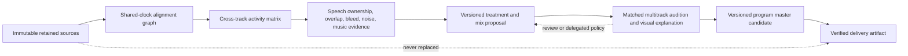

# Quipsly Multitrack Dialogue Master

**Research and production architecture · 2026-08-06**

## Product conclusion

Quipsly should not compete by adding a longer list of one-file cleanup buttons. Its defensible audio product is an episode-level dialogue system that understands every retained source together, explains what it heard on a shared clock, prepares reversible mix candidates, and lets a producer hear the consequence of every automated decision.

The product unit is the **program**, not the file:

- one retained source per microphone, device camera, remote participant, clip, music bed, or assembled master;
- one shared program clock with exact-source alignment evidence and visible uncertainty;
- a time-varying activity matrix that distinguishes intended speech, overlap, bleed, background, music, and silence across tracks;
- track-specific treatment proposals derived from the program context;
- versioned mix candidates and exact A/B evidence;
- an approved, proof-listened delivery artifact that never replaces the source.

This is the path from the current Quipsly Audio Studio to a credible best-in-market Dialogue Master.

## Primary-source research signals

### Multitrack context materially improves treatment

Auphonic documents that its multitrack system analyzes tracks individually **and combined**, using cross-track knowledge for adaptive leveling, gating, bleed removal, noise/reverb reduction, ducking, filtering, and final loudness/true-peak control. Its explanation of mic-bleed removal is especially important: correlated signal in inactive microphones cannot be handled reliably by a static gate, but speaker activity across tracks makes the problem tractable. It also exposes colored speech/music, denoise, leveler, and cut regions in its editor rather than hiding all processing. Sources: [Multitrack algorithms](https://us1.auphonic.com/help/algorithms/multitrack.html), [Multitrack workflow](https://auphonic.com/help/web/multitrack.html), [Multitrack editor](https://auphonic.com/help/web/auphoniceditor.html).

### Surgical repair and continuous program processing are different jobs

iZotope RX separates specialized repair tools—Mouth De-click, De-click, De-bleed, Breath Control, Dialogue Isolate, De-plosive, spectral repair—from general mastering. This supports Quipsly's existing candidate/review architecture: mouth sounds and isolated defects should remain bounded source-clock proposals with a matched audition, while broader dialogue isolation and de-bleed must be evaluated in context. Source: [RX feature reference](https://www.izotope.com/en/products/rx/features).

### Professional tools combine fast intelligence with inspectable controls

Blackmagic's Fairlight materials combine AI dialogue leveling and voice isolation with editable track effects and automation. The direction is not “AI or controls”; it is rapid automated assistance whose effect remains visible and adjustable in a professional timeline. Sources: [DaVinci Resolve AI audio release](https://www.blackmagicdesign.com/in/media/release/20221111-01), [Fairlight Audio Guide](https://documents.blackmagicdesign.com/UserManuals/DaVinciResolveFairlightAudioPost.pdf).

### Local, separate, aligned tracks are the recording contract

Riverside records high-quality tracks locally on each participant device so network quality does not determine retained source quality, and it preserves separate raw/aligned participant and media-board tracks for downstream editing. Its hybrid-recording guidance recommends a separate microphone per participant to preserve separate audio tracks. Sources: [High-quality tracks](https://support.riverside.com/hc/en-us/articles/5260432295581-Download-high-quality-tracks), [Hybrid recording practices](https://support.riverside.com/hc/en-us/articles/10989462140445-Best-practices-for-recording-in-person-and-hybrid-sessions), [Media Board tracks](https://support.riverside.com/hc/en-us/articles/5456395023005-Download-Media-Board-or-screen-share-tracks).

## Existing Quipsly foundation

Quipsly already has important production-grade pieces that should be composed, not replaced:

- immutable Capture and Studio media sources with release/consent gates;
- exact-source complete-decode signal profiles;
- source-clock waveform, broad-frequency, loudness, audible-event, and transcript evidence;
- exact-source alignment jobs with correlation, peak margin, offset, and drift evidence;
- bounded Dialogue Repair candidates and append-only human review receipts;
- versioned Audio Mastery previews with complete-decode verification;
- separate review, promotion, encoded delivery, and proof-listen receipts;
- episode output packets and append-only episode output selection.

The principal gap was that Audio Studio presented those capabilities one selected asset at a time. It did not yet provide a program-level answer to:

- Which source owns each participant and role?
- Which tracks represent the same participant on different devices?
- Which track is the program clock?
- Which sources are aligned, understood, treated, and delivery-ready?
- Which issue blocks the greatest amount of downstream work?
- What will the combined episode sound like after treatment?

## Implemented vertical slice: Episode Mix Map

The 2026-08-06 slice adds a read-only, permission-filtered program projection to Audio Studio:

1. Episode inventory now reads the latest signal, source-transcript, alignment, mastery, and delivery evidence for attached sources in bounded batch queries.
2. Completed processing is exposed only after its typed job and result receipt pass integrity validation. Completed transcripts must also match the registered canonical transcript counts.
3. Each source is projected through five visible stages: **Preserve → Align → Understand → Treat → Finish**.
4. Dialogue, reference, music, and unknown roles remain explicit; the projection never invents a participant from a filename.
5. Tracks sharing a canonical participant ID are displayed as a multi-device group without prematurely choosing a primary source.
6. Attention is ranked deterministically, with held lineage/release problems before sync, understanding, treatment, and delivery work.
7. The UI explicitly states that the map rendered no mix, moved no timeline media, and made no taste decision.

This is immediately useful, but it is deliberately the first layer of a larger system.

## Mature architecture

### 1. Canonical episode audio program

Add an append-only decision layer, not a mutable super-record:

- `StudioEpisodeAudioProgramRevision`: immutable snapshot hash of attached track identities and source bindings.
- `StudioEpisodeAudioTrackDecisionReceipt`: set/withdraw participant, role, clock-source, foreground/background, include/exclude, and channel-layout decisions.
- `StudioEpisodeAudioMixCandidate`: exact program revision, processor build, policy, per-track operations, output bindings, and metrics.
- `StudioEpisodeAudioMixReviewReceipt`: playback evidence, decision, note, and exact candidate hash.
- `StudioEpisodeAudioMixSelectionReceipt`: select/withdraw one candidate as the active program master without deleting alternatives.

The episode program remains a projection of retained media plus receipts. No migration should duplicate media bytes or rewrite existing episode production JSON.

### 2. Shared-clock alignment graph

Current pairwise exact-source alignment becomes a graph:

- one explicit clock source or an explicitly generated program clock;
- every other source has offset, later offset, residual drift, confidence, and qualification;
- alignment uncertainty is shown on the timeline;
- the system may automatically render an aligned preview when evidence is qualified, but applying placement to the canonical editor remains a separate versioned decision;
- manual clap/slate anchors and waveform cross-correlation remain valid evidence alongside automatic analysis.

### 3. Cross-track activity matrix

For every bounded time window, retain explainable scores:

- speech probability per track;
- speech identity/ownership confidence where canonical participant labels exist;
- pairwise correlation and lag;
- foreground/background/music/noise classification;
- simultaneous intended overlap versus likely bleed;
- clipping, dropout, loudness, spectral balance, and noise-floor evidence;
- detector/model identifier, version, input source hashes, and thresholds.

The activity matrix is deterministic evidence plus model annotations. Model output can rank and label; source clocks, hashes, correlation arithmetic, and application of edits remain deterministic.

### 4. Treatment graph

Treatments are ordered, typed, and independently auditionable:

1. alignment/resampling preview;
2. channel and phase correction;
3. bounded surgical repair (click, mouth click, plosive, clip, hum);
4. adaptive de-bleed/gating using the activity matrix;
5. dialogue isolation or denoise with retained ambience controls;
6. voice consistency / EQ proposal;
7. participant leveling and program dynamics;
8. music/clip ducking;
9. program loudness and true-peak limiting;
10. delivery encoding and proof listen.

Every stage produces a versioned derivative or a parameterized render recipe. A producer can bypass a stage, compare before/after, and hear the residual (“what Quipsly removed”) where the processor supports it.

### 5. Transparency UX

The differentiator should be an explanation surface, not an approval bureaucracy:

- stacked waveforms on one clock;
- active-speaker ribbons and overlap/bleed heatmap;
- colored regions for level, isolation, denoise, repair, and ducking;
- click any region to hear source, proposed result, residual, and full-mix consequence;
- plain-language “why” with exact measurements underneath;
- confidence and uncertainty remain visible;
- bulk accept is available for a qualified policy, but every applied operation remains reversible and individually inspectable;
- automatic background analysis and preview generation are allowed after release/consent; promotion, irreversible external delivery, and publication retain stronger gates.

## Delivery sequence

### Phase A — Program truth and UX (current)

- Episode Mix Map and batch receipt validation.
- Explicit track/participant/clock decisions with append-only receipts.
- Program-revision fingerprint and stale-decision detection.

### Phase B — Shared activity intelligence

- Batch signal/transcript/alignment orchestration for the whole episode.
- Cross-track activity and correlation evidence worker.
- Stacked shared-clock visualization with overlap and bleed attention.

### Phase C — Dialogue treatment candidates

- De-bleed/gating and isolation provider interface.
- Existing local FFmpeg/RX-style processors and optional managed providers behind the same receipt contract.
- Full-mix, per-track, and residual audition.

### Phase D — Program mix candidates

- Versioned render recipe and multitrack worker.
- Participant leveling, ducking, program loudness, and true-peak targets.
- Candidate comparison and explicit active-master selection.

### Phase E — Automated edit and release integration

- Transcript and audible-event regions become inspectable edit proposals.
- Approved program master enters the episode output graph.
- Video editor consumes the same program clock, track roles, and active master.
- Delivery profiles target podcast, YouTube, shorts, coaching archive, and accessibility derivatives without changing source truth.

## Acceptance standard

The Dialogue Master is production-ready only when Quipsly can take at least two real High Ground Odyssey multidevice recordings and prove:

- every source retained and hash/generation bound;
- participant and role assignments explicit;
- opening and later alignment evidence visible;
- overlap and likely bleed visible on a common clock;
- at least one genuine mouth-sound repair and one cross-track de-bleed/leveling candidate proof-listened;
- source, treated track, residual, and final mix can be compared;
- the chosen program master is versioned and withdrawable;
- the encoded delivery bytes pass technical verification and human proof-listen;
- the video editor and episode output graph reference the same program revision;
- a second collaborator can understand and reproduce the decisions without private developer knowledge.
